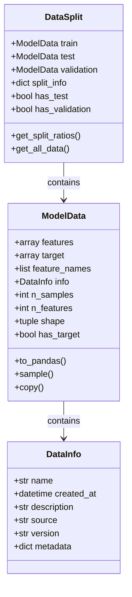
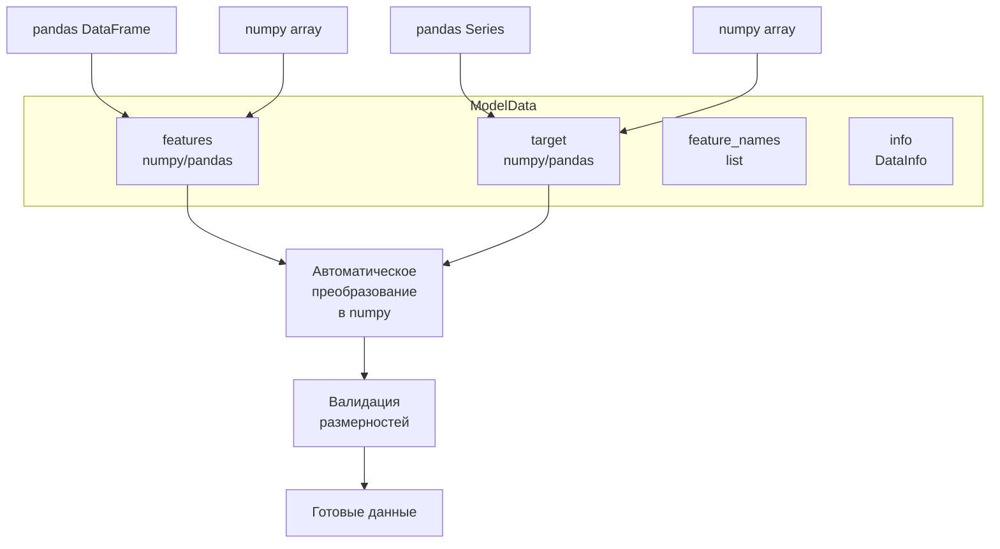
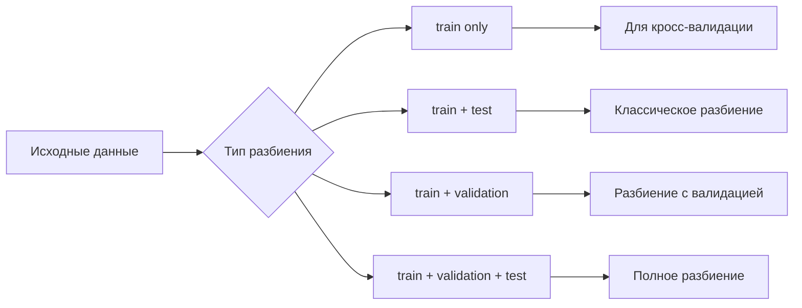
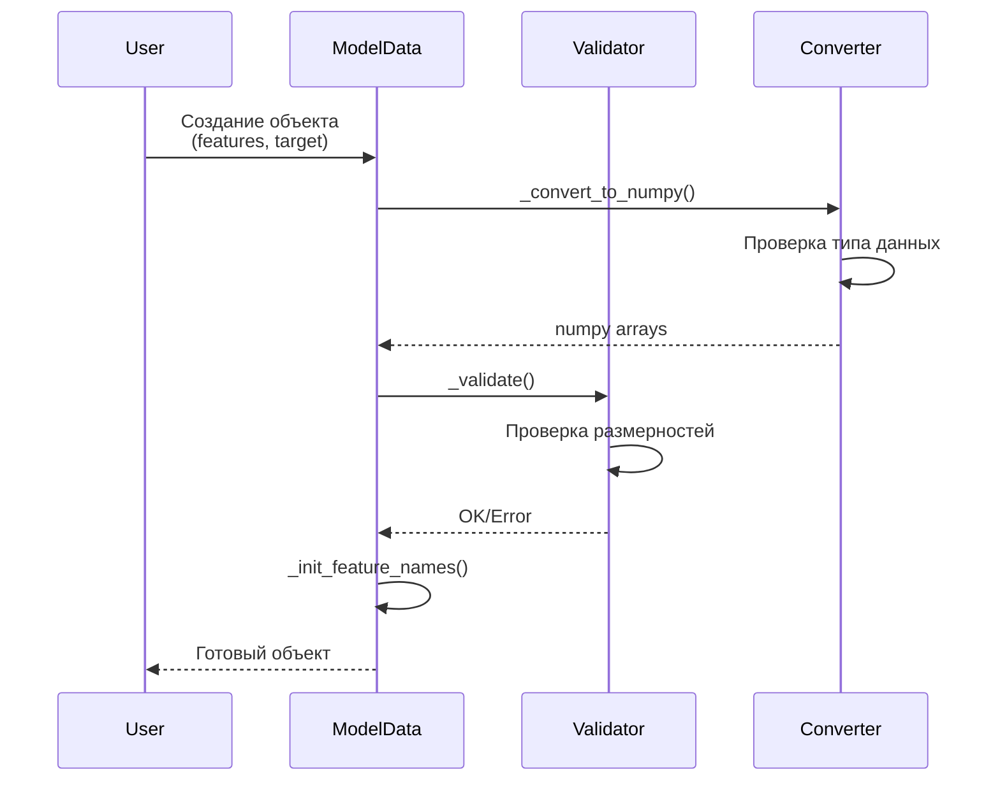
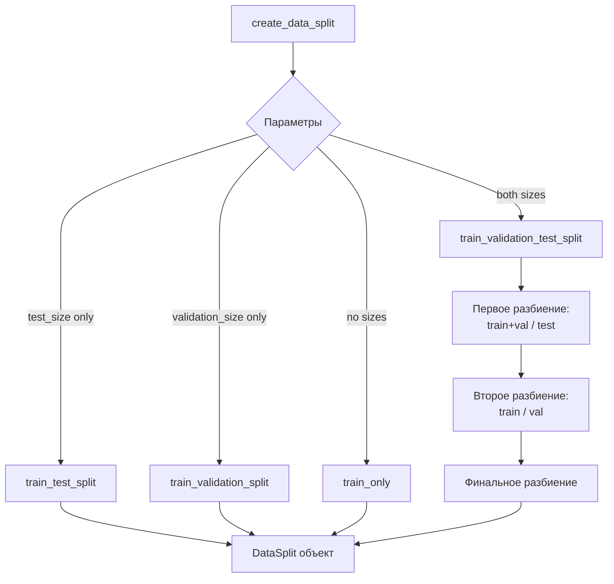

# Руководство по модулю ml_data_container

## Оглавление
1. [Обзор модуля](#обзор-модуля)
2. [Архитектура и компоненты](#архитектура-и-компоненты)
3. [Как работает модуль](#как-работает-модуль)
4. [Практическое использование](#практическое-использование)
5. [Внесение изменений](#внесение-изменений)
6. [Возможности расширения](#возможности-расширения)

## Обзор модуля

### Что делает модуль?

Модуль `ml_data_container` предоставляет унифицированную систему для работы с данными в процессе машинного обучения. Он решает следующие задачи:

- **Унификация форматов данных**: Работа с numpy arrays и pandas DataFrame/Series через единый интерфейс
- **Организация данных**: Структурированное хранение признаков, целевых переменных и метаинформации
- **Разбиение данных**: Автоматическое создание обучающих, валидационных и тестовых выборок
- **Кросс-валидация**: Поддержка K-fold разбиений
- **Валидация**: Автоматическая проверка корректности данных

### Основные компоненты



## Архитектура и компоненты

### 1. DataInfo - Метаинформация о датасете

```python
@dataclass
class DataInfo:
    name: str                    # Имя датасета
    created_at: datetime         # Время создания
    description: Optional[str]   # Описание
    source: Optional[str]       # Источник данных
    version: str = "1.0.0"      # Версия
    metadata: Dict[str, Any]    # Дополнительные метаданные
```

### 2. ModelData - Основной контейнер данных

Центральный класс модуля для хранения и манипулирования данными:



### 3. DataSplit - Контейнер для разбиений

Поддерживает различные комбинации разбиений:



## Как работает модуль

### Жизненный цикл данных



### Процесс разбиения данных



## Практическое использование

### Базовое использование

```python
import numpy as np
import pandas as pd
from dmdslab.datasets.ml_data_container import ModelData, DataInfo, create_data_split

# 1. Создание данных с numpy
X = np.random.randn(1000, 10)
y = np.random.randint(0, 2, 1000)

data = ModelData(
    features=X,
    target=y,
    feature_names=[f"feature_{i}" for i in range(10)]
)

print(f"Размер данных: {data.shape}")
print(f"Количество признаков: {data.n_features}")

# 2. Создание данных с pandas
df = pd.DataFrame(X, columns=[f"col_{i}" for i in range(10)])
target = pd.Series(y, name="target")

data_pd = ModelData(features=df, target=target)

# 3. Добавление метаинформации
info = DataInfo(
    name="my_dataset",
    description="Пример датасета для классификации",
    source="synthetic",
    metadata={"task": "binary_classification"}
)

data_with_info = ModelData(features=X, target=y, info=info)
```

### Разбиение данных

```python
# 1. Классическое разбиение train/test
split = create_data_split(X, y, test_size=0.2, random_state=42)
print(f"Train size: {split.train.n_samples}")
print(f"Test size: {split.test.n_samples}")

# 2. Разбиение train/validation/test
split_full = create_data_split(
    X, y, 
    test_size=0.2, 
    validation_size=0.2,
    random_state=42,
    stratify=True  # Стратификация по целевой переменной
)

# 3. Получение информации о разбиении
ratios = split_full.get_split_ratios()
print(f"Доли выборок: {ratios}")

# 4. Итерация по всем выборкам
for name, data in split_full.get_all_data():
    print(f"{name}: {data.shape}")
```

### Кросс-валидация

```python
from dmdslab.datasets.ml_data_container import create_kfold_data

# Создание 5-fold разбиений
kfold_splits = create_kfold_data(X, y, n_splits=5, random_state=42)

for split in kfold_splits:
    fold_idx = split.split_info["fold"]
    train_size = split.train.n_samples
    val_size = split.validation.n_samples
    print(f"Fold {fold_idx}: train={train_size}, val={val_size}")
```

### Работа с выборками

```python
# 1. Случайная выборка
sample_data = data.sample(n=100, random_state=42)
# или по доле
sample_data = data.sample(frac=0.1, random_state=42)

# 2. Преобразование в pandas
features_df, target_series = data.to_pandas()

# 3. Копирование данных
data_copy = data.copy()
```

### Примеры использования в ML pipeline

```python
from sklearn.preprocessing import StandardScaler
from sklearn.ensemble import RandomForestClassifier
from sklearn.metrics import accuracy_score

# 1. Подготовка данных
split = create_data_split(X, y, test_size=0.2, random_state=42)

# 2. Масштабирование
scaler = StandardScaler()
X_train_scaled = scaler.fit_transform(split.train.features)
X_test_scaled = scaler.transform(split.test.features)

# 3. Обучение модели
model = RandomForestClassifier(random_state=42)
model.fit(X_train_scaled, split.train.target)

# 4. Оценка
predictions = model.predict(X_test_scaled)
accuracy = accuracy_score(split.test.target, predictions)
print(f"Accuracy: {accuracy:.3f}")
```

## Внесение изменений

### Добавление новых атрибутов в ModelData

```python
@dataclass
class ModelData:
    # Существующие атрибуты...
    
    # Новый атрибут для хранения весов объектов
    sample_weights: Optional[np.ndarray] = None
    
    def _validate(self):
        """Расширенная валидация с проверкой весов."""
        # Существующая валидация...
        
        if self.sample_weights is not None:
            if len(self.sample_weights) != len(self.features):
                raise ValueError("Количество весов не совпадает с количеством объектов")
```

### Добавление новых методов

```python
def stratified_sample(self, n: int, random_state: Optional[int] = None) -> "ModelData":
    """Стратифицированная выборка по целевой переменной."""
    from sklearn.model_selection import train_test_split
    
    _, X_sample, _, y_sample = train_test_split(
        self.features,
        self.target,
        test_size=n/self.n_samples,
        stratify=self.target,
        random_state=random_state
    )
    
    return ModelData(
        features=X_sample,
        target=y_sample,
        feature_names=self.feature_names,
        info=self.info
    )
```

### Создание специализированных разбиений

```python
def create_time_series_split(
    features: np.ndarray,
    y: np.ndarray,
    n_splits: int = 5,
    test_size: Optional[int] = None
) -> List[DataSplit]:
    """Разбиение для временных рядов."""
    from sklearn.model_selection import TimeSeriesSplit
    
    tscv = TimeSeriesSplit(n_splits=n_splits, test_size=test_size)
    splits = []
    
    for fold_idx, (train_idx, val_idx) in enumerate(tscv.split(features)):
        train = ModelData(features=features[train_idx], target=y[train_idx])
        validation = ModelData(features=features[val_idx], target=y[val_idx])
        
        split = DataSplit(
            train=train,
            validation=validation,
            split_info={"fold": fold_idx, "split_type": "time_series"}
        )
        splits.append(split)
    
    return splits
```

## Лучшие практики

### 1. Всегда добавляйте метаинформацию

```python
info = DataInfo(
    name="customer_churn",
    description="Датасет для прогнозирования оттока клиентов",
    source="internal_database",
    version="2.1.0",
    metadata={
        "collection_date": "2024-01-01",
        "n_classes": 2,
        "class_balance": {"0": 0.8, "1": 0.2}
    }
)
```

### 2. Используйте стратификацию для несбалансированных данных

```python
split = create_data_split(X, y, test_size=0.2, stratify=True)
```

### 3. Проверяйте целостность данных

```python
def validate_data_pipeline(data: ModelData) -> bool:
    """Проверка данных перед обучением."""
    checks = []
    
    # Проверка на NaN
    checks.append(not np.isnan(data.features).any())
    
    # Проверка размерности
    checks.append(data.n_features > 0)
    checks.append(data.n_samples > 0)
    
    # Проверка диапазона значений
    if data.has_target:
        unique_targets = np.unique(data.target)
        checks.append(len(unique_targets) > 1)
    
    return all(checks)
```

## Заключение

Модуль `ml_data_container` предоставляет гибкую и расширяемую систему для работы с данными в машинном обучении. Основные преимущества:

- **Унификация**: Единый интерфейс для numpy и pandas
- **Валидация**: Автоматическая проверка корректности
- **Гибкость**: Поддержка различных сценариев разбиения
- **Расширяемость**: Легко добавлять новую функциональность
- **Интеграция**: Совместимость со стандартными ML библиотеками

Модуль может быть легко адаптирован под конкретные задачи и интегрирован в существующие ML pipeline.