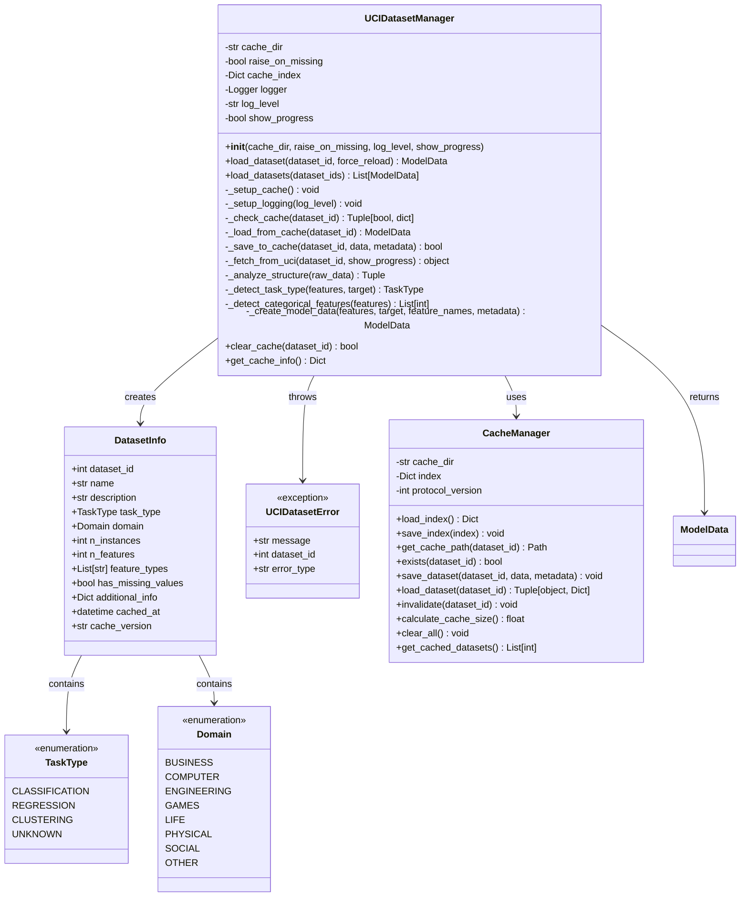
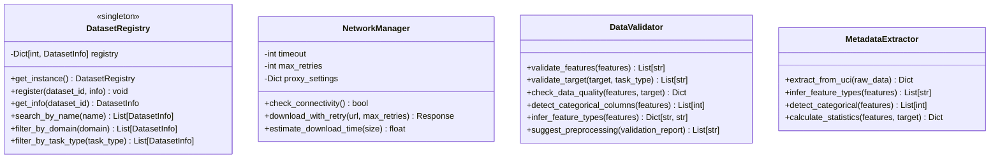
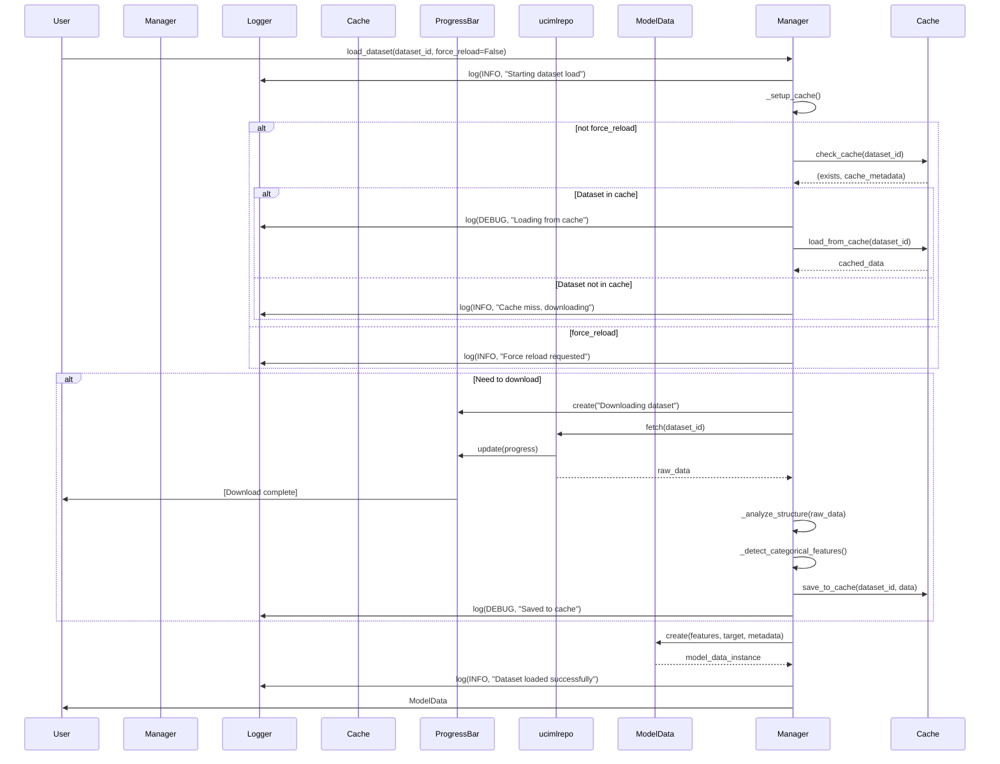
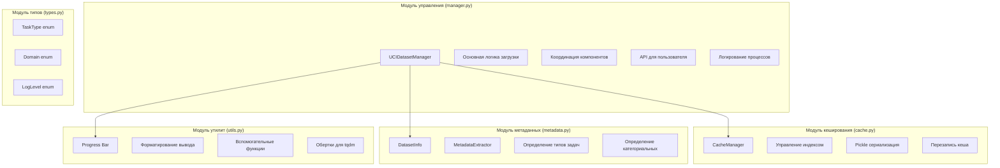

# План разработки UCI Dataset Loader для DmDSLab

## Обновления на основе требований

План обновлен с учетом следующих ключевых требований:
- **Кеширование**: Использование pickle формата с возможностью перезаписи
- **Логирование**: Все уровни (DEBUG, INFO, WARNING, ERROR) с настройкой
- **Progress Bar**: Интеграция с tqdm для отображения прогресса загрузки
- **Множественная загрузка**: Последовательная загрузка нескольких датасетов
- **Категориальные признаки**: Автоматическое определение при необходимости
- **Упрощение**: Убраны валидация, сетевые компоненты, история, CLI и другие избыточные функции

## 1. Схема классов

### 1.1. Основные классы



### 1.2. Вспомогательные компоненты



## 2. Workflow процесса загрузки

### 2.1. Основной процесс



## 3. Структура модулей

### 3.1. Файловая структура

```
dmdslab/
├── datasets/
│   ├── __init__.py
│   ├── ml_data_container.py (существующий)
│   └── uci/
│       ├── __init__.py
│       ├── manager.py          # Основной класс UCIDatasetManager
│       ├── cache.py            # CacheManager и работа с кешем
│       ├── metadata.py         # DatasetInfo и MetadataExtractor
│       ├── exceptions.py       # UCIDatasetError и другие исключения
│       ├── types.py           # TaskType, Domain и другие типы
│       └── utils.py           # Вспомогательные функции и progress bar
```

### 3.2. Разбивка на логические модули



## 4. Детальный план разработки

### 4.1. Этап 1: Базовая инфраструктура

#### Задачи:
1. **Создание структуры модуля**
   - Создать директорию `dmdslab/datasets/uci/`
   - Создать все необходимые файлы-заготовки
   - Настроить импорты в `__init__.py` файлах

2. **Реализация базовых типов (types.py)**
   ```python
   # Элементарные задачи:
   - [ ] Создать enum TaskType
   - [ ] Создать enum Domain  
   - [ ] Создать enum CacheStatus
   - [ ] Создать enum LogLevel (DEBUG, INFO, WARNING, ERROR)
   - [ ] Добавить type hints для всех типов
   ```

3. **Реализация исключений (exceptions.py)**
   ```python
   # Элементарные задачи:
   - [ ] Создать базовый класс UCIDatasetError
   - [ ] Создать CacheError
   - [ ] Создать ValidationError
   - [ ] Создать DatasetNotFoundError
   ```

4. **Настройка логирования**
   ```python
   # Элементарные задачи:
   - [ ] Создать функцию setup_logger() с настройкой уровня
   - [ ] Добавить форматирование логов
   - [ ] Создать декоратор для логирования методов
   ```

### 4.2. Этап 2: Модуль кеширования

#### Задачи:
1. **Класс CacheManager (cache.py)**
   ```python
   # Элементарные задачи:
   - [ ] Метод __init__ с настройкой директории
   - [ ] Метод load_index() для загрузки индекса
   - [ ] Метод save_index() для сохранения индекса
   - [ ] Метод get_cache_path() для путей к файлам
   - [ ] Метод save_dataset() с pickle
   - [ ] Метод load_dataset() с pickle
   - [ ] Метод exists() для проверки наличия
   - [ ] Метод invalidate() для перезаписи
   - [ ] Метод calculate_cache_size()
   - [ ] Метод clear_all() для полной очистки
   ```

2. **Утилиты для работы с pickle**
   ```python
   # Элементарные задачи:
   - [ ] Функция safe_pickle_dump() с обработкой ошибок
   - [ ] Функция safe_pickle_load() с обработкой ошибок
   - [ ] Обработка версий pickle протокола
   ```

3. **Тесты для CacheManager**
   ```python
   # Элементарные задачи:
   - [ ] Тест создания директории кеша
   - [ ] Тест сохранения/загрузки данных
   - [ ] Тест работы с индексом
   - [ ] Тест перезаписи кеша
   - [ ] Тест очистки кеша
   ```

### 4.3. Этап 3: Модуль метаданных

#### Задачи:
1. **Класс DatasetInfo (metadata.py)**
   ```python
   # Элементарные задачи:
   - [ ] Определить dataclass с полями
   - [ ] Метод from_uci_data() для создания из UCI
   - [ ] Метод to_dict() для сериализации
   - [ ] Метод from_dict() для десериализации
   ```

2. **Класс MetadataExtractor (metadata.py)**
   ```python
   # Элементарные задачи:
   - [ ] Метод extract_from_uci()
   - [ ] Метод infer_feature_types()
   - [ ] Метод detect_categorical()
   - [ ] Метод calculate_statistics()
   - [ ] Метод determine_task_type()
   ```

3. **Определение категориальных признаков**
   ```python
   # Элементарные задачи:
   - [ ] Анализ уникальных значений
   - [ ] Проверка соотношения уникальных/общих
   - [ ] Анализ типов данных (object, int с малым кардиналом)
   - [ ] Эвристики для определения категорий
   ```

### 4.4. Этап 4: Утилиты и Progress Bar

#### Задачи:
1. **Progress Bar утилиты (utils.py)**
   ```python
   # Элементарные задачи:
   - [ ] Функция create_progress_bar() с tqdm
   - [ ] Контекстный менеджер для progress bar
   - [ ] Обертки для загрузки с прогрессом
   - [ ] Настройка отображения (console/notebook)
   ```

2. **Вспомогательные функции**
   ```python
   # Элементарные задачи:
   - [ ] Функция format_dataset_info()
   - [ ] Функция estimate_download_size()
   - [ ] Функция validate_dataset_id()
   - [ ] Функция print_dataset_summary()
   ```

### 4.5. Этап 5: Основной менеджер

#### Задачи:
1. **Класс UCIDatasetManager (manager.py)**
   ```python
   # Элементарные задачи:
   - [ ] Метод __init__ с параметрами (cache_dir, raise_on_missing, log_level, show_progress)
   - [ ] Метод _setup_cache()
   - [ ] Метод _setup_logging()
   - [ ] Метод _check_cache()
   - [ ] Метод _load_from_cache()
   - [ ] Метод _save_to_cache()
   - [ ] Метод _fetch_from_uci() с progress bar
   - [ ] Метод _analyze_structure()
   - [ ] Метод _detect_task_type()
   - [ ] Метод _detect_categorical_features()
   - [ ] Метод _create_model_data()
   - [ ] Метод load_dataset() с force_reload параметром
   - [ ] Метод load_datasets() для загрузки нескольких
   - [ ] Метод clear_cache()
   - [ ] Метод get_cache_info()
   ```

2. **Логирование**
   ```python
   # Элементарные задачи:
   - [ ] Настройка уровней логирования
   - [ ] Логирование всех этапов загрузки
   - [ ] Форматирование сообщений
   - [ ] Интеграция с progress bar
   ```

3. **Загрузка нескольких датасетов**
   ```python
   # Элементарные задачи:
   - [ ] Последовательная загрузка
   - [ ] Общий progress bar для всех
   - [ ] Обработка ошибок для каждого
   - [ ] Возврат списка ModelData или dict с ошибками
   ```

### 4.6. Этап 6: Интеграция и тестирование

#### Задачи:
1. **Интеграционные тесты**
   ```python
   # Элементарные задачи:
   - [ ] Тест полного цикла загрузки
   - [ ] Тест работы без интернета
   - [ ] Тест повреждённого кеша
   - [ ] Тест различных типов датасетов
   ```

2. **Обновление документации**
   ```markdown
   # Элементарные задачи:
   - [ ] Обновить __init__.py файлы
   - [ ] Создать README для модуля
   - [ ] Добавить примеры использования
   - [ ] Создать Jupyter notebook с демо
   ```

### 4.7. Этап 7: Дополнительные возможности

#### Задачи:
1. **Обновление requirements**
   ```python
   # Элементарные задачи:
   - [ ] Добавить ucimlrepo в requirements
   - [ ] Добавить tqdm для progress bar
   - [ ] Создать extras_require для опциональных зависимостей
   - [ ] Обновить setup.py
   ```

2. **Утилиты (utils.py)**
   ```python
   # Элементарные задачи:
   - [ ] Функция print_dataset_summary()
   - [ ] Функция get_popular_datasets()
   - [ ] Функция format_cache_size()
   - [ ] Функция create_download_report()
   ```

## 5. Критерии готовности

### 5.1. Функциональные требования
- [ ] Загрузка датасета по ID работает корректно
- [ ] Кеширование с pickle функционирует без ошибок
- [ ] Перезапись кеша по force_reload работает
- [ ] Загрузка нескольких датасетов последовательно
- [ ] Progress bar отображается корректно
- [ ] Логирование с настраиваемым уровнем
- [ ] Определение категориальных признаков
- [ ] Интеграция с ModelData работает
- [ ] Все тесты проходят успешно

### 5.2. Нефункциональные требования
- [ ] Код соответствует PEP 8
- [ ] Покрытие тестами > 80%
- [ ] Документация complete
- [ ] Примеры работают корректно
- [ ] Производительность приемлема
- [ ] Логи информативны на всех уровнях

## 6. Риски и митигация

| Риск | Вероятность | Влияние | Митигация |
|------|-------------|---------|-----------|
| Изменение API ucimlrepo | Средняя | Высокое | Абстрактный слой для API |
| Большой размер кеша | Высокая | Среднее | Метод clear_all() и информация о размере |
| Недоступность UCI сервера | Низкая | Высокое | Использование кеша, информативные ошибки |
| Несовместимые форматы данных | Средняя | Среднее | Гибкая система обработки |
| Проблемы с pickle версиями | Низкая | Среднее | Фиксация protocol версии |