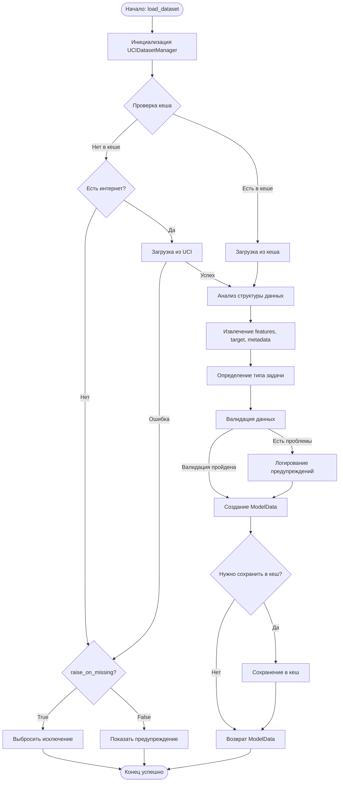

# Техническое задание: UCI Dataset Loader для DmDSLab

## Общее описание

Разработка модуля загрузки датасетов из UCI Machine Learning Repository с интеграцией в существующую архитектуру библиотеки DmDSLab. Модуль должен обеспечивать загрузку данных по ID, кеширование и автоматическое преобразование в формат ModelData.

## 1. Описание последовательности действий

### Шаг 1: Инициализация загрузчика
- **Входные данные**: 
  - Путь к директории кеша (опционально, по умолчанию `~/.dmdslab/cache/uci/`)
  - Параметры поведения при ошибках (raise_on_missing: bool)
- **Цель**: Подготовка загрузчика к работе, проверка/создание директории кеша
- **Выполнение**:
  1. Создать директорию кеша, если не существует
  2. Загрузить индекс кешированных датасетов
  3. Инициализировать параметры конфигурации
- **Выходные артефакты**: Готовый к работе экземпляр UCIDatasetManager

### Шаг 2: Проверка кеша
- **Входные данные**: 
  - dataset_id (int или str)
- **Цель**: Определить наличие датасета в локальном кеше
- **Выполнение**:
  1. Проверить наличие файла `{dataset_id}.pkl` в директории кеша
  2. Проверить валидность кешированных данных (не повреждены)
  3. Проверить актуальность версии кеша
- **Выходные артефакты**: 
  - is_cached (bool)
  - cache_metadata (dict) - информация о кешированном датасете

### Шаг 3: Загрузка данных
- **Входные данные**: 
  - dataset_id (int или str)
  - is_cached (bool) - результат проверки кеша
- **Цель**: Получить данные из UCI репозитория или кеша
- **Выполнение**:
  1. Если is_cached == True:
     - Загрузить данные из кеша
  2. Если is_cached == False:
     - Попытаться загрузить из ucimlrepo
     - При успехе - сохранить в кеш
     - При ошибке сети - проверить raise_on_missing и выдать ошибку/предупреждение
- **Выходные артефакты**: 
  - raw_data (ucimlrepo dataset object)
  - metadata (dict) - метаинформация о датасете

### Шаг 4: Анализ структуры данных
- **Входные данные**: 
  - raw_data (ucimlrepo dataset object)
- **Цель**: Определить структуру данных, выделить признаки и целевую переменную
- **Выполнение**:
  1. Извлечь X (features) и y (targets) из raw_data
  2. Определить имена признаков
  3. Определить тип задачи (классификация/регрессия)
  4. Собрать метаинформацию о датасете
- **Выходные артефакты**: 
  - features (numpy array или pandas DataFrame)
  - target (numpy array или pandas Series)
  - feature_names (list)
  - task_type (str: "classification" или "regression")
  - dataset_info (dict)

### Шаг 5: Валидация данных
- **Входные данные**: 
  - features, target, feature_names, dataset_info
- **Цель**: Проверить корректность и целостность данных
- **Выполнение**:
  1. Проверить соответствие размерностей features и target
  2. Проверить наличие и долю пропущенных значений
  3. Проверить типы данных
  4. Валидировать диапазоны значений
  5. Проверить уникальность имен признаков
- **Выходные артефакты**: 
  - validation_report (dict) - отчет о валидации
  - is_valid (bool)
  - warnings (list) - список предупреждений

### Шаг 6: Создание объекта ModelData
- **Входные данные**: 
  - features, target, feature_names, dataset_info, validation_report
- **Цель**: Преобразовать данные в формат ModelData
- **Выполнение**:
  1. Создать объект DataInfo с метаинформацией
  2. Создать объект ModelData с данными
  3. Добавить информацию о типе задачи в metadata
  4. Добавить результаты валидации
- **Выходные артефакты**: 
  - model_data (ModelData) - готовый объект с данными

### Шаг 7: Сохранение в кеш
- **Входные данные**: 
  - dataset_id, model_data, metadata
- **Цель**: Сохранить загруженные данные для последующего использования
- **Выполнение**:
  1. Сериализовать model_data и metadata
  2. Сохранить в файл `{dataset_id}.pkl`
  3. Обновить индекс кеша
  4. Записать время кеширования
- **Выходные артефакты**: 
  - cache_path (str) - путь к сохраненному файлу
  - success (bool) - статус сохранения

## 2. Схема действий (Mermaid)



## 3. Чеклист разработки

### Подготовка
- [ ] Создать файл `dmdslab/datasets/uci_dataset_manager.py`
- [ ] Добавить зависимость `ucimlrepo` в requirements
- [ ] Создать тесты в `tests/test_uci_dataset_manager.py`

### Основная разработка
- [ ] Реализовать класс `UCIDatasetManager`
  - [ ] Метод `__init__` с параметрами кеширования
  - [ ] Метод `_setup_cache` для инициализации директории кеша
  - [ ] Метод `_check_cache` для проверки наличия датасета
  - [ ] Метод `_load_from_cache` для загрузки из кеша
  - [ ] Метод `_save_to_cache` для сохранения в кеш
  - [ ] Метод `_fetch_from_uci` для загрузки из репозитория
  - [ ] Метод `_analyze_structure` для анализа структуры данных
  - [ ] Метод `_detect_task_type` для определения типа задачи
  - [ ] Метод `_validate_data` для валидации
  - [ ] Метод `_create_model_data` для создания ModelData
  - [ ] Статический метод `load_dataset` - основной публичный API

### Вспомогательные компоненты
- [ ] Создать Enum `TaskType` (CLASSIFICATION, REGRESSION, UNKNOWN)
- [ ] Создать класс `DatasetInfo` для метаданных
- [ ] Создать класс `ValidationReport` для результатов валидации
- [ ] Реализовать обработку исключений `UCIDatasetError`

### Интеграция
- [ ] Обновить `__init__.py` для экспорта новых компонентов
- [ ] Добавить условный импорт (try/except ImportError)
- [ ] Обновить основной `__init__.py` библиотеки

### Документация и примеры
- [ ] Создать пример использования basic_usage.py
- [ ] Создать пример с кешированием cache_example.py
- [ ] Создать пример обработки ошибок error_handling.py
- [ ] Добавить docstrings для всех публичных методов
- [ ] Создать README.md для модуля

### Тестирование
- [ ] Тест загрузки популярного датасета (например, Iris)
- [ ] Тест работы кеширования
- [ ] Тест обработки отсутствия интернета
- [ ] Тест валидации данных
- [ ] Тест определения типа задачи
- [ ] Тест обработки несуществующего ID

### Финализация
- [ ] Проверить совместимость с Python 3.8+
- [ ] Проверить работу всех примеров
- [ ] Провести финальное тестирование
- [ ] Обновить версию библиотеки

## Примеры использования

### Базовый пример
```python
from dmdslab.datasets import UCIDatasetManager

# Загрузка датасета Iris (ID=53)
iris_data = UCIDatasetManager.load_dataset(53)

# Работа с данными
print(f"Размер данных: {iris_data.shape}")
print(f"Признаки: {iris_data.feature_names}")
print(f"Тип задачи: {iris_data.info.metadata['task_type']}")

# Преобразование в pandas
df_features, df_target = iris_data.to_pandas()
```

### Пример с обработкой ошибок
```python
from dmdslab.datasets import UCIDatasetManager

# Создание менеджера с настройками
manager = UCIDatasetManager(
    cache_dir="./my_cache",
    raise_on_missing=False
)

try:
    # Попытка загрузить датасет
    data = manager.load_dataset(100)
    
    # Проверка валидации
    if 'validation_warnings' in data.info.metadata:
        print("Предупреждения валидации:")
        for warning in data.info.metadata['validation_warnings']:
            print(f"  - {warning}")
            
except Exception as e:
    print(f"Ошибка загрузки: {e}")
```

### Пример работы с кешем
```python
from dmdslab.datasets import UCIDatasetManager
import time

# Первая загрузка - из интернета
start = time.time()
data1 = UCIDatasetManager.load_dataset(1)
print(f"Время первой загрузки: {time.time() - start:.2f} сек")

# Вторая загрузка - из кеша
start = time.time()
data2 = UCIDatasetManager.load_dataset(1)
print(f"Время загрузки из кеша: {time.time() - start:.2f} сек")

# Проверка идентичности
assert data1.n_samples == data2.n_samples
print("Данные идентичны!")
```