# Adversary MCP Server

<div align="center">

[](https://badge.fury.io/py/adversary-mcp-server)
[](https://www.python.org/downloads/)
[](https://opensource.org/licenses/MIT)
[](https://github.com/brettbergin/adversary-mcp-server)
[](https://github.com/brettbergin/adversary-mcp-server)
[](https://pypi.org/project/adversary-mcp-server/)

**Software security analysis with hybrid AI-powered threat detection and configurable built-in and custom rule management**

[Installation](#installation) • [Quick Start](#quick-start) • [AI-Powered Analysis](#ai-powered-analysis) • [MCP Integration](#mcp-integration) • [Rule Management](#rule-management) • [CLI Reference](#cli-reference)

</div>

---

## Installation

### Prerequisites

- **Python 3.11+** (3.11+ recommended)
- **Cursor IDE** with MCP support

### Quick Install

```bash
pip install adversary-mcp-server
```

### Verify Installation

```bash
adversary-mcp-cli --version
adversary-mcp-cli status
```

---

## Quick Start

### 1. Initial Setup

```bash
# Configure the security engine
adversary-mcp-cli configure

# Check server status
adversary-mcp-cli status
```

### 2. Cursor IDE Integration

Create `.cursor/mcp.json` in your project or `~/.cursor/mcp.json` globally:

```json
{
  "mcpServers": {
    "adversary-security": {
      "command": "/Users/<user>/.venv/bin/python",
      "args": ["-m", "adversary_mcp_server.server"],
      "env": {
        "ADVERSARY_CONFIG_DIR": "~/.local/share/adversary-mcp-server"
      }
    }
  }
}
```

### 3. Start Using in Cursor

Once configured, you can use these MCP tools in Cursor:

- `adv_scan_code` - Hybrid scanning with rules + AI analysis
- `adv_scan_file` - file scanning with LLM support
- `adv_scan_folder` - directory scanning
- `adv_diff_scan` - scans only changed files between branches
- `adv_configure_settings` - Configuration management
- `adv_get_status` - Check server status and AI availability
- `adv_get_version` - Get version information
- `adv_mark_false_positive` - Mark false positive
- `adv_unmark_false_positive` - Unmark false positive
- `adv_list_false_positives` - List false positives

### 4. Run Demo (Optional)

Test the scanner with vulnerable code examples:

```bash
# Run interactive demonstration
adversary-mcp-cli demo
```

### 5. **🆕 Git Diff-Aware Scanning**

Scan only changed files between git branches for efficient CI/CD integration:

```bash
# Scan changes between branches
adversary-mcp-cli scan --source-branch=main --target-branch=feature/auth

# Scan with high severity filter
adversary-mcp-cli scan --source-branch=main --target-branch=HEAD --severity=high --use-llm --use-semgrep
```

---

### ** MCP Tool Scanning **

```bash
# Scan with Semgrep + LLM
adv_scan_folder
  directory_path=@/path/to/repo
  recursive=true
  include_exploits=false
  use_llm=true
  use_semgrep=true
  output_format=text
  output=@/path/to/.adversary.json
```
```bash
# Scan with Semgrep Only
adv_scan_folder
  directory_path=@/path/to/repo
  recursive=true
  include_exploits=false
  use_llm=false
  use_semgrep=true
  output_format=text
  output=@/path/to/.adversary.json
```

### **AI Analysis Features**

- **🎯 Smart Threat Detection**: Identifies software vulnerabilities
- **📊 Confidence Scoring**: Each finding includes AI-generated confidence levels
- **🔍 Detailed Explanations**: Natural language descriptions of vulnerabilities
- **🏷️ CWE/OWASP Mapping**: Automatic categorization with industry standards
- **⚡ Intelligent Deduplication**: Merges similar findings from multiple engines

---

## MCP Integration

### Available Tools

| Tool | Description | **🆕 AI Features** |
|------|-------------|-------------------|
| `adv_scan_code` | source code scanning | confidence scoring |
| `adv_scan_file` | file scanning | AI-powered prompts, detailed explanations |
| `adv_scan_folder` | directory scanning | statistical insights |
| `adv_diff_scan` | scans only newly added lines | Smart change detection, branch comparison, requires `working_directory` |
| `adv_configure_settings` | configuration management | LLM settings, validation |
| `adv_get_status` | Get server status | LLM configuration status |
| `adv_get_version` | Get version information | Shows AI capabilities |
| `adv_mark_false_positive` | Mark false positive | Mark false positive |
| `adv_unmark_false_positive` | Unmark false positive | unmark false positive |
| `adv_list_false_positives` | list false positives | list false positives |

### **🆕 Git Diff-Aware Scanning**

The `adv_diff_scan` tool enables intelligent scanning of only changed files between git branches:

#### **Key Features:**
- **Smart Change Detection**: Analyzes only modified code, not entire repository
- **Branch Comparison**: Compares any two branches (main vs. feature, staging vs. production)
- **Line-Level Precision**: Scans **only newly added lines** (lines with `+` in git diff), ignoring context lines and removed code
- **Statistics Generation**: Provides comprehensive diff statistics and threat metrics
- **Full Integration**: Works with all existing scan options (LLM, exploits, severity filtering)

#### **🎯 Scanning Scope (Updated)**
- ✅ **Newly added lines** (lines starting with `+` in git diff)
- ❌ **Context lines** (unchanged code shown for reference)
- ❌ **Removed lines** (deleted code)
- ❌ **Existing code** in the repository

This prevents false positives from flagging existing code as new vulnerabilities.

#### **Example Usage:**
```bash
# Scan changes in current branch vs main
adv_diff_scan
 source_branch="main"
 target_branch="HEAD"
 working_directory="/path/to/your/repo"
```
```bash
# Scan with high severity filter
adv_diff_scan
 source_branch="main"
 target_branch="HEAD"
 severity_threshold="high"
 working_directory="/path/to/your/repo"
```


## **🆕 Semgrep Integration**

### **Overview**

The Adversary MCP Server now includes integrated Semgrep static analysis as a third scanning engine, providing comprehensive security coverage through:

- **Built-in Rules Engine** (95+ custom rules)
- **AI-Powered Analysis** (LLM prompts and insights)
- **Semgrep Static Analysis** (industry-standard rule database)

### **Automatic Setup**

Semgrep integration works out-of-the-box with automatic detection:

```bash
# Check if Semgrep is available
adversary-mcp-cli status

# The status command will show:
# ✅ Semgrep: Available (Free tier)
# or
# ✅ Semgrep: Available (Pro tier) - if SEMGREP_APP_TOKEN is set
```

### **Free vs Pro Semgrep**

The integration automatically detects your Semgrep configuration:

#### **Free Semgrep** (Default)
- Uses Semgrep's built-in rule database
- No configuration required
- Community rules and patterns

### **Usage in MCP Tools**
- All MCP scanning tools support the `use_semgrep` parameter:

### **CLI Usage**

```bash
# Enable Semgrep in CLI scans
adversary-mcp-cli scan myproject/ --use-semgrep

# Combine all three engines (Rules + AI + Semgrep)
adversary-mcp-cli scan myproject/ --use-llm --use-semgrep

# Semgrep-only scanning (disable other engines)
adversary-mcp-cli scan myproject/ --no-llm --use-semgrep

# Semgrep with git diff scanning
adversary-mcp-cli scan --use-semgrep --source-branch=main --target-branch=HEAD
```

### **Configuration Options**

Semgrep behavior can be customized through configuration:

```bash
# Configure Semgrep settings
adversary-mcp-cli configure
# This will prompt for:
# - Semgrep timeout (default: 60 seconds)
# - Custom Semgrep config path (optional)
# - Specific rules to use (optional)
```

### **Smart Result Merging**

The integration intelligently combines results from all three scan engines:

```bash
# Example output showing merged results
adversary-mcp-cli scan app.py --use-llm --use-semgrep

# Results will show:
# Rules Engine: 2 threats found
# Semgrep: 3 threats found
# LLM Analysis: 1 additional threat found
# Total (after deduplication): 4 unique threats
```

### **JSON Output with Semgrep**

Get structured output including Semgrep findings:

```bash
# JSON output with all engines
adversary-mcp-cli scan app.py --use-semgrep --output=results.json

# The JSON will include:
# - semgrep_threats: Findings from Semgrep
# - llm_analysis: AI-generated prompts (if enabled)
# - scan_metadata: Detailed statistics
```

### **Installation Requirements**

Semgrep integration requires the Semgrep CLI tool:

```bash
# Install Semgrep (if not already installed)
pip install semgrep

# Verify installation
semgrep --version

# Check availability in Adversary MCP
adversary-mcp-cli status
```


## CLI Reference

### Core Commands

| Command | Description |
|---------|-------------|
| `adversary-mcp-cli configure` | Configure server settings, security thresholds, and Semgrep API key |
| `adversary-mcp-cli status` | Show current server status and configuration |
| `adversary-mcp-cli scan [TARGET]` | Scan files/directories for vulnerabilities |
| `adversary-mcp-cli demo` | Run demonstration of vulnerability scanner |
| `adversary-mcp-cli reset` | Reset all configuration and credentials |
| `adversary-mcp-cli reset-semgrep-key` | Remove stored Semgrep API key from keyring |

#### **Configure Options:**

- `--severity-threshold`: Default severity threshold (low, medium, high, critical)
- `--enable-safety-mode/--disable-safety-mode`: Enable/disable exploit safety mode

### False Positive Commands

| Command | Description |
|---------|-------------|
| `adversary-mcp-cli mark-false-positive <UUID>` | Mark finding as false positive |
| `adversary-mcp-cli unmark-false-positive <UUID>` | Remove false positive marking |
| `adversary-mcp-cli list-false-positives` | List all false positive findings |

#### **False Positive Options:**

- `--reason TEXT`: Reason for marking as false positive
- `--reviewer TEXT`: Name of reviewer making the decision

### Scan Command Options

The `scan` command supports the following options:

| Option | Description | Default |
|--------|-------------|---------|
| `--source-branch` | Source branch for git diff scanning | None |
| `--target-branch` | Target branch for git diff scanning | None |
| `--language` | Target language (python, javascript, typescript) | Auto-detect |
| `--use-llm/--no-llm` | Enable/disable LLM analysis | `true` |
| `--use-semgrep/--no-semgrep` | Enable/disable Semgrep analysis | `true` |
| `--severity` | Minimum severity threshold (low, medium, high, critical) | None |
| `--output` | Output file for results (JSON format) | None |
| `--include-exploits` | Include exploit examples in results | `false` |

#### **Scanning Examples:**
```bash
# Scan a single file
adversary-mcp-cli scan app.py

# Scan a directory
adversary-mcp-cli scan /path/to/project

# Git diff scanning - compare branches
adversary-mcp-cli scan --source-branch=main --target-branch=feature/auth

### Additional Commands

| Command | Description |
|---------|-------------|
| `adversary-mcp-cli --version` | Show version information |
| `adversary-mcp-cli --help` | Show help information |

---

## Security Coverage

#### **🆕 AI-Powered Vulnerability Detection**
- **Context-Aware Analysis**: Understands complex vulnerability patterns
- **Business Logic Flaws**: Identifies application-specific issues
- **Advanced Injection Variants**: Detects novel attack vectors
- **Compliance Violations**: Recognizes regulatory requirement breaches
- **Security Anti-Patterns**: Identifies poor security practices

#### **🆕 Semgrep Static Analysis**
- **Industry-Standard Scanning**: Leverages Semgrep's extensive rule database
- **Free & Pro Support**: Automatically detects `SEMGREP_APP_TOKEN` for Pro features
- **Smart Deduplication**: Intelligently merges Semgrep findings with other engine results
- **Category Mapping**: Automatically maps Semgrep rule IDs to threat categories
- **Performance Optimized**: Efficient scanning with configurable timeouts

### **🆕 Enhanced Standards Compliance**

- **OWASP Top 10 2021** - Complete coverage with AI enhancement
- **CWE** - Common Weakness Enumeration mappings + AI categorization
- **NIST** - Security framework alignment with intelligent analysis
- **Industry best practices** - SANS, CERT guidelines + AI insights


## 🏗️ Enhanced Architecture

The v0.9.8 release features a **triple-engine architecture** combining multiple analysis engines:

```mermaid
graph TB
    A[Source Code] --> B[Enhanced Scanner]
    B --> C[Rules Engine]
    B --> D[LLM Analyzer]
    B --> Q[Semgrep Scanner]

    C --> J[Rule Matches]
    D --> H[LLM Service]
    H --> I[AI Security Analysis]

    Q --> R[Semgrep Engine]
    R --> T[Pro Rules - Optional]

    D --> K[LLM Findings]
    Q --> U[Semgrep Findings]

    J --> L[🆕 Intelligent Merger]
    K --> L
    U --> L

    L --> M[Enhanced Results]
    M --> N[Confidence Scoring]
    M --> O[Deduplication]
    M --> P[Statistical Analysis]
    M --> V[🆕 JSON Output]

    subgraph "Built-in Rules"
        C
        J
    end

    subgraph "AI Analysis"
        D
        H
        I
        K
    end

    subgraph "Semgrep Integration"
        Q
        R
        T
        U
    end

    subgraph "Triple-Engine Output"
        L
        M
        N
        O
        P
        V
    end
```



### **🆕 Integration Architecture**

```
┌─────────────────┐    ┌─────────────────┐    ┌─────────────────┐
│   Cursor IDE    │───▶│🆕 Enhanced MCP  │───▶│🆕 Triple Engine │
│                 │    │     Server      │    │                 │
│ • Code editing  │    │ • adv_* tools   │    │ • Rules Engine  │
│ • Chat interface│    │ • AI integration│    │ • LLM Analysis  │
│ • Tool calling  │    │ • JSON output   │    │ • Semgrep Scan  │
│ • Auto-save     │    │ • Protocol v2   │    │ • Hot-reload    │
└─────────────────┘    └─────────────────┘    └─────────────────┘
                                                        │
                              ┌─────────────────────────┼─────────────────────────┐
                              │                         ▼                         │
                    ┌─────────────────┐    ┌─────────────────┐    ┌─────────────────┐
                    │🆕 Built-in Rules│    │  Custom Rules   │    │🆕 Semgrep Rules │
                    │   (95+ rules)   │    │  User defined   │    │Industry Standard│
                    │ Multi-language  │    │ Project specific│    │ Free + Pro Tiers│
                    │ + AI Categories │    │ + AI Templates  │    │ Auto-detection  │
                    └─────────────────┘    └─────────────────┘    └─────────────────┘
                                                        │
                              ┌─────────────────────────┼─────────────────────────┐
                              │                         ▼                         │
                    ┌─────────────────┐    ┌─────────────────┐    ┌─────────────────┐
                    │ 🆕 LLM Service  │     │🆕 Triple Merger │    │🆕 JSON + Stats  │
                    │   Integration   │    │   Engine        │    │   Analysis      │
                    │ • External APIs │    │ • Deduplication │    │ • Auto-save     │
                    │ • Context-aware │    │ • Confidence    │    │ • Version Ctrl  │
                    │ • NL Explanations│   │ • Smart Merging │    │ • CI/CD Ready   │
                    └─────────────────┘    └─────────────────┘    └─────────────────┘
```

### **🆕 Advanced Configuration**


### **🆕 JSON Output & Auto-Save**

#### **Structured JSON Output**

All MCP tools now support JSON output format for programmatic integration:


#### **Automatic JSON Generation**

When using MCP tools with `output_format: "json"`, results are automatically saved to the project root:

```
your-project/
├── .adversary.json
```

#### **Version Control Integration**

JSON files are automatically generated in your project root, making them perfect for:

- **Git tracking**: Commit scan results alongside code changes
- **CI/CD integration**: Parse JSON results in build pipelines

```bash
# Example CI/CD workflow
adversary-mcp-cli scan --source-branch=main --target-branch=HEAD --output=security-scan.json
git add security-scan.json
git commit -m "Security scan results for PR"
```

---

## Advanced Usage

### CI/CD Integration

#### **🆕 Git Diff-Aware CI/CD Scanning**

For efficient CI/CD pipelines, scan only newly added lines in pull requests:

```yaml
# .github/workflows/security.yml
name: Security Analysis
on: [push, pull_request]

jobs:
  security-scan:
    runs-on: ubuntu-latest
    steps:
      - uses: actions/checkout@v3
        with:
          fetch-depth: 0  # Required for git diff analysis

      - uses: actions/setup-python@v4
        with:
          python-version: '3.11'

      - name: Install Adversary MCP
        run: pip install adversary-mcp-server

      - name: Diff Security Scan (PR) - Scans only newly added lines
        if: github.event_name == 'pull_request'
        run: |
          adversary-mcp-cli scan . \
            --source-branch=origin/main \
            --target-branch=HEAD \
            --severity=medium \
            --output=security-diff.json
        env:
          GITHUB_WORKSPACE: ${{ github.workspace }}

      - name: Full Security Scan (Push to main)
        if: github.ref == 'refs/heads/main'
        run: |
          adversary-mcp-cli scan . \
            --severity medium \
            --output=security-full.json

      - name: Upload Results
        uses: actions/upload-artifact@v3
        with:
          name: security-report
          path: security-*.json
```

#### **Traditional Full Repository Scanning**

```yaml
# Traditional approach (scans entire repository)
- name: Full Security Scan
  run: |
    adversary-mcp-cli scan . \
      --severity=medium \
      --format=json \
      --output=security-report.json
```

### Environment Configuration

```bash
# Configuration environment variables
export ADVERSARY_CONFIG_DIR="~/.local/share/adversary-mcp-server"
export ADVERSARY_LOG_LEVEL="INFO"
export ADVERSARY_SEVERITY_THRESHOLD="medium"
```

---

## Development

### Development Setup

```bash
# Clone repository
git clone https://github.com/brettbergin/adversary-mcp-server.git
cd adversary-mcp-server

# Install with uv (recommended)
pip install uv
uv venv
source .venv/bin/activate
uv pip install -e ".[dev]"

# Or with traditional pip
make install

# Run tests
make test

# Code quality checks
make lint
```

## License

MIT License - see [LICENSE](LICENSE) file for details.

---

## Contributing

1. Fork the repository
2. Create a feature branch: `git checkout -b feature-name`
3. Make your changes and add tests
4. Run the test suite: `make test`
5. Submit a pull request

### Version Management

The project uses centralized version management - you only need to update the version in one place:

1. **Update version in `pyproject.toml`:**
   ```toml
   [project]
   version = "0.7.5"  # Update this line only
   ```

2. **All components automatically use the updated version:**
   - CLI: `adversary-mcp-cli --version`
   - Server: MCP server initialization
   - Package: `from adversary_mcp_server import __version__`

3. **Lock file updates automatically:**
   ```bash
   uv sync  # Updates uv.lock with new version
   ```

**No manual updates needed** in `server.py` or elsewhere - the version is read dynamically from `pyproject.toml`.

---

## CI/CD Pipeline

### Automated Testing & Quality Assurance

The project uses GitHub Actions for comprehensive CI/CD automation:

#### **🔄 Continuous Integration** (`.github/workflows/ci.yml`)

**Multi-Environment Testing:**
- **Python versions**: 3.11, 3.12
- **Operating systems**: Ubuntu, macOS, Windows
- **Dependencies**: Automatic uv-based installation

**Quality Gates:**
- ✅ **Unit Tests**: 400+ tests with 80% coverage requirement
- ✅ **Code Quality**: Ruff linting, MyPy type checking, Black formatting
- ✅ **Security Scans**: Bandit, Semgrep, Safety dependency checks
- ✅ **Build Verification**: Package building and installation testing
- ✅ **Integration Tests**: Real CLI and scanning functionality

#### **🚀 Release Automation** (`.github/workflows/release.yml`)

**Automated Publishing:**
- Version consistency validation
- Security scan verification
- PyPI package publishing
- Docker image building
- GitHub release creation

#### **🔒 Dependency Management** (`.github/workflows/dependency-updates.yml`)

**Weekly Security Monitoring:**
- Automated dependency updates
- Vulnerability scanning
- Security issue creation
- PR generation for updates

#### **📊 Status Monitoring** (`.github/workflows/status-badges.yml`)

**Live Project Metrics:**
- Test count and status tracking
- Coverage percentage monitoring
- Version and rule count updates
- Automated badge updates

### Development Workflow

```bash
# All checks run automatically on push/PR
git push origin feature-branch

# Manual quality checks
make check-all  # Run all linting, tests, and security scans
```

### Contributing & Quality Standards

See [CONTRIBUTING.md](.github/CONTRIBUTING.md) for:
- Development setup instructions
- Code quality requirements
- Testing guidelines
- Security standards
- Release process

---

## Support

- **Documentation**: [GitHub Wiki](https://github.com/brettbergin/adversary-mcp-server/wiki)
- **Issues**: [GitHub Issues](https://github.com/brettbergin/adversary-mcp-server/issues)
- **Discussions**: [GitHub Discussions](https://github.com/brettbergin/adversary-mcp-server/discussions)

---

<div align="center">

**Built with ❤️ for secure development**

</div>

## Important Notes

### Diff Scanning Scope

The `adv_diff_scan` tool **only scans newly added lines** (lines starting with `+` in git diff), not context lines or existing code. This prevents false positives from flagging existing code as new vulnerabilities.

**What gets scanned:**
- ✅ Newly added lines (actual changes)
- ❌ Context lines (unchanged code shown for reference)
- ❌ Removed lines (deleted code)

This means you'll only see security issues for code you've actually added or modified, not for existing code in the repository.

## Troubleshooting

### Git Diff Scanning Issues

If you encounter the error `"Failed to get diff summary"` when using `adv_diff_scan`, this is typically caused by one of these issues:

#### **Common Causes & Solutions:**

1. **Working Directory Issue**
   ```
   Error: Tool adv_diff_scan failed: Diff scanning failed: Git diff operation failed: Failed to get diff summary
   ```

   **Solution:** Specify the correct working directory:
   ```json
   {
     "source_branch": "main",
     "target_branch": "feature/my-branch",
     "working_directory": "/path/to/your/git/repository"
   }
   ```

2. **Branch Not Found**
   ```
   Error: Branch validation failed: Branch not found
   ```

   **Solution:** Verify branch names exist:
   ```bash
   cd /path/to/your/repo
   git branch -a  # List all branches
   ```

3. **Not a Git Repository**
   ```
   Error: Git command failed: fatal: not a git repository
   ```

   **Solution:** Ensure you're pointing to a valid git repository:
   ```json
   {
     "working_directory": "/path/to/valid/git/repo"
   }
   ```

4. **Git Not Available**
   ```
   Error: Git command not found
   ```

   **Solution:** Install git or ensure it's in your PATH.

#### **Best Practices:**

- Always specify the `working_directory` parameter when the repository is not in the current directory
- Use full/absolute paths for `working_directory` to avoid confusion
- Verify branch names with `git branch -a` before running scans
- For remote branches, use the full name (e.g., `origin/main` not just `main`)
