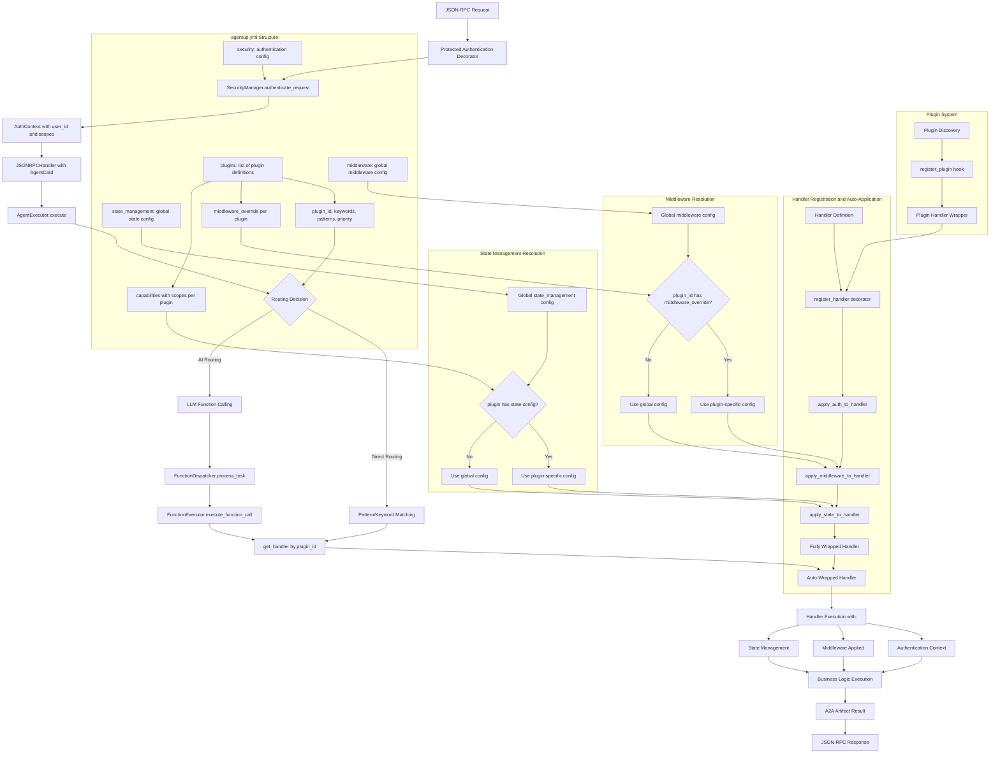

# AgentUp System Architecture and Flow Documentation

## Overview

This document provides a comprehensive analysis of the AgentUp framework's system architecture, detailing the complete flow from plugin configuration in `agentup.yml` to handler execution. The analysis covers routing mechanisms, middleware auto-application, authentication, state management, and plugin integration.

## System Flow Diagram

## Configuration Loading and Plugin Definition

The AgentUp framework begins with the loading of the `agentup.yml` file, which serves as the central configuration source for all system behavior. Plugins are defined within this configuration file with comprehensive metadata that controls both routing behavior and cross-cutting concerns. Each plugin entry contains a `plugin_id` that serves as the unique identifier for handler registration and routing decisions, along with optional `keywords` and `patterns` arrays that enable direct pattern-based routing. The configuration also supports `middleware_override` and per-capability configurations that allow individual plugins to customize their middleware chain and security requirements, overriding the global defaults specified in the top-level `middleware` and `security` sections.

The configuration loader in `src/agent/config/loader.py` processes environment variable substitutions using the `${VAR_NAME:default}` syntax, enabling dynamic configuration based on deployment environment. The loaded configuration gets transformed into strongly-typed models defined in `src/agent/config/model.py`, providing validation and type safety throughout the system. These models include `PluginConfig`, `MiddlewareConfig`, and `StateManagementConfig` classes that encapsulate the various configuration options and their relationships, ensuring that invalid configurations are caught early in the system startup process.

## Request Entry Point and Authentication Flow

The system's primary entry point is the JSON-RPC endpoint defined in `src/agent/api/routes.py:166`, which handles all incoming A2A-compliant requests. Every request immediately encounters the `@protected()` authentication decorator, which serves as the first security checkpoint in the request processing pipeline. This decorator, implemented in `src/agent/security/decorators.py`, invokes the `SecurityManager.authenticate_request()` method from `src/agent/security/manager.py`, which evaluates the incoming request against the configured security policies defined in the agent's configuration.

The authentication process extracts credentials from the request headers according to the configured authentication scheme, whether it be API key authentication via the `X-API-Key` header, Bearer token authentication via the `Authorization` header, or OAuth2 token validation with scope verification. The `SecurityManager` validates these credentials against the configured authentication backend and produces an `AuthenticationResult` object containing the authenticated user's identity, granted scopes, and authorization metadata. This result gets stored in an `AuthContext` object that is maintained throughout the request lifecycle, ensuring that downstream components have access to the authenticated user's information and authorization context.

## Routing System Architecture

The routing system operates on a  dual-architecture model implemented in `src/agent/core/executor.py:45`, where the `AgentExecutor.execute()` method serves as the central orchestration point for routing decisions. The system supports two distinct routing modes that can be configured globally or per-skill: direct routing and AI-powered routing. Direct routing examines each skill's configured keywords and regex patterns against the user input, using the `_determine_skill_and_routing()` method to find the highest-priority matching skill based on keyword matches and pattern matching. This approach provides deterministic routing behavior that is particularly useful for skills that handle specific commands or follow predictable patterns.

AI routing, implemented through the `FunctionDispatcher` in `src/agent/core/dispatcher.py`, leverages Large Language Model function calling capabilities to ly select the most appropriate skill for handling a given request. When AI routing is active, the `FunctionDispatcher.process_task()` method extracts the user message from the A2A task structure, obtains the configured LLM service from the service registry, and retrieves conversation context if state management is enabled. The system then presents the LLM with function schemas representing all available skills that have been decorated with the `@ai_function` decorator, allowing the LLM to analyze the user's intent and select the most appropriate skill while providing properly formatted parameters for skill execution.

## Handler Registration and Auto-Application System

The handler registration system implements a revolutionary auto-application pattern that fundamentally transforms how cross-cutting concerns are managed across the framework. When a handler function is decorated with `@register_handler` in `src/agent/handlers/handlers.py`, it undergoes a  three-stage wrapping process that automatically applies authentication context, middleware, and state management capabilities without requiring manual decorator application in the handler code itself.

The first stage of auto-application involves authentication context injection through the `_apply_auth_to_handler()` function, which ensures that every handler receives the current user's authentication details and authorized scopes from the `AuthContext` established during the initial authentication phase. This provides handlers with access to user identification, granted permissions, and authorization metadata that can be used for fine-grained access control and user-specific behavior customization.

The middleware auto-application stage follows, where the system examines both global middleware configuration and skill-specific `middleware_override` settings to determine which middleware components should be applied to the handler. The `_apply_middleware_to_handler()` function in `src/agent/middleware.py` resolves the appropriate middleware configuration for the specific skill, then iterates through the middleware list in reverse order to ensure proper wrapping order. This process applies decorators for rate limiting, caching, timing, logging, and other cross-cutting concerns, creating a comprehensive middleware chain that intercepts and enhances the request and response flow without requiring manual configuration in the handler code.

The final stage applies state management wrapping through the `_apply_state_to_handler()` function in `src/agent/state/decorators.py`, which inspects the handler's function signature using Python's introspection capabilities to determine if it accepts `context` or `context_id` parameters. If these parameters are present, the system dynamically injects state management capabilities that allow the handler to access conversation history, user preferences, and persistent variables through the configured state backend, whether it be an in-memory store, Redis/Valkey, or file-based persistence.

## Middleware Resolution and Application

The middleware resolution system operates through a hierarchical configuration model where global middleware defined in the `agent_config.yaml` applies to all skills by default, but individual skills can specify `middleware_override` configurations that completely replace the global settings for that specific skill. The `_resolve_middleware_config()` function in `src/agent/middleware.py` implements this resolution logic, first checking for skill-specific overrides and falling back to global configuration when no override is present.

The middleware application process uses a reverse-order wrapping strategy implemented in the `with_middleware()` function, ensuring that the outermost middleware wrapper is applied first and the innermost wrapper closest to the business logic is applied last. This creates a proper middleware chain where each component can intercept, modify, or enhance the request and response flow in the correct order. The system supports various built-in middleware types including rate limiting through the `@rate_limited` decorator, caching through the `@cached` decorator, timing through the `@timed` decorator, and custom middleware implementations that follow the established decorator pattern.

Each middleware component receives the original handler function and returns a wrapped version that provides additional functionality. For example, the rate limiting middleware maintains per-user or per-skill request counters and blocks requests that exceed configured thresholds, while the caching middleware stores handler results in the configured cache backend and returns cached responses for identical requests within the specified time-to-live window. This approach ensures consistent middleware behavior across all skills while allowing for per-skill customization through the override mechanism.

## State Management Auto-Application

State management resolution follows the same hierarchical pattern as middleware, where global `state_management` configuration provides default behavior while skill-specific `state_override` settings allow fine-grained control over which skills have access to conversational state, user context, and persistent storage capabilities. The `_resolve_state_config()` function in `src/agent/state/decorators.py` implements this resolution logic, examining both global and skill-specific configurations to determine the appropriate state backend and configuration parameters.

The state management auto-application process uses  function signature inspection to determine whether a handler can accept state management parameters. The `_inject_state_if_supported()` function examines the handler's signature using Python's `inspect` module to identify parameters named `context` and `context_id`, then dynamically injects these parameters during handler execution. The `context` parameter provides access to a state management interface that supports operations like `await context.get_variable()`, `await context.set_variable()`, and `await context.get_history()`, while the `context_id` parameter provides a unique identifier for the conversation or user session.

The state management system supports multiple backend implementations including in-memory storage for development and testing, Redis/Valkey for production deployments requiring persistence and scalability, and file-based storage for simple persistent scenarios. The backend selection and configuration are controlled through the agent configuration, allowing for easy switching between different storage strategies based on deployment requirements and performance characteristics.

## Plugin System Integration

The plugin system integrates  into the AgentUp architecture through the `PluginManager` class in `src/agent/plugins/manager.py`, which implements a discovery mechanism that scans for installed packages exposing the `agentup.plugins` entry point. The `discover_plugins()` method dynamically loads plugin modules that can contribute skills, middleware, and services to the agent runtime, extending the core functionality without requiring modifications to the framework itself.

Plugin-contributed skills undergo the same registration and auto-application process as core handlers, ensuring consistent behavior and cross-cutting concern application regardless of whether functionality originates from the core framework or external plugins. The `register_skill()` hook allows plugins to register their skill handlers, which get wrapped in adapter functions that translate between the plugin's `SkillContext` interface and the core framework's execution model. This adapter pattern, implemented in `src/agent/plugins/adapter.py`, maintains plugin isolation while enabling full integration with the agent's configuration-driven behavior.

Plugin handlers are automatically wrapped with the same authentication, middleware, and state management capabilities as core handlers, ensuring that plugin-provided functionality receives the same level of integration and support as built-in skills. The plugin system also supports middleware and service contributions, allowing plugins to extend the framework's capabilities beyond just adding new skills, enabling the creation of comprehensive plugin ecosystems that can provide specialized functionality for specific domains or use cases.

### Multi-Modal Capabilities as Plugins

The AgentUp framework follows a plugin-first approach for specialized capabilities like multi-modal processing. Rather than including image processing, document processing, or other multi-modal capabilities in the core framework, these features are implemented as external plugins that can be installed and configured as needed. This architectural decision provides several benefits:

- **Reduced Core Dependencies**: The core framework remains lightweight without optional dependencies like PIL, numpy, or document processing libraries
- **Modular Installation**: Users only install the capabilities they need, reducing deployment complexity and attack surface
- **Specialized Maintenance**: Plugin-specific functionality can be maintained and updated independently from the core framework
- **Extensible Architecture**: New multi-modal capabilities can be added through plugins without modifying the core framework

The framework provides utility classes in `src/agent/utils/multimodal.py` and `src/agent/services/multimodal.py` that plugins can leverage for consistent multi-modal processing patterns, while the actual processing capabilities are provided by plugins like `agentup-image-processing` for image analysis and transformation.

## Function Execution and Result Processing

The execution flow culminates when the fully wrapped handler is invoked with the original A2A `Task` object, along with any injected authentication context, middleware-provided enhancements, and state management capabilities that were configured for the specific skill. The handler executes its business logic with access to all framework services through the service registry, state backends for persistent data storage, and cross-cutting capabilities provided by the middleware chain.

Handler execution follows different paths depending on the routing mode used to select the skill. For direct routing, the `AgentExecutor._process_direct_routing()` method in `src/agent/core/executor.py:123` retrieves the handler using `get_handler(skill_id)` and directly invokes it with the task parameters. For AI routing, the `FunctionDispatcher.process_task()` method coordinates with the `FunctionExecutor.execute_function_call()` method in `src/agent/core/function_executor.py` to handle LLM-directed function calls with parameter extraction and validation.

The `FunctionExecutor` implements  state management integration through the `_execute_with_state_management()` method, which dynamically applies state management capabilities to handlers that support them, while gracefully falling back to normal execution for handlers that don't require state access. This approach ensures that the same handler code can work in both stateful and stateless contexts, providing maximum flexibility for different deployment scenarios and use cases.

Handler results are transformed into A2A-compliant `Artifact` objects that encapsulate the response data, metadata, and any additional information required by the A2A specification. These artifacts are then serialized into proper JSON-RPC responses that maintain compatibility with the A2A protocol while providing rich metadata about the processing that occurred. The response generation process in `src/agent/api/routes.py` handles both standard JSON responses and Server-Sent Events streaming responses, depending on the request method and configured capabilities.

## Key Architecture Benefits

The AgentUp architecture provides several significant benefits through its configuration-driven approach and auto-application pattern. The system achieves configuration-driven behavior where everything is controlled through the `agent_config.yaml` file, eliminating the need for manual decorators in handler code and ensuring consistent application of cross-cutting concerns across all skills. This approach reduces code duplication, improves maintainability, and provides a single source of truth for all system behavior.

The auto-application pattern ensures that middleware and state management are automatically applied at handler registration time, with per-skill overrides available for customization scenarios. This eliminates the common problem of forgetting to apply necessary decorators to new handlers, while still providing the flexibility to customize behavior for specific skills that have unique requirements. The system also implements graceful fallbacks where handlers work even if middleware or state management are not configured, ensuring that the framework remains functional across different deployment scenarios.

The plugin system integration demonstrates the power of the auto-application approach by ensuring that plugin-contributed skills receive the same treatment as core handlers with respect to authentication, middleware, and state management. This creates a consistent development experience for plugin authors while maintaining the security and reliability guarantees of the core framework. The result is a highly extensible system that can grow through plugin contributions while maintaining architectural consistency and operational reliability.

## Code References

- **Main Entry Point**: `src/agent/api/routes.py:166` - JSON-RPC endpoint with @protected decorator
- **Authentication System**: `src/agent/security/manager.py` - SecurityManager.authenticate_request()
- **Routing Logic**: `src/agent/core/executor.py:45` - AgentExecutor.execute() method
- **Handler Registration**: `src/agent/handlers/handlers.py` - @register_handler decorator
- **Middleware Auto-Application**: `src/agent/middleware.py` - _apply_middleware_to_handler()
- **State Management**: `src/agent/state/decorators.py` - _apply_state_to_handler()
- **Plugin System**: `src/agent/plugins/manager.py` - PluginManager.discover_plugins()
- **Function Execution**: `src/agent/core/function_executor.py` - FunctionExecutor class
- **Configuration Models**: `src/agent/config/models.py` - SkillConfig, MiddlewareConfig classes
- **Service Registry**: `src/agent/services/registry.py` - Service integration and health checks
- **Multi-Modal Utilities**: `src/agent/utils/multimodal.py` - MultiModalHelper utility class for plugins
- **Multi-Modal Services**: `src/agent/services/multimodal.py` - MultiModalProcessor and service classes for plugin use