# Mermaid Diagrams Guide

Mermaid diagrams are now fully supported in your AgentUp documentation! Simply use code blocks with the `mermaid` language identifier to create beautiful, interactive diagrams.

## How to Use Mermaid

To create a Mermaid diagram, use a code block with the `mermaid` language:

````markdown
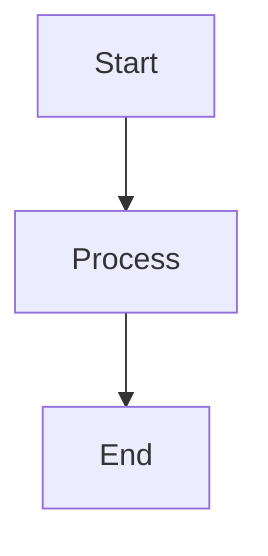
````

## Supported Diagram Types

### 1. Flowcharts

Perfect for showing process flows and decision trees:

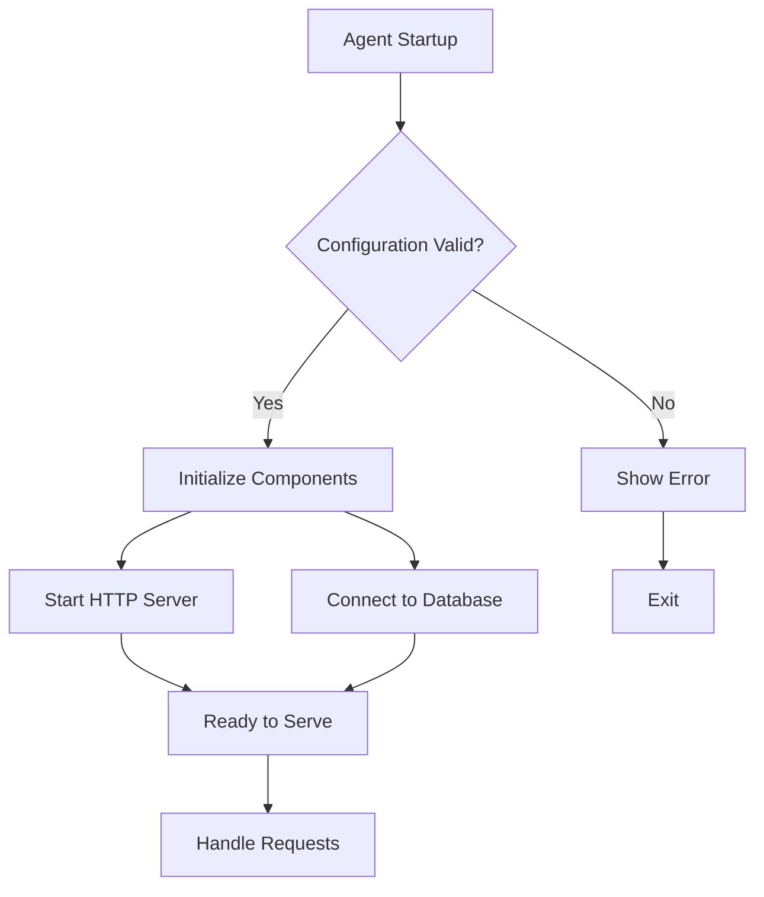

### 2. Sequence Diagrams

Ideal for showing API interactions and communication flows:

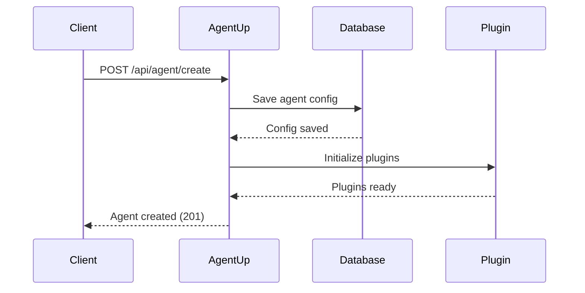

### 3. Class Diagrams

Great for showing code architecture and relationships:

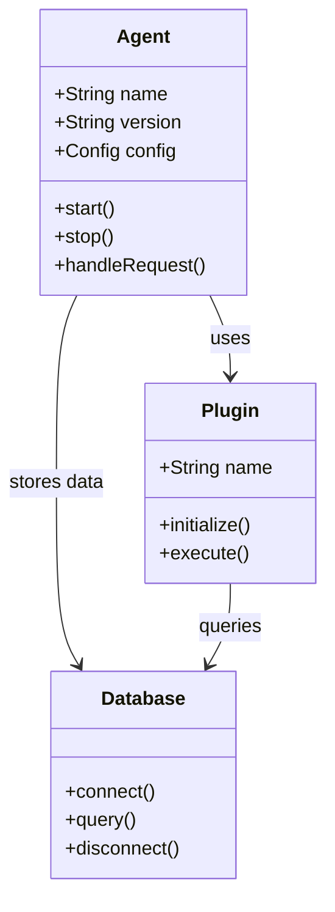

### 4. State Diagrams

Perfect for showing agent states and transitions:

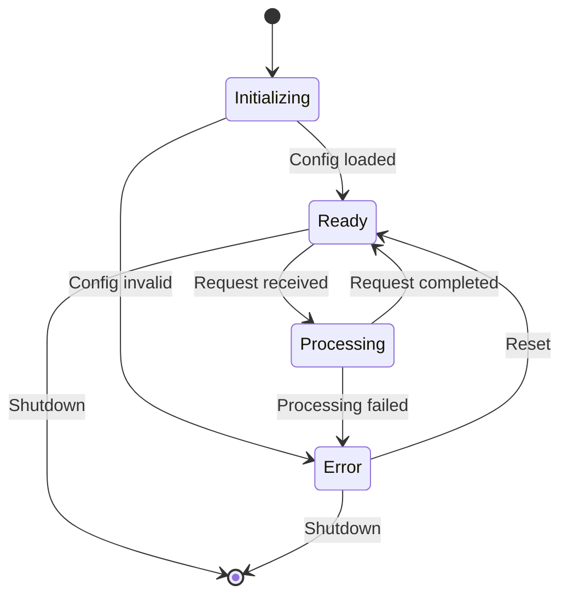

### 5. Entity Relationship Diagrams

Useful for database design documentation:

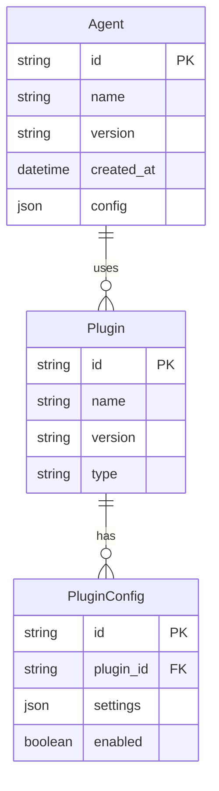

### 6. Gantt Charts

Excellent for project timelines and milestones:

```mermaid
gantt
    title AgentUp Development Timeline
    dateFormat  YYYY-MM-DD
    section Core Development
    Framework Setup       :done, framework, 2024-01-01, 2024-01-15
    Plugin System         :done, plugins, 2024-01-10, 2024-02-01
    Authentication        :active, auth, 2024-01-20, 2024-02-15
    
    section Documentation
    API Documentation     :docs, after auth, 2024-02-01, 2024-02-20
    User Guides          :guides, after docs, 2024-02-15, 2024-03-01
    
    section Testing
    Unit Tests           :testing, 2024-01-25, 2024-03-01
    Integration Tests    :integration, after testing, 2024-02-15, 2024-03-15
```

### 7. Pie Charts

Great for showing distributions and statistics:

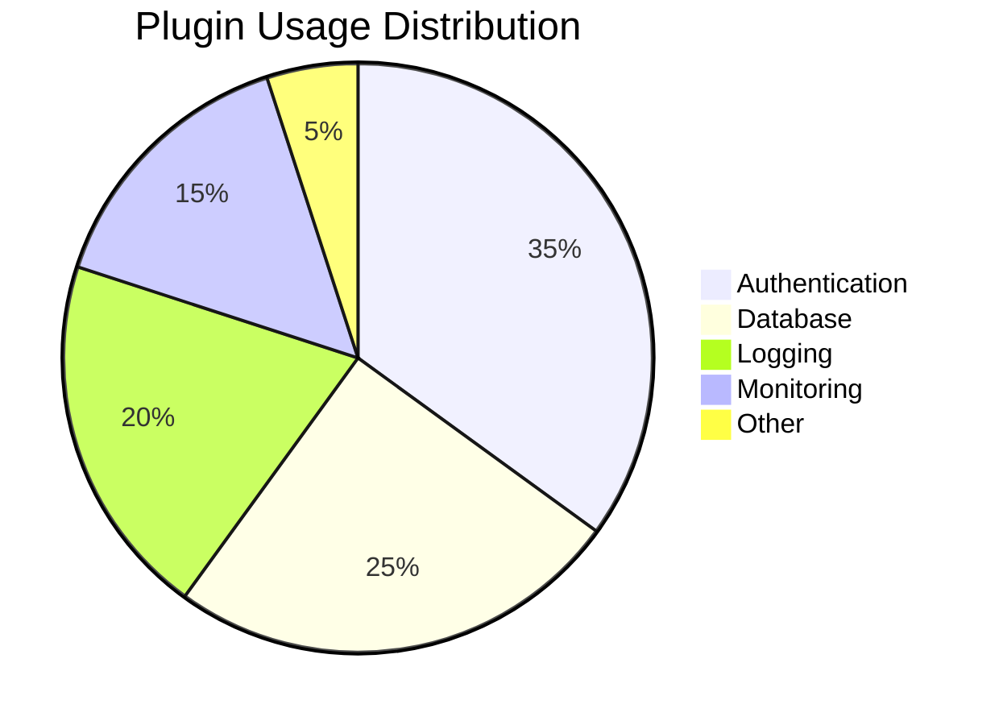

### 8. User Journey

Perfect for documenting user workflows:

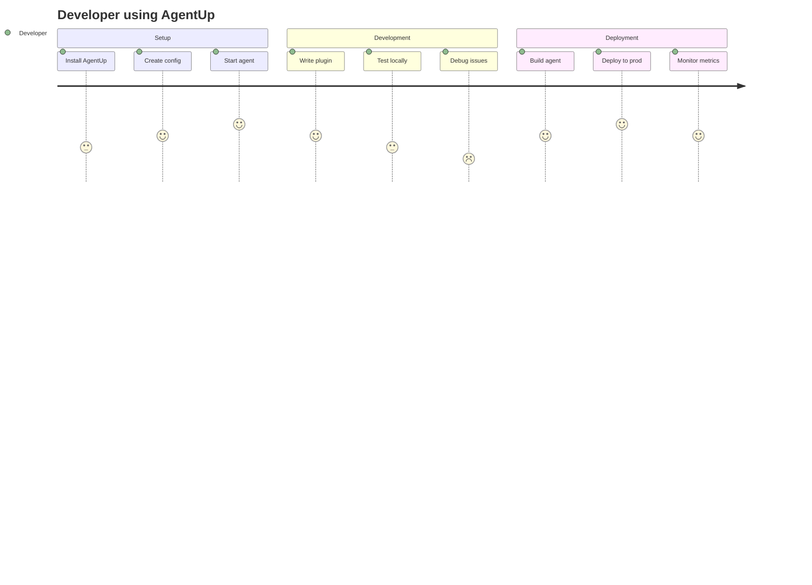

### 9. Git Graph

Useful for showing branching strategies:

```mermaid
gitgraph
    commit id: "Initial commit"
    branch feature/auth
    checkout feature/auth
    commit id: "Add auth plugin"
    commit id: "Add tests"
    checkout main
    merge feature/auth
    commit id: "Release v1.1.0"
    branch feature/monitoring
    checkout feature/monitoring
    commit id: "Add metrics"
    checkout main
    commit id: "Hotfix: security patch"
    checkout feature/monitoring
    merge main
    commit id: "Update monitoring"
    checkout main
    merge feature/monitoring
    commit id: "Release v1.2.0"
```

## Styling and Themes

All Mermaid diagrams automatically use your retro comic book theme with:

- **Teal colors** for primary elements
- **Charcoal borders** and text
- **Cream backgrounds** for readability
- **Roboto font** for consistency
- **Retro borders** with shadows

## Best Practices

### 1. Keep It Simple
- Use clear, descriptive labels
- Avoid overcrowding diagrams
- Break complex flows into multiple diagrams

### 2. Use Appropriate Diagram Types
- **Flowcharts**: Process flows, decision trees
- **Sequence**: API calls, interactions
- **Class**: Code architecture
- **State**: System states, workflows
- **ER**: Database design
- **Gantt**: Project timelines

### 3. Label Everything
- Use meaningful node names
- Add descriptions for complex flows
- Include relationship labels

### 4. Consider Your Audience
- Technical diagrams for developers
- High-level flows for stakeholders
- Detailed sequences for API documentation

## Common Examples for AgentUp Documentation

### Agent Lifecycle

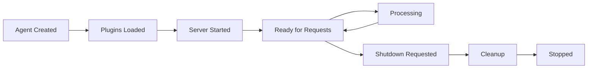

### Plugin Architecture

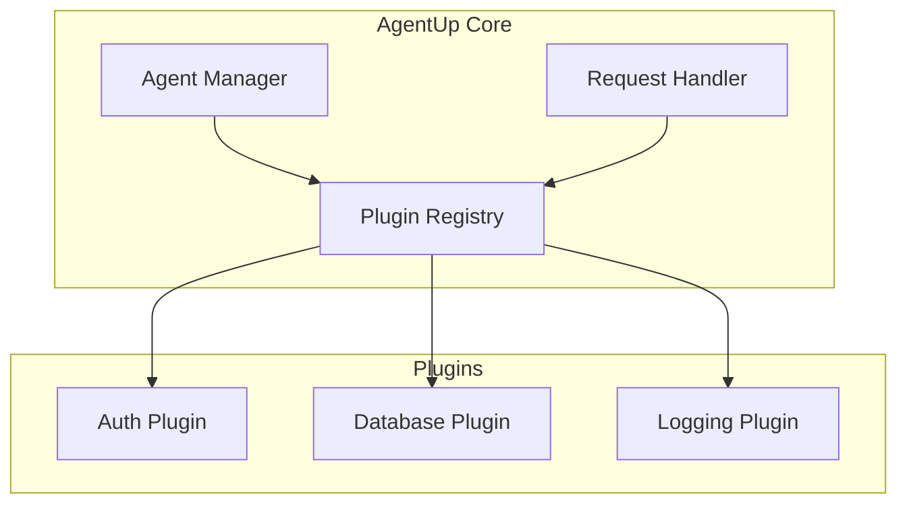

### Authentication Flow

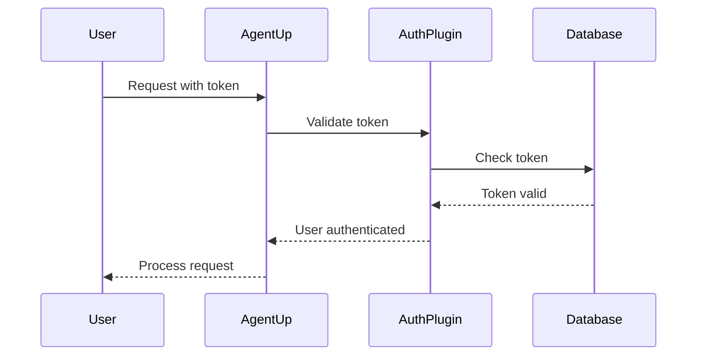

## Troubleshooting

If diagrams don't render:

1. **Check syntax**: Ensure your Mermaid syntax is correct
2. **Language identifier**: Use `mermaid` (lowercase) in code blocks
3. **Browser console**: Look for JavaScript errors
4. **Complex diagrams**: Break into smaller, simpler diagrams

## Resources

- [Mermaid Official Documentation](https://mermaid.js.org/)
- [Mermaid Live Editor](https://mermaid.live/) - Test your diagrams
- [Syntax Reference](https://mermaid.js.org/syntax/classDiagram.html)

Your AgentUp documentation now supports all these diagram types with beautiful, consistent styling that matches your retro comic book theme!