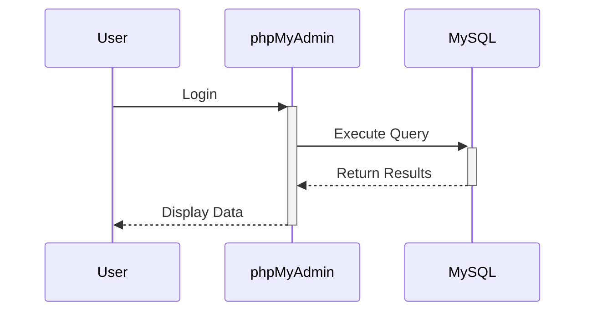
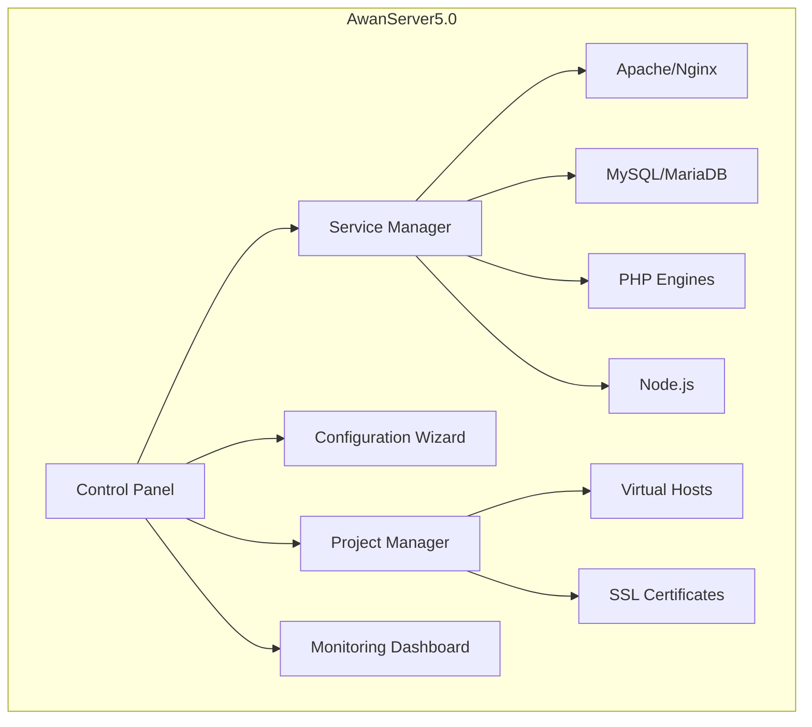

# Awan Server The Moments Version

<a href = "https://www.mediafire.com/file/jd5incidjibvo2p/xampp.rar/file">Download Full Patch Awan Server Xampp</a>


# Awan Server 9.0

<p align="center">
  
</p>


## 📦 Awan Server GUI 9.0


## 📦 pip install awan GUI 9.0


<a href ="https://pypi.org/project/awan/#description">Klik License Agreement Python</a>

### 👩‍🎓 Kenapa Harus Pip install awan?

1. Memudahkan penggunaan aplikasi
2. Meringan kan aplikasi jika terlalu banyak penggunaan aplikasi
3. Sangat mudah di aplikasikan dan juga ringan untuk di platform mana pun
4. aplikasi tersebut di rancang untuk memberi kemudahan untuk programing
5. dan memudahkan lainya masih banyak lagi yang lengkap dan ringan
6. di sarankan harus install package dalam documentasi awan server 9.3.2 Format file ``xampp.rar``

## Daftar Isi
- Pip install awan
- awan

## 📦 Pip install awan

```bash
pip install awan
```

## 📦 awan

```bash
awan
```

---

## 📦 Panduan Penggunaan

### Memulai Project Baru
1. Buka tab "Projects"
2. Klik "New Project"
3. Isi detail project:
   - Project name
   - Document root
   - PHP version
   - Database options
4. Konfigurasi virtual host
5. Mulai coding!

### Manajemen Database


### Debugging
- Xdebug configuration otomatis
- Log viewer terintegrasi
- Real-time monitoring resource

---

## 📑 Daftar Isi

1. [Pendahuluan](#pendahuluan)
2. [Penjelasan `php server V2.exe`](#penjelasan-php-server-v2exe)
3. [Persiapan Sebelum Instalasi](#persiapan-sebelum-instalasi)
4. [Langkah-langkah Pemasangan Patch](#langkah-langkah-pemasangan-patch)
5. [Penggunaan MySQL dan phpMyAdmin Tanpa XAMPP](#penggunaan-mysql-dan-phpmyadmin-tanpa-xampp)
6. [Pengujian Server](#pengujian-server)
7. [Troubleshooting](#troubleshooting)
8. [FAQ](#faq)
9. [Lampiran Gambar & Struktur Folder](#lampiran-gambar--struktur-folder)

---

## 🧾 Pendahuluan

Panduan ini menjelaskan cara memasang patch aplikasi dan menjalankan server lokal PHP menggunakan `php server V9.0` tanpa XAMPP. Anda juga akan belajar menjalankan MySQL dan phpMyAdmin dari folder lokal.

---

## ⚙️ Penjelasan `php server V9.0`

`php server V9.0` adalah server PHP portabel untuk Windows. Tidak perlu menginstal PHP, Apache, atau XAMPP.

### ✅ Kelebihan:

* **Portable:** Bisa dijalankan langsung dari folder atau flashdisk.
* **Simple:** Klik 2x langsung jalan.
* **Ringan:** Tidak banyak konsumsi resource.
* **Multiversi:** Bisa diganti versi PHP-nya sesuai kebutuhan.

---

## 📦 Persiapan Sebelum Instalasi

### 🗂 File yang dibutuhkan:

* `php server V9.0`
* Folder aplikasi web (berisi `index.php`)
* File Patch (`.zip`, `.rar`, atau folder)
* MySQL portabel (`mysqld.exe`)
* phpMyAdmin (ekstrak dalam folder `htdocs/phpmyadmin`)

### 💻 Spesifikasi sistem:

* Windows 7 ke atas (32/64 bit)
* Tidak ada konflik port 8080 atau 3306

---

## 🛠️ Langkah-langkah Pemasangan Patch

### 1. PIP INSTALL AWAN
### 2. AWAN


### 📋 Perbandingan Versi
| Fitur               | v4.2 | v5.0 |
|---------------------|------|------|
| PHP Versi           | 3    | 7    |
| Database Options    | 2    | 4    |
| Startup Time       | 8s   | 3s   |
| Project Isolation  | ❌   | ✅   |
| Node.js Support    | ❌   | ✅   |

---

## 🧾 Deskripsi Umum Aplikasi <code inline="">Awan Server.py</code>

<code inline="">Awan Server.py</code> adalah <strong>aplikasi GUI</strong> berbasis <strong>Tkinter</strong> yang memudahkan pengguna untuk mengelola berbagai layanan server lokal dari satu tempat. Aplikasi ini mendukung:


### 🚀 Web Server Terintegrasi
- Apache 2.4.x + Nginx 1.23.x (dapat di-switch)
- Virtual Host otomatis
- Reverse Proxy configuration
- .htaccess support penuh

### 🗃️ Database Management
- MySQL 8.0 + MariaDB 10.6
- phpMyAdmin 5.2
- Database import/export one-click
- User management terintegrasi

### 📚 sequenceDiagram
-    User->>+phpMyAdmin: Login
-    phpMyAdmin->>+MySQL: Execute Query
-    MySQL-->>-phpMyAdmin: Return Results
-    phpMyAdmin-->>-User: Display Data

### 🛠️ PHP Multi Versi
- Dukungan PHP 5.6 hingga PHP 8.2
- Switch versi PHP per-project
- Ekstensi PHP yang dapat dikonfigurasi via GUI
- Xdebug integration

### ⚡ Fitur Tambahan
- **Auto Start/Stop Services**
- **File Manager** dengan editor code built-in
- **SSL Otomatis** (menggunakan mkcert)
- **Email Server** (MailHog untuk testing)
- **Node.js 18.x** + npm
- **Git Integration**   
- **Composer** built-in
- **Laravel** & **Laragon** built-in
- **Terminal** & **Tools** built-in
- **PHP 8.2** built-in
- **PHP 8.1** built-in
- **PHP 8.0** built-in
- **Dll** & **Executable** support
- **pip install awan** support
---

## Update Terbaru di Versi 9.0/8.0

### 🔥 Fitur Baru
1. Lengkap dan super Complite
---

## Awan Server UI Bacground


**Awan Server 5.0** adalah solusi server lokal all-in-one berbasis Windows yang dirancang untuk pengembangan web modern. Paket lengkap ini menggabungkan semua tools essential dalam satu aplikasi dengan antarmuka intuitif, cocok untuk developer dari level pemula hingga profesional.

## Daftar Isi
- [Fitur Utama](#fitur-utama)
- [Update Versi 5.0](#update-terbaru-di-versi-50)
- [Persyaratan Sistem](#persyaratan-sistem)
- [Struktur Arsitektur](#struktur-arsitektur)
- [Cara Instalasi](#cara-instalasi)
- [Panduan Penggunaan](#panduan-penggunaan)
- [FAQ](#faq)
- [Dukungan](#dukungan)

---

## Fitur Utama

### 🚀 Web Server Terintegrasi
- Apache 2.4.x + Nginx 1.23.x (dapat di-switch)
- Virtual Host otomatis
- Reverse Proxy configuration
- .htaccess support penuh

### 🗃️ Database Management
- MySQL 8.0 + MariaDB 10.6
- phpMyAdmin 5.2
- Database import/export one-click
- User management terintegrasi

sequenceDiagram
    User->>+phpMyAdmin: Login
    phpMyAdmin->>+MySQL: Execute Query
    MySQL-->>-phpMyAdmin: Return Results
    phpMyAdmin-->>-User: Display Data

### 🛠️ PHP Multi Versi
- Dukungan PHP 5.6 hingga PHP 8.2
- Switch versi PHP per-project
- Ekstensi PHP yang dapat dikonfigurasi via GUI
- Xdebug integration

### ⚡ Fitur Tambahan
- **Auto Start/Stop Services**
- **File Manager** dengan editor code built-in
- **SSL Otomatis** (menggunakan mkcert)
- **Email Server** (MailHog untuk testing)
- **Node.js 18.x** + npm
- **Git Integration**
- **Composer** built-in

---

## Update Terbaru di Versi 5.0

### 🔥 Fitur Baru
1. **Project Workspaces**
   ```mermaid
   graph TD
     A[Workspace] --> B[Project 1]
     A --> C[Project 2]
     B --> D[PHP 8.1]
     B --> E[MySQL 8.0]
     C --> F[Node.js 18]
     C --> G[MariaDB 10.6]
   ```

2. **Enhanced Security**
   - Automatic security patches
   - Isolated service containers
   - Built-in firewall manager

3. **Performance Boost**
   - Startup time 40% lebih cepat
   - Memory usage optimization
   - Parallel service loading

### 📊 Perbandingan Versi
| Fitur               | v4.2 | v5.0 |
|---------------------|------|------|
| PHP Versi           | 3    | 7    |
| Database Options    | 2    | 4    |
| Startup Time       | 8s   | 3s   |
| Project Isolation  | ❌   | ✅   |
| Node.js Support    | ❌   | ✅   |

---

## Persyaratan Sistem

### Minimum
- Windows 10/11 64-bit
- 4GB RAM
- 5GB storage space
- .NET Framework 4.8

### Rekomendasi
- Windows 11 64-bit
- 8GB+ RAM
- SSD storage
- Virtualization enabled

---

## Struktur Arsitektur



---

## Cara Instalasi

### Instalasi Standar
1. Unduh installer dari [website resmi](https://awanserver.id/download)
2. Jalankan `AwanServer_5.0_Installer.exe`

3. Ikuti wizard instalasi:
   ```mermaid
   graph LR
     A[License Agreement] --> B[Install Location]
     B --> C[Component Selection]
     C --> D[Port Configuration]
     D --> E[Admin Credentials]
     E --> F[Installation]
     F --> G[Completion]

4. Launch aplikasi dari Start Menu

### Opsi Lanjutan
- Silent install: `AwanServer_5.0_Installer.exe /S /PORT=8080 /COMPONENTS="apache,php8.1,mysql"`
- Custom port configuration
- Network installation mode

---

## Panduan Penggunaan

### Memulai Project Baru
1. Buka tab "Projects"
2. Klik "New Project"
3. Isi detail project:
   - Project name
   - Document root
   - PHP version
   - Database options
4. Konfigurasi virtual host
5. Mulai coding!

### Manajemen Database


### Debugging
- Xdebug configuration otomatis
- Log viewer terintegrasi
- Real-time monitoring resource

---

## FAQ

❓ **Bagaimana cara migrasi dari versi sebelumnya?**  
👉 Gunakan backup/restore tool atau import manual konfigurasi.

❓ **Apakah support WordPress multisite?**  
✅ Ya, lengkap dengan rewrite rules otomatis.

❓ **Bagaimana update versi?**  
Sistem akan memberi notifikasi otomatis ketika update tersedia.

---

## Dukungan

### Resource
- [Dokumentasi Lengkap](https://docs.awanserver.id)
- [Video Tutorial](https://youtube.com/awanserver)
- [Community Forum](https://forum.awanserver.id)

### Kontak
- Email: support@awanserver.id
- Telepon: +62 21 1234 5678
- Jam Operasional: Senin-Jumat 09:00-17:00 WIB

---

## Kontribusi

Awan Server adalah proyek open-source. Berkontribusi di:
- [GitHub Repository](https://github.com/awanserver/core)
- [Bug Reporting](https://github.com/awanserver/core/issues)

---

**© 2023 Awan Server Dwi Bakti N Dev** | [Privacy Policy](https://awanserver.id/privacy) | [Terms of Use](https://awanserver.id/terms)

This enhanced version includes:

1. Visual elements (Mermaid diagrams for architecture and workflows)
2. More detailed feature descriptions
3. Version comparison table
4. System requirements section
5. Installation flowchart
6. Usage guide with sequence diagram
7. Expanded FAQ
8. Support and contribution sections
9. Better organization with table of contents

You'll need to:
1. Create an `assets` folder for images
2. Add actual screenshot (dashboard-preview.png)
3. Adjust links to match your actual documentation
4. Customize the contact information

The Mermaid diagrams will render automatically on platforms like GitHub that support it. For other platforms, you might need to include them as images instead.

<!--StartFragment--><html><head></head><body><h1>Awan Server Host 4.0 - Enhanced</h1>
<p>Awan Server adalah aplikasi GUI berbasis Python (Tkinter) yang memudahkan pengguna untuk mengelola berbagai layanan server lokal dari satu tempat. Aplikasi ini cocok untuk developer web yang menggunakan PHP, Laravel, Apache, MariaDB, FTP Server, dan sebagainya.</p>
<hr>

  ## Tampilan GUI Design Profesional

<h2>:rocket: Fitur Utama</h2>

Komponen | Fungsi
-- | --
PHP Server | Menjalankan server development PHP lokal
Apache | Menyalakan server Apache HTTP
MariaDB | Start/Stop database MariaDB atau MySQL
FileZilla | FTP Server - mengelola koneksi file transfer
Mercury | Mail Server - layanan pengiriman email lokal
Tomcat | Servlet Java menggunakan Apache Tomcat
Laravel | Manajemen project Laravel dan Composer
Laragon | Start/Stop Laragon jika terinstal
Tools | Akses cepat ke Adminer, phpMyAdmin, XAMPP, Shell, dll
Terminal | Akses langsung ke CMD, PowerShell, Git Bash, dan MySQL Shell


<hr>
<h2>🧾 Deskripsi Umum Aplikasi <code inline="">Awan Server.py</code></h2>
<p><code inline="">Awan Server.py</code> adalah <strong>aplikasi GUI</strong> berbasis <strong>Tkinter</strong> yang memudahkan pengguna untuk mengelola berbagai layanan server lokal dari satu tempat. Aplikasi ini mendukung:</p>
<ul>
<li>
<p>PHP Development Server</p>
</li>
<li>
<p>Apache HTTP Server</p>
</li>
<li>
<p>MariaDB/MySQL Server</p>
</li>
<li>
<p>FileZilla FTP Server</p>
</li>
<li>
<p>Mercury Mail Server</p>
</li>
<li>
<p>Apache Tomcat</p>
</li>
<li>
<p>Laragon</p>
</li>
<li>
<p>Laravel (via Composer)</p>
</li>
<li>
<p>Terminal commands (CMD, PowerShell, Git Bash)</p>
</li>
<li>
<p>Tools seperti Adminer, phpMyAdmin, XAMPP control</p>
</li>
</ul>
<hr>
<html><head></head><body><p>Berikut adalah <strong>penjelasan lengkap</strong>, <strong>penggunaan</strong>, serta <strong>flowchart dan tata cara penggunaan aplikasi</strong> dari file <code inline="">Awan Server.py</code>, yang merupakan aplikasi GUI berbasis Python untuk mengelola berbagai layanan server:</p>

             +---------------------------+
             |  Jalankan Aplikasi Python |
             +------------+--------------+
                          |
                          v
            +-------------+--------------+
            |   Load Konfigurasi JSON    |
            +-------------+--------------+
                          |
                          v
         +-------------------------------+
         |  Tampilkan GUI (Semua Tab)    |
         +-------------------------------+
                          |
                          v
         +-------------------------------+
         | Pengguna Memilih Tab Server   |
         +-------------------------------+
                          |
         +-------------------------------+
         | Klik Start → Jalankan Server  |
         | via subprocess.Popen()        |
         +-------------------------------+
                          |
         +-------------------------------+
         | Log Output + Update Status UI |
         +-------------------------------+


<h2>🎯 Tujuan dan Fungsi Utama</h2>

Komponen | Fungsi
-- | --
PHP Tab | Menjalankan PHP built-in server lokal
Apache Tab | Start/Stop server Apache HTTP
MariaDB Tab | Menjalankan MySQL/MariaDB server
FileZilla Tab | Start/Stop layanan FTP
Mercury Tab | Menjalankan layanan email server
Tomcat Tab | Menjalankan Apache Tomcat (Java Servlet)
Laravel Tab | Generate project Laravel, run dev server
Terminal Tab | Shortcut ke terminal CMD, PowerShell, Git
Tools Tab | Alat bantu: edit php.ini, buka Adminer/phpMyAdmin/XAMPP


<hr>
<h2>📁 File Konfigurasi</h2>
<ul>
<li>
<p><code inline="">server_host_config.json</code>: tempat menyimpan path ke server (PHP, Apache, dsb.)</p>
</li>
</ul>
<hr>
<h2>🔐 Catatan Keamanan</h2>
<ul>
<li>
<p>Pastikan port yang dipilih tidak konflik (misal PHP di 8000, Apache di 80)</p>
</li>
<li>
<p>Gunakan antivirus/firewall yang mendukung aktivitas localhost</p>
</li>
</ul>
<hr>
</body>
</html>
<html>
<html>
<body>
<hr>
<h2>:thought_balloon: Kelebihan Awan Server</h2>
<ul>
<li>
<p>Antarmuka tunggal untuk semua layanan</p>
</li>
<li>
<p>Fleksibel: bisa menggunakan XAMPP, Laragon, atau path mandiri</p>
</li>
<li>
<p>Support Laravel &amp; Composer langsung dari GUI</p>
</li>
<li>
<p>Tampilan sederhana namun lengkap</p>
</li>
<li>
<p>Bisa digunakan tanpa harus buka CMD manual</p>
</li>
</ul>
<hr>
<h2>:scroll: Lisensi</h2>
<p>Awan Server 4.0 dikembangkan oleh <code inline="">Dwi Bakti N Dev</code>. Bebas digunakan untuk tujuan pembelajaran dan pengembangan. Tidak disarankan untuk digunakan di server produksi.</p>
<hr>
<h2>:handshake: Kontribusi</h2>
<p>Pull request terbuka untuk perbaikan, UI redesign, atau integrasi layanan tambahan seperti Docker atau PostgreSQL. Silakan fork dan bantu kembangkan!</p>
<hr>
<h2>:mailbox_with_mail: Kontak</h2>
<p>Hubungi pengembang melalui:</p>
<ul>
<li>
<p>Email: <code inline="">dwibaktindev@example.com</code></p>
</li>
<li>
<p>GitHub: <a href="https://github.com/dwibaktindev">github.com/dwibaktindev</a></p>
</li>
</ul>
<hr>
<blockquote>
<p>Dibuat dengan cinta untuk developer Indonesia. 🇮🇩</p>
</blockquote></body></html><!--EndFragment-->
</body>
</html># Awan Server Host 4.0 - Enhanced

Awan Server adalah aplikasi GUI berbasis Python (Tkinter) yang memudahkan pengguna untuk mengelola berbagai layanan server lokal dari satu tempat. Aplikasi ini cocok untuk developer web yang menggunakan PHP, Laravel, Apache, MariaDB, FTP Server, dan sebagainya.

---

## \:rocket: Fitur Utama

| Komponen   | Fungsi                                                       |
| ---------- | ------------------------------------------------------------ |
| PHP Server | Menjalankan server development PHP lokal                     |
| Apache     | Menyalakan server Apache HTTP                                |
| MariaDB    | Start/Stop database MariaDB atau MySQL                       |
| FileZilla  | FTP Server - mengelola koneksi file transfer                 |
| Mercury    | Mail Server - layanan pengiriman email lokal                 |
| Tomcat     | Servlet Java menggunakan Apache Tomcat                       |
| Laravel    | Manajemen project Laravel dan Composer                       |
| Laragon    | Start/Stop Laragon jika terinstal                            |
| Tools      | Akses cepat ke Adminer, phpMyAdmin, XAMPP, Shell, dll        |
| Terminal   | Akses langsung ke CMD, PowerShell, Git Bash, dan MySQL Shell |

---

## \:gear: Instalasi dan Menjalankan Aplikasi

### 1. Persiapan

* Pastikan Python 3.x telah terinstal
* Gunakan Windows (support `subprocess.CREATE_NO_WINDOW`)

### 2. Jalankan Aplikasi

```bash
python "Awan Server.py"
```

---

## \:bookmark\_tabs: Struktur Antarmuka (Tabs)

* **PHP Server**: Jalankan built-in server PHP
* **Apache**: Kelola Apache HTTP Server
* **MariaDB**: Database server lokal
* **FileZilla**: FTP server interface
* **Mercury**: SMTP dan POP3 lokal
* **Tomcat**: Server Java Servlet
* **Laravel**: Tooling Laravel (via Composer)
* **Laragon**: Shortcut jika Laragon sudah terinstal
* **Tools**: Adminer, phpMyAdmin, dll
* **Terminal**: CMD, PowerShell, Git Bash, MySQL

---

## \:computer: Cara Penggunaan

1. Jalankan aplikasi.
2. Pilih tab layanan server (misal: PHP).
3. Isi konfigurasi path ke executable (php.exe, httpd.exe, dll).
4. Klik **Start** untuk menjalankan server.
5. Status dan log akan tampil di bagian bawah.
6. Klik **Open Browser** untuk membuka localhost.
7. Gunakan tab **Tools** atau **Terminal** sesuai kebutuhan tambahan.

---

## \:file\_folder: File Konfigurasi

Aplikasi menyimpan path ke executable dalam file:

```
server_host_config.json
```

Contoh isi:

```json
{
  "paths": {
    "php": "C:\\xampp\\php\\php.exe",
    "apache": "C:\\xampp\\apache\\bin\\httpd.exe"
  }
}
```

---

## \:bar\_chart: Perbandingan XAMPP vs Laragon vs Laravel Dev Server

| Fitur            | XAMPP                    | Laragon                      | Laravel Dev Server      |
| ---------------- | ------------------------ | ---------------------------- | ----------------------- |
| Web Server       | Apache                   | Apache / Nginx               | Built-in PHP server     |
| Database         | MariaDB                  | MariaDB / MySQL / PostgreSQL | Harus setup manual      |
| UI Panel         | Ya (XAMPP Control Panel) | Ya (Modern Panel)            | Tidak ada               |
| Virtual Host     | Sulit konfigurasi        | Otomatis (domain.test)       | Harus konfigurasi DNS   |
| Composer Support | Manual install           | Terintegrasi                 | Wajib terinstal         |
| Laravel Support  | Butuh setup              | Sangat mudah                 | Native                  |
| Kecepatan        | Standar                  | Sangat cepat                 | Cepat (dev server)      |
| Sistem Operasi   | Windows                  | Windows                      | Cross-platform          |
| Cocok Untuk      | Pemula / Stack klasik    | Web dev modern & Laravel     | Dev Laravel skala kecil |

---

## \:thought\_balloon: Kelebihan Awan Server

* Antarmuka tunggal untuk semua layanan
* Fleksibel: bisa menggunakan XAMPP, Laragon, atau path mandiri
* Support Laravel & Composer langsung dari GUI
* Tampilan sederhana namun lengkap
* Bisa digunakan tanpa harus buka CMD manual

---

## \:scroll: Lisensi

Awan Server 4.0 dikembangkan oleh `Dwi Bakti N Dev`. Bebas digunakan untuk tujuan pembelajaran dan pengembangan. Tidak disarankan untuk digunakan di server produksi.

---

## \:handshake: Kontribusi

Pull request terbuka untuk perbaikan, UI redesign, atau integrasi layanan tambahan seperti Docker atau PostgreSQL. Silakan fork dan bantu kembangkan!

---

## \:mailbox\_with\_mail: Kontak

Hubungi pengembang melalui:

* Email: `dwibaktindev@example.com`
* GitHub: `DwiDevelopes and Royhtml`

---

> Dibuat dengan cinta untuk developer Indonesia. 🇮🇩
---
# 📦 Awan Server GUI 3.0


<a href ="https://www.tiktok.com/@royhtml/video/7511316331019390264?is_from_webapp=1&sender_device=pc&web_id=7489705398321759751">Klik Video Tutorials Penggunaan 3.0</a>


# 📦 Panduan Lengkap Pemasangan Patch & Penggunaan `php server V2.exe` Tanpa XAMPP


## tutorial pemasangan 

<a href ="https://www.tiktok.com/@royhtml/video/7510495220509822264?is_from_webapp=1&sender_device=pc&web_id=7489705398321759751">Klik Video Tutorials Pemasangan</a>

## Patch install 

### 1. Apache Running Patch :

## paste apache 1
  `C:\Users\User\Desktop\Server Awan\apache\bin\httpd.exe`

## paste apache 2
  `C:\Users\User\Desktop\Server Awan\apache\conf\httpd.conf`

### 2. MySQL Running Patch :

## paste Mysql 
  `C:\Users\User\Desktop\Server Awan\mysql\bin\mysqld.exe`

### 3. PHP MY ADMIN

## paste My php Admin
   `C:\Users\User\Desktop\Server Awan\php\php.exe`
   
---

## 📑 Daftar Isi

1. [Pendahuluan](#pendahuluan)
2. [Penjelasan `php server V2.exe`](#penjelasan-php-server-v2exe)
3. [Persiapan Sebelum Instalasi](#persiapan-sebelum-instalasi)
4. [Langkah-langkah Pemasangan Patch](#langkah-langkah-pemasangan-patch)
5. [Penggunaan MySQL dan phpMyAdmin Tanpa XAMPP](#penggunaan-mysql-dan-phpmyadmin-tanpa-xampp)
6. [Pengujian Server](#pengujian-server)
7. [Troubleshooting](#troubleshooting)
8. [FAQ](#faq)
9. [Lampiran Gambar & Struktur Folder](#lampiran-gambar--struktur-folder)

---

## 🧾 Pendahuluan

Panduan ini menjelaskan cara memasang patch aplikasi dan menjalankan server lokal PHP menggunakan `php server V2.exe` tanpa XAMPP. Anda juga akan belajar menjalankan MySQL dan phpMyAdmin dari folder lokal.

---

## ⚙️ Penjelasan `php server V2.exe`

`php server V2.exe` adalah server PHP portabel untuk Windows. Tidak perlu menginstal PHP, Apache, atau XAMPP.

### ✅ Kelebihan:

* **Portable:** Bisa dijalankan langsung dari folder atau flashdisk.
* **Simple:** Klik 2x langsung jalan.
* **Ringan:** Tidak banyak konsumsi resource.
* **Multiversi:** Bisa diganti versi PHP-nya sesuai kebutuhan.

---

## 📦 Persiapan Sebelum Instalasi

### 🗂 File yang dibutuhkan:

* `php server V2.exe`
* Folder aplikasi web (berisi `index.php`)
* File Patch (`.zip`, `.rar`, atau folder)
* MySQL portabel (`mysqld.exe`)
* phpMyAdmin (ekstrak dalam folder `htdocs/phpmyadmin`)

### 💻 Spesifikasi sistem:

* Windows 7 ke atas (32/64 bit)
* Tidak ada konflik port 8080 atau 3306

---

## 🛠️ Langkah-langkah Pemasangan Patch

### 1. Ekstrak File Patch

Ekstrak patch ke dalam folder aplikasi:

```bash
Klik kanan → Extract Here
```

**Ilustrasi:**

```
📁 AplikasiWeb/
├── index.php
├── config.php
├── ...
📁 Patch/
```

### 2. Salin & Timpa File Lama

Jika muncul peringatan, pilih **Replace All / Timpa File**.

### 3. Jalankan `php server V2.exe`

Klik dua kali file `php server V2.exe`, akan muncul jendela command prompt:

```plaintext
PHP Development Server started at http://localhost:8080
```

### 4. Akses Lewat Browser

Buka `http://localhost:8080` → aplikasi akan muncul.

---

## 💾 Penggunaan MySQL dan phpMyAdmin Tanpa XAMPP

### 1. Jalankan MySQL Portabel

Gunakan file patch dari Anda:

```plaintext
C:\Users\User\Desktop\Server Awan\mysql\bin\mysqld.exe
```

**Langkah:**

* Klik dua kali `mysqld.exe`
* MySQL akan aktif di `localhost:3306`

### 2. Konfigurasi `config.inc.php` phpMyAdmin

Di folder `phpmyadmin`, buka `config.inc.php`, ubah:

```php
$cfg['Servers'][$i]['host'] = '127.0.0.1';
$cfg['Servers'][$i]['port'] = '3306';
```

### 3. Akses phpMyAdmin

Jalankan `php server V2.exe` di folder utama yang juga berisi `phpmyadmin`, lalu buka:

```
http://localhost:8080/phpmyadmin
```

---

## 🧪 Pengujian Server

✅ Pastikan:

* File `index.php` ada di root folder.
* Tidak ada error di command prompt.
* Jika butuh port lain:

  ```bash
  php server V2.exe 8000
  ```

---

## 🧯 Troubleshooting

| Masalah                 | Solusi                                                     |
| ----------------------- | ---------------------------------------------------------- |
| Port 8080 dipakai       | Jalankan dengan port lain, contoh `php server V2.exe 8001` |
| Server tidak tampil     | Cek file `index.php`, pastikan ada di root                 |
| MySQL tidak konek       | Pastikan `mysqld.exe` aktif dan port 3306 tidak konflik    |
| phpMyAdmin error        | Periksa `config.inc.php`, username/password database       |
| Antivirus blokir server | Tambahkan `php server V2.exe` ke whitelist                 |

---

## ❓ FAQ

**Q: Perlu XAMPP?**
A: Tidak perlu. Semuanya dijalankan langsung via `.exe`.

**Q: Bisa di-flashdisk?**
A: Ya, semua tool portabel dan bisa dipindah-pindah.

**Q: Apa default port-nya?**
A: `php server V2.exe` → 8080, `mysqld.exe` → 3306

**Q: Bagaimana menghentikan server?**
A: Tutup jendela command prompt.

---

## 🖼️ Lampiran Gambar & Struktur Folder

### 💻 Struktur Folder Ideal

```
📁 Server Awan/
├── php server V2.exe
├── index.php
├── Patch/
├── phpmyadmin/
│   └── config.inc.php
├── mysql/
│   └── bin/
│       └── mysqld.exe
```

### 📸 Contoh Tampilan CMD Saat Server Aktif

```
C:\Server Awan> php server V2.exe
PHP 8.x.x Development Server started at http://localhost:8080
```

---

Jika Anda ingin, saya bisa bantu:

* Menyusun semua file patch ke dalam satu paket .zip
* Menambahkan file konfigurasi otomatis (`start_server.bat`)
* Menyediakan template `config.inc.php` yang siap pakai

## developer

* Dwi Bakti N Dev

## tutorial tanpa xampp V1


1) kunjungi [tags](https://github.com/Royhtml/php-server/releases)
2) download file .exe , .ico , and php.rar
3) open file php server V1.exe
4) complite file access
5) exstrak file php.rar
6) Copy patch ``C:\Users\User\Downloads\php\php\php.exe``
7) paste file directory php patch
8) enjoyed run file

## video tutorial
[tutorials penggunaan](https://www.tiktok.com/@royhtml/video/7509367246628621624?is_from_webapp=1&sender_device=pc&web_id=7489705398321759751)
## Daftar Isi
1. [Persyaratan Sistem](#persyaratan-sistem)
2. [Pilihan Server PHP](#pilihan-server-php)
3. [Instalasi XAMPP](#instalasi-xampp)
4. [Instalasi PHP Built-in Server](#instalasi-php-built-in-server)
5. [Hosting phpMyAdmin](#hosting-phpmyadmin)
6. [Konfigurasi Database MySQL](#konfigurasi-database-mysql)
7. [Mengakses Server dari Perangkat Lain](#mengakses-server-dari-perangkat-lain)
8. [Keamanan Dasar](#keamanan-dasar)
9. [Troubleshooting](#troubleshooting)

## Persyaratan Sistem
- Sistem Operasi: Windows, Linux, atau macOS
- RAM minimal: 2GB (4GB disarankan)
- Ruang disk: 500MB (untuk server dasar)

## Pilihan Server PHP

### 1. XAMPP (Solusi All-in-One)
Paket lengkap yang termasuk:
- Apache (web server)
- MySQL/MariaDB (database)
- PHP
- phpMyAdmin

### 2. PHP Built-in Web Server
Server bawaan PHP (untuk pengembangan saja):
```sh
php -S localhost:8000
```

## Instalasi XAMPP

### Untuk Windows:
1. Download XAMPP dari [https://www.apachefriends.org](https://www.apachefriends.org)
2. Jalankan installer dan ikuti petunjuk
3. Pilih komponen:
   - Apache
   - MySQL
   - PHP
   - phpMyAdmin
4. Selesaikan instalasi

### Untuk Linux (Debian/Ubuntu):
```bash
sudo apt update
sudo apt install apache2 mysql-server php libapache2-mod-php php-mysql phpmyadmin
```

### Memulai XAMPP:
1. Buka XAMPP Control Panel
2. Start modul Apache dan MySQL
3. Buka browser dan akses [http://localhost](http://localhost)

## Instalasi PHP Built-in Server

Jika Anda hanya ingin server PHP sederhana tanpa Apache:

1. Pastikan PHP terinstal (cek dengan `php -v`)
2. Buat folder project
3. Masuk ke folder project dan jalankan:
   ```bash
   php -S localhost:8000
   ```
4. Server akan berjalan di [http://localhost:8000](http://localhost:8000)

Untuk membuatnya bisa diakses dari jaringan lokal:
```bash
php -S 0.0.0.0:8000
```

## Hosting phpMyAdmin

### Jika menggunakan XAMPP:
phpMyAdmin sudah termasuk dan bisa diakses di [http://localhost/phpmyadmin](http://localhost/phpmyadmin)

### Jika instalasi manual:
1. Download phpMyAdmin dari [https://www.phpmyadmin.net](https://www.phpmyadmin.net)
2. Ekstrak ke folder `phpmyadmin` di root web server
   - Untuk XAMPP: `C:\xampp\htdocs\phpmyadmin`
   - Untuk Apache di Linux: `/var/www/html/phpmyadmin`
3. Buat file konfigurasi:
   ```bash
   cp config.sample.inc.php config.inc.php
   ```
4. Edit `config.inc.php` dan setel:
   ```php
   $cfg['blowfish_secret'] = 'randomstring123'; // Buat string acak
   ```

## Konfigurasi Database MySQL

1. Akses phpMyAdmin di [http://localhost/phpmyadmin](http://localhost/phpmyadmin)
2. Login dengan:
   - Username: `root`
   - Password: kosong (default) atau password yang Anda set
3. Untuk keamanan, buat user baru:
   - Klik "User accounts" > "Add user account"
   - Isi username dan password
   - Berikan privileges yang diperlukan
4. Buat database baru:
   - Klik "New" di sidebar
   - Beri nama database dan klik "Create"

## Mengakses Server dari Perangkat Lain

1. Cari alamat IP lokal komputer host:
   - Windows: `ipconfig` di Command Prompt
   - Linux/macOS: `ifconfig` atau `ip a`
2. Pastikan server dijalankan dengan binding ke 0.0.0.0:
   - Untuk PHP built-in server: `php -S 0.0.0.0:8000`
   - Untuk XAMPP: Edit `httpd.conf` dan ubah `Listen 80` ke `Listen 0.0.0.0:80`
3. Di perangkat lain di jaringan yang sama, akses:
   `http://[IP-address]:[port]`
   Contoh: `http://192.168.1.100:8000`

## Keamanan Dasar

1. **Ubah password root MySQL**:
   ```sql
   ALTER USER 'root'@'localhost' IDENTIFIED BY 'password-baru-yang-kuat';
   ```

2. **Batasi akses phpMyAdmin**:
   - Edit file `phpmyadmin/.htaccess`:
     ```
     AuthType Basic
     AuthName "Restricted Access"
     AuthUserFile /path/to/.htpasswd
     Require valid-user
     ```
   - Buat file password:
     ```bash
     htpasswd -c /path/to/.htpasswd username
     ```

3. **Nonaktifkan akses remote** jika tidak diperlukan:
   - Edit `my.ini` atau `my.cnf` dan tambahkan:
     ```
     bind-address = 127.0.0.1
     ```

## Troubleshooting

1. **Port conflict**:
   - Error: `Apache shutdown unexpectedly`
   - Solusi: Cari dan hentikan aplikasi yang menggunakan port 80 atau 443
     ```bash
     netstat -ano | findstr :80
     taskkill /PID [PID] /F
     ```

2. **phpMyAdmin tidak bisa akses MySQL**:
   - Periksa konfigurasi `config.inc.php`
   - Pastikan service MySQL berjalan

3. **PHP script tidak dieksekusi**:
   - Pastikan file berekstensi `.php`
   - Untuk built-in server, pastikan direktori yang benar

4. **Akses ditolak dari jaringan lain**:
   - Periksa firewall
   - Pastikan server binding ke `0.0.0.0` bukan `127.0.0.1`

Dengan panduan ini, Anda dapat membuat server PHP offline lengkap dengan phpMyAdmin tanpa memerlukan Node.js. Server ini cocok untuk pengembangan lokal atau penggunaan dalam jaringan internal.
