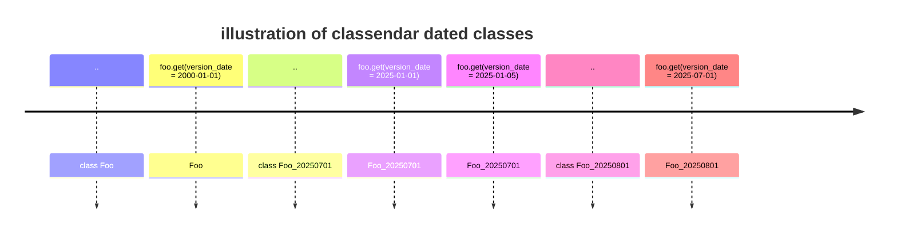

# classendar

Classendar is a Python library for managing versioned classes based on dates. It allows you to define base classes and create dated subclasses whose behavior can be selected dynamically by passing a `version_date` argument to the `get` method.

## Features

- Decorator-based API for versioned classes
- Automatic selection of the correct subclass based on a date
- Easy extension for new versions by subclassing


## How It Works

You decorate your base class with `@classendar_base`. Then, you create subclasses named with a date suffix (e.g., `Foo_20250701`). When you call the `get` method with a `version_date` date object, the correct subclass is chosen automatically.




## Requirements

1. the dated classes 
    * must be named with a date suffix in the format `YYYYMMDD` (e.g., `Foo_20250701`)
    * must inherit from the base class
    * must be defined in the same module as the base class or imported into the module where the base class is used
2. the method to have the version date functionality is async `get` method. if no `version_date` is provided, it defaults to the current date.

## Usage

Define your base and dated classes:

```python
from classendar.decorator import classendar_base
from datetime import date

@classendar_base
class Foo:
    async def get(self, **kwargs):
        return "Base Foo result"

class Foo_20250701(Foo):  # modified on 7/1/2025
    async def get(self, **kwargs):
        return "Foo_20250701 result"

class Foo_20250801(Foo_20250701):  # modified on 8/1/2025
    async def get(self, **kwargs):
        return "Foo_20250801 result"
```

Call the `get` method with a `version_date`:

```python
foo = Foo()
result = await foo.get(version_date=date(2025, 7, 15))  # Uses Foo_20250701
```
