# CrewAIMaster

**A Python package for building intelligent multi-agent systems using CrewAI**

CrewAIMaster is an advanced framework that automatically generates, manages, and executes multi-agent crews based on natural language task descriptions. It provides a CLI interface and comprehensive backend system for creating intelligent AI agents with memory, tools, and safety guardrails.

## 📦 Installation

```bash
# install from PyPI (when available)
pip install crewaimaster

# Or Install from source (recommended for development)
git clone https://github.com/VishApp/crewaimaster
cd crewaimaster
python -m venv venv
source venv/bin/activate
pip install -e .
```

## 🎬 Demo

### 📹 Video Walkthrough
[](https://youtu.be/osF9oTBa9IU)

*Click the image above to watch a complete walkthrough of CrewAIMaster in action*

### 📸 Screenshots

#### CLI Interface


#### CrewAIMaster Providers


#### CrewAIMaster Help


## 🏃 Quick Start

### Prerequisites
```bash
# Install Python 3.10+
python --version

# Configure your LLM provider (see supported providers)
crewaimaster providers

# Quick setup with OpenAI (most common)
crewaimaster providers --configure openai --api-key "your-openai-key" --model "gpt-4"
```

### 1. Create Your First Crew with AI Orchestration

```bash
# Create an intelligent crew using AI analysis
crewaimaster create "Write a comprehensive market analysis report for electric vehicles in 2024" --name electric_vehicles_market_analysis_crew
```

### 2. Execute the Crew

```bash
# Run the crew (requires configured LLM provider)
crewaimaster run electric_vehicles_market_analysis_crew

# With additional context:
crewaimaster run electric_vehicles_market_analysis_crew --input "Focus on Tesla, BMW, and Volkswagen specifically"
```

### 3. Alternative Execution (Direct Script)

Generated crews can also be executed directly using environment variables:

```bash
# Navigate to the generated crew directory
cd crews/electric_vehicles_market_analysis_crew

# Run using standard environment variables
export OPENAI_API_KEY="your-openai-key"
./run.sh "your input"

# Or run using CrewAIMaster-specific environment variables
export CREWAIMASTER_LLM_PROVIDER="openai"
export CREWAIMASTER_LLM_MODEL="gpt-4"
export CREWAIMASTER_LLM_API_KEY="your-openai-key"
export CREWAIMASTER_LLM_BASE_URL="https://api.openai.com/v1"
```

## 🔄 Development Workflow

### Typical CrewAIMaster Workflow

```mermaid
flowchart LR
    A["`**1. Task Definition**
    Natural Language Task`"] --> B["`**2. AI Analysis**
    🤖 Task Complexity
    🎯 Agent Requirements
    🛠️ Tool Selection`"]
    
    B --> C["`**3. Crew Creation**
    👥 Agent Design
    🔧 Tool Assignment
    📋 Task Orchestration`"]
    
    C --> D["`**4. Execution**
    🏃 Multi-Agent Coordination
    🔄 Real-time Processing
    📊 Progress Monitoring`"]
    
    D --> E["`**5. Results & Analytics**
    📄 Output Generation
    📈 Performance Metrics
    💾 Persistent Storage`"]
    
    E --> F["`**6. Optimization**
    🔧 Crew Modification
    ⚡ Performance Tuning
    📤 Export/Backup`"]
    
    F --> G["`**7. Reuse & Scale**
    🔄 Crew Reusability
    📚 Knowledge Building
    🚀 Production Deployment`"]

    classDef stepStyle fill:#f9f9f9,stroke:#333,stroke-width:2px,color:#333
    class A,B,C,D,E,F,G stepStyle
```



## 🏗️ Architecture

CrewAIMaster follows a clean, layered architecture designed for intelligent multi-agent system creation and execution:

```mermaid
flowchart TD
    %% User Entry Point
    User[👤 User Input<br/>Natural Language Task] --> CLI[🖥️ CLI Interface<br/>crewaimaster create/run/providers]
    
    %% Configuration Layer
    CLI --> Config[⚙️ Configuration<br/>config.yaml<br/>LLM Providers]
    
    %% AI Orchestration Core
    CLI --> MasterAgent[🧠 Master Agent<br/>Intelligent Orchestrator]
    
    %% AI Analysis Pipeline
    MasterAgent --> TaskAnalyzer[📋 Task Analyzer<br/>• Complexity Assessment<br/>• Requirements Extraction<br/>• Agent Planning]
    
    TaskAnalyzer --> AgentDesigner[👥 Agent Designer<br/>• Role Definition<br/>• Tool Selection<br/>• Capability Mapping]
    
    AgentDesigner --> CrewOrchestrator[🎭 Crew Orchestrator<br/>• Team Assembly<br/>• Process Selection<br/>• Workflow Design]
    
    %% Core Generation Engine
    CrewOrchestrator --> CrewDesigner[🔧 Crew Designer<br/>File-Based Generator]
    Config --> CrewDesigner
    
    CrewDesigner --> FileGen[📁 File Generator<br/>• Project Structure<br/>• Python Modules<br/>• YAML Configs]
    
    %% Output Generation
    FileGen --> GeneratedFiles{📄 Generated Crew Project}
    
    %% Generated Project Structure
    GeneratedFiles --> AgentYAML[agents.yaml<br/>Agent Definitions]
    GeneratedFiles --> TaskYAML[tasks.yaml<br/>Task Specifications]
    GeneratedFiles --> CrewPY[crew.py<br/>CrewAI Implementation]
    GeneratedFiles --> MainPY[main.py<br/>Execution Entry Point]
    
    %% Execution Runtime
    MainPY --> CrewAI[🚀 CrewAI Runtime<br/>Multi-Agent Execution]
    
    CrewAI --> AgentA[🤖 Agent A<br/>Specialized Role]
    CrewAI --> AgentB[🤖 Agent B<br/>Specialized Role]
    CrewAI --> AgentC[🤖 Agent C<br/>Specialized Role]
    
    %% Tool Integration
    AgentA --> Tools[🛠️ Tool Registry<br/>• Web Search<br/>• File Operations<br/>• Code Execution<br/>• Custom Tools]
    AgentB --> Tools
    AgentC --> Tools
    
    %% LLM Integration
    Config --> LLMProvider[🔗 LLM Provider<br/>• OpenAI<br/>• Anthropic<br/>• Google<br/>• Custom APIs]
    LLMProvider --> AgentA
    LLMProvider --> AgentB
    LLMProvider --> AgentC
    LLMProvider --> MasterAgent
    
    %% Memory & Knowledge
    CrewAI --> Memory[🧠 Memory System<br/>• Agent Memory<br/>• Shared Context<br/>• Knowledge Base]
    
    %% Safety & Guardrails
    Tools --> Guardrails[🛡️ Guardrails<br/>• Safety Checks<br/>• Content Filtering<br/>• Validation]
    
    %% Final Output
    CrewAI --> Results[📊 Results<br/>Task Completion<br/>Generated Content]
    
    %% Styling
    classDef userLayer fill:#e8f5e8,stroke:#1b5e20,stroke-width:3px,color:#000
    classDef cliLayer fill:#e1f5fe,stroke:#01579b,stroke-width:2px,color:#000
    classDef aiLayer fill:#f3e5f5,stroke:#4a148c,stroke-width:2px,color:#000
    classDef coreLayer fill:#fff8e1,stroke:#ff8f00,stroke-width:2px,color:#000
    classDef fileLayer fill:#fce4ec,stroke:#880e4f,stroke-width:2px,color:#000
    classDef runtimeLayer fill:#fff3e0,stroke:#e65100,stroke-width:2px,color:#000
    classDef toolLayer fill:#f1f8e9,stroke:#33691e,stroke-width:2px,color:#000
    
    class User userLayer
    class CLI,Config cliLayer
    class MasterAgent,TaskAnalyzer,AgentDesigner,CrewOrchestrator aiLayer
    class CrewDesigner,FileGen,LLMProvider coreLayer
    class GeneratedFiles,AgentYAML,TaskYAML,CrewPY,MainPY fileLayer
    class CrewAI,AgentA,AgentB,AgentC,Memory,Results runtimeLayer
    class Tools,Guardrails toolLayer
```



### 🔄 Data Flow Explanation

1. **User Input**: Natural language task description via CLI
2. **AI Analysis**: Master Agent analyzes complexity and requirements
3. **Intelligent Design**: AI agents design optimal crew composition
4. **Code Generation**: Automated creation of CrewAI project files
5. **Execution**: Generated crew runs with real-time coordination
6. **Results**: Task completion with generated content and insights

### 🏛️ Architecture Overview

CrewAIMaster's architecture is designed for scalability, modularity, and intelligent automation:

#### 🎯 **User Interface Layer**
- **CLI Interface**: Rich terminal experience with typer and rich libraries
- **Command Processing**: Handles user commands and provides interactive feedback
- **Input Validation**: Ensures commands are properly formatted and validated

#### 🤖 **AI Orchestration Layer** (Core Innovation)
- **MasterAgentCrew**: Main orchestrator using AI agents for intelligent decision-making
- **TaskAnalyzerAgent**: Advanced NLP analysis of user tasks and requirements
- **AgentDesignerAgent**: Intelligent design of agents based on task requirements
- **CrewOrchestratorAgent**: Optimizes crew composition and execution strategies

#### ⚙️ **Core Processing Layer**
- **CrewDesigner**: Handles CrewAI integration and agent instantiation
- **TaskAnalyzer**: Legacy fallback for task analysis with pattern matching

#### 🛠️ **Tool Ecosystem**
- **Tool Registry**: Centralized management of all available tools
- **Available Tools**: Comprehensive library of built-in and custom tools
- **Guardrails**: Safety and validation systems for secure operation

#### 🔄 **Execution Engine**
- **CrewAI Engine**: Core execution engine for running multi-agent crews
- **Agent Memory**: Sophisticated memory management for agent learning and context

### 🔄 Data Flow

1. **User Input** → CLI processes commands and validates input
2. **AI Analysis** → MasterAgentCrew analyzes task using specialized AI agents
3. **Crew Creation** → CrewDesigner instantiates agents with appropriate tools
4. **Execution** → CrewAI Engine runs the crew with real-time monitoring

## 🛠️ Configuration

### LLM Provider Setup

CrewAIMaster uses a `.crewaimaster/config.yaml` configuration file for all settings. Environment variables are **no longer supported** - all configuration must be done via CLI commands or direct config file editing.

#### 📋 **View Available Providers**
```bash
# See all supported providers and configuration examples
crewaimaster providers
```

#### 🚀 **CLI Configuration (All Providers)**

Configure any supported provider using the CLI:

**OpenAI:**
```bash
crewaimaster providers --configure openai --api-key "your-openai-key" --model "gpt-4"
# Automatically sets base_url to https://api.openai.com/v1
```

**Anthropic:**
```bash
crewaimaster providers --configure anthropic --api-key "your-anthropic-key" --model "claude-3-sonnet-20240229"
# Automatically sets base_url to https://api.anthropic.com/v1
```

**Google:**
```bash
crewaimaster providers --configure google --api-key "your-google-key" --model "gemini-pro"
# Automatically sets base_url to https://generativelanguage.googleapis.com/v1beta
```

**DeepSeek:**
```bash
crewaimaster providers --configure deepseek --api-key "your-deepseek-key" --model "deepseek-chat"
# Automatically sets base_url to https://api.deepseek.com/v1
```

**Custom Provider:**
```bash
crewaimaster providers --configure custom --api-key "your-key" --base-url "https://api.example.com/v1" --model "gpt-4o-mini"
# Requires explicit base_url for custom endpoints
```

## 🤝 Contributing

We welcome contributions! Here's how to get started:

1. Fork the repository
2. Create a feature branch: `git checkout -b feature/amazing-feature`
3. Make your changes and add tests
4. Run tests: `pytest tests/`
5. Commit changes: `git commit -m 'Add amazing feature'`
6. Push to branch: `git push origin feature/amazing-feature`
7. Open a Pull Request

### Development Setup

```bash
# Clone and setup development environment
git clone https://github.com/VishApp/crewaimaster
cd crewaimaster

# Install development dependencies
pip install -e .
```

## 📄 License

CrewAIMaster is released under the MIT License. See [LICENSE](LICENSE) for details.

## 🙏 Acknowledgments

- [CrewAI](https://github.com/joaomdmoura/crewAI) - Core multi-agent framework
- [LangChain](https://github.com/langchain-ai/langchain) - LLM integration tools  
- [Sentence Transformers](https://github.com/UKPLab/sentence-transformers) - Text embeddings
- [FAISS](https://github.com/facebookresearch/faiss) - Vector similarity search

## 🔗 Links

- [GitHub Repository](https://github.com/VishApp/crewaimaster)
- [PyPI Package](https://pypi.org/project/crewaimaster)
---

**Built with ❤️ for the AI community**