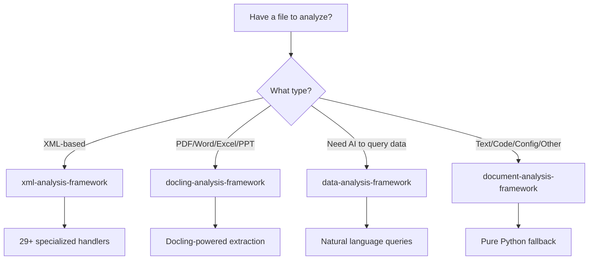

# AI Building Blocks - Framework Selection Guide

## 🎯 Quick Decision Tree



## 📦 Framework Overview

### 1. **[xml-analysis-framework](https://pypi.org/project/xml-analysis-framework/)** 
*The XML Specialist*

**Install:** `pip install xml-analysis-framework`

**Use for:**
- All XML documents and XML-based formats
- Enterprise configurations (Spring, Hibernate, Struts)
- Web services (WSDL, SOAP, WADL)
- Data formats (RSS, Atom, KML, GPX, SVG)
- Build files (Maven POM, Ant build.xml)

**Key Features:**
- 29+ specialized XML handlers
- Security-focused (prevents XXE attacks)
- Hierarchical chunking that preserves XML structure
- Enterprise system support

### 2. **[docling-analysis-framework](https://pypi.org/project/docling-analysis-framework/)** 
*The Office Document Expert*

**Install:** `pip install docling-analysis-framework`

**Use for:**
- PDF documents (.pdf)
- Microsoft Word (.docx)
- Microsoft Excel (.xlsx)
- Microsoft PowerPoint (.pptx)
- Images with text (.png, .jpg, .jpeg, .tiff)

**Key Features:**
- Powered by IBM's Docling
- OCR support for scanned documents
- Table and figure extraction
- Maintains document structure

### 3. **[data-analysis-framework](https://pypi.org/project/data-analysis-framework/)** 
*The AI Agent Interface*

**Install:** `pip install data-analysis-framework`

**Use for:**
- When you need AI agents to query structured data
- Natural language data exploration
- Safe data access with constraints
- Business intelligence reports

**Key Features:**
- Natural language to SQL-like queries
- Safe, constrained data access
- Automatic result formatting
- Built-in security constraints

### 4. **document-analysis-framework** 
*The Universal Fallback*

**Install:** `pip install -e .` (from repo)

**Use for:**
- Source code files
- Configuration files
- Text documents
- Log files
- Any text-based format not covered above

**Key Features:**
- Pure Python standard library (no dependencies)
- 30+ file type handlers
- Extensible architecture
- AI-ready chunking strategies

## 📋 Detailed File Type Mapping

### Programming Languages

| File Type | Extension | Framework | Handler |
|-----------|-----------|-----------|---------|
| Python | .py | document-analysis | PythonHandler |
| JavaScript | .js | document-analysis | JavaScriptHandler |
| TypeScript | .ts, .tsx | document-analysis | TypeScriptHandler |
| Go | .go | document-analysis | GoHandler |
| Rust | .rs | document-analysis | RustHandler |
| Ruby | .rb | document-analysis | RubyHandler |
| PHP | .php | document-analysis | PHPHandler |
| Java | .java | document-analysis | JavaHandler |
| C/C++ | .c, .cpp, .h | document-analysis | CppHandler |
| SQL | .sql | document-analysis | SQLHandler |
| Shell | .sh, .bash | document-analysis | ShellScriptHandler |
| PowerShell | .ps1 | document-analysis | PowerShellHandler |

### Configuration Files

| File Type | Extension | Framework | Handler |
|-----------|-----------|-----------|---------|
| Dockerfile | Dockerfile | document-analysis | DockerfileHandler |
| package.json | package.json | document-analysis | PackageJSONHandler |
| requirements.txt | requirements.txt | document-analysis | RequirementsHandler |
| Makefile | Makefile | document-analysis | MakefileHandler |
| INI files | .ini, .cfg | document-analysis | INIHandler |
| Environment | .env | document-analysis | EnvFileHandler |
| Properties | .properties | document-analysis | PropertiesFileHandler |
| Apache Config | .conf, .htaccess | document-analysis | ApacheConfigHandler |
| Nginx Config | nginx.conf | document-analysis | NginxConfigHandler |

### Document Formats

| File Type | Extension | Framework | Handler |
|-----------|-----------|-----------|---------|
| PDF | .pdf | docling-analysis | PDFHandler |
| Word | .docx | docling-analysis | DOCXHandler |
| Excel | .xlsx | docling-analysis | Via Docling |
| Excel (basic) | .xls, .xlsx | document-analysis | ExcelHandler |
| PowerPoint | .pptx | docling-analysis | Via Docling |
| Markdown | .md | document-analysis | MarkdownHandler |
| LaTeX | .tex | document-analysis | LaTeXHandler |
| AsciiDoc | .adoc | document-analysis | AsciiDocHandler |
| reStructuredText | .rst | document-analysis | ReStructuredTextHandler |

### Data Files

| File Type | Extension | Framework | Handler |
|-----------|-----------|-----------|---------|
| CSV | .csv | document-analysis | CSVHandler |
| CSV (AI queries) | .csv | data-analysis | AgentQueryInterface |
| JSON | .json | document-analysis | JSONHandler |
| JSON (AI queries) | .json | data-analysis | AgentQueryInterface |
| YAML | .yaml, .yml | document-analysis | YAMLHandler |
| TOML | .toml | document-analysis | TOMLHandler |
| TSV | .tsv | document-analysis | TSVHandler |

### XML Files

| File Type | Extension | Framework | Handler |
|-----------|-----------|-----------|---------|
| Any XML | .xml | xml-analysis | 29+ specialized handlers |
| Maven POM | pom.xml | xml-analysis | MavenPOMHandler |
| Spring Config | .xml | xml-analysis | SpringConfigHandler |
| RSS/Atom | .rss, .atom | xml-analysis | RSSHandler |
| SVG | .svg | xml-analysis | SVGHandler |
| WSDL | .wsdl | xml-analysis | WSDLHandler |

### Other Files

| File Type | Extension | Framework | Handler |
|-----------|-----------|-----------|---------|
| Log files | .log | document-analysis | LogFileHandler |
| Plain text | .txt | document-analysis | TextHandler |
| Images (OCR) | .png, .jpg | docling-analysis | Via Docling |

## 🤔 Special Cases & Overlaps

### Excel Files (.xlsx)
- **For full analysis with formulas, charts:** Use `docling-analysis-framework`
- **For basic text extraction:** Use `document-analysis-framework`
- **For AI querying of data:** Load into `data-analysis-framework`

### CSV/JSON Files
- **For document analysis and chunking:** Use `document-analysis-framework`
- **For AI agent querying:** Use `data-analysis-framework`

### Configuration Files
- **XML-based configs:** Use `xml-analysis-framework`
- **Text-based configs:** Use `document-analysis-framework`

## 💡 Usage Examples

### Analyzing a Python file
```python
# Using document-analysis-framework
from core.analyzer import DocumentAnalyzer

analyzer = DocumentAnalyzer()
result = analyzer.analyze_document("app.py")
print(f"Found {len(result['analysis'].key_findings['functions'])} functions")
```

### Analyzing a PDF
```python
# Using docling-analysis-framework
import docling_analysis_framework as daf

result = daf.analyze("report.pdf")
print(f"Pages: {result['document_type'].pages}")
```

### Querying CSV data with AI
```python
# Using data-analysis-framework
from data_analysis_framework import AgentQueryInterface

interface = AgentQueryInterface()
interface.load_data("sales.csv")
result = interface.execute_query("Show me top 10 products by revenue")
```

### Analyzing XML configuration
```python
# Using xml-analysis-framework
import xml_analysis_framework as xaf

result = xaf.analyze("spring-config.xml")
print(f"Handler: {result['handler_used']}")
```

## 🚀 Framework Selection Best Practices

1. **Start with the specialized framework** - They provide better analysis
2. **Use document-analysis-framework as fallback** - When others don't apply
3. **Consider your use case:**
   - Need chunking? → Document/XML frameworks
   - Need AI queries? → Data framework
   - Need extraction? → Docling framework
4. **Check for updates** - New handlers are added regularly

## 📚 Additional Resources

- [XML Analysis Framework Docs](https://github.com/your-org/xml-analysis-framework)
- [Docling Analysis Framework Docs](https://github.com/your-org/docling-analysis-framework)
- [Data Analysis Framework Docs](https://github.com/your-org/data-analysis-framework)
- [Document Analysis Framework Docs](https://github.com/your-org/document-analysis-framework)

---

*Part of the AI Building Blocks initiative - Making documents AI-ready* 