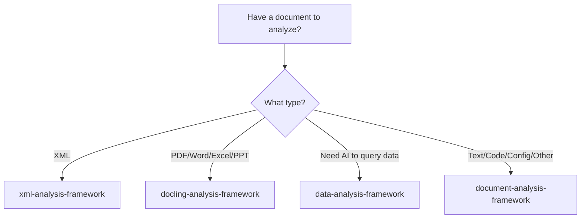

# Document Analysis Framework

[](https://www.python.org/downloads/)
[](https://opensource.org/licenses/MIT)
[](https://github.com/redhat-ai-americas/document-analysis-framework)

A lightweight document analysis framework for **text, code, configuration, and other text-based files** designed for AI/ML data pipelines. Uses only Python standard library for maximum compatibility.

## 🎯 When to Use This Framework

This is a **fallback framework** for text-based files not handled by our specialized frameworks:

### Specialized Frameworks (Use These First!)

1. **[xml-analysis-framework](https://pypi.org/project/xml-analysis-framework/)** 📑
   - For: XML documents of all types
   - Includes: 29+ specialized XML handlers (SCAP, RSS, Maven POM, Spring configs, etc.)
   - Install: `pip install xml-analysis-framework`

2. **[docling-analysis-framework](https://pypi.org/project/docling-analysis-framework/)** 📄
   - For: PDF, Word, Excel, PowerPoint, and images with text
   - Features: Docling-powered extraction with OCR support
   - Install: `pip install docling-analysis-framework`

3. **[data-analysis-framework](https://pypi.org/project/data-analysis-framework/)** 📊
   - For: Structured data that needs AI agent interaction
   - Features: Safe query interface for AI agents to analyze data
   - Install: `pip install data-analysis-framework`

### Use This Framework For:
- **Code files**: Python, JavaScript, TypeScript, Go, Rust, etc.
- **Config files**: Dockerfile, package.json, .env, INI files, etc.
- **Text/Markup**: Markdown, plain text, LaTeX, AsciiDoc, etc.
- **Data files**: CSV, JSON, YAML, TOML, TSV, etc.
- **Other text-based formats** not covered above

> **Note**: Some file types (like CSV, JSON) can be handled by multiple frameworks. Choose based on your use case:
> - Use `data-analysis-framework` for AI agent querying of structured data
> - Use `document-analysis-framework` for chunking and document analysis

## 🚀 Quick Start

### Document Analysis
```python
from core.analyzer import DocumentAnalyzer

analyzer = DocumentAnalyzer()
result = analyzer.analyze_document("path/to/file.py")

print(f"Document Type: {result['document_type'].type_name}")
print(f"Language: {result['document_type'].language}")
print(f"AI Use Cases: {result['analysis'].ai_use_cases}")
```

### Smart Chunking
```python
from core.analyzer import DocumentAnalyzer
from core.chunking import ChunkingOrchestrator

# Analyze document
analyzer = DocumentAnalyzer()
analysis = analyzer.analyze_document("file.py")

# Convert format for chunking
chunking_analysis = {
    'document_type': {
        'type_name': analysis['document_type'].type_name,
        'confidence': analysis['document_type'].confidence,
        'category': analysis['document_type'].category
    },
    'analysis': analysis['analysis']
}

# Generate AI-optimized chunks
orchestrator = ChunkingOrchestrator()
chunks = orchestrator.chunk_document("file.py", chunking_analysis, strategy='auto')
```

## 📋 Currently Supported File Types

| Category | File Types | Extensions | Confidence |
|----------|------------|------------|------------|
| **📝 Text & Data** | Markdown, CSV, JSON, YAML, TOML, Plain Text | .md, .csv, .json, .yaml, .toml, .txt | 90-95% |
| **💻 Code Files** | Python, JavaScript, Java, C++, SQL | .py, .js, .java, .cpp, .sql | 90-95% |
| **⚙️ Configuration** | Dockerfile, package.json, requirements.txt, Makefile | Various | 95% |

### Coming Soon:
- TypeScript, Go, Rust, Ruby, PHP, Swift, Kotlin
- Shell scripts, PowerShell, R, MATLAB
- INI files, .env files, Apache/Nginx configs
- LaTeX, AsciiDoc, reStructuredText
- Log files, CSS/SCSS, Vue/Svelte components

## 🎯 Key Features

- **🔍 Intelligent Document Detection** - Content-based recognition with confidence scoring
- **🤖 AI-Ready Output** - Structured analysis with quality metrics and use case recommendations  
- **⚡ Smart Chunking** - Document-type-aware segmentation strategies
- **🔒 Security & Reliability** - File size limits, safe handling, pure Python stdlib
- **🔄 Extensible** - Easy to add new handlers for additional file types

## 🔧 Installation

```bash
git clone https://github.com/redhat-ai-americas/document-analysis-framework.git
cd document-analysis-framework
pip install -e .
```

## 🧪 Framework Ecosystem

This framework is part of the **AI Building Blocks** document analysis ecosystem:

| Framework | Purpose | Key Features |
|-----------|---------|--------------|
| **[xml-analysis-framework](https://pypi.org/project/xml-analysis-framework/)** | XML document specialist | 29+ handlers, security-focused, enterprise configs |
| **[docling-analysis-framework](https://pypi.org/project/docling-analysis-framework/)** | PDF & Office documents | OCR support, table extraction, figure handling |
| **[data-analysis-framework](https://pypi.org/project/data-analysis-framework/)** | Structured data AI agent | Safe queries, natural language interface |
| **document-analysis-framework** | Everything else (text-based) | Fallback handler, pure Python, extensible |

### Choosing the Right Framework



## 📄 License

MIT License - see [LICENSE](LICENSE) file for details.