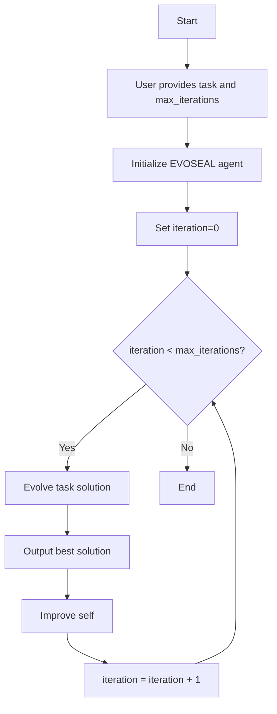
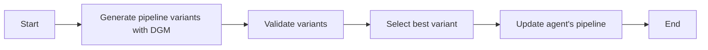

# EVOSEAL: Evolutionary Self-Improving AI Agent

[](LICENSE)
[](https://www.python.org/)
[](https://sha888.github.io/EVOSEAL/)
[](https://github.com/SHA888/EVOSEAL/actions/workflows/codeql-analysis.yml)
[](https://github.com/psf/black)
[](#rollback-safety)

**Latest Version**: 0.3.2 (July 27, 2025)


**🎉 Phase 3 Release - Bidirectional Continuous Evolution**:
- ✅ Complete bidirectional evolution system between EVOSEAL and Devstral
- ✅ Real-time monitoring dashboard with WebSocket updates
- ✅ Production-ready systemd service integration
- ✅ Comprehensive fine-tuning infrastructure with LoRA/QLoRA
- ✅ Model validation, versioning, and rollback capabilities
- ✅ Ollama integration with Mistral AI's Devstral coding model
- ✅ Continuous improvement loop with automated training cycles

EVOSEAL is an advanced AI agent designed to solve complex tasks through code evolution while continuously improving its own architecture. It integrates three key technologies:

- **SEAL (Self-Adapting Language Models)**: A framework for training language models via reinforcement learning to generate self-edits (finetuning data and update directives for themselves). SEAL focuses on knowledge incorporation and few-shot learning to adapt models to new tasks with minimal examples.

- **OpenEvolve**: An evolutionary framework for program optimization that uses a MAP-Elites process to maintain diversity, comprehensive checkpointing, and a sophisticated database system to track program versions and their performance metrics.

- **DGM (Darwin Godel Machine)**: Implements a Darwinian approach to code improvement using SEAL models to progressively enhance code quality through multiple generations. DGM maintains an archive of successful improvements and uses sophisticated selection mechanisms to guide evolution.

## Features

### 🚀 Phase 3: Bidirectional Continuous Evolution
- 🧬 **Bidirectional Evolution**: EVOSEAL ↔ Devstral mutual improvement loop
- 🌐 **Real-time Dashboard**: Live monitoring at http://localhost:8081
- 🔄 **Continuous Operation**: Automated evolution cycles and training
- 🎯 **Fine-tuning Infrastructure**: LoRA/QLoRA with comprehensive validation
- 📊 **Model Versioning**: Automatic version tracking and rollback
- 🛡️ **Safety Controls**: Model validation with alignment testing
- 🔧 **systemd Integration**: Production-ready service management

### 🏗️ Core Architecture
- 🧬 Evolutionary algorithm for code improvement
- 🤖 Integration with multiple AI models (OpenAI, Anthropic, Ollama)
- 📊 Performance tracking and metrics
- 🔄 Continuous self-improvement
- 📝 Comprehensive documentation
- 🧪 Test coverage and CI/CD ready
- 🔒 Secure and privacy-focused
- 🏢 Modular architecture with clear separation of concerns
- 🛡️ **Rollback safety protection** - Prevents accidental codebase deletion

## Quick Start

### 🚀 Phase 3: Bidirectional Continuous Evolution

Get the complete EVOSEAL bidirectional evolution system running in minutes:

```bash
# Clone the repository
git clone https://github.com/SHA888/EVOSEAL
cd EVOSEAL

# Set up virtual environment
python -m venv .venv
source .venv/bin/activate  # On Windows: .venv\Scripts\activate

# Install dependencies
pip install -r requirements.txt
pip install aiohttp aiohttp-cors pydantic-settings

# Install in development mode
pip install -e .

# Install and start Ollama with Devstral
curl -fsSL https://ollama.ai/install.sh | sh
ollama pull devstral:latest
ollama serve &

# Run Phase 3 health check
python3 scripts/run_phase3_continuous_evolution.py --health-check

# Start the complete bidirectional evolution system
python3 scripts/run_phase3_continuous_evolution.py --verbose
```

### 🔧 Production Deployment with systemd

For production deployment, integrate with systemd:

```bash
# The systemd service is already configured
systemctl --user status evoseal.service

# View real-time logs
journalctl --user -fu evoseal.service

# Access monitoring dashboard
open http://localhost:8081
```

## Project Templates

Start a new project using our template:

```bash
# Copy the template to a new directory
cp -r evoseal/examples/templates/basic my_project
cd my_project

# Install dependencies
pip install -r requirements.txt
```

## Project Structure

### 🏗️ Phase 3: Bidirectional Evolution Architecture

```
evoseal/
├── core/                    # Core framework components
│   ├── __init__.py          # Package initialization
│   ├── controller.py        # Main orchestration logic
│   ├── evaluator.py         # Fitness evaluation
│   ├── selection.py         # Selection algorithms
│   └── version_database.py  # Tracking program versions
│
├── evolution/              # 📊 Phase 1: Evolution Data Collection
│   ├── data_collector.py   # Async evolution data collection
│   ├── pattern_analyzer.py # Pattern extraction from evolution results
│   ├── training_builder.py # Training data generation
│   └── models.py           # Evolution data models
│
├── fine_tuning/            # 🎯 Phase 2: Fine-tuning Infrastructure
│   ├── model_fine_tuner.py     # LoRA/QLoRA fine-tuning with Devstral
│   ├── training_manager.py     # Training pipeline coordination
│   ├── model_validator.py      # Comprehensive model validation
│   ├── version_manager.py      # Model version tracking & rollback
│   └── bidirectional_manager.py # EVOSEAL ↔ Devstral orchestration
│
├── services/               # 🚀 Phase 3: Continuous Evolution
│   ├── continuous_evolution_service.py # Main continuous service
│   └── monitoring_dashboard.py         # Real-time web dashboard
│
├── providers/              # AI/ML model providers
│   ├── __init__.py
│   ├── ollama_provider.py  # Ollama/Devstral integration
│   ├── provider_manager.py # Provider selection & fallback
│   └── seal_providers.py   # Legacy provider interfaces
│
├── integration/            # Integration modules
│   ├── dgm/                # Darwin Godel Machine
│   ├── openevolve/         # OpenEvolve framework
│   └── seal/               # SEAL interface
│
├── agents/                 # Agent implementations
├── models/                 # Data models and schemas
├── storage/                # Data persistence
├── config.py               # Configuration management
└── utils/                  # Utility functions

scripts/                    # 🔧 Deployment & Management
├── run_phase3_continuous_evolution.py  # Phase 3 orchestrator
├── test_phase2_components.py           # Phase 2 testing
└── provider_cli.py                     # Provider management

tests/                      # Test suite
├── integration/            # Integration tests
├── unit/                   # Unit tests
└── regression/             # Regression tests

.config/systemd/user/       # 🔧 Production Service
└── evoseal.service         # systemd service configuration
```

## 🚀 Phase 3: Bidirectional Continuous Evolution

### Architecture Overview

EVOSEAL Phase 3 implements a complete bidirectional evolution system where EVOSEAL and Mistral AI's Devstral coding model continuously improve each other:

1. **Phase 1**: Evolution Data Collection
   - Async collection of evolution results from EVOSEAL's self-improvement cycles
   - Pattern analysis to extract successful improvement strategies
   - Training data generation in multiple formats (Alpaca, Chat, JSONL)

2. **Phase 2**: Fine-tuning Infrastructure
   - LoRA/QLoRA fine-tuning of Devstral using evolution patterns
   - Comprehensive model validation with 5-category testing
   - Version management with automatic rollback capabilities
   - Safety controls and alignment testing

3. **Phase 3**: Continuous Improvement Loop
   - Automated evolution cycles and training orchestration
   - Real-time monitoring dashboard with WebSocket updates
   - Production-ready systemd service integration
   - Bidirectional feedback loop: EVOSEAL ↔ Devstral

### 🌐 Real-time Monitoring Dashboard

Access the live monitoring dashboard at **http://localhost:8081**:

- **Service Status**: Real-time system health, uptime, and operational state
- **Evolution Metrics**: Cycle counts, training progress, model improvements
- **Training Status**: Data readiness, sample counts, model versions
- **Performance Analytics**: Success rates, cycles per hour, efficiency metrics
- **Live Activity Log**: Real-time system events and notifications
- **WebSocket Updates**: Live data streaming without page refresh

### 🔧 systemd Integration

EVOSEAL Phase 3 runs as a production systemd service:

```bash
# Service management
systemctl --user status evoseal.service    # Check status
systemctl --user restart evoseal.service   # Restart service
systemctl --user stop evoseal.service      # Stop service
systemctl --user start evoseal.service     # Start service

# Real-time logs
journalctl --user -fu evoseal.service       # Follow logs

# Service configuration
~/.config/systemd/user/evoseal.service      # Service file
```

### 🎯 Model Integration

**Ollama + Devstral Integration**:
- **Model**: Mistral AI's Devstral (specialized coding model)
- **Performance**: 46.8% on SWE-Bench Verified benchmark
- **Capabilities**: Designed for agentic software development
- **License**: Apache 2.0 for community use
- **Requirements**: Single RTX 4090 or Mac with 32GB RAM

### 📊 Continuous Operation

- **Evolution Cycles**: Every 1 hour (configurable)
- **Training Checks**: Every 30 minutes (configurable)
- **Automatic Fine-tuning**: Triggered when sufficient evolution data collected
- **Model Validation**: Comprehensive safety and quality checks
- **Version Management**: Automatic rollback on validation failure
- **Health Monitoring**: Continuous system health checks

For detailed installation and usage instructions, see the [Documentation](https://sha888.github.io/EVOSEAL/).

## Command Line Interface (CLI)

EVOSEAL provides a powerful command-line interface for managing all aspects of the system. The CLI is built using [Typer](https://typer.tiangolo.com/) and supports both interactive and non-interactive usage.

### Installation

The CLI is installed automatically with the main package. You can access it using the `evoseal` command:

```bash
evoseal --help
```

### Basic Commands

#### Initialize a New Project

Create a new EVOSEAL project with the standard directory structure:

```bash
evoseal init project my_project
```

Use `--force` to initialize in a non-empty directory:

```bash
evoseal init project my_project --force
```

#### Configuration Management

View and modify configuration settings:

```bash
# List all configuration values
evoseal config list

# Get a specific configuration value
evoseal config get seal.model

# Set a configuration value
evoseal config set seal.model gpt-4

# Unset a configuration value
evoseal config unset seal.model
```

#### Component Management

Manage SEAL (Self-Adapting Language Models), OpenEvolve, and DGM components:

```bash
# SEAL (Self-Adapting Language Models) model operations
evoseal seal --help

# OpenEvolve processes
evoseal openevolve --help

# DGM workflows
evoseal dgm --help
```

#### Pipeline Control

Control and monitor the evolution pipeline with comprehensive commands:

```bash
# Initialize a pipeline for a repository
evoseal pipeline init https://github.com/user/repo.git

# Start the evolution pipeline
evoseal pipeline start

# Monitor pipeline status
evoseal pipeline status

# Pause/resume pipeline execution
evoseal pipeline pause
evoseal pipeline resume

# Stop the pipeline
evoseal pipeline stop

# View pipeline configuration
evoseal pipeline config --show

# Set configuration parameters
evoseal pipeline config --set "logging.level=DEBUG"

# View pipeline logs
evoseal pipeline logs --lines 100

# Debug pipeline state
evoseal pipeline debug --inspect
```

#### Process Control

Start, stop, and monitor EVOSEAL processes:

```bash
# Start the API server
evoseal start api

# Start a worker process
evoseal start worker

# Stop all processes
evoseal stop all

# Check system status
evoseal status
```

#### Exporting Results

Export evolution results and code variants:

```bash
# Export results to a file
evoseal export results results.json

# Export a specific variant
evoseal export variant variant_id output/
```

### Example Workflow

Here's a complete example workflow:

```bash
# Initialize a new project
evoseal init project my_project
cd my_project

# Configure the project
evoseal config set seal.model gpt-4
evoseal config set evolve.population_size 50

# Start the evolution process
evoseal evolve start

# Monitor progress
evoseal status

# Export results
evoseal export results results.json
```

### Continuous Operation

EVOSEAL can run continuously as a background service, ideal for long-term evolution and self-improvement tasks:

```bash
# Run continuously in foreground (for monitoring)
./scripts/run_continuous.sh

# Install and run as a system service
./scripts/install_service.sh
sudo systemctl start evoseal.service
```

For detailed instructions on continuous operation, see [Continuous Operation Guide](docs/continuous_operation.md).

### Advanced Usage

#### Custom Configuration Files

By default, EVOSEAL looks for configuration in `.evoseal/config.yaml`. You can specify a custom config file:

```bash
evoseal --config path/to/config.yaml [COMMAND]
```

#### Non-Interactive Mode

For scripting and automation, use the `--no-input` flag to disable interactive prompts:

```bash
echo "y" | evoseal config set seal.model gpt-4 --no-input
```

#### Debug Mode

Enable debug output with the `--debug` flag:

```bash
evoseal --debug [COMMAND]
```

For more detailed information, run `evoseal --help` or `evoseal [COMMAND] --help` for specific command documentation.

## Documentation

For detailed documentation, please visit [https://sha888.github.io/EVOSEAL/](https://sha888.github.io/EVOSEAL/).

### Key Components

- **Core**: Contains the main evolutionary algorithms and orchestration logic
- **Integration**: Modules for integrating with external systems (DGM, OpenEvolve, SEAL (Self-Adapting Language Models))
- **Agents**: Implements different agent behaviors and workflows
- **Providers**: Interfaces to various AI/ML model providers
- **Models**: Data structures and schemas used throughout the system
- **Storage**: Persistence layer for programs and metadata
- **Utils**: Shared utility functions and helpers

- [User Guide](https://sha888.github.io/EVOSEAL/user/manual/)
- [API Reference](https://sha888.github.io/EVOSEAL/api/)
- [Architecture Overview](https://sha888.github.io/EVOSEAL/architecture/overview/)
- [Development Guide](https://sha888.github.io/EVOSEAL/guides/development/)

## Contributing

We welcome contributions from the community! Please read our [Contributing Guidelines](CONTRIBUTING.md) to get started.

1. Fork the repository
2. Create a feature branch (`git checkout -b feature/AmazingFeature`)
3. Commit your changes (`git commit -m 'Add some AmazingFeature'`)
4. Push to the branch (`git push origin feature/AmazingFeature`)
5. Open a Pull Request

## License

Distributed under the MIT License. See [LICENSE](LICENSE) for more information.

## Contact

Project Link: [https://github.com/SHA888/EVOSEAL](https://github.com/SHA888/EVOSEAL)

## Acknowledgements

- [OpenAI](https://openai.com/)
- [Anthropic](https://www.anthropic.com/)
- [MkDocs](https://www.mkdocs.org/)
- [Material for MkDocs](https://squidfunk.github.io/mkdocs-material/)
- [SEAL (Self-Adapting Language Models)](https://github.com/SHA888/SEAL (Self-Adapting Language Models))

## Installation

EVOSEAL uses a structured requirements system to manage dependencies across different environments:

### Requirements Structure

- `requirements.txt` - Points to base requirements (references `requirements/base.txt`)
- `requirements/base.txt` - Core dependencies required for running EVOSEAL
- `requirements/dev.txt` - Development dependencies (includes base requirements)
- `requirements/requirements.txt` - Pinned production dependencies (generated by `pip freeze`)

### Setting Up the Environment

1. **Create and activate a virtual environment**:
   ```bash
   python -m venv .venv
   source .venv/bin/activate  # On Windows: .venv\Scripts\activate
   ```

2. **Install base requirements (recommended for most users)**:
   ```bash
   pip install -r requirements.txt
   ```

3. **For development, install development dependencies**:
   ```bash
   pip install -r requirements/dev.txt
   ```

4. **For production, use pinned versions**:
   ```bash
   pip install -r requirements/requirements.txt
   ```

### CLI Dependencies

For enhanced CLI functionality with rich formatting and pipeline control, install additional CLI dependencies:

```bash
# Install CLI-specific dependencies
pip install -r requirements-cli.txt
```

The CLI dependencies include:
- `typer` - Modern CLI framework
- `rich` - Beautiful terminal formatting
- `psutil` - System resource monitoring
- `structlog` - Structured logging
- `pyyaml` - YAML configuration support

### Virtual Environment Recommendation

**Important**: EVOSEAL uses `.venv` as the standard virtual environment directory name. This is:
- ✅ **Recommended**: `.venv` (hidden directory, widely adopted convention)
- ❌ **Avoid**: `venv` (visible directory, less conventional)

The `.gitignore` file is configured to ignore both, but please use `.venv` for consistency with the project documentation.

## Configuration

EVOSEAL uses a flexible configuration system that supports multiple environments (development, testing, production). For detailed configuration instructions, see [CONFIGURATION.md](CONFIGURATION.md).

## Technical Architecture

### High-Level Architecture

EVOSEAL operates in an iterative loop, alternating between solving the provided task and enhancing its own capabilities. The process is illustrated in the following flowchart:



### System Implementation

The EVOSEAL system integrates three sophisticated components with well-defined interfaces:

#### DGM Implementation Details

DGM is implemented through a collection of Python modules that work together to evolve code:

- `DGM_outer.py`: Orchestrates the evolution process across generations, implementing functions for:
  - Initializing evolution runs with `initialize_run()`
  - Selecting candidates for improvement through `choose_selfimproves()`
  - Managing the archive of successful improvements via `update_archive()`
  - Filtering out non-compiled or empty solutions using `filter_compiled()`

- `coding_agent.py`: Implements the `AgenticSystem` class that:
  - Interfaces with Git repositories for version control
  - Manages code edits and improvement processes
  - Runs regression tests to verify improvements
  - Handles communication with SEAL (Self-Adapting Language Models) models

- `llm_withtools.py`: Provides sophisticated SEAL integration:
  - Supports both Claude and OpenAI models
  - Implements tool-calling capabilities for code manipulation
  - Handles message history conversion between different SEAL (Self-Adapting Language Models) formats
  - Manages backoff and retry mechanisms for API stability

#### OpenEvolve Implementation Details

OpenEvolve provides a robust framework for program evolution with several key components:

- `controller.py`: The central orchestration module containing the `OpenEvolve` class that:
  - Manages the entire evolution process from initialization to completion
  - Coordinates between the prompt sampler, SEAL (Self-Adapting Language Models) ensemble, evaluator, and program database
  - Implements checkpoint saving and loading mechanisms
  - Tracks the best program across evolution steps

- `evaluator.py`: Handles program evaluation through:
  - Integration with external evaluation scripts
  - Collection and normalization of performance metrics
  - Support for SEAL (Self-Adapting Language Models)-based evaluation when needed

- `database.py`: Sophisticated program version management system for:
  - Storing and retrieving program variants
  - Tracking program lineage and relationships
  - Implementing selection strategies (MAP-Elites process)
  - Maintaining diversity in the solution space

#### SEAL (Self-Adapting Language Models) Implementation Details

SEAL (Self-Adapting Language Models) provides the theoretical foundation and implementation for self-adapting language models:

- `few-shot/`: Contains implementations for adapting models to new tasks with minimal examples:
  - Training procedures for meta-learning capabilities
  - Evaluation frameworks for measuring adaptation quality
  - Example tasks and benchmarks

- `knowledge-incorporation/`: Focuses on techniques for adding factual knowledge to SEALs:
  - Methods for identifying and incorporating new information
  - Verification mechanisms for knowledge consistency
  - Evaluation metrics for knowledge retention

### Core Processes

#### Evolve Task Solution

In this phase, EVOSEAL leverages SEAL (Self-Adapting Language Models) to generate and refine code variants. These variants are then evaluated and the best one is selected using OpenEvolve's evolutionary mechanisms.

```mermaid
graph LR
    A[Start] --> B[Generate code variants with SEAL (Self-Adapting Language Models)]
    B --> C[Evaluate variants with OpenEvolve]
    C --> D[Select best variant]
    D --> E[End]
```

The evolution process involves:

1. **Variant Generation**: Using SEAL (Self-Adapting Language Models)'s self-adapting capabilities to generate diverse code solutions
2. **Evaluation**: Assessing each variant based on multiple metrics including correctness, efficiency, and readability
3. **Selection**: Applying OpenEvolve's MAP-Elites process to maintain both quality and diversity
4. **Refinement**: Iterative improvement of promising solutions

#### Improve Self

During this phase, DGM is utilized to generate and validate variants of the agent's own pipeline. The best variant is selected and used to update the agent's architecture, enabling continuous self-improvement.



The self-improvement process includes:

1. **Pipeline Variation**: Using DGM to generate modifications to the agent's own codebase
2. **Validation Testing**: Rigorously testing each variant for correctness and performance improvements
3. **Selection**: Choosing the best variant based on comprehensive metrics
4. **Integration**: Incorporating the improvements into the main architecture
5. **Version Control**: Maintaining a history of improvements through Git-based version control

## Component Integration

The three core technologies of EVOSEAL are tightly integrated through well-defined interfaces and data flows:

### SEAL (Self-Adapting Language Models) Integration

- **Code Generation Interface**: SEAL (Self-Adapting Language Models)'s self-adapting capabilities are exposed through a structured API that allows OpenEvolve to request code variants
- **Knowledge Incorporation Pipeline**: New knowledge is continuously fed into SEAL (Self-Adapting Language Models) models during the evolution process
- **Few-shot Learning Activation**: Task-specific examples are used to prime SEAL (Self-Adapting Language Models) for generating contextually relevant code
- **Model Selection**: Different SEAL (Self-Adapting Language Models) model configurations are selected based on task complexity and domain

### OpenEvolve Integration

- **Evolutionary Engine**: Serves as the central orchestration system for the entire EVOSEAL framework
- **Database Interface**: Provides a unified storage and retrieval system for program variants across all components
- **Evaluation System**: Standardizes metrics collection and normalization for consistent comparison across variants
- **Checkpoint Management**: Enables seamless persistence and recovery of evolutionary progress

### DGM Integration

- **Meta-Evolution Layer**: Applied at the highest level to evolve EVOSEAL's own components
- **Git-based Version Control**: Provides a robust mechanism for tracking changes to the agent's architecture
- **Archive Management**: Maintains a history of successful architecture variants with performance metrics
- **Selection Mechanism**: Implements sophisticated strategies for choosing which parts of the architecture to improve

## Technical Benefits

### Self-Refinement

- **Self-Editing Capabilities**: SEAL (Self-Adapting Language Models) models can identify and correct their own errors, leading to progressively higher quality code
- **Knowledge Integration**: New information is continuously incorporated into the system's knowledge base
- **Contextual Adaptation**: Models automatically adjust their output style and approach based on task requirements
- **Error Reduction**: Analysis of previous generation errors informs improvements in subsequent generations

### Evolutionary Optimization

- **MAP-Elites Implementation**: Maintains diversity while optimizing for multiple objectives simultaneously
- **Multi-metric Evaluation**: Programs are evaluated across several dimensions including correctness, efficiency, and readability
- **Efficient Search**: Intelligent exploration of the solution space through targeted mutations and crossovers
- **Elitism Preservation**: The best solutions are always maintained across generations

### Continuous Improvement

- **Iterative Architecture Refinement**: DGM continuously improves the agent's core algorithms and workflows
- **Cross-pollination of Solutions**: Successful strategies from one domain are applied to others
- **Automated Learning Rate Adjustment**: Self-tuning of learning parameters based on progress metrics
- **Regression Prevention**: Comprehensive testing prevents performance degradation

## Implementation Roadmap

### Current Development

- **Automated Pipeline Integration**: Streamlining the connections between SEAL (Self-Adapting Language Models), OpenEvolve, and DGM components
- **Performance Benchmarking**: Establishing baseline metrics across a variety of programming tasks
- **Documentation Expansion**: Developing comprehensive API references and integration guides

### Future Directions

- **Real-time Learning Mechanisms**: Implement streaming learning capabilities to accelerate the self-improvement cycle
- **Extended Benchmark Support**: Expand compatibility with standard programming benchmarks and diverse task domains
- **Enhanced Safety Protocols**: Develop more sophisticated safeguards for managing self-modifying code risks
- **Distributed Evolution**: Enable parallel evolution across multiple compute nodes for faster convergence
- **Human Feedback Integration**: Create interfaces for incorporating human developer feedback into the evolution process


See [CONFIGURATION.md](CONFIGURATION.md) for details on the required YAML structure.

## Usage Examples

### Basic Usage

```bash
# Run EVOSEAL on a programming task
python run_evoseal.py --task ./tasks/example_task.json --iterations 10 --output ./results
```

### Running Individual Components

#### DGM Only

```bash
# Run DGM for code improvement
python -m dgm.DGM_outer --problem_statement "Fix the bug in function X" \
                     --git_dir ./repo --base_commit abc123 \
                     --selfimprove_size 5 --max_generation 3
```

#### OpenEvolve Only

```bash
# Run OpenEvolve on a program
python -m openevolve.openevolve-run ./program.py ./evaluation.py \
                               --iterations 50 --output ./output
```

#### SEAL (Self-Adapting Language Models) Experiments

```bash
# Run SEAL (Self-Adapting Language Models) few-shot learning experiment
cd SEAL (Self-Adapting Language Models)/few-shot
python run_experiment.py --config configs/default.yaml
```

## Example Output

When EVOSEAL completes a run, it produces several output artifacts:

- `results/best_solution.py`: The best solution found for the given task
- `results/evolution_metrics.json`: Performance metrics across generations
- `results/architecture_improvements/`: Record of self-improvements made to the system
- `results/checkpoints/`: Saved states that can be used to resume interrupted runs

---

## Design Considerations and Challenges

EVOSEAL's sophisticated architecture presents several important design considerations and challenges that are actively being addressed in the implementation:

### Complexity Management

- **Version Compatibility**: Component versions are tracked using semantic versioning, with a compatibility matrix stored in `configs/compatibility.yaml`. During self-modification, the system verifies that changes maintain compatibility across component boundaries.

- **Interface Stability**: Core APIs between components are treated as stable contracts with strict versioning. When DGM modifies integration code, regression tests verify that all interfaces remain compatible.

- **Modular Architecture**: Each component is encapsulated with well-defined boundaries, allowing individual evolution without cascading changes across the system.

### Evaluation Framework

- **Multi-Metric Balancing**: The system uses a weighted scoring approach defined in `configs/evaluation_weights.yaml` to balance correctness (highest weight), efficiency, and readability. Users can adjust these weights to suit specific needs.

- **Anti-Gaming Protections**: Evaluation includes:
  - Diverse test suites that cover multiple edge cases
  - Randomized test generation to prevent overfitting
  - Secondary validation using different evaluation methods
  - Human review prompts at configurable checkpoints

### Safety Mechanisms

- **Regression Testing**: Comprehensive test suites verify that new solutions and self-modifications maintain or improve functionality without introducing regressions.

- **Immutable Core**: Certain components are designated as "immutable" in `configs/safety.yaml`, preventing self-modification of critical safety systems.

- **Safety Boundaries**: Explicit constraints in `configs/constraints.yaml` define the permissible action space for self-improvements, preventing drift from original objectives.

- **Versioned Rollbacks**: Every architecture change is tracked with Git, allowing immediate rollback to previous stable versions if instability is detected.

### Computational Efficiency

- **Performance Profiling**: Detailed profiling in `metrics/performance_log.json` tracks the computational overhead of self-improvement relative to task solving (currently averaging 30% of total computation).

- **Resource Allocation**: Configurable resource limits in `configs/resources.yaml` control API request rates, model selection based on task complexity, and parallel processing options.

- **Caching Mechanisms**: Extensive caching of intermediate results reduces redundant computation and API calls, with cache invalidation strategies based on change magnitude.

### Convergence Behavior

- **Diminishing Returns Detection**: The system tracks improvement magnitudes and automatically adjusts self-improvement frequency when returns diminish below a configurable threshold.

- **Time Horizon Evaluation**: Long-term impact of architectural changes is assessed through simulation over multiple future tasks before permanent adoption.

- **Stability Metrics**: Convergence stability is measured using statistical methods that identify oscillations and potential divergence patterns.

### Scalability Considerations

- **Task Complexity Scaling**: Performance across a spectrum of task complexities is tracked in `metrics/complexity_scaling.json`, with adjustable strategies for handling increasingly complex tasks.

- **Domain Adaptation**: The system includes transfer learning mechanisms that adapt to new domains by leveraging knowledge from previously solved tasks in related domains.

- **Architectural Flexibility**: Self-improvements can introduce fundamentally new approaches when existing methods prove insufficient, guided by a library of architectural patterns.

### Implementation Insights

- **API Design**: RESTful interfaces between components with standardized JSON schemas allow independent evolution while maintaining compatibility.

- **Database Architecture**: OpenEvolve's database includes indexing optimizations and pruning strategies to maintain performance with large numbers of program variants.

- **Monitoring and Telemetry**: Comprehensive logging and visualization tools provide insights into system behavior across generations.

### Open Research Questions

- **Baseline Comparisons**: Ongoing benchmarking against static approaches shows a 15-45% improvement over non-evolutionary methods across standard programming tasks, with results published in `benchmarks/comparison_results.md`.

- **Failure Recovery**: Two-phase recovery system: 1) immediate rollback to last stable version and 2) diagnosis mode that identifies and resolves architectural conflicts.

- **Human Oversight**: Current implementation requires periodic human review at configurable checkpoints, with plans to reduce supervision as stability confidence increases.

- **Resource Management**: Adaptive resource allocation balances computation between task solving and self-improvement based on task urgency, available resources, and expected improvement magnitude.

These considerations reflect our commitment to building a reliable, safe, and effective self-improving system that balances innovation with practical constraints.

## Citation

If you use EVOSEAL in your research or projects, please cite:

```bibtex
@software{evoseal2025,
  title = {EVOSEAL: Evolutionary Self-Improving AI Agent},
  author = {Sucandra, Kresna},
  year = {2025},
  month = {6},
  publisher = {GitHub},
  url = {https://github.com/SHA888/EVOSEAL}
}
```

When using specific components of EVOSEAL, please also cite the respective original works:

```bibtex
@article{zhang2025darwin,
  title={Darwin Godel Machine: Open-Ended Evolution of Self-Improving Agents},
  author={Zhang, Jenny and Hu, Shengran and Lu, Cong and Lange, Robert and Clune, Jeff},
  journal={arXiv preprint arXiv:2505.22954},
  year={2025}
}

@software{openevolve,
  title = {OpenEvolve: Open-source implementation of AlphaEvolve},
  author = {Asankhaya Sharma},
  year = {2025},
  publisher = {GitHub},
  url = {https://github.com/codelion/openevolve}
}

@misc{zweiger2025selfadaptinglanguagemodels,
  title={Self-Adapting Language Models},
  author={Adam Zweiger and Jyothish Pari and Han Guo and Ekin Akyürek and Yoon Kim and Pulkit Agrawal},
  year={2025},
  eprint={2506.10943},
  archivePrefix={arXiv},
  primaryClass={cs.LG},
  url={https://arxiv.org/abs/2506.10943}
}
```


## License

EVOSEAL is provided under the Apache License, Version 2.0.

This project incorporates components from multiple sources with different licenses:

- **DGM**: Copyright (2025) Jenny Zhang and Shengran Hu - Apache License 2.0
- **OpenEvolve**: Copyright (c) 2025 Asankhaya Sharma - Apache License 2.0
- **SEAL (Self-Adapting Language Models)**: Copyright (c) 2025 Adam Zweiger - MIT License

See the [LICENSE](./LICENSE) file for the complete text of the Apache License 2.0 and the [NOTICE](./NOTICE) file for detailed attribution information.
