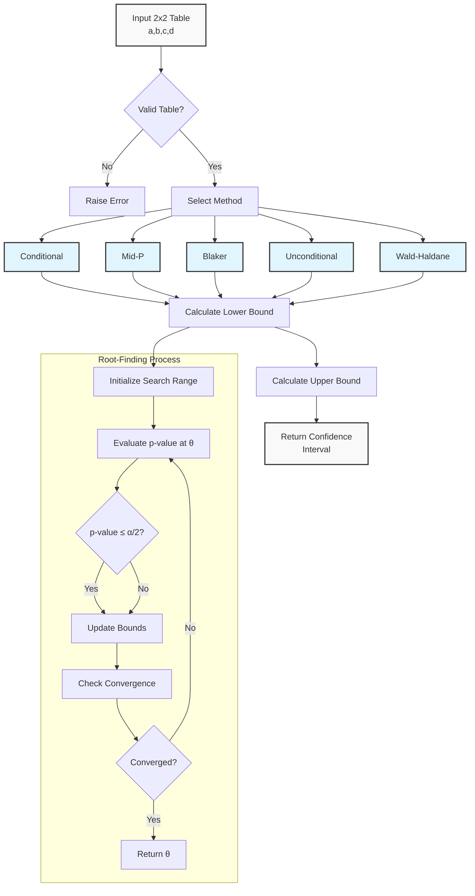

```mermaid
flowchart TD
    A[Input 2x2 Table\na,b,c,d] --> B{Valid Table?}
    B -->|No| C[Raise Error]
    B -->|Yes| D[Select Method]
    
    D --> E[Conditional]
    D --> F[Mid-P]
    D --> G[Blaker]
    D --> H[Unconditional]
    D --> I[Wald-Haldane]
    
    E --> J[Calculate Lower Bound]
    F --> J
    G --> J
    H --> J
    I --> J
    
    J --> K[Calculate Upper Bound]
    K --> L[Return Confidence\nInterval]
    
    subgraph "Root-Finding Process"
    M[Initialize Search Range]
    N[Evaluate p-value at θ]
    O{p-value ≤ α/2?}
    P[Update Bounds]
    Q[Check Convergence]
    R{Converged?}
    S[Return θ]
    
    M --> N
    N --> O
    O -->|Yes| P
    O -->|No| P
    P --> Q
    Q --> R
    R -->|No| N
    R -->|Yes| S
    end
    
    J --> M
    
    style A fill:#f9f9f9,stroke:#333,stroke-width:2px
    style L fill:#f9f9f9,stroke:#333,stroke-width:2px
    style E fill:#e1f5fe,stroke:#333,stroke-width:2px
    style F fill:#e1f5fe,stroke:#333,stroke-width:2px
    style G fill:#e1f5fe,stroke:#333,stroke-width:2px
    style H fill:#e1f5fe,stroke:#333,stroke-width:2px
    style I fill:#e1f5fe,stroke:#333,stroke-width:2px
```
