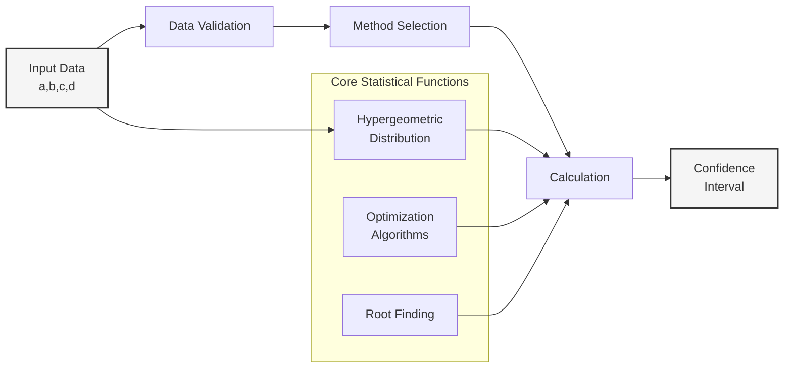

```mermaid
flowchart LR
    A[Input Data\na,b,c,d] --> B[Data Validation]
    B --> C[Method Selection]
    C --> D[Calculation]
    D --> E[Confidence\nInterval]
    
    subgraph "Core Statistical Functions"
    F[Hypergeometric\nDistribution]
    G[Optimization\nAlgorithms]
    H[Root Finding]
    end
    
    A --> F
    F --> D
    G --> D
    H --> D
    
    style A fill:#f5f5f5,stroke:#333,stroke-width:2px
    style E fill:#f5f5f5,stroke:#333,stroke-width:2px
```
