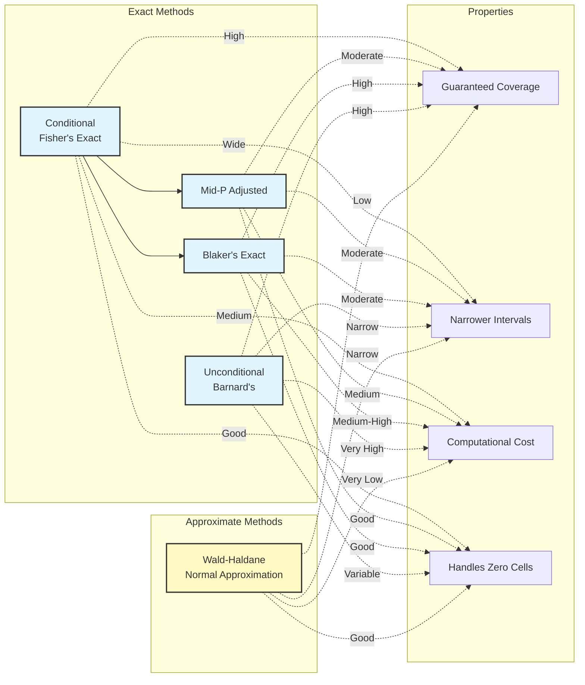

```mermaid
graph LR
    subgraph "Exact Methods"
        A[Conditional\nFisher's Exact] --> B[Mid-P Adjusted]
        A --> C[Blaker's Exact]
        D[Unconditional\nBarnard's] 
    end
    
    subgraph "Approximate Methods"
        E[Wald-Haldane\nNormal Approximation]
    end
    
    subgraph "Properties"
        F[Guaranteed Coverage]
        G[Narrower Intervals]
        H[Computational Cost]
        I[Handles Zero Cells]
    end
    
    A -.->|High| F
    B -.->|Moderate| F
    C -.->|High| F
    D -.->|High| F
    E -.->|Low| F
    
    A -.->|Wide| G
    B -.->|Moderate| G
    C -.->|Moderate| G
    D -.->|Narrow| G
    E -.->|Narrow| G
    
    A -.->|Medium| H
    B -.->|Medium| H
    C -.->|Medium-High| H
    D -.->|Very High| H
    E -.->|Very Low| H
    
    A -.->|Good| I
    B -.->|Good| I
    C -.->|Good| I
    D -.->|Variable| I
    E -.->|Good| I
    
    style A fill:#e1f5fe,stroke:#333,stroke-width:2px
    style B fill:#e1f5fe,stroke:#333,stroke-width:2px
    style C fill:#e1f5fe,stroke:#333,stroke-width:2px
    style D fill:#e1f5fe,stroke:#333,stroke-width:2px
    style E fill:#fff9c4,stroke:#333,stroke-width:2px
```
