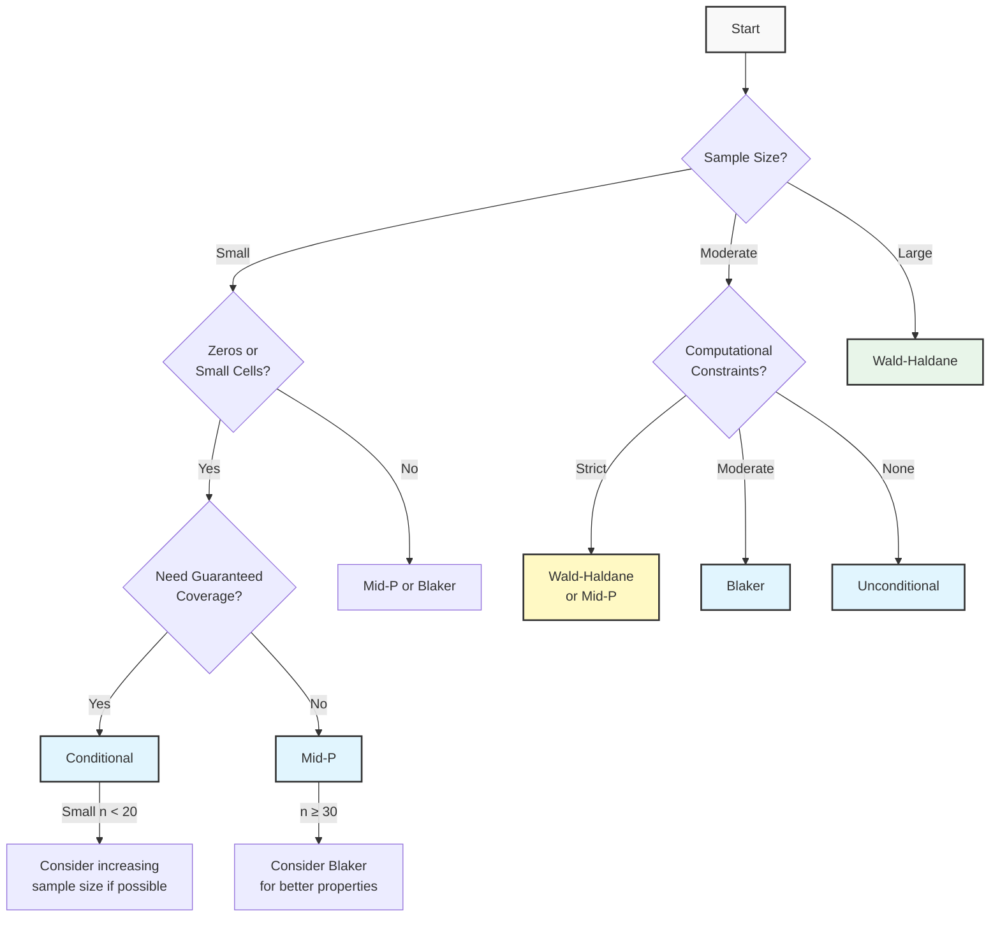

```mermaid
graph TD
    A[Start] --> B{Sample Size?}
    B -->|Small| C{Zeros or\nSmall Cells?}
    B -->|Moderate| F{Computational\nConstraints?}
    B -->|Large| J[Wald-Haldane]
    
    C -->|Yes| D{Need Guaranteed\nCoverage?}
    C -->|No| E[Mid-P or Blaker]
    
    D -->|Yes| K[Conditional]
    D -->|No| L[Mid-P]
    
    F -->|Strict| G[Wald-Haldane\nor Mid-P]
    F -->|Moderate| H[Blaker]
    F -->|None| I[Unconditional]
    
    K -->|"Small n < 20"| M[Consider increasing\nsample size if possible]
    L -->|"n ≥ 30"| N[Consider Blaker\nfor better properties]
    
    style A fill:#f9f9f9,stroke:#333,stroke-width:2px
    style J fill:#e8f5e9,stroke:#333,stroke-width:2px
    style K fill:#e1f5fe,stroke:#333,stroke-width:2px
    style L fill:#e1f5fe,stroke:#333,stroke-width:2px
    style G fill:#fff9c4,stroke:#333,stroke-width:2px
    style H fill:#e1f5fe,stroke:#333,stroke-width:2px
    style I fill:#e1f5fe,stroke:#333,stroke-width:2px
```
