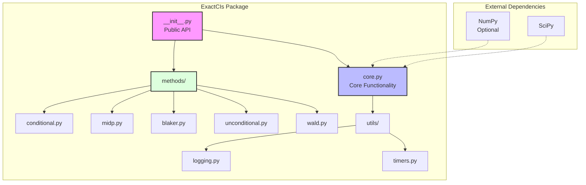

```mermaid
graph TD
    subgraph "ExactCIs Package"
    A[__init__.py\nPublic API] --> B[core.py\nCore Functionality]
    A --> C[methods/]
    C --> D[conditional.py]
    C --> E[midp.py]
    C --> F[blaker.py]
    C --> G[unconditional.py]
    C --> H[wald.py]
    B --> I[utils/]
    I --> J[logging.py]
    I --> K[timers.py]
    end
    
    subgraph "External Dependencies"
    L[NumPy\nOptional] -.-> B
    M[SciPy] -.-> B
    end
    
    style A fill:#f9f,stroke:#333,stroke-width:2px
    style B fill:#bbf,stroke:#333,stroke-width:2px
    style C fill:#dfd,stroke:#333,stroke-width:2px
```
