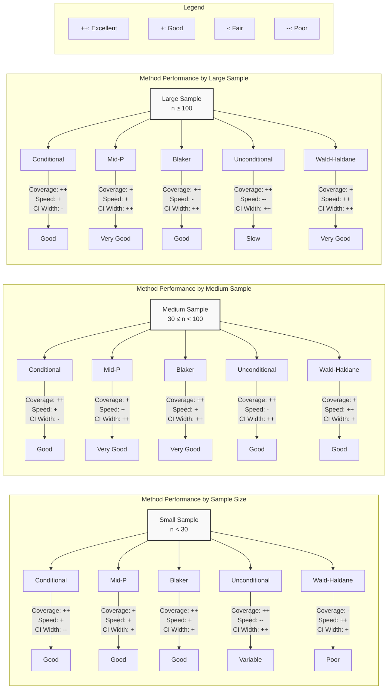

```mermaid
graph LR
    subgraph "Method Performance by Sample Size"
        direction TB
        A[Small Sample\nn < 30] --> A1[Conditional]
        A --> A2[Mid-P]
        A --> A3[Blaker]
        A --> A4[Unconditional]
        A --> A5[Wald-Haldane]
        
        A1 -->|Coverage: ++<br>Speed: +<br>CI Width: --| A1P[Good]
        A2 -->|Coverage: +<br>Speed: +<br>CI Width: +| A2P[Good]
        A3 -->|Coverage: ++<br>Speed: +<br>CI Width: +| A3P[Good]
        A4 -->|Coverage: ++<br>Speed: --<br>CI Width: ++| A4P[Variable]
        A5 -->|Coverage: -<br>Speed: ++<br>CI Width: +| A5P[Poor]
    end
    
    subgraph "Method Performance by Medium Sample"
        direction TB
        B[Medium Sample\n30 ≤ n < 100] --> B1[Conditional]
        B --> B2[Mid-P]
        B --> B3[Blaker]
        B --> B4[Unconditional]
        B --> B5[Wald-Haldane]
        
        B1 -->|Coverage: ++<br>Speed: +<br>CI Width: -| B1P[Good]
        B2 -->|Coverage: +<br>Speed: +<br>CI Width: ++| B2P[Very Good]
        B3 -->|Coverage: ++<br>Speed: +<br>CI Width: ++| B3P[Very Good]
        B4 -->|Coverage: ++<br>Speed: -<br>CI Width: ++| B4P[Good]
        B5 -->|Coverage: +<br>Speed: ++<br>CI Width: +| B5P[Good]
    end
    
    subgraph "Method Performance by Large Sample"
        direction TB
        C[Large Sample\nn ≥ 100] --> C1[Conditional]
        C --> C2[Mid-P]
        C --> C3[Blaker]
        C --> C4[Unconditional]
        C --> C5[Wald-Haldane]
        
        C1 -->|Coverage: ++<br>Speed: +<br>CI Width: -| C1P[Good]
        C2 -->|Coverage: +<br>Speed: +<br>CI Width: ++| C2P[Very Good]
        C3 -->|Coverage: ++<br>Speed: -<br>CI Width: ++| C3P[Good]
        C4 -->|Coverage: ++<br>Speed: --<br>CI Width: ++| C4P[Slow]
        C5 -->|Coverage: +<br>Speed: ++<br>CI Width: ++| C5P[Very Good]
    end
    
    subgraph "Legend"
        L1[++: Excellent]
        L2[+: Good]
        L3[-: Fair]
        L4[--: Poor]
    end
    
    style A fill:#f9f9f9,stroke:#333,stroke-width:2px
    style B fill:#f9f9f9,stroke:#333,stroke-width:2px
    style C fill:#f9f9f9,stroke:#333,stroke-width:2px
```
