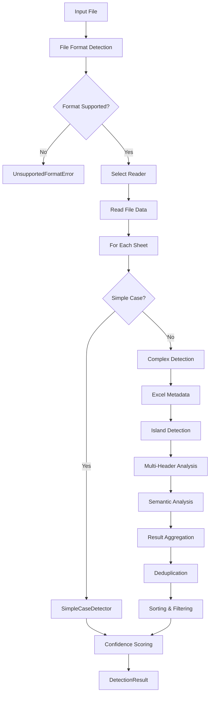

# Detection Pipeline

The GridGulp detection pipeline is a sophisticated multi-stage process designed to accurately find tables in various spreadsheet formats.

## Pipeline Overview



## Stage 1: File Format Detection

### Purpose
Accurately determine file format regardless of extension.

### Process
1. **File signature check**: Read first bytes for magic numbers
2. **AI detection (Magika)**: ML-based format classification
3. **Extension fallback**: Use file extension if other methods fail
4. **Content validation**: Ensure file matches detected format

### Implementation
```python
def detect_file_format(file_path: Path) -> FileInfo:
    # Check file signature
    with open(file_path, 'rb') as f:
        header = f.read(8192)

    # Try Magika AI detection
    if config.enable_magika:
        format_type = magika.identify(header)

    # Fallback to signature matching
    if not format_type:
        format_type = match_file_signature(header)

    # Validate against extension
    return validate_format(format_type, file_path)
```

## Stage 2: Reader Selection

### Reader Types
- **CalamineReader**: Fast Rust-based Excel/ODS reader
- **ExcelReader**: Full-featured openpyxl-based reader
- **CSVReader**: Intelligent CSV/TSV parser
- **TextReader**: Generic delimited text handler

### Selection Logic
```python
def select_reader(file_info: FileInfo) -> BaseReader:
    if file_info.type == FileType.XLSB:
        raise UnsupportedFormatError(
            "XLSB (Excel Binary) format is not supported. "
            "Please save as XLSX format in Excel."
        )

    if file_info.type in [FileType.XLSX, FileType.XLSM]:
        return ExcelReader(file_info)

    elif file_info.type in [FileType.CSV, FileType.TSV]:
        return CSVReader(file_info)

    elif file_info.type == FileType.TXT:
        return TextReader(file_info)
```

## Stage 3: Data Reading

### Memory Management
- Stream large files in chunks
- Cache only necessary cell data
- Release memory after processing

### Data Structure
```python
class SheetData:
    name: str
    cells: dict[tuple[int, int], CellData]
    max_row: int
    max_column: int
    merged_cells: list[str]  # Excel ranges like "A1:C3"
```

## Stage 4: Detection Strategy

### Simple Case Detection

**Optimization**: Handle common cases quickly.

```python
def try_simple_case(sheet_data: SheetData) -> Optional[TableInfo]:
    # Check if data starts near A1
    if not has_data_near_origin(sheet_data):
        return None

    # Find continuous data region
    bounds = find_continuous_region(sheet_data)

    # Validate as single table
    if is_valid_single_table(bounds):
        return TableInfo(
            range=bounds,
            confidence=0.95,
            detection_method="simple_case"
        )
```

### Complex Detection Pipeline

For sheets that don't match simple patterns:

#### 1. Excel Metadata Extraction
```python
def extract_excel_metadata(sheet_data: SheetData) -> list[TableInfo]:
    tables = []

    # Native Excel tables (ListObjects)
    for table_def in sheet_data.excel_tables:
        tables.append(convert_excel_table(table_def))

    # Named ranges that might be tables
    for named_range in sheet_data.named_ranges:
        if looks_like_table(named_range):
            tables.append(convert_named_range(named_range))

    return tables
```

#### 2. Island Detection
```python
def detect_islands(sheet_data: SheetData) -> list[Island]:
    # Create binary mask of non-empty cells
    mask = create_cell_mask(sheet_data)

    # Find connected components
    islands = connected_components(mask)

    # Filter by size and density
    valid_islands = []
    for island in islands:
        if (island.cell_count >= config.min_cells and
            island.density >= config.min_density):
            valid_islands.append(island)

    return valid_islands
```

#### 3. Multi-Header Detection
```python
def detect_multi_headers(sheet_data: SheetData,
                        table_bounds: TableRange) -> HeaderInfo:
    # Analyze top rows for header patterns
    potential_headers = []

    for row in range(table_bounds.start_row,
                     min(table_bounds.start_row + 10,
                         table_bounds.end_row)):
        if is_header_row(sheet_data, row, table_bounds):
            potential_headers.append(row)

    # Detect merged cells in headers
    merged_headers = analyze_merged_cells(
        sheet_data,
        potential_headers
    )

    return build_header_hierarchy(merged_headers)
```

#### 4. Semantic Analysis
```python
def semantic_analysis(sheet_data: SheetData,
                     table_info: TableInfo) -> TableInfo:
    # Analyze content patterns
    table_info.has_totals = detect_total_rows(sheet_data, table_info)
    table_info.sections = detect_sections(sheet_data, table_info)

    # Refine boundaries based on content
    table_info.range = refine_boundaries(sheet_data, table_info)

    # Adjust confidence based on patterns
    table_info.confidence = calculate_semantic_confidence(table_info)

    return table_info
```

## Stage 5: Result Processing

### Deduplication
Remove overlapping tables:

```python
def deduplicate_tables(tables: list[TableInfo]) -> list[TableInfo]:
    # Sort by confidence (highest first)
    tables.sort(key=lambda t: t.confidence, reverse=True)

    kept_tables = []
    for table in tables:
        # Check if overlaps with higher confidence table
        if not overlaps_with_any(table, kept_tables):
            kept_tables.append(table)

    return kept_tables
```

### Filtering
Apply user-defined criteria:

```python
def filter_tables(tables: list[TableInfo]) -> list[TableInfo]:
    filtered = []

    for table in tables:
        # Apply confidence threshold
        if table.confidence < config.confidence_threshold:
            continue

        # Apply size constraints
        if (table.shape[0] < config.min_table_size[0] or
            table.shape[1] < config.min_table_size[1]):
            continue

        filtered.append(table)

    return filtered[:config.max_tables_per_sheet]
```

## Performance Optimizations

### Early Exit Conditions
```python
# Skip empty sheets
if not sheet_data.has_data():
    return []

# Simple case shortcut
if simple_result and simple_result.confidence > 0.9:
    return [simple_result]

# Limit processing for huge sheets
if sheet_data.cell_count > config.max_cells_to_process:
    return fallback_detection(sheet_data)
```

### Parallel Processing
```python
async def detect_tables_parallel(sheets: list[SheetData]) -> list[list[TableInfo]]:
    tasks = []
    for sheet in sheets:
        task = asyncio.create_task(detect_tables_in_sheet(sheet))
        tasks.append(task)

    return await asyncio.gather(*tasks)
```

### Caching
```python
@lru_cache(maxsize=1000)
def calculate_island_signature(mask: np.ndarray) -> int:
    """Cache island detection for identical patterns"""
    return hash(mask.tobytes())
```

## Error Handling

### Graceful Degradation
```python
try:
    # Try advanced detection
    tables = advanced_detection(sheet_data)
except Exception as e:
    logger.warning(f"Advanced detection failed: {e}")
    # Fall back to simple detection
    tables = simple_detection(sheet_data)
```

### Partial Results
```python
class SheetResult:
    name: str
    tables: list[TableInfo]
    error: Optional[str] = None

    @property
    def success(self) -> bool:
        return self.error is None
```

## Extensibility

### Custom Detectors
```python
class CustomDetector(BaseDetector):
    def detect(self, sheet_data: SheetData) -> list[TableInfo]:
        # Custom detection logic
        pass

# Register custom detector
pipeline.register_detector(CustomDetector(), priority=5)
```

### Pipeline Hooks
```python
# Pre-processing hook
@pipeline.pre_process
def normalize_data(sheet_data: SheetData) -> SheetData:
    # Normalize data before detection
    return sheet_data

# Post-processing hook
@pipeline.post_process
def enhance_results(tables: list[TableInfo]) -> list[TableInfo]:
    # Enhance results after detection
    return tables
```

## Next Steps

- Understand [semantic analysis](semantic-understanding.md) in detail
- Learn about [configuration](../user-guide/configuration.md) options
- See [detection methods](../user-guide/detection-methods.md) for specific algorithms
