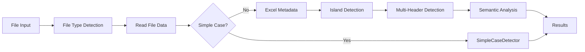

# Detection Methods

GridGulp uses multiple detection algorithms to find tables in spreadsheets. Each method is optimized for different scenarios.

## Detection Pipeline

The detection process follows this pipeline:



## SimpleCaseDetector

**Purpose**: Quickly handles the most common case - a single table starting near cell A1.

**When it's used**:
- First detector to run
- Handles ~80% of real-world spreadsheets
- Very fast (typically <50ms)

**How it works**:
1. Checks if data starts in the top-left region
2. Looks for continuous data without large gaps
3. Identifies clear boundaries
4. Returns high confidence if pattern matches

**Example**:
```python
# Ideal for SimpleCaseDetector
| Name  | Age | City     |
|-------|-----|----------|
| Alice | 30  | New York |
| Bob   | 25  | Boston   |
| Carol | 35  | Chicago  |
```

**Configuration**:
```python
config = Config(
    enable_simple_case_detection=True,  # Enable/disable
    simple_case_max_start_row=5,       # How far from A1
    simple_case_max_start_col=5        # to look for data
)
```

## ExcelMetadataExtractor

**Purpose**: Uses Excel's native table definitions and named ranges.

**When it's used**:
- Only for Excel files (.xlsx, .xlsm)
- When Excel tables (ListObjects) are defined
- When named ranges might contain tables

**How it works**:
1. Reads Excel's internal table definitions
2. Extracts named ranges
3. Converts to GridGulp table format
4. Highest confidence (1.0) for native tables

**Benefits**:
- 100% accurate for defined tables
- Preserves table names and settings
- No computation needed

**Configuration**:
```python
config = Config(
    enable_excel_metadata=True,         # Enable/disable
    read_excel_table_styles=True,      # Include style info
    expand_excel_tables=False          # Expand beyond defined range
)
```

## IslandDetector

**Purpose**: Finds multiple disconnected data regions (islands) on a single sheet.

**When it's used**:
- Multiple tables on one sheet
- Tables not starting at A1
- Complex layouts with scattered data

**How it works**:
1. Creates binary mask of non-empty cells
2. Uses connected component analysis
3. Groups adjacent cells into islands
4. Filters by size and density

**Example**:
```
A1: Summary Stats        F1: Product Sales
A2: Total: 1000         F2: Product | Revenue
A3: Average: 50         F3: Widget  | $500
                        F4: Gadget  | $300
                        F5: Tool    | $200
```

**Configuration**:
```python
config = Config(
    enable_island_detection=True,
    island_min_cells=5,              # Minimum cells per island
    island_max_gap=1,                # Max gap between cells
    island_density_threshold=0.3,    # Min filled ratio
    island_neighbor_distance=3       # Distance to merge islands
)
```

## Multi-Header Detection

**Purpose**: Identifies tables with complex, multi-row headers including merged cells.

**When it's used**:
- Hierarchical headers
- Merged cells in headers
- Financial reports with nested categories

**How it works**:
1. Analyzes formatting patterns in top rows
2. Detects merged cell regions
3. Builds header hierarchy
4. Maps columns to header paths

**Example**:
```
|        Sales by Region         |
|   Q1   |   Q2   |   Q3   |  Q4 |
| Jan|Feb| Apr|May| Jul|Aug| Oct |
|--------+--------+--------+-----|
| 100|120| 150|140| 180|190| 200 |
```

**Configuration**:
```python
config = Config(
    enable_multi_header_detection=True,
    max_header_rows=10,              # Max rows to check
    header_confidence_threshold=0.7,  # Min confidence
    detect_merged_cells=True,        # Handle merged cells
    header_format_weight=0.4         # Formatting importance
)
```

## Semantic Analysis

**Purpose**: Uses content analysis to understand table structure and boundaries.

**When it's used**:
- After structural detection
- To refine table boundaries
- To identify special rows (totals, subtotals)

**How it works**:
1. Analyzes data types per column
2. Identifies consistent patterns
3. Detects summary rows
4. Finds natural boundaries

**Features detected**:
- Header rows (bold, different type)
- Total/subtotal rows
- Section breaks
- Data type consistency

**Configuration**:
```python
config = Config(
    enable_semantic_analysis=True,
    semantic_blank_row_threshold=0.9,   # Row is blank if 90%+ empty
    semantic_total_keyword_list=[       # Total row keywords
        'total', 'sum', 'subtotal',
        'grand total', 'overall'
    ],
    semantic_header_keyword_boost=0.2   # Confidence boost for headers
)
```

## Confidence Scoring

Each detection method produces a confidence score:

### Base Confidence
- **SimpleCaseDetector**: 0.85-0.95 (high for clear cases)
- **ExcelMetadata**: 1.0 (perfect for defined tables)
- **IslandDetector**: 0.5-0.9 (based on island quality)
- **Multi-Header**: 0.6-0.95 (based on header structure)

### Confidence Adjustments
```python
# Factors that increase confidence:
+ Large table size (more data points)
+ High data density (fewer gaps)
+ Consistent column types
+ Clear headers
+ Formatting patterns

# Factors that decrease confidence:
- Small table size
- Sparse data
- Mixed data types
- No clear headers
- Irregular shape
```

## Method Selection Strategy

GridGulp automatically selects appropriate methods:

```python
def select_detection_methods(file_info, sheet_data):
    methods = []

    # Always try simple case first (fast)
    if config.enable_simple_case_detection:
        methods.append(SimpleCaseDetector)

    # Excel metadata if available
    if file_info.is_excel and config.enable_excel_metadata:
        methods.append(ExcelMetadataExtractor)

    # Island detection for complex layouts
    if not simple_case_found and config.enable_island_detection:
        methods.append(IslandDetector)

    # Header detection for tables with headers
    if has_potential_headers and config.enable_multi_header_detection:
        methods.append(MultiHeaderDetector)

    # Semantic analysis to refine results
    if config.enable_semantic_analysis:
        methods.append(SemanticAnalyzer)

    return methods
```

## Performance Considerations

| Method | Speed | Memory | Best For |
|--------|-------|--------|----------|
| SimpleCaseDetector | Very Fast (<50ms) | Low | Single tables at A1 |
| ExcelMetadata | Very Fast (<10ms) | Low | Defined Excel tables |
| IslandDetector | Fast (<200ms) | Medium | Multiple tables |
| Multi-Header | Medium (<500ms) | Medium | Complex headers |
| Semantic | Slow (<1s) | High | Accuracy refinement |

## Custom Detection Patterns

For specific use cases, combine methods:

### Financial Reports
```python
config = Config(
    enable_multi_header_detection=True,
    enable_semantic_analysis=True,
    semantic_total_keyword_list=['total', 'sum', 'net', 'gross'],
    header_format_weight=0.5
)
```

### Scientific Data
```python
config = Config(
    enable_island_detection=True,
    island_min_cells=10,
    text_min_delimiter_consistency=0.8,
    expected_header_rows=1
)
```

### Simple CSV Files
```python
config = Config(
    enable_simple_case_detection=True,
    enable_island_detection=False,
    enable_multi_header_detection=False,
    enable_semantic_analysis=False
)
```

## Debugging Detection

Enable detailed logging to understand detection:

```python
import logging

logging.basicConfig(level=logging.DEBUG)

# Detection logs will show:
# - Which methods were tried
# - Confidence scores from each
# - Why tables were accepted/rejected
# - Performance metrics
```

## Next Steps

- Learn about [configuration options](configuration.md) to tune detection
- See [file formats](file-formats.md) for format-specific detection
- Explore [DataFrame extraction](dataframe-extraction.md) after detection
