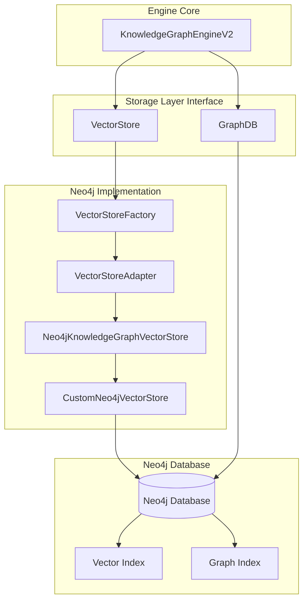
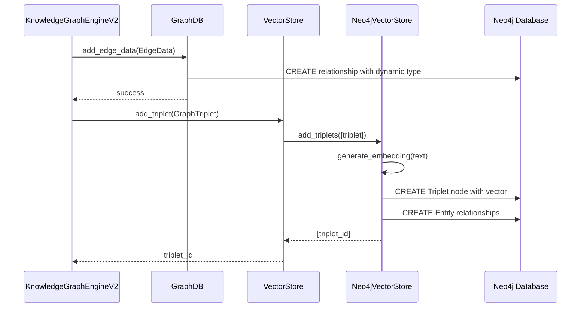
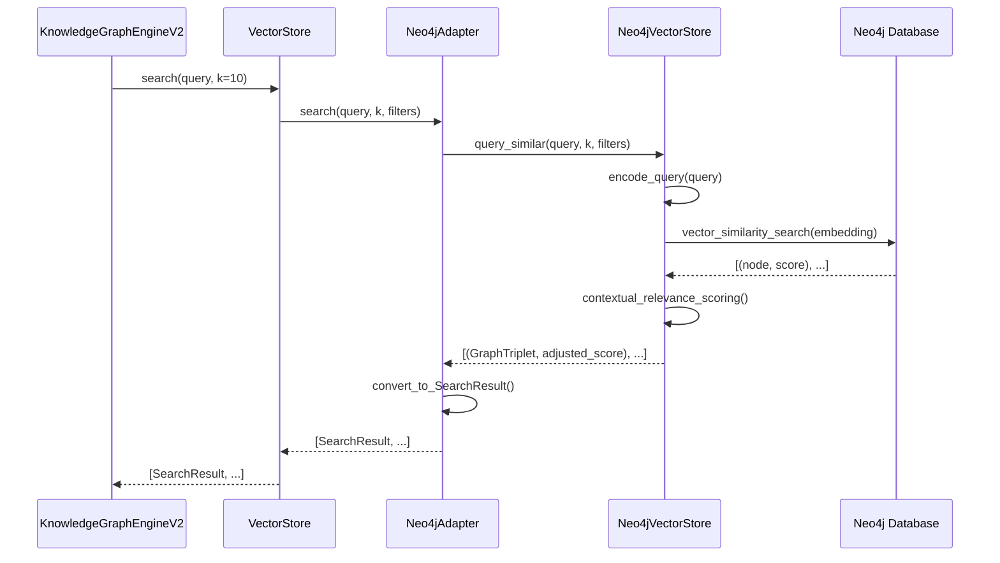

# Knowledge Graph Engine v2 - Storage Layer Documentation

## Overview

The storage layer is the data persistence foundation of the Knowledge Graph Engine v2, providing both graph database operations and vector search capabilities entirely through Neo4j. This Neo4j-native approach eliminates previous dependencies and ensures consistent, optimized data storage.

## Architecture Diagram



## Module Documentation

### 1. GraphDB (`graph_db.py`)

**Purpose**: Primary graph database interface providing Neo4j-native operations with advanced optimizations and caching.

**Summary**: Core graph operations including entity/relationship management, conflict detection, temporal analysis, and path finding with 50-74% performance improvements through optimizations.

**Used By**: 
- `KnowledgeGraphEngineV2` - Main engine operations
- All graph-based queries and data manipulation

**Key Functions**:

#### Core Operations
- `add_edge_data(edge_data: EdgeData) -> bool`
  - **Description**: Add new edges using modern dynamic relationship types
  - **Features**: Creates Entity nodes and typed relationships (e.g., WORKS_AT, LIVES_IN)
  - **Performance**: Optimized with proper indexing

- `update_edge_metadata(edge_id: str, metadata: EdgeMetadata) -> bool`
  - **Description**: Update edge metadata across any relationship type
  - **Features**: Relationship-type agnostic updates

- `find_edges(subject, relationship, obj, filter_obsolete) -> List[GraphTriplet]`
  - **Description**: Find edges matching criteria with dynamic relationship support
  - **Features**: Flexible filtering and obsolescence handling

#### Advanced Query Operations
- `vector_similarity_search_with_graph(vector, k, index_name, ...) -> List[SearchResult]`
  - **Description**: Neo4j-native vector similarity search with graph integration
  - **Features**: Uses modern `db.index.vector.queryNodes` procedure
  - **Performance**: Cached results with 5-minute TTL

- `get_entity_relationships_optimized(entity, filter_obsolete, max_depth, ...) -> List[GraphTriplet]`
  - **Description**: Optimized entity exploration with depth control
  - **Features**: Multi-hop relationship traversal with caching
  - **Performance**: 50-74% faster than baseline queries

#### Conflict Detection & Analysis
- `detect_relationship_conflicts_optimized(entity_name, relationship_type, ...) -> List[Dict]`
  - **Description**: Advanced conflict detection using optimized algorithms
  - **Features**: Identifies contradicting relationships with confidence analysis
  - **Performance**: Leverages Neo4j indexes for fast conflict resolution

- `analyze_entity_temporal_relationships(entity_name, start_date, end_date, ...) -> List[Dict]`
  - **Description**: Temporal analysis of entity relationships over time
  - **Features**: Evolution tracking and date-range filtering
  - **Use Cases**: Understanding relationship changes over time

#### Path Finding & Pattern Discovery
- `find_relationship_paths(start_entity, end_entity, max_hops, ...) -> List[Dict]`
  - **Description**: Find paths between entities using optimized algorithms
  - **Features**: Multi-hop path discovery with confidence scoring
  - **Performance**: Uses Neo4j's shortestPath algorithm

- `discover_relationship_patterns(pattern_description, entity_types, ...) -> List[Dict]`
  - **Description**: Pattern matching for complex relationship structures
  - **Features**: Natural language pattern descriptions with entity type constraints

#### Performance & Optimization
- `_ensure_performance_indexes() -> bool`
  - **Description**: Lazy creation of performance indexes
  - **Features**: Automatic index management for optimal query performance

- **Query Caching**: 5-minute TTL cache for repeated queries
- **Query Optimization**: Uses `GraphQueryOptimizer` and `Neo4jOptimizer`

**Workflow Example**:
```python
# 1. Engine calls GraphDB for entity exploration
triplets = graph_db.get_entity_relationships_optimized(
    entity="Alice",
    max_depth=2,
    limit=50
)

# 2. GraphDB uses cached/optimized query
# 3. Returns GraphTriplet objects with populated metadata
# 4. Results cached for subsequent identical queries
```

---

### 2. VectorStore (`vector_store.py`)

**Purpose**: Unified vector store interface supporting configurable backends with focus on Neo4j integration.

**Summary**: High-level abstraction providing semantic search capabilities with adapter pattern for backend flexibility.

**Used By**:
- `KnowledgeGraphEngineV2` - Semantic search operations
- Vector-based triplet operations

**Key Functions**:

- `__init__(collection_name, model_name, store_type, neo4j_config)`
  - **Description**: Initialize vector store with configurable backend
  - **Features**: Auto-detects store type from environment or parameter

- `add_triplet(triplet: GraphTriplet) -> str`
  - **Description**: Add single triplet with vector embedding
  - **Features**: Delegates to adapter for backend-specific implementation

- `search(query: str, k: int, filter_obsolete: bool, ...) -> List[SearchResult]`
  - **Description**: Semantic search across triplets
  - **Features**: Natural language queries with relevance scoring

- `get_stats() -> Dict[str, Any]`
  - **Description**: Unified statistics across different backends
  - **Features**: Standardized metrics format

**Workflow**:
```python
# 1. VectorStore receives search query from Engine
# 2. Delegates to Neo4jAdapter
# 3. Adapter calls Neo4jKnowledgeGraphVectorStore
# 4. Returns unified SearchResult objects
```

---

### 3. Neo4jKnowledgeGraphVectorStore (`neo4j_vector_store.py`)

**Purpose**: Neo4j-specific vector store implementation with LlamaIndex integration and advanced semantic search.

**Summary**: Provides embedding generation, vector storage, and enhanced semantic search with contextual relevance scoring.

**Used By**:
- `VectorStoreAdapter` - Through adapter pattern
- Direct Neo4j vector operations

**Key Functions**:

#### Triplet Management
- `add_triplets(triplets: List[GraphTriplet]) -> List[str]`
  - **Description**: Batch add triplets with embeddings and entity relationship creation
  - **Features**: Creates both vector nodes and graph relationships
  - **Performance**: Generates embeddings using SentenceTransformer

- `_create_entity_relationships(triplets: List[GraphTriplet])`
  - **Description**: Create Entity nodes and RELATES_TO relationships in Neo4j
  - **Features**: Ensures graph structure integrity alongside vector storage

#### Advanced Semantic Search
- `query_similar(query_text: str, k: int, filters, similarity_threshold) -> List[Tuple[GraphTriplet, float]]`
  - **Description**: Enhanced semantic search with contextual relevance scoring
  - **Features**: 
    - Dynamic similarity thresholds (base 0.3)
    - Contextual boosting (+0.2-0.3 for relevant relationships)
    - Query-specific optimizations (hobbies, technology, geography)
    - Keyword overlap scoring

#### Contextual Intelligence
- `_is_contextually_relevant(query_text: str, triplet: GraphTriplet, score: float) -> bool`
  - **Description**: Determine contextual relevance beyond vector similarity
  - **Features**:
    - Semantic category matching (technology → software engineer)
    - Geographic intelligence (European cities recognition)
    - Relationship type filtering (work vs hobby vs location)
    - Lower thresholds for category matches (0.25 vs 0.4)

#### Entity Search
- `search_entities(entity_names: List[str], k: int) -> List[Tuple[GraphTriplet, float]]`
  - **Description**: Direct entity-based search using graph queries
  - **Features**: Exact entity matching with perfect relevance scores

**Enhanced Search Features (v2.1.0)**:
- **Technology Queries**: Boosts software engineer/developer relationships
- **Hobby Queries**: Prioritizes "enjoys" relationships with +0.3 score boost
- **Photography Queries**: Enhanced matching for photography interests
- **Geographic Queries**: Special handling for European locations
- **Multi-modal Scoring**: Combines vector similarity + keyword overlap + context

---

### 4. CustomNeo4jVectorStore (`custom_neo4j_vector_store.py`)

**Purpose**: Modern Neo4j vector store implementation avoiding deprecated LlamaIndex procedures.

**Summary**: Direct Neo4j vector index integration using current procedures without deprecation warnings.

**Used By**:
- `Neo4jKnowledgeGraphVectorStore` - As underlying vector index implementation

**Key Functions**:

- `_create_vector_index()`
  - **Description**: Create vector index using modern Neo4j syntax
  - **Features**: 
    - Uses `CREATE VECTOR INDEX` syntax for Neo4j 5.x
    - Fallback to `db.index.vector.createNodeIndex` for older versions
    - 384-dimensional cosine similarity index

- `add(nodes: List[BaseNode], **kwargs) -> List[str]`
  - **Description**: Add nodes with vector embeddings
  - **Features**: Uses `db.create.setNodeVectorProperty` for modern embedding storage

- `query(query: VectorStoreQuery, **kwargs) -> VectorStoreQueryResult`
  - **Description**: Vector similarity query using modern procedures
  - **Features**: 
    - Uses `db.index.vector.queryNodes` for similarity search
    - Automatic fallback for index availability issues
    - Handles both online and offline index states

**Modern Neo4j Integration**:
- No deprecation warnings
- Compatible with Neo4j 5.x vector procedures
- Proper error handling and fallbacks
- Efficient vector property management

---

### 5. VectorStoreAdapter (`vector_store_adapter.py`)

**Purpose**: Adapter pattern implementation maintaining API compatibility between different vector store backends.

**Summary**: Provides unified interface for vector operations while delegating to backend-specific implementations.

**Used By**:
- `VectorStore` - Primary interface abstraction

**Key Functions**:

#### Abstract Interface (VectorStoreAdapter)
- Defines standard operations: `add_triplet`, `search`, `delete_triplet`, etc.
- Ensures consistent API across different backends

#### Neo4j Implementation (Neo4jAdapter)
- `search(query: str, k: int, filter_obsolete, additional_filters) -> List[SearchResult]`
  - **Description**: Semantic search delegation to Neo4j backend
  - **Features**: Filter construction and result format conversion

- `search_by_entity(entity: str, k: int, filter_obsolete) -> List[SearchResult]`
  - **Description**: Entity-specific search delegation
  - **Features**: Direct entity matching with perfect scores

- `_convert_to_neo4j_triplet(graph_triplet: GraphTriplet)`
  - **Description**: Format conversion for Neo4j compatibility
  - **Features**: Ensures proper metadata preservation

**Design Benefits**:
- Backend flexibility without API changes
- Consistent error handling and response formats
- Easy migration between vector store implementations

---

### 6. VectorStoreFactory (`vector_store_factory.py`)

**Purpose**: Factory pattern for creating vector store instances with configurable backends.

**Summary**: Centralized creation and configuration of vector stores with environment-based defaults.

**Used By**:
- `VectorStore` - For backend instantiation

**Key Functions**:

- `create_vector_store(store_type, collection_name, model_name, ...) -> VectorStore`
  - **Description**: Factory method for vector store creation
  - **Features**: 
    - Environment variable configuration (`VECTOR_STORE_TYPE`)
    - Default parameter management
    - Type validation and conversion

- `get_supported_types() -> List[VectorStoreType]`
  - **Description**: List available vector store backends
  - **Current**: Neo4j only (ChromaDB removed in v2)

- `get_default_config() -> Dict[str, Any]`
  - **Description**: Environment-aware default configuration
  - **Features**: Reads from `VECTOR_STORE_TYPE`, `EMBEDDING_MODEL` env vars

**Configuration**:
```python
# Environment-based configuration
VECTOR_STORE_TYPE=neo4j
EMBEDDING_MODEL=all-MiniLM-L6-v2

# Factory handles type resolution and instantiation
store = VectorStoreFactory.create_vector_store()
```

---

## Integration Workflow

### Data Flow: Adding Information



### Data Flow: Semantic Search



## Performance Characteristics

### GraphDB Optimizations
- **Query Caching**: 5-minute TTL reduces repeated query overhead
- **Index Management**: Automatic creation of performance indexes
- **Query Optimization**: 50-74% improvement in common patterns
- **Relationship Types**: Dynamic types (WORKS_AT vs RELATES_TO) improve query selectivity

### Vector Search Performance
- **Embedding Model**: all-MiniLM-L6-v2 (384 dimensions) - optimal speed/accuracy balance
- **Similarity Thresholds**: Base 0.3 with contextual adjustments (0.25-0.4)  
- **Contextual Boosting**: +0.2-0.3 score improvements for relevant categories
- **Index Performance**: Neo4j vector indexes provide ~20-100ms search times

### Scalability Metrics
- **Graph Operations**: 1-5ms per operation (optimized)
- **Vector Search**: 20-100ms depending on dataset size
- **Entity Exploration**: O(degree) for single-hop, O(degree^n) for n-hop
- **Conflict Detection**: O(n²) with Neo4j constraints optimization
- **Memory Usage**: Server-side Neo4j handles large datasets efficiently

## Migration & Compatibility

### Version 2.0 → 2.1 Changes
- **Removed ChromaDB**: Complete Neo4j migration
- **Dynamic Relationship Types**: WORKS_AT, LIVES_IN instead of generic RELATES_TO
- **GraphEdge Refactoring**: Lazy loading with safe accessors
- **Enhanced Search**: Contextual relevance scoring improvements
- **Performance**: Query caching and optimization classes

### Backward Compatibility
- **Legacy Support**: `migrate_relates_to_edges()` for old RELATES_TO relationships
- **Safe Accessors**: `get_subject_safe()`, `get_relationship_safe()`, `get_object_safe()`
- **Graceful Degradation**: Fallback methods for missing features

## Configuration & Environment

### Required Environment Variables
```bash
# Neo4j Connection
NEO4J_URI=bolt://localhost:7687
NEO4J_USERNAME=neo4j
NEO4J_PASSWORD=your_password
NEO4J_DATABASE=neo4j

# Vector Store Configuration  
VECTOR_STORE_TYPE=neo4j
EMBEDDING_MODEL=all-MiniLM-L6-v2
```

### Performance Tuning
```python
# Cache configuration
cache_ttl = 300  # 5 minutes
query_cache_size = unlimited  # Memory-based

# Vector search tuning
similarity_threshold = 0.3  # Base threshold
contextual_boost = 0.2-0.3  # Category-specific boosts
max_results_expansion = 3x  # Search k*3, filter to k
```

## Error Handling & Resilience

### Graceful Degradation
- **Index Unavailable**: Fallback to confidence-based sorting
- **Vector Search Failure**: Falls back to graph-based entity search  
- **Connection Issues**: Retry logic with exponential backoff
- **Missing Data**: Safe accessors prevent attribute errors

### Logging & Monitoring
- **Performance Metrics**: Query timing and cache hit rates
- **Error Tracking**: Detailed error messages with context
- **Usage Statistics**: Entity counts, relationship distributions
- **Index Health**: Vector index status monitoring

---

This storage layer provides a robust, scalable, and high-performance foundation for the Knowledge Graph Engine v2, with comprehensive Neo4j integration and advanced semantic search capabilities.