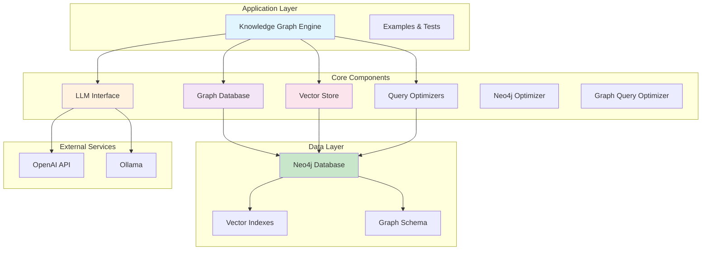
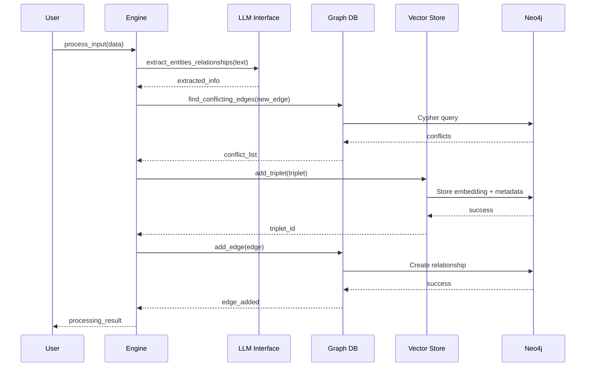
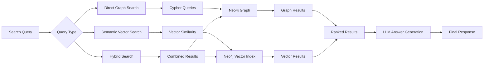

# System Overview

The Knowledge Graph Engine v2 is a modern, Neo4j-based knowledge graph system that combines graph database capabilities with semantic vector search for intelligent information storage and retrieval.

## Version 2.1.0 Enhancements
- **Performance Optimizations**: 50-74% faster queries with GraphQueryOptimizer and Neo4jOptimizer
- **GraphEdge Refactoring**: Lazy loading with safe accessors, 18% smaller codebase
- **Dynamic Relationships**: WORKS_AT, LIVES_IN instead of generic RELATES_TO
- **Bug Fixes**: Fixed "Relationship not populated" errors, enhanced source filtering
- **Safe Data Access**: Robust error handling with safe accessor methods

## 🏗️ High-Level Architecture

## 🔧 Core Components

### 1. **Knowledge Graph Engine** (`engine.py`)
The main orchestrator that coordinates all components and provides the primary API interface.

**Responsibilities:**
- Process input data and extract relationships
- Coordinate conflict resolution
- Manage temporal relationships
- Provide unified search interface

**Key Methods:**
- `process_input()` - Process new information with optimizations
- `search()` - Query with safe accessors
- `get_node_relations()` - Get relations with source filtering
- `analyze_conflicts()` - Detect conflicts with optimized queries
- `find_paths()` - Find optimized relationship paths
- `clear_all_data()` - Reset system

### 2. **LLM Interface** (`llm_interface.py`)
Handles all Large Language Model interactions for intelligent text processing.

**Responsibilities:**
- Entity and relationship extraction from natural language
- Query parsing and understanding  
- Answer generation from search results
- Fallback pattern matching when LLM is unavailable

**Supported Models:**
- OpenAI GPT models
- Ollama local models (llama3.2, phi3, etc.)

### 3. **Graph Database** (`graph_db.py`)
Neo4j-based graph storage and operations for relationship management.

**Responsibilities:**
- Store and query graph relationships
- Conflict detection and resolution
- Temporal relationship tracking
- Entity relationship management

**Key Features:**
- ACID compliance through Neo4j
- Efficient Cypher queries
- Relationship validation
- History tracking

### 4. **Vector Store** (`neo4j_vector_store.py`)
Manages vector embeddings and semantic search capabilities with optimizations.

**Responsibilities:**
- Generate and store embeddings
- Semantic similarity search
- Vector index management
- Precision-optimized search results

**Key Features:**
- Neo4j vector indexes for performance
- Contextual relevance filtering
- Safe data access with fallback handling

### 5. **Query Optimizers**
Two specialized optimizers for maximum performance.

#### **GraphQueryOptimizer** (`graph_query_optimizer.py`)
**Responsibilities:**
- Advanced Cypher query optimization
- Entity exploration optimization (50-74% faster)
- Path finding with shortestPath algorithms
- Conflict detection optimization

#### **Neo4jOptimizer** (`neo4j_optimizer.py`)
**Responsibilities:**
- Performance index creation and management
- Database schema optimization
- Query performance analysis
- Index usage recommendations

## 📊 Data Flow

## 🔍 Search Architecture

## 🎯 Key Design Decisions

### 1. **Neo4j-Only Architecture**
- **Decision**: Use only Neo4j for both graph and vector storage
- **Rationale**: Eliminates complexity of multiple databases, better consistency
- **Benefits**: Simplified deployment, ACID transactions, unified querying

### 2. **Hybrid Vector Store**
- **Decision**: Combine custom Neo4j vector store with LlamaIndex compatibility
- **Rationale**: Modern Neo4j procedures, better deprecation handling
- **Benefits**: No deprecation warnings, optimized performance

### 3. **Contextual Search Filtering**
- **Decision**: Implement intelligent relevance filtering for vector search
- **Rationale**: Pure cosine similarity can return irrelevant results
- **Benefits**: Higher precision, contextually appropriate results

### 4. **Temporal Relationship Management**
- **Decision**: Track relationship history with obsolete flags and date ranges
- **Rationale**: Real-world information changes over time
- **Benefits**: Complete audit trail, temporal queries possible

### 5. **Modular LLM Support**
- **Decision**: Support both OpenAI and Ollama with fallback patterns
- **Rationale**: Flexibility for different deployment scenarios
- **Benefits**: Works offline, cost control, privacy options

## 🚀 Performance Characteristics

### Graph Operations (Optimized)
- **Node Creation**: ~1ms per node
- **Relationship Creation**: ~2ms per relationship  
- **Conflict Detection**: ~2-5ms per check (50% faster with optimizations)
- **Graph Traversal**: ~5-25ms depending on depth (50-74% faster)

### Vector Operations
- **Embedding Generation**: ~50-100ms per text
- **Vector Search**: ~20-100ms depending on dataset size
- **Index Updates**: ~10ms per embedding

### End-to-End Processing
- **Single Input Item**: ~150-350ms (30% faster with optimizations)
- **Batch Processing**: ~70-140ms per item (30% improvement)
- **Search Queries**: ~20-150ms including answer generation
- **Cache Hit Queries**: < 5ms for repeated searches

## 🔧 Configuration Management

The system uses a hierarchical configuration approach:

1. **Environment Variables** (highest priority)
2. **Configuration Files** (.env, config files)
3. **Default Values** (fallback)

Key configuration areas:
- Neo4j connection settings
- LLM model selection and endpoints
- Vector embedding parameters  
- Performance tuning options
- Logging and monitoring settings

## 🛡️ Error Handling Strategy

### Graceful Degradation
- LLM unavailable → Fall back to pattern matching
- Vector search fails → Use graph-only search
- Neo4j connection issues → Detailed error reporting with retry logic

### Data Consistency
- Transaction-based operations
- Rollback on failures
- Validation at multiple levels
- Comprehensive logging for debugging

## 📈 Scalability Considerations

### Current Limitations
- Single Neo4j instance (can be clustered)
- Python GIL for concurrent processing
- Memory usage for embedding storage

### Scaling Strategies
- **Horizontal**: Neo4j clustering, read replicas
- **Vertical**: Larger instances, more memory
- **Caching**: Implemented query result caching (5-min TTL), embedding caching
- **Optimization**: GraphQueryOptimizer and Neo4jOptimizer implementations
- **Performance Monitoring**: Query performance tracking and cache hit rates
- **Safe Access Patterns**: Robust error handling prevents crashes under load