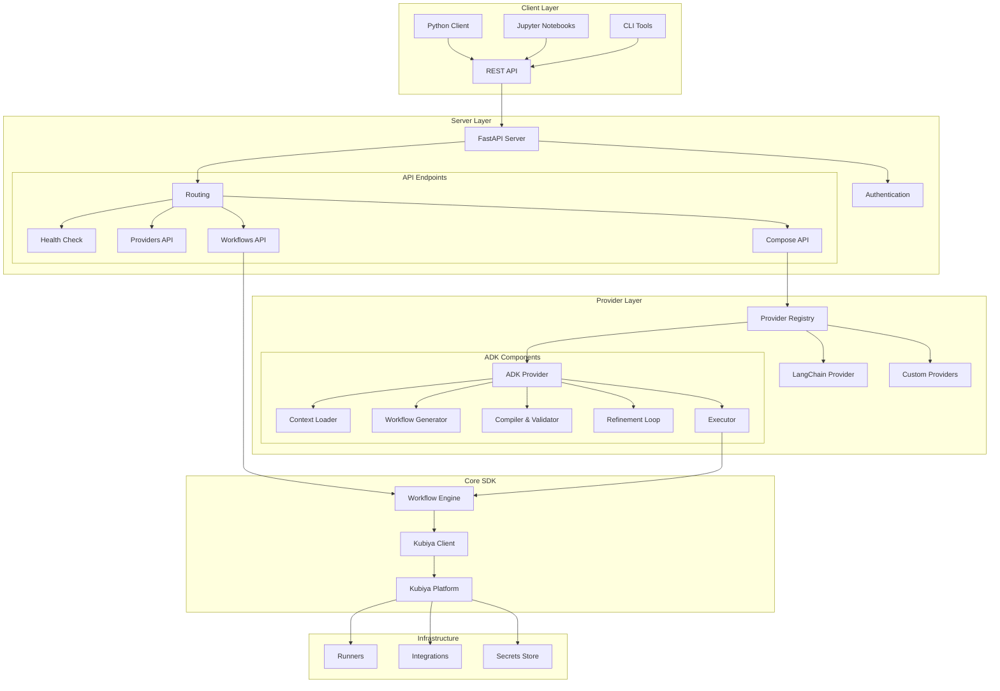

# Kubiya Workflow SDK Architecture

## Overview

The Kubiya Workflow SDK is a comprehensive framework for building, orchestrating, and executing workflows with native support for AI-powered workflow generation through pluggable providers. The SDK provides:

- **Core SDK**: Python library for workflow creation and execution
- **Server**: REST API server with SSE streaming support
- **Providers**: Pluggable AI frameworks for workflow generation (ADK, LangChain, etc.)
- **Client**: Python client for programmatic access

## Architecture Diagram



## Component Details

### 1. Core SDK (`kubiya_workflow_sdk`)

The foundational Python library providing:

- **Workflow DSL**: Pythonic interface for defining workflows
- **Client**: API client for Kubiya platform integration
- **Execution**: Workflow execution with SSE streaming
- **Types**: Type definitions and validation

#### Key Classes:

```python
# Workflow definition
from kubiya_workflow_sdk import Workflow, Step

workflow = Workflow(
    name="example-workflow",
    description="Example workflow",
    steps=[
        Step(name="step1", command="echo 'Hello'"),
        Step(name="step2", command="echo 'World'", depends=["step1"])
    ]
)

# Client usage
from kubiya_workflow_sdk import Client

client = Client(api_key="your-key")
execution = client.execute_workflow(workflow, stream=True)
```

### 2. Server (`kubiya_workflow_sdk.server`)

FastAPI-based REST API server providing:

- **RESTful API**: Standard HTTP endpoints
- **SSE Streaming**: Real-time execution updates
- **Authentication**: API key validation
- **Provider Management**: Dynamic provider loading

#### Endpoints:

- `GET /health` - Health check
- `GET /api/v1/providers` - List available providers
- `POST /api/v1/compose` - Generate/execute workflows via AI
- `POST /api/v1/workflows/execute` - Direct workflow execution

### 3. Provider System

Pluggable architecture for AI-powered workflow generation:

#### Base Provider Interface:

```python
from abc import ABC, abstractmethod

class BaseProvider(ABC):
    @abstractmethod
    async def generate_workflow(self, task: str, context: Dict) -> Workflow:
        """Generate a workflow from natural language task."""
        pass
    
    @abstractmethod
    async def validate_workflow(self, workflow: Workflow) -> ValidationResult:
        """Validate workflow syntax and requirements."""
        pass
    
    @abstractmethod
    async def refine_workflow(self, workflow: Workflow, errors: List[str]) -> Workflow:
        """Refine workflow based on errors."""
        pass
    
    @abstractmethod
    async def execute_workflow(self, workflow: Workflow, stream: bool = False):
        """Execute workflow with optional streaming."""
        pass
```

### 4. ADK Provider

First-class provider implementation using Google's Agent Development Kit:

#### Components:

1. **Context Loader Agent**
   - Fetches available runners, integrations, secrets
   - Provides platform context to workflow generator

2. **Workflow Generator Agent**
   - Uses LLMs (DeepSeek V3 via Together AI)
   - Generates Python code that creates workflows
   - Supports callbacks and artifacts

3. **Compiler Agent**
   - Validates Python syntax
   - Ensures workflow structure is correct

4. **Refinement Loop**
   - Iteratively fixes errors
   - Uses advanced reasoning models
   - Maximum iterations configurable

5. **Executor Agent**
   - Executes workflows on Kubiya platform
   - Streams real-time execution events
   - Handles errors and retries

#### Configuration:

```python
# Environment variables
TOGETHER_API_KEY=your-key
KUBIYA_API_KEY=your-key

# Or programmatic
config = ADKProviderConfig(
    together_api_key="your-key",
    model_provider="together",
    execute_workflows=True,
    max_loop_iterations=3
)
```

## Data Flow

### 1. Workflow Generation (Plan Mode)

```
User Request → Server → Provider Registry → ADK Provider
    ↓
Context Loading ← Kubiya Platform
    ↓
LLM Generation → Python Code → Workflow Object
    ↓
Validation → Refinement (if needed)
    ↓
Response → User
```

### 2. Workflow Execution (Act Mode)

```
Generated Workflow → Executor Agent → Kubiya Client
    ↓
Kubiya Platform → Runner Selection → Execution
    ↓
SSE Events ← Real-time Updates
    ↓
Stream Handler → Formatted Events → User
```

## Security

1. **API Authentication**
   - Bearer token validation
   - User key format support

2. **Provider Isolation**
   - Each provider runs in isolated context
   - No cross-provider data sharing

3. **Execution Safety**
   - Workflows execute on Kubiya platform
   - Sandboxed runner environments
   - Resource limits enforced

## Deployment

### Docker Deployment

```bash
# Build image
docker build -t kubiya-sdk-server .

# Run server
docker run -p 8000:8000 \
  -e KUBIYA_API_KEY=your-key \
  -e TOGETHER_API_KEY=your-key \
  kubiya-sdk-server
```

### Kubernetes Deployment

```yaml
apiVersion: apps/v1
kind: Deployment
metadata:
  name: kubiya-sdk-server
spec:
  replicas: 3
  template:
    spec:
      containers:
      - name: server
        image: kubiya-sdk-server:latest
        env:
        - name: KUBIYA_API_KEY
          valueFrom:
            secretKeyRef:
              name: kubiya-secrets
              key: api-key
```

## Extensibility

### Adding New Providers

1. Create provider class inheriting from `BaseProvider`
2. Implement required methods
3. Register with provider registry
4. Configure model/API keys

Example:

```python
from kubiya_workflow_sdk.providers import BaseProvider, register_provider

@register_provider("custom")
class CustomProvider(BaseProvider):
    async def generate_workflow(self, task: str, context: Dict):
        # Your implementation
        pass
```

### Custom Streaming Formats

Providers can support multiple streaming formats:

```python
class CustomFormatter(BaseStreamFormatter):
    def format_event(self, event: Dict) -> str:
        # Custom format logic
        return f"custom: {json.dumps(event)}\n\n"
```

## Performance Considerations

1. **Streaming**: Use SSE for real-time updates
2. **Caching**: Context cached per session
3. **Connection Pooling**: Reuse HTTP connections
4. **Async Operations**: Non-blocking I/O throughout

## Monitoring

1. **Logging**: Structured logging with levels
2. **Metrics**: Prometheus-compatible metrics
3. **Tracing**: OpenTelemetry support
4. **Health Checks**: Liveness and readiness probes 