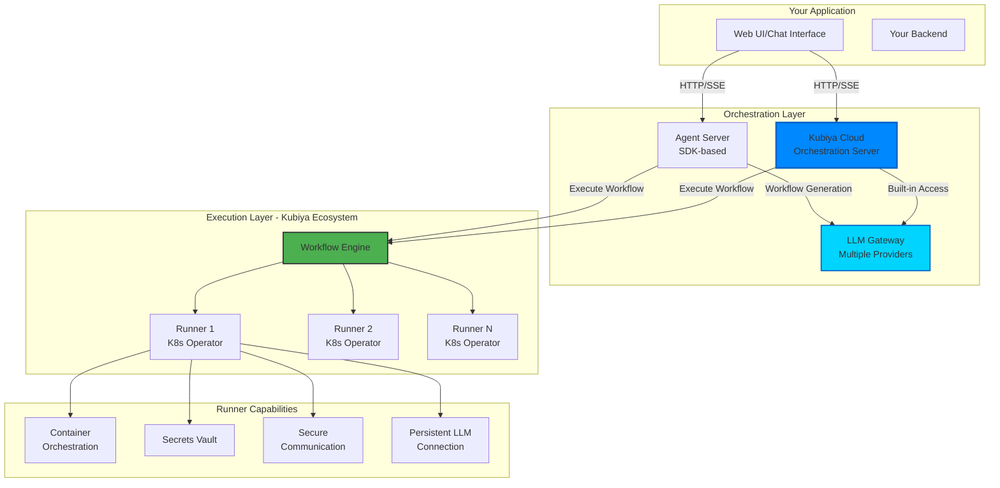
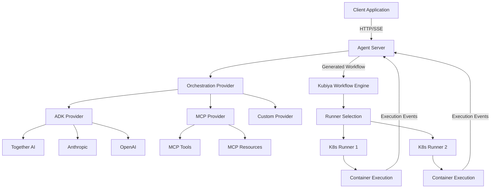

<Note>
  Agent Server APIs are provided by orchestration servers built with the Kubiya Workflow SDK. These servers expose agent capabilities for intelligent workflow generation, execution, and orchestration. This includes both your own self-hosted Agent Servers and Kubiya's built-in Cloud orchestration server.
</Note>

## Overview

Agent Servers are SDK-based servers that expose agent orchestration capabilities through REST APIs. They serve as the foundation for agent orchestration, leveraging various providers (ADK, MCP, etc.) for intelligent workflow generation and execution.

### Types of Agent Servers

#### 1. Self-Hosted Agent Servers
SDK-based servers you deploy and manage:
- Built with Kubiya Workflow SDK
- Deployed on your infrastructure
- Custom provider configurations (ADK, MCP, etc.)
- Full control over models and capabilities

#### 2. Kubiya Cloud Orchestration Server
Kubiya's managed orchestration server:
- **Built-in LLM Gateway**: Access to multiple model providers (OpenAI, Anthropic, Together AI, Google, etc.)
- **Managed Infrastructure**: Fully managed by Kubiya with high availability
- **Multi-Model Support**: Automatically chooses optimal models for different orchestration tasks
- **Enterprise Features**: Advanced security, compliance, and monitoring
- **Seamless Integration**: Direct integration with Kubiya Platform APIs

<Callout type="info">
  Kubiya Cloud orchestration server is plugged into Kubiya's LLM gateway, allowing you to use multiple types of models for various tasks as part of your orchestration and workflow generation without managing API keys or infrastructure.
</Callout>

## Orchestration Server Responsibilities

Orchestration servers handle two primary responsibilities:

### 1. Streaming to UIs
- **Real-time Updates**: Server-Sent Events (SSE) for live workflow generation and execution
- **Multiple Formats**: Support for Vercel AI SDK, raw SSE, and custom formats
- **UI Integration**: Seamless integration with web applications and chat interfaces
- **Progress Tracking**: Granular progress updates during workflow generation and execution

### 2. LLM Inferencing
- **Provider Management**: Interface with multiple LLM providers (OpenAI, Anthropic, Together AI, etc.)
- **Model Selection**: Intelligent model selection based on task requirements
- **Context Management**: Maintain conversation context and workflow state
- **Prompt Engineering**: Optimized prompts for workflow generation and refinement

## Workflow Execution on Runners

**Important**: While orchestration servers generate and manage workflows, the actual workflow execution happens on **Runners** - not on the orchestration servers themselves.

### The Kubiya Ecosystem



### Runners: The Execution Foundation

Runners are **Kubernetes operators** that form the core of workflow execution in the Kubiya ecosystem:

#### Core Capabilities
- **Container Orchestration**: Execute workflow steps as isolated Kubernetes pods
- **Secrets Vault**: Secure credential management and injection
- **Secure Communication**: Encrypted connection to Kubiya workflow engine
- **Persistent LLM Connection**: Maintained connection to LLM providers for real-time inferencing

#### Deployment & Security
- **K8s Operator**: Deployed on any Kubernetes cluster (your infrastructure or cloud)
- **Network Isolation**: Workflows run in isolated environments within your cluster
- **Resource Management**: CPU, memory, and GPU allocation per workflow step
- **Compliance**: Meet regulatory requirements by keeping execution in your environment

#### Workflow Engine Integration
- **Queue Management**: Receives workflows from orchestration servers
- **State Management**: Tracks execution progress and maintains state
- **Event Streaming**: Real-time execution updates back to orchestration servers
- **Error Handling**: Automatic retries and failure recovery

<Note>
  This separation of concerns ensures that orchestration servers focus on AI-powered workflow generation while Runners handle secure, scalable execution within your infrastructure.
</Note>

## Key Features

<CardGroup cols={2}>
  <Card title="Intelligent Composition" icon="brain">
    AI-powered workflow generation from natural language descriptions using multiple LLM providers
  </Card>
  <Card title="Multi-Provider Support" icon="puzzle-piece">
    Support for ADK, MCP, and custom orchestration providers with flexible model selection
  </Card>
  <Card title="Real-time Streaming" icon="stream">
    Server-Sent Events (SSE) for real-time workflow generation and execution monitoring
  </Card>
  <Card title="Discovery Protocol" icon="magnifying-glass">
    Automatic capability discovery and server health monitoring
  </Card>
  <Card title="Secure Execution" icon="shield">
    Workflows execute on isolated Runners with enterprise-grade security
  </Card>
  <Card title="LLM Gateway Access" icon="network-wired">
    Built-in access to multiple model providers through Kubiya's managed gateway
  </Card>
</CardGroup>

## Architecture

Agent Servers act as the orchestration layer that:

1. **Receives** natural language requests for workflow automation
2. **Processes** them using AI providers (ADK, MCP, etc.)
3. **Generates** structured workflows with validation and refinement
4. **Submits** workflows to the Kubiya workflow engine for execution
5. **Streams** real-time progress updates from Runner execution
6. **Manages** multiple execution modes (plan, act) and output formats



## Core API Endpoints

| Endpoint | Purpose | Description |
|----------|---------|-------------|
| `/discover` | Server Discovery | Get server capabilities, models, and health status |
| `/compose` | Intelligent Composition | Generate and optionally execute workflows from natural language |
| `/health` | Health Check | Monitor server status and availability |
| `/providers` | Provider Info | List available orchestration providers |

## Server Discovery

Agent Servers implement a standardized discovery protocol that allows clients to:

- **Auto-detect** server capabilities and supported features
- **Discover** available AI models and providers
- **Monitor** server health and status
- **Configure** client applications dynamically

Example discovery response:

```json
{
  "server": {
    "id": "kubiya-cloud",
    "name": "Kubiya Cloud Orchestration Server",
    "provider": "kubiya-cloud",
    "capabilities": {
      "streaming": true,
      "modes": ["plan", "act"],
      "orchestration": true,
      "generation": true,
      "llm_gateway": true,
      "managed_infrastructure": true
    },
    "features": {
      "workflowGeneration": true,
      "workflowExecution": true,
      "multiModelSupport": true,
      "enterpriseSecurity": true,
      "managedRunners": true
    }
  },
  "models": [
    {
      "id": "gpt-4o",
      "name": "GPT-4 Optimized",
      "provider": "openai",
      "capabilities": ["generation", "reasoning", "code"]
    },
    {
      "id": "claude-3-5-sonnet-latest",
      "name": "Claude 3.5 Sonnet",
      "provider": "anthropic",
      "capabilities": ["generation", "reasoning", "analysis"]
    },
    {
      "id": "meta-llama/Meta-Llama-3.1-70B-Instruct-Turbo",
      "name": "Llama 3.1 70B Instruct Turbo",
      "provider": "together",
      "capabilities": ["generation", "code", "fast-inference"]
    }
  ],
  "runners": [
    {
      "id": "kubiya-hosted",
      "name": "Kubiya Managed Runners",
      "type": "managed",
      "available": true
    },
    {
      "id": "customer-k8s-prod",
      "name": "Customer Production Cluster",
      "type": "self-hosted",
      "available": true
    }
  ],
  "health": {
    "status": "healthy",
    "timestamp": "2024-01-15T10:30:00Z",
    "llm_gateway_status": "operational",
    "runner_connectivity": "established"
  }
}
```

## Execution Modes

Agent Servers support multiple execution modes:

### Plan Mode
- **Purpose**: Generate workflow without execution
- **Output**: Structured workflow definition
- **Use Case**: Preview, validation, or manual execution

### Act Mode  
- **Purpose**: Generate and immediately execute workflow
- **Output**: Real-time execution progress and results from Runners
- **Use Case**: Automated task execution with monitoring

## Integration Patterns

### Frontend Applications
```typescript
// Discover and connect to agent servers
const serverResponse = await fetch('https://api.kubiya.ai/discover');
const capabilities = await serverResponse.json();

if (capabilities.server.capabilities.orchestration) {
  // This is an agent server - can handle complex workflows
  const workflowResponse = await fetch('https://api.kubiya.ai/compose', {
    method: 'POST',
    headers: {
      'Authorization': 'Bearer ' + kubiyaApiKey,
      'Content-Type': 'application/json'
    },
    body: JSON.stringify({
      message: "Deploy my application to staging",
      mode: "act",
      runner: "customer-k8s-prod"  // Specify target runner
    })
  });
}
```

### MCP Integration
```python
# Expose agent server capabilities through MCP
@mcp.tool()
def execute_complex_workflow(description: str, mode: str = "plan", runner: str = "kubiya-hosted"):
    """Execute a complex multi-step workflow on specified runner"""
    return agent_server.compose(
        task=description, 
        mode=mode,
        context={"preferred_runner": runner}
    )
```

## Authentication & Security

Agent Servers support various authentication methods:

- **Bearer Tokens**: Standard API key authentication
- **JWT Tokens**: For user context and permissions  
- **OAuth**: Integration with identity providers
- **Kubiya Platform Keys**: Direct integration with Kubiya Cloud

## LLM Gateway Benefits

When using Kubiya Cloud orchestration server, you get:

- **Model Diversity**: Access to models from OpenAI, Anthropic, Together AI, Google, and more
- **Automatic Optimization**: System selects optimal models for different task types
- **Cost Management**: Intelligent routing to cost-effective models when appropriate
- **Rate Limit Handling**: Built-in rate limiting and retry logic
- **API Key Management**: No need to manage individual provider API keys

## Next Steps

<CardGroup cols={2}>
  <Card title="Compose API" icon="wand-magic-sparkles" href="/api-reference/agent-servers/compose">
    Learn about intelligent workflow composition
  </Card>
  <Card title="Discovery API" icon="magnifying-glass" href="/api-reference/agent-servers/discovery">
    Implement server discovery in your applications
  </Card>
  <Card title="Runner Deployment" icon="kubernetes" href="/concepts/runners">
    Deploy Runners for workflow execution
  </Card>
  <Card title="Platform APIs" icon="cloud" href="/api-reference/platform/overview">
    Explore Kubiya Platform APIs
  </Card>
</CardGroup> 