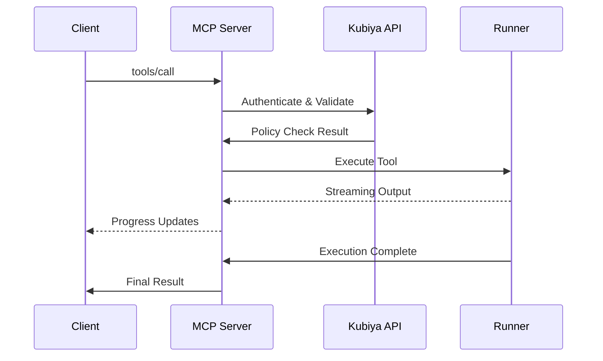

# MCP Protocol Implementation

Kubiya implements the Model Context Protocol (MCP) specification to enable seamless integration with AI assistants and tools.

## Protocol Version

Kubiya MCP server implements **MCP Protocol Version 2024-11-05**.

## Transport Layer

### Standard I/O Transport
The primary transport method uses standard input/output streams:

```bash
kubiya mcp serve
```

### Server Capabilities

The Kubiya MCP server advertises the following capabilities:

```json
{
  "capabilities": {
    "tools": {
      "listChanged": true
    },
    "resources": {
      "subscribe": true,
      "listChanged": true
    },
    "prompts": {
      "listChanged": true
    },
    "logging": {
      "level": "info"
    }
  },
  "protocolVersion": "2024-11-05",
  "serverInfo": {
    "name": "kubiya-mcp-server",
    "version": "1.0.0"
  }
}
```

## Message Types

### Initialize
Client initialization with server capability negotiation.

### Tools
- `tools/list`: List available tools
- `tools/call`: Execute specific tools

### Resources
- `resources/list`: List available resources
- `resources/read`: Read resource content
- `resources/subscribe`: Subscribe to resource changes

### Prompts
- `prompts/list`: List available prompt templates
- `prompts/get`: Retrieve specific prompts

## Tool Execution Flow



## Error Handling

### Standard Error Codes

| Code | Description |
|------|-------------|
| -32700 | Parse Error |
| -32600 | Invalid Request |
| -32601 | Method Not Found |
| -32602 | Invalid Parameters |
| -32603 | Internal Error |

### Kubiya-Specific Error Codes

| Code | Description |
|------|-------------|
| 1001 | Authentication Failed |
| 1002 | Policy Violation |
| 1003 | Runner Unavailable |
| 1004 | Tool Not Found |
| 1005 | Execution Timeout |

## Security Implementation

### Authentication
- API key validation on every request
- User context propagation to execution environment

### Authorization
- OPA policy evaluation before tool execution
- Runner-specific permission checks

### Audit Logging
- Complete request/response logging
- User attribution for all actions
- Execution telemetry and metrics

## Configuration

### Environment Variables

| Variable | Purpose | Default |
|----------|---------|---------|
| `KUBIYA_API_KEY` | Authentication | Required |
| `KUBIYA_API_URL` | API endpoint | `https://api.kubiya.ai` |
| `KUBIYA_MCP_LOG_LEVEL` | Logging verbosity | `info` |
| `KUBIYA_MCP_TIMEOUT` | Request timeout | `300s` |

### Server Options

```bash
# Basic server
kubiya mcp serve

# With debug logging
kubiya mcp serve --log-level debug

# With custom configuration
kubiya mcp serve --config ~/.kubiya/mcp-config.json
```

## Client Integration Examples

### Python Client

```python
import asyncio
from mcp import ClientSession, StdioServerParameters
from mcp.client.stdio import StdioServerTransport

async def connect_to_kubiya():
    server_params = StdioServerParameters(
        command="kubiya",
        args=["mcp", "serve"],
        env={"KUBIYA_API_KEY": "kb-your-key"}
    )
    
    async with StdioServerTransport(server_params) as (read, write):
        async with ClientSession(read, write) as session:
            await session.initialize()
            
            # List tools
            tools_result = await session.list_tools()
            print(f"Available tools: {len(tools_result.tools)}")
            
            # Execute tool
            result = await session.call_tool(
                "execute_tool",
                {"tool_name": "echo", "args": {"message": "Hello"}}
            )
            print(result.content)
```

### TypeScript Client

```typescript
import { Client } from "@modelcontextprotocol/sdk/client/index.js";
import { StdioClientTransport } from "@modelcontextprotocol/sdk/client/stdio.js";

async function connectToKubiya() {
  const transport = new StdioClientTransport({
    command: "kubiya",
    args: ["mcp", "serve"],
    env: { KUBIYA_API_KEY: "kb-your-key" }
  });

  const client = new Client({
    name: "kubiya-client",
    version: "1.0.0"
  }, {
    capabilities: {
      tools: {}
    }
  });

  await client.connect(transport);
  
  // List and call tools
  const tools = await client.listTools();
  console.log(`Available tools: ${tools.tools.length}`);
}
```

## Performance Considerations

### Connection Pooling
- MCP server maintains persistent connections
- Automatic reconnection on network failures

### Streaming Support
- Real-time output streaming for long-running tools
- Progress updates during workflow execution

### Caching
- Tool definitions cached for performance
- Runner health status cached for 30 seconds

## Monitoring and Observability

### Metrics
- Request count and latency
- Tool execution success/failure rates
- Runner utilization statistics

### Logging
- Structured JSON logging
- Correlation IDs for request tracing
- Performance metrics collection

### Health Checks
- Server health endpoint
- Dependency health monitoring
- Graceful degradation on failures