# Agent Frameworks vs Kubiya: On Rails to Production

Traditional agent frameworks like LangChain, CrewAI, and AutoGPT promise autonomous AI systems. But in production, they often create more problems than they solve. Kubiya takes a fundamentally different approach: **deterministic workflows with AI assistance**, not autonomous agents running wild.

## The Problem with Agent Frameworks

### Complex Agent Architectures

```mermaid
graph TD
    subgraph "Traditional Agent Frameworks"
        subgraph "LangChain/CrewAI/AutoGPT"
            A1[Complex Agent Logic]
            A2[State Management]
            A3[Chain of Thought]
            A4[Memory Systems]
            A5[Tool Calling]
            
            A1 --> A2
            A2 --> A3
            A3 --> A4
            A4 --> A5
        end
    end
    
    subgraph "Kubiya Approach"
        subgraph "Simple Workflow + AI"
            K1[Natural Language Input]
            K2[ADK Generates Workflow]
            K3[Deterministic DAG]
            K4[Container Execution]
            K5[Predictable Results]
            
            K1 --> K2
            K2 --> K3
            K3 --> K4
            K4 --> K5
        end
    end
    
    subgraph "Key Differences"
        D1[❌ Complex Agent Chains<br/>✅ Simple Workflows]
        D2[❌ Unpredictable Paths<br/>✅ Deterministic Execution]
        D3[❌ Memory/State Issues<br/>✅ Stateless Containers]
        D4[❌ Debug Nightmares<br/>✅ Clear Execution Trail]
    end
    
    style A1 fill:#FFB74D,stroke:#333,stroke-width:2px
    style A3 fill:#FF7043,stroke:#333,stroke-width:2px
    style K1 fill:#9C27B0,stroke:#333,stroke-width:2px,color:#fff
    style K3 fill:#4CAF50,stroke:#333,stroke-width:2px
    style K5 fill:#2196F3,stroke:#333,stroke-width:2px
```



## Framework Comparison

### LangChain: Complexity Overload

<Tabs>
  <Tab title="LangChain Approach">
    ```python
    from langchain.agents import AgentExecutor, create_react_agent
    from langchain.memory import ConversationBufferMemory
    from langchain.tools import Tool
    from langchain.chains import LLMChain
    
    # Complex setup with multiple abstractions
    memory = ConversationBufferMemory()
    
    tools = [
        Tool(
            name="Database Query",
            func=lambda x: db_query(x),
            description="Query the database"
        ),
        Tool(
            name="API Call",
            func=lambda x: api_call(x),
            description="Make API calls"
        )
    ]
    
    # Agent with unpredictable execution paths
    agent = create_react_agent(
        llm=llm,
        tools=tools,
        prompt=prompt,
        memory=memory
    )
    
    # Hope for the best...
    result = agent.run("Deploy my application")
    # What actually happened? Good luck debugging!
    ```
  </Tab>
  
  <Tab title="Kubiya Approach">
    ```python
    from kubiya_workflow_sdk import KubiyaWorkflow
    
    # Simple, deterministic workflow generation
    workflow = KubiyaWorkflow.from_prompt(
        "Deploy my application",
        runner="kubiya-hosted"
    )
    
    # See exactly what will happen
    print(workflow.to_yaml())
    
    # Execute with confidence
    result = workflow.execute()
    # Full visibility into every step
    ```
  </Tab>
</Tabs>

### CrewAI: Multi-Agent Chaos

```mermaid
graph TD
    subgraph "CrewAI Multi-Agent System"
        M[Manager Agent]
        R[Researcher Agent]
        D[Developer Agent]
        T[Tester Agent]
        
        M -.->|"Delegates<br/>(hopefully)"| R
        M -.->|"Assigns<br/>(maybe)"| D
        M -.->|"Coordinates<br/>(sometimes)"| T
        
        R -.->|"Shares findings<br/>(or forgets)"| D
        D -.->|"Passes code<br/>(with bugs?)"| T
        T -.->|"Reports back<br/>(eventually)"| M
    end
    
    subgraph "Problems"
        P1[🔴 Agents might loop infinitely]
        P2[🔴 State gets corrupted]
        P3[🔴 No rollback mechanism]
        P4[🔴 Debugging = nightmare]
    end
    
    style M fill:#FF5252,stroke:#333,stroke-width:2px
    style P1 fill:#D32F2F,color:#fff
    style P2 fill:#D32F2F,color:#fff
    style P3 fill:#D32F2F,color:#fff
    style P4 fill:#D32F2F,color:#fff
```



**CrewAI Issues:**
- Agents can get stuck in communication loops
- No guarantees on execution order
- State synchronization problems
- Difficult to reproduce issues

**Kubiya Solution:**
```python
# Instead of complex multi-agent systems...
workflow = (
    workflow("deployment-pipeline")
    .step("research", "analyze requirements")
    .step("develop", "implement solution")
    .step("test", "run tests")
    .step("deploy", "deploy to production")
)

# Clear, sequential, debuggable
```

### AutoGPT: The Autonomous Nightmare

<Warning>
  **AutoGPT in Production**: "It ran for 3 hours, made 127 API calls, modified 42 files, and crashed. Good luck figuring out what happened."

```mermaid
graph TD
    subgraph "AutoGPT Execution"
        START[Goal: Deploy App]
        
        A1[🤖 Think...]
        A2[🤖 Browse web...]
        A3[🤖 Write code...]
        A4[🤖 Run commands...]
        A5[🤖 Loop back...]
        
        START --> A1
        A1 --> A2
        A2 --> A3
        A3 --> A4
        A4 --> A5
        A5 --> A1
        
        A4 -.->|"Oops!"| ERR[💥 Error State]
        ERR -.->|"Now what?"| LOST[🌀 Lost Context]
    end
    
    style START fill:#4CAF50,stroke:#333,stroke-width:2px
    style ERR fill:#F44336,stroke:#333,stroke-width:2px,color:#fff
    style LOST fill:#FF5722,stroke:#333,stroke-width:2px,color:#fff
```

</Warning>



## Why Kubiya is Different

### 1. **Deterministic by Design**

<ComparisonTable>
  <Row>
    <Cell>Feature</Cell>
    <Cell>Agent Frameworks</Cell>
    <Cell>Kubiya</Cell>
  </Row>
  <Row>
    <Cell>Execution Path</Cell>
    <Cell>❌ Non-deterministic, varies each run</Cell>
    <Cell>✅ Same input → Same workflow → Same result</Cell>
  </Row>
  <Row>
    <Cell>Debugging</Cell>
    <Cell>❌ Trace through agent decisions</Cell>
    <Cell>✅ Clear step-by-step execution log</Cell>
  </Row>
  <Row>
    <Cell>State Management</Cell>
    <Cell>❌ Complex memory systems</Cell>
    <Cell>✅ Stateless container execution</Cell>
  </Row>
  <Row>
    <Cell>Error Recovery</Cell>
    <Cell>❌ Agent might loop or give up</Cell>
    <Cell>✅ Explicit retry and error handling</Cell>
  </Row>
  <Row>
    <Cell>Production Ready</Cell>
    <Cell>❌ Experimental, unstable</Cell>
    <Cell>✅ Battle-tested, reliable</Cell>
  </Row>
</ComparisonTable>

### 2. **AI Where It Matters**

```mermaid
graph LR
    subgraph "Agent Frameworks"
        AF1[AI Makes Decisions]
        AF2[AI Manages State]
        AF3[AI Controls Flow]
        AF4[AI Handles Errors]
        
        AF1 --> CHAOS[🌪️ Chaos]
        AF2 --> CHAOS
        AF3 --> CHAOS
        AF4 --> CHAOS
    end
    
    subgraph "Kubiya"
        K1[AI Generates Workflow]
        K2[Deterministic Execution]
        K3[Predictable Flow]
        K4[Structured Error Handling]
        
        K1 --> SUCCESS[✅ Success]
        K2 --> SUCCESS
        K3 --> SUCCESS
        K4 --> SUCCESS
    end
    
    style CHAOS fill:#FF5252,stroke:#333,stroke-width:3px,color:#fff
    style SUCCESS fill:#4CAF50,stroke:#333,stroke-width:3px,color:#fff
```



### 3. **Real Production Examples**

#### Incident Response: Agent Framework vs Kubiya

<Tabs>
  <Tab title="LangChain Incident Response">
    ```python
    # LangChain approach - unpredictable
    from langchain.agents import initialize_agent
    
    agent = initialize_agent(
        tools=[check_logs, restart_service, page_oncall],
        agent_type="zero-shot-react-description",
        verbose=True
    )
    
    # Agent might:
    # - Check logs 50 times in a loop
    # - Restart wrong service
    # - Page entire team at 3am
    # - Get stuck and do nothing
    
    agent.run("Service is down, fix it!")
    # 🙏 Pray it works...
    ```
  </Tab>
  
  <Tab title="Kubiya Incident Response">
    ```python
    # Kubiya approach - predictable and safe
    workflow = (
        workflow("incident-response")
        .step("detect")
        .inline_agent(
            message="Analyze incident: ${ALERT}",
            agent_name="incident-analyzer",
            runners=["kubiya-hosted"],
            tools=[{
                "name": "check-health",
                "type": "docker",
                "image": "alpine:latest",
                "content": "curl health-check"
            }]
        )
        .output("ANALYSIS")
        
        # Deterministic response based on analysis
        .step("respond")
        .shell("""
        if [ "${ANALYSIS.severity}" = "critical" ]; then
            kubectl rollout restart deployment/app
        fi
        """)
        .preconditions({"condition": "${ANALYSIS.severity}", "expected": "re:(critical|high)"})
        
        # Controlled notification
        .step("notify")
        .shell("send-slack-notification.sh")
    )
    
    # Executes exactly as defined, every time
    ```
  </Tab>
</Tabs>

## How Kubiya Complements Agent Frameworks

### Use Agent Frameworks for Research & Development

Agent frameworks excel at:
- Exploratory data analysis
- Research and prototyping
- Creative content generation
- Open-ended problem solving

### Use Kubiya for Production

Kubiya excels at:
- Production automation
- Critical infrastructure tasks
- Repeatable processes
- Auditable operations

### Bridge Pattern: Prototype → Production


**Example Migration:**
```python
# 1. Prototype with LangChain
langchain_agent = create_agent(tools=[...])
result = langchain_agent.run("process customer data")

# 2. Understand what worked
# Agent used: fetch_data → transform → validate → store

# 3. Convert to Kubiya workflow
workflow = KubiyaWorkflow.from_prompt(
    """Create a workflow that:
    1. Fetches customer data from API
    2. Transforms using pandas
    3. Validates data quality
    4. Stores in PostgreSQL
    """,
    runner="kubiya-hosted"
)

# 4. Deploy with confidence
production_result = workflow.execute()
```

## The Bottom Line

<CardGroup cols={2}>
  <Card title="🎲 Agent Frameworks" icon="dice" color="#FF5252">
    **Good for:**
    - Research & experimentation
    - Creative exploration
    - Prototype development
    
    **Bad for:**
    - Production systems
    - Critical operations
    - Reproducible results
  </Card>
  
  <Card title="🚄 Kubiya Workflows" icon="train" color="#4CAF50">
    **Good for:**
    - Production automation
    - Mission-critical tasks
    - Auditable processes
    
    **Enables:**
    - Deterministic execution
    - Container isolation
    - Clear debugging
  </Card>
</CardGroup>

## Real User Testimonials

<Tabs>
  <Tab title="Before: LangChain">
    > "We spent 3 months building a LangChain system. It worked great in demos but failed spectacularly in production. Agents would get stuck in loops, make incorrect decisions, and we couldn't debug what went wrong."
    > 
    > — DevOps Lead, Fortune 500 Company
  </Tab>
  
  <Tab title="After: Kubiya">
    > "Switched to Kubiya and had reliable automation running in 2 days. Every execution is predictable, we can see exactly what happens, and our on-call incidents dropped by 80%."
    > 
    > — Same DevOps Lead, now sleeping peacefully
  </Tab>
</Tabs>

## Migration Guide

### From LangChain to Kubiya

```python
# Instead of complex chains...
chain = LLMChain(llm=llm, prompt=prompt) | OutputParser() | Tool()

# Use simple workflows
workflow = KubiyaWorkflow.from_prompt("Your automation goal")
```

### From CrewAI to Kubiya

```python
# Instead of multi-agent crews...
crew = Crew(agents=[researcher, developer, tester])

# Use deterministic steps
workflow = (
    workflow("my-pipeline")
    .step("research", "gather requirements")
    .step("develop", "implement solution")
    .step("test", "validate results")
)
```

### From AutoGPT to Kubiya

```python
# Instead of autonomous agents...
auto_gpt.run_until_complete("achieve goal")

# Use controlled automation
workflow = KubiyaWorkflow.from_prompt(
    "Specific, bounded automation task",
    constraints=["no destructive operations", "max 10 steps"]
)
```

## Conclusion

Agent frameworks are powerful research tools, but **production needs predictability**. Kubiya gives you:

- 🚄 **On Rails Execution**: Deterministic paths, not agent wandering
- 🐳 **Container Isolation**: Each step in its own secure environment  
- 🔍 **Full Observability**: See exactly what happened and why
- 🤖 **AI Assistance**: Generate workflows with AI, execute with confidence
- 🏭 **Production Ready**: Battle-tested in enterprise environments

**The future isn't autonomous agents running wild—it's intelligent workflow generation with deterministic execution.**

<Card title="Start Your Migration Today" icon="rocket" href="/getting-started/quickstart">
  Move from agent chaos to workflow clarity with Kubiya
</Card> 