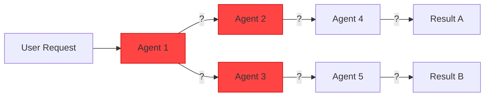
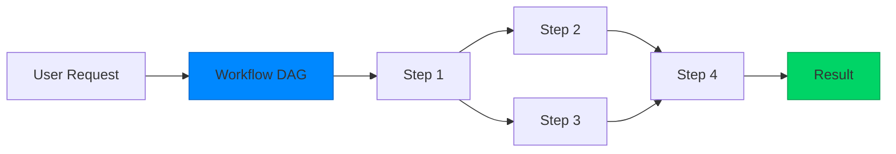

<Note>
  Unlike unpredictable agent-based systems, Kubiya workflows are **deterministic by design**. Same input → Same execution path → Same output, every time.
</Note>

## The Problem with Non-Deterministic Systems

### Traditional Agent Systems



**Problems:**
- 🎲 Different execution paths each time
- 🐛 Impossible to debug failures
- 📈 Errors compound through the chain
- ⏱️ Unpredictable execution time
- 🔍 No clear audit trail

### Kubiya's Deterministic Approach



**Benefits:**
- ✅ Same execution path every time
- ✅ Clear debugging with step-by-step logs
- ✅ Isolated failures don't cascade
- ✅ Predictable performance
- ✅ Complete audit trail

## What Makes Kubiya Deterministic?

### 1. DAG-Based Execution

Workflows are **Directed Acyclic Graphs (DAGs)**:

```python
workflow = (
    Workflow("deploy-app")
    .step("validate", "validate.sh")
    .step("build", "docker build -t app:latest .", depends_on=["validate"])
    .step("test", "pytest tests/", depends_on=["build"])
    .step("deploy", "kubectl apply -f k8s/", depends_on=["test"])
)
```

**Why DAGs?**
- No circular dependencies
- Clear execution order
- Parallelizable where possible
- Stateless between runs

### 2. Isolated Step Execution

Each step runs in an isolated container:

```yaml
# Step execution
apiVersion: batch/v1
kind: Job
metadata:
  name: workflow-${id}-step-${name}
spec:
  template:
    spec:
      containers:
      - name: step
        image: ${step.image}
        command: ${step.command}
        env: ${step.env}
      restartPolicy: Never
```

**Isolation Benefits:**
- No side effects between steps
- Clean environment each time
- Resource limits enforced
- Security boundaries maintained

### 3. Immutable Workflow Definitions

Once defined, workflows don't change during execution:

```python
# Workflow is compiled to immutable JSON
{
    "name": "deploy-app",
    "version": "1.0.0",
    "steps": [
        {
            "name": "validate",
            "command": "validate.sh",
            "hash": "abc123..."  # Content-addressed
        }
    ]
}
```

### 4. Explicit Dependencies

Dependencies are declared, not discovered:

```python
# Clear dependency graph
.step("fetch-data", "wget data.csv")
.step("process", "python process.py", depends_on=["fetch-data"])
.step("upload", "aws s3 cp output.csv s3://bucket/", depends_on=["process"])
```

## Comparison with Other Systems

| Feature | Kubiya | LangChain/Agents | Traditional CI/CD | Step Functions |
|---------|---------|------------------|-------------------|----------------|
| **Deterministic** | ✅ Always | ❌ Varies | ✅ Yes | ✅ Yes |
| **Debuggable** | ✅ Step-by-step | ❌ Black box | ⚠️ Limited | ⚠️ Limited |
| **Scalable** | ✅ K8s native | ❌ Single process | ⚠️ Runner limits | ✅ AWS only |
| **Portable** | ✅ Any K8s | ❌ Python only | ❌ Platform specific | ❌ AWS only |
| **AI Integration** | ✅ Optional | ✅ Core | ❌ None | ❌ None |

## Determinism in Practice

### Example: Database Backup Workflow

```python
backup_workflow = (
    Workflow("db-backup")
    # Always executes in this order
    .step("check-space", "df -h /backup")
    .step("dump-db", "pg_dump -Fc mydb > backup.sql", depends_on=["check-space"])
    .step("compress", "gzip backup.sql", depends_on=["dump-db"])
    .step("upload", "aws s3 cp backup.sql.gz s3://backups/", depends_on=["compress"])
    .step("verify", "aws s3 ls s3://backups/backup.sql.gz", depends_on=["upload"])
    .step("cleanup", "rm backup.sql.gz", depends_on=["verify"])
)
```

**Guarantees:**
1. Space is always checked first
2. Database is only dumped if space available
3. Upload only happens after successful compression
4. Cleanup only after verification
5. Same execution order every time

### Handling Non-Deterministic Operations

Even with external services, maintain determinism:

```python
# Deterministic retry logic
.step("api-call", 
    command="curl https://api.example.com/data",
    retry=RetryPolicy(
        max_attempts=3,
        backoff="exponential",
        max_delay=60
    )
)
```

### AI Integration Without Chaos

When using AI providers, the workflow structure remains deterministic:

```python
# AI generates the workflow, but execution is deterministic
adk = get_provider("adk")
workflow = adk.generate_workflow("backup databases")

# The generated workflow is a fixed DAG
print(workflow)
# {
#   "name": "backup-databases",
#   "steps": [
#     {"name": "check-disk", "command": "df -h"},
#     {"name": "dump-postgres", "command": "pg_dump..."},
#     ...
#   ]
# }

# Execution is 100% predictable
client.execute_workflow(workflow)
```

## Benefits for Production

### 1. Reliable Deployments

```python
deploy_workflow = (
    Workflow("production-deploy")
    .step("run-tests", "pytest")
    .step("build", "docker build", depends_on=["run-tests"])
    .step("push", "docker push", depends_on=["build"])
    .step("deploy", "kubectl rollout", depends_on=["push"])
    .step("verify", "curl health-check", depends_on=["deploy"])
)

# This ALWAYS follows the same path
# No surprises in production
```

### 2. Debugging Failures

```bash
# When something fails, you know exactly where
$ kubiya logs workflow-123

Step: run-tests [SUCCESS] 2.3s
Step: build [SUCCESS] 45.2s
Step: push [FAILED] 12.1s
  Error: Registry timeout
  Retry 1/3...
```

### 3. Compliance and Auditing

```json
// Complete execution history
{
  "workflow": "financial-report",
  "execution_id": "exec-789",
  "steps": [
    {
      "name": "fetch-transactions",
      "started": "2024-01-15T10:00:00Z",
      "completed": "2024-01-15T10:00:45Z",
      "status": "success",
      "output_hash": "sha256:abc..."
    }
  ]
}
```

## Best Practices for Deterministic Workflows

<AccordionGroup>
  <Accordion title="Use Explicit Dependencies" icon="diagram-project">
    ```python
    # Good: Clear dependencies
    .step("download", "wget file.zip")
    .step("extract", "unzip file.zip", depends_on=["download"])
    
    # Bad: Implicit ordering
    .step("download", "wget file.zip")
    .step("extract", "unzip file.zip")  # Might run in parallel!
    ```
  </Accordion>
  
  <Accordion title="Make Steps Idempotent" icon="arrows-rotate">
    ```python
    # Good: Can run multiple times safely
    .step("create-table", """
        psql -c "CREATE TABLE IF NOT EXISTS users (id INT PRIMARY KEY)"
    """)
    
    # Bad: Fails on second run
    .step("create-table", """
        psql -c "CREATE TABLE users (id INT PRIMARY KEY)"
    """)
    ```
  </Accordion>
  
  <Accordion title="Handle External Variability" icon="cloud">
    ```python
    # Good: Explicit handling of variable data
    .step("get-timestamp", "date +%s > timestamp.txt")
    .step("use-timestamp", "export TS=$(cat timestamp.txt); process.sh $TS")
    
    # Bad: Non-deterministic inline
    .step("process", "process.sh $(date +%s)")
    ```
  </Accordion>
  
  <Accordion title="Version Everything" icon="code-branch">
    ```python
    # Good: Pinned versions
    .step("install", image="python:3.11.7", command="pip install pandas==2.1.4")
    
    # Bad: Floating versions
    .step("install", image="python:latest", command="pip install pandas")
    ```
  </Accordion>
</AccordionGroup>

## The Bottom Line

<CardGroup cols={2}>
  <Card title="Predictable" icon="route">
    Same workflow, same execution, every time
  </Card>
  <Card title="Debuggable" icon="bug">
    Clear visibility into every step
  </Card>
  <Card title="Auditable" icon="clipboard-check">
    Complete execution history
  </Card>
  <Card title="Scalable" icon="chart-line">
    Determinism enables parallelization
  </Card>
</CardGroup>

## What's Next?

<CardGroup cols={2}>
  <Card title="Workflow DSL" icon="code" href="/concepts/workflow-dsl">
    Learn the workflow definition language
  </Card>
  <Card title="Execution Model" icon="play" href="/concepts/execution-model">
    Understand how workflows execute
  </Card>
  <Card title="Platform Architecture" icon="building" href="/concepts/platform-overview">
    See the complete platform design
  </Card>
  <Card title="Getting Started" icon="rocket" href="/getting-started/quickstart">
    Build your first deterministic workflow
  </Card>
</CardGroup> 