# Kubiya Platform Overview

Kubiya is the **first LLM-native automation platform** that runs **entirely on your infrastructure**. Unlike traditional automation platforms, Kubiya is designed from the ground up for AI agents with **Serverless Container Tools**, **LLM-Friendly DAG Workflows**, and **Zero-Trust Security** - all executing in your own environment.

## 🎯 What Makes Kubiya Unique

<CardGroup cols={2}>
  <Card title="🧠 LLM-Native Design" icon="brain">
    **Built for AI agents** - Every tool and workflow is designed to be easily understood and executed by LLMs
  </Card>
  
  <Card title="🏠 Your Infrastructure" icon="home">
    **Runs on your infra** - Complete control and security with self-hosted runners in your own environment
  </Card>
  
  <Card title="📊 LLM-Friendly DAG Workflows" icon="project-diagram">
    **Visual workflows** that LLMs can understand, modify, and execute with natural language descriptions
  </Card>
  
  <Card title="🛠️ True Serverless Tools" icon="container">
    **Container-native tools** that scale to zero, start instantly, and run any language or framework
  </Card>
</CardGroup>

## 🏗️ LLM-Native Architecture

```mermaid
graph TB
    subgraph "🧠 AI Layer"
        LLM["🤖 LLM/AI Assistant<br/>Claude, ChatGPT, Custom"]
        MCP["🔌 MCP Server<br/>Zero Dependencies"]
        CLI["⚡ Kubiya CLI<br/>Single Binary"]
    end
    
    subgraph "☁️ Kubiya Control Plane"
        API["🌐 API Gateway<br/>Stateless & Scalable"]
        Auth["🔐 Authentication<br/>OIDC/SAML/API Keys"]
        Policies["🛡️ OPA Policy Engine<br/>Pre-execution Validation"]
        Orchestrator["🎭 Workflow Orchestrator<br/>LLM-Friendly DAGs"]
        KB["📚 Knowledge Base<br/>Semantic Search"]
    end
    
    subgraph "🏠 Your Infrastructure (Self-Hosted)"
        direction TB
        subgraph "🏃 Execution Runners"
            K8sRunner["⚙️ Kubernetes Runner<br/>Auto-scaling Pods"]
            DockerRunner["🐳 Docker Runner<br/>Local Containers"]
            VMRunner["💻 VM Runner<br/>Direct Execution"]
        end
        
        subgraph "🛠️ Serverless Tools"
            PyTool["🐍 Python Tools<br/>pandas, numpy, ML"]
            NodeTool["📦 Node.js Tools<br/>APIs, automation"]
            GoTool["⚡ Go Tools<br/>CLI, performance"]
            BashTool["💻 Bash Tools<br/>System operations"]
        end
        
        subgraph "🔗 Your Resources"
            K8S["⚙️ Kubernetes Clusters"]
            Cloud["☁️ AWS/Azure/GCP"]
            DB["🗄️ Databases"]
            APIs["🔌 Internal APIs"]
        end
    end
    
    %% Connections
    LLM -.->|"📡 MCP Protocol"| MCP
    MCP -.->|"🔐 Authenticated"| CLI
    CLI -->|"📊 Telemetry Only"| API
    API --> Auth
    Auth --> Policies
    Policies --> Orchestrator
    Orchestrator -.->|"📋 Task Assignment"| K8sRunner
    Orchestrator -.->|"📋 Task Assignment"| DockerRunner
    Orchestrator -.->|"📋 Task Assignment"| VMRunner
    
    K8sRunner --> PyTool
    K8sRunner --> NodeTool
    DockerRunner --> GoTool
    VMRunner --> BashTool
    
    PyTool --> K8S
    NodeTool --> Cloud
    GoTool --> DB
    BashTool --> APIs
    
    %% Styling
    classDef ai fill:#e1f5fe
    classDef control fill:#f3e5f5
    classDef infra fill:#e8f5e8
    classDef tools fill:#fff3e0
    
    class LLM,MCP,CLI ai
    class API,Auth,Policies,Orchestrator,KB control
    class K8sRunner,DockerRunner,VMRunner,K8S,Cloud,DB,APIs infra
    class PyTool,NodeTool,GoTool,BashTool tools
```



### 🔑 Key Architecture Principles

1. **🏠 Your Infrastructure First**: All execution happens in your environment
2. **🧠 LLM-Native**: Every component designed for AI agent interaction
3. **📊 Minimal Data Transfer**: Only metadata and telemetry leave your infrastructure
4. **🛡️ Zero-Trust Security**: Policy validation before any execution
5. **⚡ Serverless Execution**: Tools scale to zero when not in use

## 🎯 Core Capabilities

### 1. **🛠️ True Serverless Container Tools**

**What makes them special**: Unlike traditional serverless functions with cold starts and language limitations, Kubiya's serverless tools are **container-native** and **LLM-optimized**.

```mermaid
graph LR
    subgraph "🔥 Traditional Serverless (AWS Lambda, etc.)"
        direction TB
        CS["❄️ Cold Starts<br/>300ms-10s"]
        LL["🔒 Language Lock-in<br/>Python, Node.js only"]
        SM["📏 Size Limits<br/>250MB max"]
        TL["⏱️ Time Limits<br/>15min max"]
    end
    
    subgraph "⚡ Kubiya Serverless Tools"
        direction TB
        IS["🚀 Instant Start<br/>50-100ms"]
        AL["🌍 Any Language<br/>Python, Go, Rust, etc."]
        AS["📦 Any Size<br/>Full Docker images"]
        UT["⏳ Unlimited Time<br/>Long-running jobs"]
    end
    
    CS -.->|"vs"| IS
    LL -.->|"vs"| AL
    SM -.->|"vs"| AS
    TL -.->|"vs"| UT
```



**🎯 LLM-Optimized Features**:
- **📝 Natural Language Descriptions**: Each tool has LLM-friendly documentation
- **🔍 Semantic Discovery**: LLMs can find tools by describing what they need
- **⚡ Instant Scaling**: From 0 to 1000+ containers in seconds
- **🏠 Your Infrastructure**: Run on your Kubernetes, Docker, or VMs
- **📊 Live Streaming**: Real-time output for LLM feedback

**Example Tool Definition**:
```json
{
  "name": "analyze-logs",
  "description": "Analyze application logs for errors and patterns",
  "llm_prompt": "Use this tool when you need to investigate application issues, find error patterns, or analyze log data. It supports JSON, text, and structured logs.",
  "image": "python:3.11-slim",
  "packages": ["pandas", "numpy", "matplotlib"],
  "integrations": ["aws/s3", "elasticsearch"],
  "scaling": {
    "min_instances": 0,
    "max_instances": 100,
    "scale_to_zero_timeout": "5m"
  }
}
```

### 2. **📊 LLM-Friendly DAG Workflows**

**What makes them special**: Traditional workflows are code-heavy and hard for LLMs to understand. Kubiya workflows are **declarative**, **visual**, and **LLM-optimized**.

```mermaid
graph TD
    subgraph "🧠 LLM-Friendly Workflow"
        Start(["🚀 Start: Deploy App"])
        Check{"🔍 Environment Check<br/>Is staging healthy?"}
        Build["🔨 Build Container<br/>docker build -t app:v2.1"]
        Test["🧪 Run Tests<br/>pytest --cov=80%"]
        Deploy["🚀 Deploy to Staging<br/>kubectl apply -f staging/"]
        Validate{"✅ Health Check<br/>All endpoints responding?"}
        Promote["🎯 Promote to Production<br/>kubectl apply -f prod/"]
        Rollback["⏪ Rollback<br/>kubectl rollout undo"]
        Notify["📢 Notify Team<br/>Slack + Email"]
        End(["✅ Complete"])
        
        Start --> Check
        Check -->|"✅ Healthy"| Build
        Check -->|"❌ Unhealthy"| Notify
        Build --> Test
        Test -->|"✅ Pass"| Deploy
        Test -->|"❌ Fail"| Notify
        Deploy --> Validate
        Validate -->|"✅ Healthy"| Promote
        Validate -->|"❌ Unhealthy"| Rollback
        Promote --> Notify
        Rollback --> Notify
        Notify --> End
    end
    
    %% Styling
    classDef success fill:#e8f5e8
    classDef warning fill:#fff3e0
    classDef error fill:#ffebee
    classDef decision fill:#e3f2fd
    
    class Start,Build,Test,Deploy,Promote,End success
    class Notify warning
    class Rollback error
    class Check,Validate decision
```



**🧠 LLM-Optimized Features**:
- **📝 Natural Language Steps**: Each step has human-readable descriptions
- **🎯 Intent-Based**: Focus on "what" not "how"
- **🔍 Self-Documenting**: Workflows explain themselves to LLMs
- **🔄 Dynamic**: LLMs can modify workflows on-the-fly
- **📊 Visual**: Mermaid diagrams auto-generated for LLM understanding

**Example: LLM Creating a Workflow**
```python
# LLM Request: "Create a data pipeline that processes user events"
# Kubiya generates:

workflow = {
    "name": "user-events-pipeline",
    "description": "Process and analyze user events from multiple sources",
    "llm_summary": "This workflow extracts user events from Kafka, transforms them with pandas, validates data quality, and loads into data warehouse",
    "steps": [
        {
            "name": "extract-events",
            "description": "Extract user events from Kafka topics",
            "tool": "kafka-consumer",
            "args": {"topics": ["user-clicks", "user-views"]}
        },
        {
            "name": "transform-data",
            "description": "Clean and transform event data using pandas",
            "tool": "python-pandas",
            "depends_on": ["extract-events"]
        },
        {
            "name": "load-warehouse",
            "description": "Load processed data into Snowflake",
            "tool": "snowflake-loader",
            "depends_on": ["transform-data"]
        }
    ]
}
```

### 3. **🏠 Your Infrastructure Execution**

**Why this matters**: Most AI platforms send your data to their cloud. Kubiya keeps everything in your infrastructure for **security**, **compliance**, and **performance**.

```mermaid
graph TB
    subgraph "☁️ Traditional AI Platforms"
        YourData1["🏢 Your Data"]
        TheirCloud["☁️ Third-Party Cloud<br/>❌ Data leaves your network<br/>❌ Compliance risks<br/>❌ Vendor lock-in"]
        Processing["⚙️ Processing<br/>❌ No control<br/>❌ Limited resources"]
        
        YourData1 --> TheirCloud
        TheirCloud --> Processing
    end
    
    subgraph "🏠 Kubiya Architecture"
        YourData2["🏢 Your Data"]
        YourInfra["🏠 Your Infrastructure<br/>✅ Data stays local<br/>✅ Full compliance<br/>✅ No vendor lock-in"]
        YourProcessing["⚙️ Your Processing<br/>✅ Full control<br/>✅ Unlimited resources"]
        
        YourData2 --> YourInfra
        YourInfra --> YourProcessing
    end
    
    %% Styling
    classDef bad fill:#ffebee
    classDef good fill:#e8f5e8
    
    class TheirCloud,Processing bad
    class YourInfra,YourProcessing good
```



**🔒 Security & Compliance Benefits**:
- **🏠 Data Locality**: Your data never leaves your infrastructure
- **🛡️ Zero Trust**: Every action validated by your policies
- **📋 Compliance**: GDPR, SOC2 - your rules, your infrastructure
- **🔐 Air-Gapped**: Works completely offline if needed
- **👁️ Full Visibility**: Complete audit trails in your systems

**⚡ Performance Benefits**:
- **🚀 Low Latency**: Direct access to your resources
- **🔄 No API Limits**: Scale based on your infrastructure
- **💾 Data Efficiency**: No data transfer overhead
- **🎯 Resource Optimization**: Use your existing capacity

### 4. **🧠 LLM-Native Design Philosophy**

Everything in Kubiya is designed for AI agents to understand and use effectively:

```mermaid
mindmap
  root)🧠 LLM-Native Design(
    📝 Documentation
      Natural Language
      Examples Included
      Intent-Based
    🔍 Discovery
      Semantic Search
      Tag-Based
      Auto-Suggestions
    🎯 Execution
      Self-Describing
      Progress Updates
      Error Context
    🔄 Feedback
      Success Metrics
      Failure Analysis
      Improvement Hints
```



**📝 LLM-Friendly Documentation**:
- Every tool has natural language descriptions
- Use cases and examples included
- Common failure modes documented
- Alternative tool suggestions

**🔍 Intelligent Discovery**:
- LLMs can find tools by describing intent
- Semantic search across all capabilities
- Auto-suggest related tools and workflows
- Context-aware recommendations

## 🎯 Next Steps

<CardGroup cols={2}>
  <Card title="🚀 Quick Start" icon="rocket" href="/getting-started/quickstart">
    Get started in 5 minutes
  </Card>
  
  <Card title="🔧 MCP Integration" icon="plug" href="/mcp/overview">
    Connect your AI assistant
  </Card>
  
  <Card title="🛠️ Tool Development" icon="wrench" href="/concepts/workflows">
    Build your first tools
  </Card>
  
  <Card title="🏃 Runner Setup" icon="running" href="/concepts/runners">
    Deploy execution infrastructure
  </Card>
</CardGroup>

---

**Ready to build enterprise-grade AI applications?** Kubiya provides the production infrastructure, security, and scale you need to deploy AI automation that actually works in the real world.
