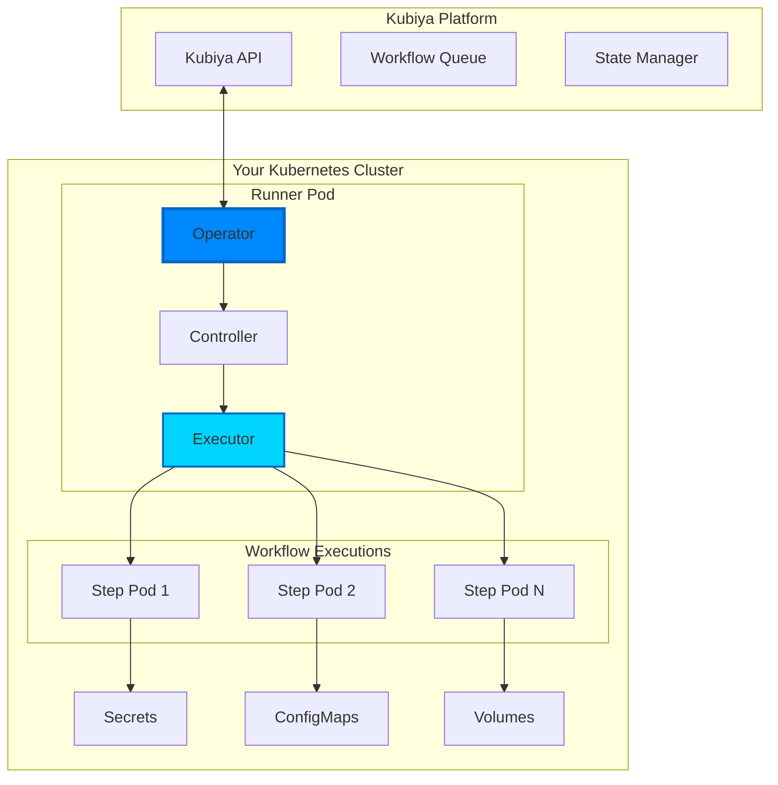
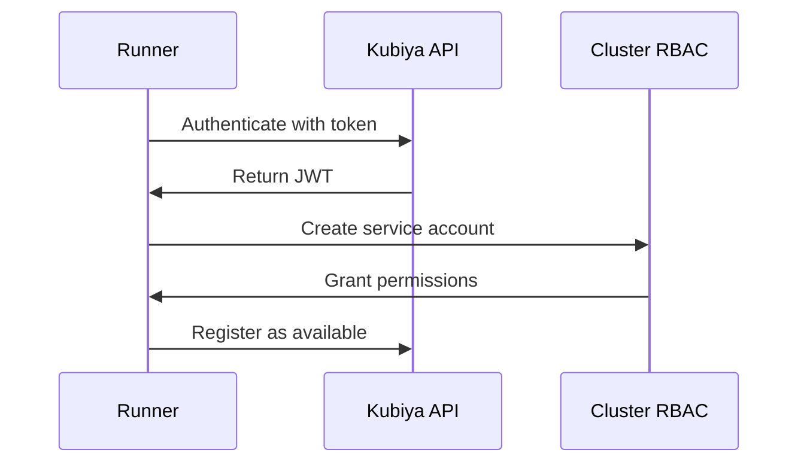
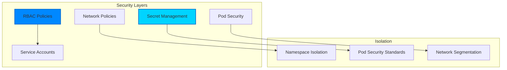

# Runners

Kubiya Runners are the execution engines that bring workflows to life. They are Kubernetes operators that orchestrate containers securely within your infrastructure, ensuring your data never leaves your environment while providing enterprise-grade workflow execution.

## What is a Runner?

A Kubiya Runner is:
- A **Kubernetes operator** that manages workflow execution
- Deployed in **your infrastructure** (K8s cluster)
- Connects to Kubiya platform for **workflow coordination**
- Executes workflow steps as **Kubernetes pods**
- Provides **secure isolation** between executions

## Runner Architecture



## Types of Runners

### Local Runners

Deploy runners in your own infrastructure for complete control:

- **Your Infrastructure**: Run in your Kubernetes cluster, VMs, or bare metal
- **Network Isolation**: Keep sensitive data within your network
- **Custom Configuration**: Tailor resources to your needs
- **Compliance**: Meet regulatory requirements

#### Deployment Options

1. **Helm Chart** (Recommended)
   ```bash
   helm repo add kubiya https://charts.kubiya.ai
   helm install my-runner kubiya/kubiya-runner \
     --namespace kubiya \
     --create-namespace
   ```
   
   See the [Helm Chart documentation](/deployment/helm-chart) for detailed configuration options.

2. **Kubernetes Manifest**
   - Create runner in Kubiya platform
   - Download generated manifest
   - Apply to your cluster

3. **Docker**
   - For development/testing only
   - Not recommended for production

<Note>
  Local runners require outbound HTTPS connectivity to Kubiya's control plane for management and coordination. Your data and workflows remain within your infrastructure.
</Note>

### Hosted Runners

Managed by Kubiya for quick starts:

<CardGroup cols={2}>
  <Card title="Zero Setup" icon="rocket">
    Start executing workflows immediately without any infrastructure setup
  </Card>
  <Card title="Managed Updates" icon="arrows-rotate">
    Automatic updates and maintenance handled by Kubiya
  </Card>
  <Card title="Elastic Scaling" icon="expand">
    Automatically scales based on workload without capacity planning
  </Card>
  <Card title="Development" icon="code">
    Perfect for development, testing, and proof-of-concepts
  </Card>
</CardGroup>

## How Runners Work

### 1. Connection & Authentication



The runner:
- Authenticates with Kubiya using a secure token
- Establishes a persistent connection
- Registers its capabilities and constraints
- Begins polling for assigned workflows

### 2. Workflow Execution

When a workflow is assigned:

```yaml
# Runner creates pods like this for each step
apiVersion: v1
kind: Pod
metadata:
  name: workflow-${id}-step-${name}
  labels:
    kubiya.ai/workflow: ${workflow_id}
    kubiya.ai/step: ${step_name}
    kubiya.ai/runner: ${runner_name}
spec:
  containers:
  - name: step
    image: ${step.image}
    command: ${step.command}
    env: ${step.env}
    resources:
      requests:
        memory: ${step.resources.memory}
        cpu: ${step.resources.cpu}
  restartPolicy: Never
  serviceAccountName: kubiya-workflow
```

### 3. Resource Management

Runners manage:
- **Pod lifecycle**: Creation, monitoring, cleanup
- **Resource limits**: CPU, memory, GPU allocation
- **Storage**: Volume mounts and persistent data
- **Networking**: Service discovery and policies
- **Secrets**: Secure injection of credentials

### 4. Security Model



## Deployment Options

### Helm Chart Installation

The recommended way to deploy runners:

```bash
# Add Kubiya Helm repository
helm repo add kubiya https://charts.kubiya.ai
helm repo update

# Install runner
helm install kubiya-runner kubiya/runner \
  --namespace kubiya \
  --create-namespace \
  --set runner.token=${RUNNER_TOKEN} \
  --set runner.name=production-runner
```

### Configuration Options

```yaml
# values.yaml
runner:
  # Runner identification
  name: production-runner
  token: ${RUNNER_TOKEN}
  
  # Resource allocation
  resources:
    requests:
      memory: "256Mi"
      cpu: "100m"
    limits:
      memory: "1Gi"
      cpu: "500m"
  
  # Workflow execution
  workflow:
    namespace: kubiya-workflows
    serviceAccount: kubiya-executor
    defaultTimeout: 30m
    maxConcurrent: 10
  
  # Security
  security:
    podSecurityStandard: restricted
    allowPrivileged: false
    runAsNonRoot: true
  
  # Networking
  network:
    dnsPolicy: ClusterFirst
    enableServiceLinks: false
  
  # Storage
  storage:
    workspaceSize: 10Gi
    storageClass: fast-ssd
```

### kubectl Installation

For quick testing:

```bash
# Create namespace
kubectl create namespace kubiya

# Create secret with token
kubectl create secret generic kubiya-runner-token \
  --from-literal=token=${RUNNER_TOKEN} \
  -n kubiya

# Apply runner manifest
kubectl apply -f https://get.kubiya.ai/runner.yaml
```

## Runner Capabilities

### Container Orchestration

Runners can orchestrate any container:

```python
# Python containers
step.analyze(
    image="python:3.11-slim",
    command=["python", "analyze.py"]
)

# Node.js applications
step.build(
    image="node:18-alpine",
    command=["npm", "run", "build"]
)

# Custom tools
step.security_scan(
    image="aquasec/trivy:latest",
    command=["trivy", "image", "myapp:latest"]
)

# Cloud CLIs
step.deploy(
    image="amazon/aws-cli:latest",
    command=["aws", "ecs", "update-service"]
)
```

### Advanced Features

#### 1. Sidecar Containers

Run multiple containers in a step:

```python
step.database_migration(
    image="migrate:latest",
    sidecars=[
        {
            "name": "postgres",
            "image": "postgres:15",
            "env": {"POSTGRES_PASSWORD": "temp"}
        }
    ]
)
```

#### 2. Init Containers

Prepare environment before main container:

```python
step.process(
    image="processor:latest",
    init_containers=[
        {
            "name": "download-data",
            "image": "aws-cli:latest",
            "command": ["aws", "s3", "sync", "s3://data", "/data"]
        }
    ]
)
```

#### 3. Volume Management

Share data between steps:

```python
# Create volume
volume = workflow.create_volume("shared-data", size="5Gi")

# Write data
step.generate(
    image="generator:latest",
    volumes=[{"name": "data", "mount": "/output", "volume": volume}]
)

# Read data
step.process(
    image="processor:latest",
    volumes=[{"name": "data", "mount": "/input", "volume": volume}]
)
```

## Monitoring & Observability

### Runner Metrics

Exposed via Prometheus:

```prometheus
# Runner health
kubiya_runner_up{runner="production"} 1

# Workflow execution
kubiya_workflows_running{runner="production"} 5
kubiya_workflows_completed{runner="production",status="success"} 142
kubiya_workflows_completed{runner="production",status="failed"} 3

# Resource usage
kubiya_runner_cpu_usage{runner="production"} 0.45
kubiya_runner_memory_usage{runner="production"} 0.72

# Step execution times
kubiya_step_duration_seconds{step="build",percentile="p99"} 45.2
```

### Logging

Structured logging with context:

```json
{
  "timestamp": "2024-01-10T10:30:45Z",
  "level": "info",
  "runner": "production-runner",
  "workflow_id": "wf-123",
  "step_name": "deploy",
  "message": "Starting step execution",
  "image": "kubectl:latest",
  "namespace": "kubiya-workflows"
}
```

### Health Checks

Built-in health endpoints:

```bash
# Liveness probe
curl http://runner:8080/healthz

# Readiness probe
curl http://runner:8080/ready

# Metrics
curl http://runner:8080/metrics
```

## Security Best Practices

### 1. Network Isolation

```yaml
apiVersion: networking.k8s.io/v1
kind: NetworkPolicy
metadata:
  name: kubiya-runner-policy
spec:
  podSelector:
    matchLabels:
      app: kubiya-runner
  policyTypes:
  - Ingress
  - Egress
  ingress:
  - from:
    - namespaceSelector:
        matchLabels:
          name: kubiya
  egress:
  - to:
    - namespaceSelector:
        matchLabels:
          name: kubiya
  - to:
    - namespaceSelector: {}
    ports:
    - protocol: TCP
      port: 443  # HTTPS only
```

### 2. RBAC Configuration

```yaml
apiVersion: rbac.authorization.k8s.io/v1
kind: Role
metadata:
  name: kubiya-runner
rules:
- apiGroups: [""]
  resources: ["pods", "pods/log"]
  verbs: ["create", "get", "list", "watch", "delete"]
- apiGroups: [""]
  resources: ["configmaps", "secrets"]
  verbs: ["get", "list"]
- apiGroups: [""]
  resources: ["persistentvolumeclaims"]
  verbs: ["create", "get", "delete"]
```

### 3. Pod Security Standards

```yaml
apiVersion: v1
kind: Namespace
metadata:
  name: kubiya-workflows
  labels:
    pod-security.kubernetes.io/enforce: restricted
    pod-security.kubernetes.io/audit: restricted
    pod-security.kubernetes.io/warn: restricted
```

## Troubleshooting

### Common Issues

<AccordionGroup>
  <Accordion title="Runner not connecting" icon="plug">
    Check:
    - Runner token is valid
    - Network connectivity to Kubiya API
    - Firewall rules allow outbound HTTPS
    - DNS resolution works
    
    ```bash
    kubectl logs -n kubiya deployment/kubiya-runner
    ```
  </Accordion>
  
  <Accordion title="Workflows not executing" icon="pause">
    Verify:
    - Runner has sufficient permissions
    - Resource quotas not exceeded
    - Image pull secrets configured
    - Node resources available
    
    ```bash
    kubectl describe pod -n kubiya-workflows
    ```
  </Accordion>
  
  <Accordion title="Performance issues" icon="gauge">
    Investigate:
    - CPU/memory limits too low
    - Network latency
    - Image pull times
    - Node scheduling constraints
    
    ```bash
    kubectl top pods -n kubiya-workflows
    ```
  </Accordion>
</AccordionGroup>

## Next Steps

<CardGroup cols={2}>
  <Card title="Deploy a Runner" icon="rocket" href="/runners/kubernetes-operator">
    Step-by-step runner deployment
  </Card>
  <Card title="Security Guide" icon="shield" href="/runners/security">
    Secure your runner deployment
  </Card>
  <Card title="Local Development" icon="laptop" href="/runners/local-runners">
    Set up local runners
  </Card>
  <Card title="Monitoring" icon="chart-line" href="/deployment/production">
    Production monitoring setup
  </Card>
</CardGroup> 