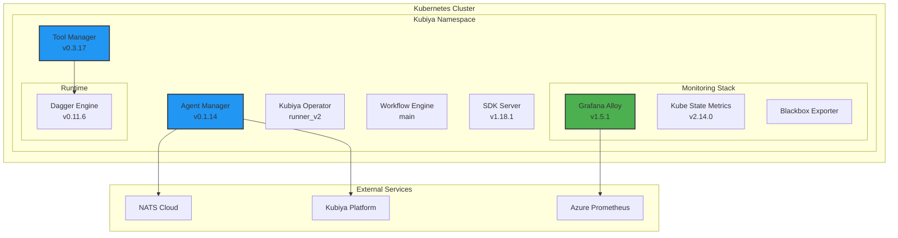

# Kubiya Runner Helm Chart

Deploy and manage Kubiya Runners in your Kubernetes cluster using the official Helm chart.

<Info>
  The kubiya-runner Helm chart is the recommended way to deploy runners in production environments. It provides a fully configured, scalable deployment with monitoring and security best practices.
</Info>

## Chart Information

- **Chart Name**: `kubiya-runner`
- **Repository**: `https://charts.kubiya.ai`
- **Current Version**: `0.6.84`
- **App Version**: `0.6.84`
- **Kubernetes Version**: `>=1.19.0-0`

## Quick Start

```bash
# Add Kubiya Helm repository
helm repo add kubiya https://charts.kubiya.ai
helm repo update

# Install the runner
helm install my-runner kubiya/kubiya-runner \
  --namespace kubiya \
  --create-namespace \
  --set organization="my-org" \
  --set uuid="your-runner-uuid" \
  --set nats.jwt="your-jwt-token"
```

## Prerequisites

- **Kubernetes**: 1.19+
- **Helm**: 3.0+
- **Resources**: 
  - Minimum 4 CPU cores
  - 8GB RAM
  - 50GB storage
- **Network**: Outbound HTTPS access
- **NATS Credentials**: JWT tokens from Kubiya platform
- **Registry Access**: Access to Kubiya container registry

## Architecture Overview



## Components

### Core Components

#### Agent Manager
- **Image**: `ghcr.io/kubiyabot/agent-manager:v0.1.14`
- **Purpose**: Manages Kubiya agents lifecycle
- **Key Features**:
  - Agent registration and discovery
  - Health monitoring
  - Automatic scaling
  - NATS communication

#### Tool Manager
- **Image**: `ghcr.io/kubiyabot/tool-manager:v0.3.17`
- **Purpose**: Executes tools and integrations
- **Key Features**:
  - Container-native tool execution
  - SDK server integration
  - Resource isolation
  - Multi-language support

#### Kubiya Operator
- **Image**: `ghcr.io/kubiyabot/kubiya-operator:runner_v2`
- **Purpose**: Manages operational aspects
- **Key Features**:
  - Configuration management
  - Secret rotation
  - Component orchestration

#### Workflow Engine
- **Image**: `ghcr.io/kubiyabot/workflow-engine:main`
- **Purpose**: Orchestrates workflow execution
- **Key Features**:
  - DAG execution
  - State management
  - Event streaming

### Monitoring Components

#### Grafana Alloy
- **Image**: `grafana/alloy:v1.5.1`
- **Purpose**: Metrics collection and forwarding
- **Features**:
  - Prometheus-compatible scraping
  - Azure Managed Prometheus integration
  - OTEL support
  - Data processing pipelines

#### Kube State Metrics
- **Image**: `registry.k8s.io/kube-state-metrics/kube-state-metrics:v2.14.0`
- **Purpose**: Kubernetes resource metrics
- **Scope**: Namespace-limited by default

## Configuration

### Minimum Required Values

Create a `values-override.yaml` file:

```yaml
# Required: Organization configuration
organization: "my-company"
uuid: "679adc53-7068-4454-aa9f-16df30b14a50"

# Required: NATS configuration
nats:
  jwt: "eyJ0eXAiOiJKV1QiLCJhbGc..."  # Primary JWT token
  secondJwt: "eyJ0eXAiOiJKV1QiLCJhbG..."  # Secondary JWT token
  subject: "kubiya.agents.my-company"
  serverUrl: "nats://connect.ngs.global"

# Required for monitoring: Azure Prometheus
alloy:
  alloy:
    extraEnv:
      - name: AZURE_REMOTE_WRITE_URL
        value: "https://your-prometheus.azureprometheus.io/api/v1/write"
      - name: AZURE_CLIENT_ID
        value: "your-client-id"
      - name: AZURE_CLIENT_SECRET
        value: "your-client-secret"
      - name: AZURE_TOKEN_URL
        value: "https://login.microsoftonline.com/your-tenant/oauth2/v2.0/token"

# Optional: Resource configuration
resources:
  agentManager:
    requests:
      cpu: "500m"
      memory: "1Gi"
    limits:
      cpu: "2"
      memory: "4Gi"
  toolManager:
    requests:
      cpu: "1"
      memory: "2Gi"
    limits:
      cpu: "4"
      memory: "8Gi"
```

### Advanced Configuration

#### Resource Management

```yaml
# Configure resources for each component
resources:
  agentManager:
    requests: {cpu: "500m", memory: "1Gi"}
    limits: {cpu: "2", memory: "4Gi"}
  
  toolManager:
    requests: {cpu: "1", memory: "2Gi"}
    limits: {cpu: "4", memory: "8Gi"}
  
  kubiyaOperator:
    requests: {cpu: "250m", memory: "512Mi"}
    limits: {cpu: "1", memory: "2Gi"}
  
  workflowEngine:
    requests: {cpu: "1", memory: "2Gi"}
    limits: {cpu: "4", memory: "8Gi"}
  
  alloy:
    requests: {cpu: "100m", memory: "128Mi"}
    limits: {cpu: "1", memory: "1Gi"}
```

#### Monitoring Configuration

```yaml
# Alloy scrape intervals
alloy:
  scrapeIntervals:
    default: "60s"
    runnerExporters: "60s"
    alloyExporter: "60s"
    blackboxExporter: "60s"
    kubeStateMetrics: "60s"
    cadvisor: "60s"  # Disabled by default

# Enable additional metrics
monitoring:
  enabled: true
  serviceMonitor:
    enabled: true
  dashboards:
    enabled: true
```

#### Security Configuration

```yaml
# RBAC configuration
rbac:
  create: true
  # Optional: Grant cluster-wide permissions
  adminClusterRole:
    create: false  # Set to true for full cluster access

# Pod Security
podSecurityContext:
  runAsNonRoot: true
  runAsUser: 1000
  fsGroup: 1000

# Network Policies
networkPolicy:
  enabled: true
  ingress:
    - from:
      - namespaceSelector:
          matchLabels:
            name: kubiya
```

#### Storage Configuration

```yaml
# Persistent storage for components
persistence:
  toolManager:
    enabled: true
    size: "50Gi"
    storageClass: "fast-ssd"
  
  workflowEngine:
    enabled: true
    size: "100Gi"
    storageClass: "standard"
```

## Installation

### Standard Installation

```bash
# Create namespace
kubectl create namespace kubiya

# Install with custom values
helm install my-runner kubiya/kubiya-runner \
  --namespace kubiya \
  --values values-override.yaml \
  --wait
```

### Production Installation

```bash
# Install with production settings
helm install prod-runner kubiya/kubiya-runner \
  --namespace kubiya \
  --values values-prod.yaml \
  --set image.pullPolicy=IfNotPresent \
  --set updateStrategy.type=RollingUpdate \
  --set nodeSelector."node\.kubernetes\.io/purpose"=kubiya \
  --timeout 10m \
  --wait
```

### Upgrade

```bash
# Upgrade existing installation
helm upgrade my-runner kubiya/kubiya-runner \
  --namespace kubiya \
  --values values-override.yaml \
  --wait
```

## Monitoring

### Health Monitoring

The chart includes comprehensive health monitoring:

1. **Cumulative Health Score**: Composite score from 5 signals
   - Tool Manager HTTP success rate
   - Agent Manager HTTP success rate
   - Pod ready status
   - Pod restart stability
   - Probe success rate

2. **Health Thresholds**:
   - **Healthy** (Green): 100%
   - **Warning** (Yellow): 99-99.9%
   - **Degraded** (Orange): 90-98.9%
   - **Down** (Red): 0-89.9%

### Grafana Dashboards

Pre-built dashboards included:

1. **All Runners Health State**: Overview of all runners
2. **Runner Components Health**: Component-level metrics
3. **Tool Manager Performance**: Request latency and throughput
4. **Agent Manager Metrics**: Agent lifecycle metrics
5. **Alloy Monitoring**: Metrics pipeline health

### Alerts

Default alerts configured:

```yaml
alerts:
  - name: RunnerHealthDegraded
    expr: 'runner_health_score < 90'
    for: 5m
    severity: warning
    
  - name: ComponentDown
    expr: 'up{job="kubiya-runner"} == 0'
    for: 2m
    severity: critical
```

## Security

### RBAC Permissions

The chart creates minimal RBAC permissions:

```yaml
# Default namespace-scoped permissions
- apiGroups: [""]
  resources: ["pods", "services", "configmaps", "secrets"]
  verbs: ["get", "list", "watch", "create", "update", "patch"]

# Optional cluster-wide permissions (disabled by default)
- apiGroups: [""]
  resources: ["persistentvolumeclaims"]
  verbs: ["*"]
```

### Network Security

- All components run as non-root
- Network policies restrict inter-pod communication
- TLS enabled for registry communication
- Secrets mounted as volumes (not environment variables)

## Troubleshooting

### Common Issues

<AccordionGroup>
  <Accordion title="Installation Fails">
    ```bash
    # Check prerequisites
    kubectl version --client
    helm version
    
    # Verify namespace exists
    kubectl get namespace kubiya
    
    # Check for existing installations
    helm list -n kubiya
    ```
  </Accordion>
  
  <Accordion title="Pods Not Starting">
    ```bash
    # Check pod status
    kubectl get pods -n kubiya
    
    # View pod events
    kubectl describe pod <pod-name> -n kubiya
    
    # Check logs
    kubectl logs -n kubiya <pod-name>
    ```
  </Accordion>
  
  <Accordion title="NATS Connection Issues">
    ```bash
    # Test NATS connectivity
    kubectl exec -n kubiya deploy/agent-manager -- \
      nats-cli --server=$NATS_URL --creds=/nats/creds sub ">"
    
    # Verify JWT token
    kubectl get secret -n kubiya shared-secrets -o yaml
    ```
  </Accordion>
  
  <Accordion title="Metrics Not Appearing">
    ```bash
    # Check Alloy status
    kubectl logs -n kubiya -l app.kubernetes.io/name=alloy
    
    # Verify scrape targets
    kubectl port-forward -n kubiya svc/alloy 12345:12345
    # Visit http://localhost:12345/targets
    ```
  </Accordion>
</AccordionGroup>

### Debug Commands

```bash
# Get all runner resources
kubectl get all -n kubiya -l app.kubernetes.io/instance=my-runner

# View helm values
helm get values my-runner -n kubiya

# Test runner health
kubectl exec -n kubiya deploy/tool-manager -- \
  curl -s http://localhost:8080/health

# Check component versions
kubectl get pods -n kubiya -o json | \
  jq '.items[].spec.containers[].image' | sort | uniq
```

## Maintenance

### Backup

```bash
# Backup helm release
helm get values my-runner -n kubiya > runner-backup.yaml

# Backup persistent data
kubectl exec -n kubiya -c tool-manager \
  deploy/tool-manager -- tar czf - /data | \
  gzip > tool-manager-data.tar.gz
```

### Scaling

```yaml
# Horizontal scaling configuration
autoscaling:
  enabled: true
  minReplicas: 2
  maxReplicas: 10
  targetCPUUtilizationPercentage: 70
  targetMemoryUtilizationPercentage: 80
```

### Updates

The chart includes an automatic image updater (deprecated):

```yaml
# Disable automatic updates in production
imageUpdater:
  enabled: false  # Recommended for production
```

## Migration Guide

### From Previous Versions

```bash
# 1. Backup current installation
helm get values my-runner -n kubiya > backup.yaml

# 2. Review breaking changes
helm show readme kubiya/kubiya-runner --version 0.6.84

# 3. Update values file
# Add any new required values

# 4. Upgrade
helm upgrade my-runner kubiya/kubiya-runner \
  --namespace kubiya \
  --values values-updated.yaml \
  --wait
```

## Support

<CardGroup cols={2}>
  <Card title="Documentation" icon="book" href="https://docs.kubiya.ai">
    Full platform documentation
  </Card>
  <Card title="GitHub Issues" icon="github" href="https://github.com/kubiyabot/helm-charts/issues">
    Report chart issues
  </Card>
  <Card title="Enterprise Support" icon="headset" href="mailto:support@kubiya.ai">
    Priority support for enterprise
  </Card>
</CardGroup>

## Next Steps

<Steps>
  <Step title="Create Runner in Platform">
    Go to Kubiya platform and create a new runner configuration
  </Step>
  <Step title="Download Values">
    Get the generated values.yaml with your credentials
  </Step>
  <Step title="Deploy Chart">
    Install the Helm chart in your cluster
  </Step>
  <Step title="Verify Health">
    Check the runner appears as healthy in the platform
  </Step>
  <Step title="Test Execution">
    Run a test workflow using your new runner
  </Step>
</Steps> 