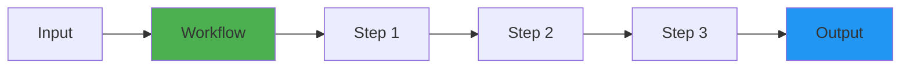

# Why Choose Kubiya?

## The Problem with Traditional Approaches

### AI Agent Frameworks: Unpredictable Chaos
- **Non-deterministic**: Same input can produce different execution paths
- **Hard to debug**: Complex agent interactions make troubleshooting nearly impossible
- **Production risks**: Unpredictable behavior in critical environments
- **State management hell**: Agents accumulate state leading to drift

### Traditional Orchestrators: Manual Complexity
- **No AI capabilities**: Everything must be manually coded
- **Steep learning curve**: Complex DSLs and configurations
- **Limited flexibility**: Hard to adapt to changing requirements
- **Slow development**: Every workflow requires extensive coding

## The Kubiya Solution

<CardGroup cols={2}>
  <Card title="AI-Powered Generation" icon="brain">
    Natural language to workflow in seconds
  </Card>
  <Card title="Deterministic Execution" icon="route">
    Same input always produces same result
  </Card>
  <Card title="Container Isolation" icon="shield">
    Every step runs in its own secure container
  </Card>
  <Card title="Universal Compatibility" icon="globe">
    Run any language, tool, or software
  </Card>
</CardGroup>

## Key Differentiators

### 1. **Deterministic by Design**


Unlike agent frameworks where execution paths vary, Kubiya workflows follow the exact same path every time.

### 2. **Application Layer Security**
- No direct infrastructure access required
- No god-mode Kubernetes permissions
- Complete audit trail of all actions
- Runs in isolated containers

### 3. **AI as a Tool, Not a Controller**
```python
# AI generates the workflow
workflow = adk.compose("Deploy my app with health checks")

# But execution is deterministic
result = execute_workflow(workflow)  # Same result every time
```

### 4. **Production-Ready from Day One**
- Built-in error handling and retries
- Comprehensive logging and monitoring
- Rollback capabilities
- Health checks and validations

## Comparison Matrix

| Feature | Agent Frameworks | Traditional Orchestrators | Kubiya |
|---------|-----------------|-------------------------|---------|
| **AI Capabilities** | ✅ Deep but chaotic | ❌ None | ✅ AI-generated, deterministic |
| **Predictability** | ❌ Non-deterministic | ✅ Deterministic | ✅ Deterministic |
| **Debugging** | ❌ Nearly impossible | ⚠️ Complex | ✅ Step-by-step visibility |
| **Setup Time** | Days/Weeks | Days/Weeks | Minutes |
| **Language Support** | Limited | Limited | ✅ Universal |
| **Production Safety** | ❌ High risk | ✅ Safe but rigid | ✅ Safe and flexible |

## Real-World Benefits

### For DevOps Teams
- **Faster automation**: Natural language to production workflow in minutes
- **Reduced errors**: Deterministic execution eliminates surprises
- **Easy maintenance**: Clear, auditable workflow definitions
- **Universal tooling**: Use any tool or language you prefer

### For Security Teams
- **No infrastructure access**: Workflows run in isolated containers
- **Complete audit trails**: Every action is logged and traceable
- **Least privilege**: Only the permissions needed for each step
- **Compliance ready**: SOC2, GDPR compliant platform

### For Development Teams
- **Rapid prototyping**: Test ideas quickly with AI generation
- **Language agnostic**: Use Python, Go, Node.js, or any language
- **Version control**: Workflows are just code, use Git naturally
- **Testing friendly**: Deterministic = easily testable

## Success Stories

### Before Kubiya
- 🔴 3 days to build a deployment pipeline
- 🔴 Constant debugging of agent behavior
- 🔴 Production incidents from unpredictable AI
- 🔴 Complex state management code

### After Kubiya
- ✅ 30 minutes from idea to production
- ✅ Predictable, debuggable workflows
- ✅ Zero AI-related production incidents
- ✅ Simple, declarative workflows

## The Bottom Line

Kubiya provides the best of both worlds:
- **AI power** for rapid workflow generation
- **Deterministic execution** for production reliability
- **Container isolation** for security
- **Universal compatibility** for flexibility

## Get Started Today

<Steps>
  <Step title="Install SDK">
    ```bash
    pip install kubiya-workflow-sdk
    ```
  </Step>
  
  <Step title="Generate Your First Workflow">
    ```python
    from kubiya_workflow_sdk.providers import get_provider
    
    adk = get_provider("adk", api_key="YOUR_KEY")
    workflow = await adk.compose("Create a backup of my database")
    ```
  </Step>
  
  <Step title="Deploy with Confidence">
    ```python
    result = execute_workflow(workflow)  # Deterministic execution
    ```
  </Step>
</Steps>

## Learn More

<CardGroup cols={2}>
  <Card title="Platform Overview" icon="layer-group" href="/concepts/platform-overview">
    Understand the architecture
  </Card>
  <Card title="Quickstart" icon="rocket" href="/getting-started/quickstart">
    Build your first workflow
  </Card>
  <Card title="Agent Comparison" icon="balance-scale" href="/concepts/agent-frameworks-comparison">
    Detailed framework comparison
  </Card>
  <Card title="Examples" icon="lightbulb" href="/sdk/examples">
    Real-world use cases
  </Card>
</CardGroup> 
