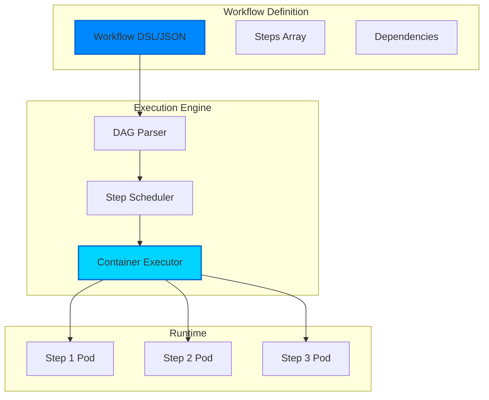
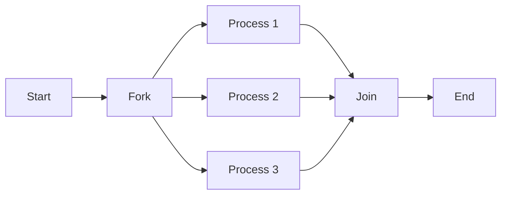
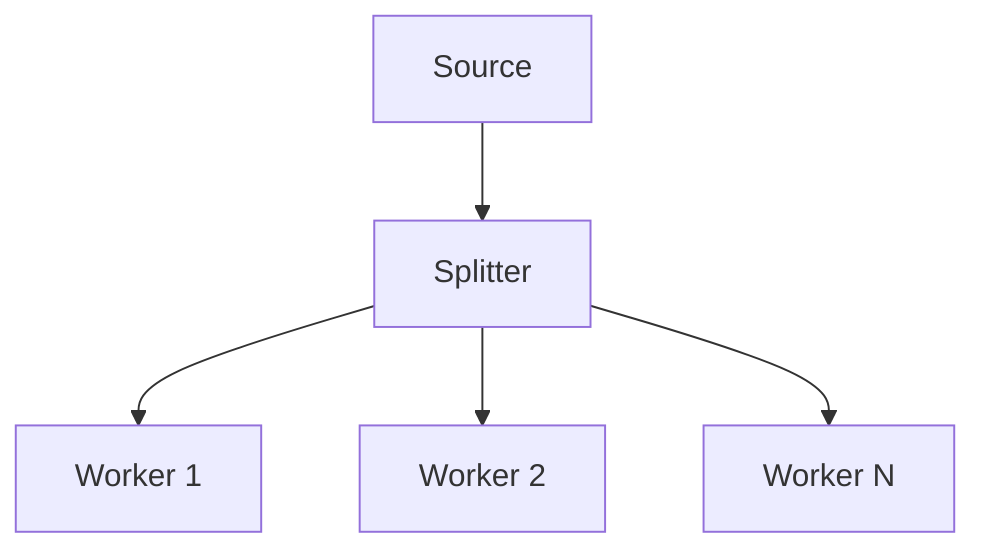

# Workflows

Workflows are the heart of Kubiya - they define sequences of containerized tasks that execute reliably on your infrastructure. Built on the concept of Directed Acyclic Graphs (DAGs), workflows provide deterministic execution with full observability.

<Note>
  **Key Insight**: Every workflow step runs as an independent Docker container. This means you can use ANY language, tool, or software - not just Python. Each execution starts fresh with zero state pollution.
</Note>

## What is a Workflow?

A workflow in Kubiya is:
- A **DAG** (Directed Acyclic Graph) of steps
- Each step runs in its own **Docker container** (serverless execution)
- **Language agnostic** - use Python, Node.js, Go, Rust, or any tool
- Steps can have **dependencies** on other steps
- Execution is **deterministic** and **reproducible**
- Fully **observable** with logs and metrics
- **Stateless** - no pollution between executions

## 🐳 The Container Revolution

Unlike traditional workflow engines that run scripts in a shared Python environment, Kubiya executes every step as a serverless container:

```python
# This workflow uses multiple languages and tools
workflow("multi-language-pipeline")
.step("extract")
.docker(
    image="python:3.11",
    code="import pandas as pd; df = pd.read_csv('data.csv')"
)
.step("transform")
.docker(
    image="node:20",
    code="const data = require('./data.json'); /* Node.js processing */"
)
.step("analyze")
.docker(
    image="r-base:latest",
    code="library(ggplot2); # R statistical analysis"
)
.step("deploy")
.docker(
    image="hashicorp/terraform:latest",
    command="terraform apply -auto-approve"
)
```

## Workflow Architecture



## Core Concepts

### Steps

The atomic unit of work in a workflow:

```python
from kubiya import step

# Simple command step
step.run("echo 'Hello World'", image="alpine:latest")

# Step with custom name and resources
step.process_data(
    image="python:3.11",
    command=["python", "process.py"],
    resources={"cpu": "2", "memory": "4Gi"}
)
```

### Dependencies

Steps can depend on other steps, creating the DAG:

```python
@workflow
def data_pipeline():
    # Step 1: Extract
    raw = step.extract(image="extractor:latest")
    
    # Step 2: Transform (depends on extract)
    clean = step.transform(
        image="transformer:latest",
        depends_on=[raw]
    )
    
    # Step 3: Load (depends on transform)
    step.load(
        image="loader:latest",
        depends_on=[clean]
    )
```

### Parallel Execution

Steps without dependencies run in parallel:

```python
@workflow
def parallel_processing():
    # These run simultaneously
    data1 = step.fetch_source1(image="fetcher:latest")
    data2 = step.fetch_source2(image="fetcher:latest")
    data3 = step.fetch_source3(image="fetcher:latest")
    
    # This waits for all three
    step.merge_data(
        image="merger:latest",
        depends_on=[data1, data2, data3]
    )
```

## Workflow Formats

### Python DSL

The recommended way to define workflows:

```python
from kubiya import workflow, step, params

@workflow
def deploy_application():
    """Deploy application with health checks"""
    
    # Parameters
    env = params.get("environment", default="staging")
    version = params.get("version", required=True)
    
    # Build step
    build = step.build(
        image="docker:latest",
        command=f"docker build -t app:{version} .",
        retry={"limit": 3}
    )
    
    # Test step
    test = step.test(
        image="app:{version}",
        command="pytest tests/",
        depends_on=[build],
        timeout="10m"
    )
    
    # Deploy step
    deploy = step.deploy(
        image="kubectl:latest",
        command=f"kubectl apply -f deploy/{env}.yaml",
        depends_on=[test],
        approval_required=True if env == "production" else False
    )
    
    # Health check
    step.health_check(
        image="curl:latest",
        command="curl -f http://app/health",
        depends_on=[deploy],
        retry={"limit": 5, "interval": "30s"}
    )
```

### JSON Format

For programmatic generation or storage:

```json
{
  "name": "deploy-application",
  "description": "Deploy application with health checks",
  "params": {
    "environment": {"default": "staging"},
    "version": {"required": true}
  },
  "steps": [
    {
      "name": "build",
      "image": "docker:latest",
      "command": "docker build -t app:${version} .",
      "retry": {"limit": 3}
    },
    {
      "name": "test",
      "image": "app:${version}",
      "command": "pytest tests/",
      "depends_on": ["build"],
      "timeout": "10m"
    },
    {
      "name": "deploy",
      "image": "kubectl:latest",
      "command": "kubectl apply -f deploy/${environment}.yaml",
      "depends_on": ["test"],
      "approval_required": "${environment == 'production'}"
    }
  ]
}
```

## Execution Model

### 1. Submission
When you submit a workflow:
- Workflow is validated for syntax and circular dependencies
- DAG is constructed from step dependencies
- Workflow is stored with a unique execution ID

### 2. Scheduling
The scheduler:
- Identifies steps ready to run (no pending dependencies)
- Allocates resources based on step requirements
- Queues steps for execution on available runners

### 3. Execution
For each step:
- Runner creates a Kubernetes pod
- Container image is pulled (with caching)
- Command is executed in the container
- Logs are streamed in real-time
- Exit code determines success/failure

### 4. State Management
Throughout execution:
- Step states: pending → running → success/failed
- Workflow state reflects overall progress
- State is persisted for durability
- Failures trigger retry logic if configured

## Advanced Features

### Conditional Execution

Execute steps based on conditions:

```python
@workflow
def conditional_deployment():
    test_result = step.run_tests(image="tester:latest")
    
    # Only deploy if tests pass
    step.deploy(
        image="deployer:latest",
        when=f"{test_result.exit_code} == 0"
    )
    
    # Send notification either way
    step.notify(
        image="notifier:latest",
        env={
            "STATUS": "success" if test_result.success else "failed"
        }
    )
```

### Loops and Iteration

Process lists of items:

```python
@workflow
def batch_processing():
    # Get list of files
    files = step.list_files(
        image="aws-cli:latest",
        command="aws s3 ls s3://bucket/",
        output_format="lines"
    )
    
    # Process each file
    for file in files:
        step.process_file(
            name=f"process-{file}",
            image="processor:latest",
            env={"FILE": file}
        )
```

### Error Handling

Robust error handling and recovery:

```python
@workflow
def fault_tolerant_pipeline():
    # Step with retries
    data = step.fetch_data(
        image="fetcher:latest",
        retry={
            "limit": 3,
            "interval": "30s",
            "backoff": "exponential"
        }
    )
    
    # Step with fallback
    try:
        result = step.primary_processor(
            image="processor:v2",
            depends_on=[data]
        )
    except StepFailure:
        result = step.fallback_processor(
            image="processor:v1",
            depends_on=[data]
        )
    
    # Cleanup runs regardless
    step.cleanup(
        image="cleaner:latest",
        always_run=True
    )
```

### Resource Management

Fine-grained resource control:

```python
@workflow
def resource_aware_pipeline():
    # CPU-intensive step
    step.cpu_task(
        image="cpu-heavy:latest",
        resources={
            "cpu": "4",
            "memory": "2Gi"
        }
    )
    
    # GPU-accelerated step
    step.ml_training(
        image="tensorflow:gpu",
        resources={
            "nvidia.com/gpu": "1",
            "memory": "16Gi"
        }
    )
    
    # Spot/preemptible instances
    step.batch_job(
        image="batch:latest",
        node_selector={
            "node.kubernetes.io/instance-type": "spot"
        }
    )
```

## Workflow Patterns

### Fork-Join Pattern


### Pipeline Pattern


### Fan-Out Pattern


## Monitoring & Observability

### Real-Time Logs
Stream logs from any step:
```python
client = Client()
for event in client.stream_logs(execution_id, step_name):
    print(event.message)
```

### Metrics
Track workflow performance:
- Execution duration
- Step success/failure rates
- Resource utilization
- Queue wait times

### Tracing
Distributed tracing support:
- OpenTelemetry integration
- Trace across workflows
- Identify bottlenecks

## Best Practices

### 1. Keep Steps Atomic
Each step should do one thing well:
```python
# Good: Atomic steps
step.download_data(...)
step.validate_data(...)
step.process_data(...)

# Bad: Monolithic step
step.download_validate_and_process(...)
```

### 2. Use Appropriate Images
Choose minimal, purpose-built images:
```python
# Good: Specific images
step.run_python(image="python:3.11-slim")
step.run_kubectl(image="bitnami/kubectl:latest")

# Bad: Heavy, general images
step.run_python(image="ubuntu:latest")  # Too heavy
```

### 3. Handle Failures Gracefully
Always plan for failure:
```python
# Add retries for network operations
step.api_call(retry={"limit": 3})

# Add timeouts for long-running operations
step.process(timeout="30m")

# Add cleanup steps
step.cleanup(always_run=True)
```

### 4. Parameterize Workflows
Make workflows reusable:
```python
@workflow
def deploy(env: str, version: str, replicas: int = 3):
    # Parameterized workflow
    step.deploy(
        env={"ENV": env, "VERSION": version},
        command=f"kubectl scale --replicas={replicas}"
    )
```

## Next Steps

<CardGroup cols={2}>
  <Card title="Python DSL" icon="python" href="/workflows/python-dsl">
    Deep dive into the Python DSL
  </Card>
  <Card title="Workflow Examples" icon="code" href="/workflows/examples">
    Real-world workflow examples
  </Card>
  <Card title="Runners" icon="server" href="/concepts/runners">
    Learn about workflow execution
  </Card>
  <Card title="API Reference" icon="book" href="/api-reference/workflows">
    Complete workflow API docs
  </Card>
</CardGroup> 