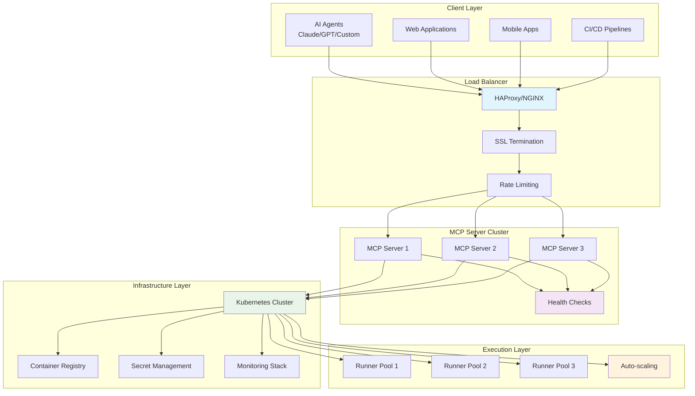

# Production Deployment Guide

This guide covers deploying Kubiya MCP server in production environments with enterprise-grade security, monitoring, and high availability.

## 🏗️ Deployment Architecture

<div className="diagram-container">

</div>

## 🚀 Deployment Options

### 1. Docker Compose (Development/Small Scale)

```yaml
# docker-compose.yml
version: '3.8'

services:
  kubiya-mcp:
    image: kubiya/mcp-server:latest
    ports:
      - "8080:8080"
      - "8081:8081"  # Health check port
    environment:
      - KUBIYA_API_KEY=${KUBIYA_API_KEY}
      - KUBIYA_OPA_ENFORCE=true
      - KUBIYA_DEFAULT_RUNNER=docker-local
      - KUBIYA_LOG_LEVEL=INFO
    volumes:
      - /var/run/docker.sock:/var/run/docker.sock
      - ./config:/app/config
      - ./logs:/app/logs
    restart: unless-stopped
    healthcheck:
      test: ["CMD", "curl", "-f", "http://localhost:8081/health"]
      interval: 30s
      timeout: 10s
      retries: 3
    depends_on:
      - redis
      - prometheus
  
  redis:
    image: redis:7-alpine
    ports:
      - "6379:6379"
    volumes:
      - redis_data:/data
    restart: unless-stopped
  
  prometheus:
    image: prom/prometheus:latest
    ports:
      - "9090:9090"
    volumes:
      - ./prometheus.yml:/etc/prometheus/prometheus.yml
      - prometheus_data:/prometheus
    command:
      - '--config.file=/etc/prometheus/prometheus.yml'
      - '--storage.tsdb.path=/prometheus'
      - '--web.console.libraries=/etc/prometheus/console_libraries'
      - '--web.console.templates=/etc/prometheus/consoles'
    restart: unless-stopped
  
  grafana:
    image: grafana/grafana:latest
    ports:
      - "3000:3000"
    environment:
      - GF_SECURITY_ADMIN_PASSWORD=admin
    volumes:
      - grafana_data:/var/lib/grafana
      - ./grafana/dashboards:/var/lib/grafana/dashboards
      - ./grafana/provisioning:/etc/grafana/provisioning
    restart: unless-stopped

volumes:
  redis_data:
  prometheus_data:
  grafana_data:
```

### 2. Kubernetes Deployment (Production)

```yaml
# k8s-deployment.yaml
apiVersion: apps/v1
kind: Deployment
metadata:
  name: kubiya-mcp-server
  namespace: kubiya-system
  labels:
    app: kubiya-mcp-server
spec:
  replicas: 3
  selector:
    matchLabels:
      app: kubiya-mcp-server
  template:
    metadata:
      labels:
        app: kubiya-mcp-server
    spec:
      serviceAccountName: kubiya-mcp-server
      containers:
      - name: mcp-server
        image: kubiya/mcp-server:v1.0.0
        ports:
        - containerPort: 8080
          name: mcp-port
        - containerPort: 8081
          name: health-port
        env:
        - name: KUBIYA_API_KEY
          valueFrom:
            secretKeyRef:
              name: kubiya-secrets
              key: api-key
        - name: KUBIYA_OPA_ENFORCE
          value: "true"
        - name: KUBIYA_DEFAULT_RUNNER
          value: "k8s-production"
        - name: KUBIYA_LOG_LEVEL
          value: "INFO"
        - name: KUBIYA_REDIS_URL
          value: "redis://redis-service:6379"
        resources:
          requests:
            cpu: 200m
            memory: 256Mi
          limits:
            cpu: 500m
            memory: 512Mi
        livenessProbe:
          httpGet:
            path: /health
            port: 8081
          initialDelaySeconds: 30
          periodSeconds: 10
        readinessProbe:
          httpGet:
            path: /ready
            port: 8081
          initialDelaySeconds: 5
          periodSeconds: 5
        volumeMounts:
        - name: config
          mountPath: /app/config
        - name: logs
          mountPath: /app/logs
      volumes:
      - name: config
        configMap:
          name: kubiya-config
      - name: logs
        emptyDir: {}
---
apiVersion: v1
kind: Service
metadata:
  name: kubiya-mcp-service
  namespace: kubiya-system
spec:
  selector:
    app: kubiya-mcp-server
  ports:
  - name: mcp
    port: 8080
    targetPort: 8080
  - name: health
    port: 8081
    targetPort: 8081
  type: ClusterIP
---
apiVersion: networking.k8s.io/v1
kind: Ingress
metadata:
  name: kubiya-mcp-ingress
  namespace: kubiya-system
  annotations:
    kubernetes.io/ingress.class: nginx
    cert-manager.io/cluster-issuer: letsencrypt-prod
    nginx.ingress.kubernetes.io/rate-limit: "100"
    nginx.ingress.kubernetes.io/ssl-redirect: "true"
spec:
  tls:
  - hosts:
    - mcp.yourdomain.com
    secretName: kubiya-mcp-tls
  rules:
  - host: mcp.yourdomain.com
    http:
      paths:
      - path: /
        pathType: Prefix
        backend:
          service:
            name: kubiya-mcp-service
            port:
              number: 8080
```

### 3. Helm Chart Deployment

```yaml
# values.yaml
replicaCount: 3

image:
  repository: kubiya/mcp-server
  tag: v1.0.0
  pullPolicy: IfNotPresent

service:
  type: ClusterIP
  port: 8080
  healthPort: 8081

ingress:
  enabled: true
  className: nginx
  annotations:
    cert-manager.io/cluster-issuer: letsencrypt-prod
    nginx.ingress.kubernetes.io/rate-limit: "100"
  hosts:
    - host: mcp.yourdomain.com
      paths:
        - path: /
          pathType: Prefix
  tls:
    - secretName: kubiya-mcp-tls
      hosts:
        - mcp.yourdomain.com

config:
  kubiya:
    apiKey: "kb-your-api-key"
    opaEnforce: true
    defaultRunner: "k8s-production"
    logLevel: "INFO"
  
  redis:
    enabled: true
    url: "redis://redis-service:6379"
  
  monitoring:
    enabled: true
    prometheus:
      enabled: true
    grafana:
      enabled: true

autoscaling:
  enabled: true
  minReplicas: 3
  maxReplicas: 10
  targetCPUUtilizationPercentage: 70
  targetMemoryUtilizationPercentage: 80

resources:
  requests:
    cpu: 200m
    memory: 256Mi
  limits:
    cpu: 500m
    memory: 512Mi

nodeSelector: {}
tolerations: []
affinity:
  podAntiAffinity:
    preferredDuringSchedulingIgnoredDuringExecution:
    - weight: 100
      podAffinityTerm:
        labelSelector:
          matchExpressions:
          - key: app
            operator: In
            values:
            - kubiya-mcp-server
        topologyKey: kubernetes.io/hostname
```

```bash
# Install with Helm
helm repo add kubiya https://charts.kubiya.ai
helm repo update

helm install kubiya-mcp kubiya/mcp-server \
  --namespace kubiya-system \
  --create-namespace \
  --values values.yaml
```

## 🔒 Security Configuration

### 1. Authentication & Authorization

```yaml
# auth-config.yaml
apiVersion: v1
kind: ConfigMap
metadata:
  name: kubiya-auth-config
  namespace: kubiya-system
data:
  auth.yaml: |
    authentication:
      providers:
        - name: oidc
          type: oidc
          config:
            issuer: https://your-identity-provider.com
            client_id: kubiya-mcp-client
            client_secret_ref:
              name: oidc-secrets
              key: client-secret
            scopes: ["openid", "profile", "email"]
            claims_mapping:
              username: "preferred_username"
              email: "email"
              groups: "groups"
        
        - name: ldap
          type: ldap
          config:
            url: ldaps://ldap.company.com:636
            bind_dn: "cn=kubiya,ou=service-accounts,dc=company,dc=com"
            bind_password_ref:
              name: ldap-secrets
              key: bind-password
            user_search:
              base_dn: "ou=users,dc=company,dc=com"
              filter: "(uid=%s)"
            group_search:
              base_dn: "ou=groups,dc=company,dc=com"
              filter: "(memberUid=%s)"
    
    authorization:
      default_policy: deny
      policies:
        - name: admin-full-access
          rules:
            - effect: allow
              resources: ["*"]
              actions: ["*"]
              conditions:
                groups: ["admin"]
        
        - name: developer-limited-access
          rules:
            - effect: allow
              resources: ["tools", "workflows"]
              actions: ["execute", "list"]
              conditions:
                groups: ["developers"]
                runners: ["dev-*"]
        
        - name: read-only-access
          rules:
            - effect: allow
              resources: ["tools", "runners"]
              actions: ["list", "get"]
              conditions:
                groups: ["read-only"]
```

### 2. Network Security

```yaml
# network-policy.yaml
apiVersion: networking.k8s.io/v1
kind: NetworkPolicy
metadata:
  name: kubiya-mcp-network-policy
  namespace: kubiya-system
spec:
  podSelector:
    matchLabels:
      app: kubiya-mcp-server
  policyTypes:
  - Ingress
  - Egress
  ingress:
  - from:
    - namespaceSelector:
        matchLabels:
          name: ingress-system
    - podSelector:
        matchLabels:
          app: nginx-ingress
    ports:
    - protocol: TCP
      port: 8080
  egress:
  - to:
    - namespaceSelector:
        matchLabels:
          name: kube-system
    ports:
    - protocol: TCP
      port: 443  # Kubernetes API
  - to:
    - namespaceSelector:
        matchLabels:
          name: kubiya-system
    ports:
    - protocol: TCP
      port: 6379  # Redis
  - to: []
    ports:
    - protocol: TCP
      port: 443  # External APIs
    - protocol: TCP
      port: 80   # HTTP (for health checks)
---
apiVersion: networking.k8s.io/v1
kind: NetworkPolicy
metadata:
  name: kubiya-runners-network-policy
  namespace: kubiya-tools
spec:
  podSelector:
    matchLabels:
      app: kubiya-runner
  policyTypes:
  - Ingress
  - Egress
  ingress:
  - from:
    - namespaceSelector:
        matchLabels:
          name: kubiya-system
    - podSelector:
        matchLabels:
          app: kubiya-mcp-server
  egress:
  - to: []
    ports:
    - protocol: TCP
      port: 443  # Container registry
    - protocol: TCP
      port: 80   # Package managers
```

### 3. Secret Management

```yaml
# secrets-management.yaml
apiVersion: v1
kind: Secret
metadata:
  name: kubiya-secrets
  namespace: kubiya-system
type: Opaque
data:
  api-key: <base64-encoded-api-key>
  opa-signing-key: <base64-encoded-signing-key>
  registry-credentials: <base64-encoded-docker-config>
---
apiVersion: external-secrets.io/v1beta1
kind: SecretStore
metadata:
  name: vault-backend
  namespace: kubiya-system
spec:
  provider:
    vault:
      server: "https://vault.company.com"
      path: "secret"
      version: "v2"
      auth:
        kubernetes:
          mountPath: "kubernetes"
          role: "kubiya-mcp-server"
          serviceAccountRef:
            name: kubiya-mcp-server
---
apiVersion: external-secrets.io/v1beta1
kind: ExternalSecret
metadata:
  name: kubiya-external-secrets
  namespace: kubiya-system
spec:
  refreshInterval: 15s
  secretStoreRef:
    name: vault-backend
    kind: SecretStore
  target:
    name: kubiya-secrets
    creationPolicy: Owner
  data:
  - secretKey: api-key
    remoteRef:
      key: kubiya/mcp-server
      property: api-key
  - secretKey: opa-signing-key
    remoteRef:
      key: kubiya/mcp-server
      property: opa-signing-key
```

## 📊 Monitoring & Observability

### 1. Prometheus Configuration

```yaml
# prometheus-config.yaml
apiVersion: v1
kind: ConfigMap
metadata:
  name: prometheus-config
  namespace: monitoring
data:
  prometheus.yml: |
    global:
      scrape_interval: 15s
      evaluation_interval: 15s
    
    rule_files:
      - "/etc/prometheus/rules/*.yml"
    
    scrape_configs:
      - job_name: 'kubiya-mcp-server'
        static_configs:
          - targets: ['kubiya-mcp-service.kubiya-system.svc.cluster.local:8080']
        metrics_path: '/metrics'
        scrape_interval: 10s
        
      - job_name: 'kubiya-runners'
        kubernetes_sd_configs:
          - role: pod
            namespaces:
              names:
                - kubiya-tools
        relabel_configs:
          - source_labels: [__meta_kubernetes_pod_label_app]
            regex: kubiya-runner
            action: keep
          - source_labels: [__meta_kubernetes_pod_annotation_prometheus_io_scrape]
            regex: true
            action: keep
          - source_labels: [__meta_kubernetes_pod_annotation_prometheus_io_path]
            regex: (.+)
            target_label: __metrics_path__
            action: replace
          - source_labels: [__address__, __meta_kubernetes_pod_annotation_prometheus_io_port]
            regex: ([^:]+)(?::\d+)?;(\d+)
            replacement: $1:$2
            target_label: __address__
            action: replace
    
    alerting:
      alertmanagers:
        - static_configs:
            - targets: ['alertmanager.monitoring.svc.cluster.local:9093']
---
apiVersion: v1
kind: ConfigMap
metadata:
  name: prometheus-rules
  namespace: monitoring
data:
  kubiya-alerts.yml: |
    groups:
    - name: kubiya-mcp-server
      rules:
      - alert: KubiyaMCPServerDown
        expr: up{job="kubiya-mcp-server"} == 0
        for: 5m
        labels:
          severity: critical
        annotations:
          summary: "Kubiya MCP Server is down"
          description: "Kubiya MCP Server has been down for more than 5 minutes"
      
      - alert: KubiyaHighExecutionLatency
        expr: histogram_quantile(0.95, kubiya_execution_duration_seconds_bucket) > 60
        for: 10m
        labels:
          severity: warning
        annotations:
          summary: "High execution latency detected"
          description: "95th percentile execution time is above 60 seconds"
      
      - alert: KubiyaHighErrorRate
        expr: rate(kubiya_tool_executions_total{status="error"}[5m]) / rate(kubiya_tool_executions_total[5m]) > 0.1
        for: 10m
        labels:
          severity: warning
        annotations:
          summary: "High error rate detected"
          description: "Error rate is above 10% for the last 10 minutes"
      
      - alert: KubiyaRunnerResourceExhaustion
        expr: kubiya_runner_utilization > 0.9
        for: 15m
        labels:
          severity: warning
        annotations:
          summary: "Runner resource exhaustion"
          description: "Runner {{ $labels.runner_id }} is at {{ $value }}% utilization"
```

### 2. Grafana Dashboard

```json
{
  "dashboard": {
    "title": "Kubiya MCP Server Dashboard",
    "panels": [
      {
        "title": "Request Rate",
        "type": "graph",
        "targets": [
          {
            "expr": "rate(kubiya_tool_executions_total[5m])",
            "legendFormat": "{{ tool_name }} - {{ status }}"
          }
        ]
      },
      {
        "title": "Execution Duration",
        "type": "graph",
        "targets": [
          {
            "expr": "histogram_quantile(0.50, kubiya_execution_duration_seconds_bucket)",
            "legendFormat": "50th percentile"
          },
          {
            "expr": "histogram_quantile(0.95, kubiya_execution_duration_seconds_bucket)",
            "legendFormat": "95th percentile"
          }
        ]
      },
      {
        "title": "Active Sessions",
        "type": "singlestat",
        "targets": [
          {
            "expr": "kubiya_active_sessions",
            "legendFormat": "Active Sessions"
          }
        ]
      },
      {
        "title": "Runner Utilization",
        "type": "graph",
        "targets": [
          {
            "expr": "kubiya_runner_utilization",
            "legendFormat": "{{ runner_id }}"
          }
        ]
      }
    ]
  }
}
```

### 3. Logging Configuration

```yaml
# logging-config.yaml
apiVersion: v1
kind: ConfigMap
metadata:
  name: kubiya-logging-config
  namespace: kubiya-system
data:
  logging.yml: |
    logging:
      level: INFO
      format: json
      output:
        - type: stdout
        - type: file
          path: /app/logs/kubiya-mcp.log
          max_size: 100MB
          max_backups: 10
        - type: elasticsearch
          hosts:
            - http://elasticsearch.logging.svc.cluster.local:9200
          index: kubiya-mcp-logs
          template:
            name: kubiya-mcp-template
            pattern: kubiya-mcp-logs-*
      
      structured_logging:
        enabled: true
        fields:
          service: kubiya-mcp-server
          version: "1.0.0"
          environment: production
      
      request_logging:
        enabled: true
        include_headers: false
        include_body: false
        sanitize_fields:
          - api_key
          - password
          - token
```

## 🚀 High Availability Setup

### 1. Multi-Region Deployment

```yaml
# multi-region-deployment.yaml
apiVersion: argoproj.io/v1alpha1
kind: Application
metadata:
  name: kubiya-mcp-us-east
  namespace: argocd
spec:
  project: kubiya
  source:
    repoURL: https://github.com/company/kubiya-mcp-deploy
    targetRevision: HEAD
    path: manifests/us-east
  destination:
    server: https://k8s-us-east.company.com
    namespace: kubiya-system
  syncPolicy:
    automated:
      prune: true
      selfHeal: true
---
apiVersion: argoproj.io/v1alpha1
kind: Application
metadata:
  name: kubiya-mcp-eu-west
  namespace: argocd
spec:
  project: kubiya
  source:
    repoURL: https://github.com/company/kubiya-mcp-deploy
    targetRevision: HEAD
    path: manifests/eu-west
  destination:
    server: https://k8s-eu-west.company.com
    namespace: kubiya-system
  syncPolicy:
    automated:
      prune: true
      selfHeal: true
```

### 2. Database Replication

```yaml
# redis-cluster.yaml
apiVersion: v1
kind: ConfigMap
metadata:
  name: redis-cluster-config
  namespace: kubiya-system
data:
  redis.conf: |
    cluster-enabled yes
    cluster-config-file nodes.conf
    cluster-node-timeout 5000
    cluster-announce-ip ${POD_IP}
    cluster-announce-port 6379
    cluster-announce-bus-port 16379
    appendonly yes
    appendfilename appendonly.aof
    save 900 1
    save 300 10
    save 60 10000
---
apiVersion: apps/v1
kind: StatefulSet
metadata:
  name: redis-cluster
  namespace: kubiya-system
spec:
  serviceName: redis-cluster
  replicas: 6
  selector:
    matchLabels:
      app: redis-cluster
  template:
    metadata:
      labels:
        app: redis-cluster
    spec:
      containers:
      - name: redis
        image: redis:7-alpine
        ports:
        - containerPort: 6379
          name: client
        - containerPort: 16379
          name: gossip
        env:
        - name: POD_IP
          valueFrom:
            fieldRef:
              fieldPath: status.podIP
        volumeMounts:
        - name: conf
          mountPath: /usr/local/etc/redis/redis.conf
          subPath: redis.conf
        - name: data
          mountPath: /data
      volumes:
      - name: conf
        configMap:
          name: redis-cluster-config
  volumeClaimTemplates:
  - metadata:
      name: data
    spec:
      accessModes: ["ReadWriteOnce"]
      resources:
        requests:
          storage: 1Gi
```

### 3. Load Balancer Configuration

```yaml
# load-balancer.yaml
apiVersion: v1
kind: ConfigMap
metadata:
  name: haproxy-config
  namespace: kubiya-system
data:
  haproxy.cfg: |
    global
        daemon
        maxconn 4096
        log stdout local0
        stats socket /var/run/haproxy.sock mode 660 level admin
    
    defaults
        mode http
        timeout connect 5000ms
        timeout client 50000ms
        timeout server 50000ms
        option httplog
        option dontlognull
        option redispatch
        retries 3
    
    frontend kubiya_frontend
        bind *:8080
        bind *:8443 ssl crt /etc/ssl/certs/kubiya.pem
        redirect scheme https if !{ ssl_fc }
        
        # Rate limiting
        stick-table type ip size 100k expire 30s store http_req_rate(10s)
        http-request track-sc0 src
        http-request reject if { sc_http_req_rate(0) gt 20 }
        
        # Health check bypass
        acl is_health_check path_beg /health
        use_backend kubiya_health if is_health_check
        
        default_backend kubiya_backend
    
    backend kubiya_backend
        balance roundrobin
        option httpchk GET /health
        http-check expect status 200
        
        server mcp1 kubiya-mcp-service:8080 check
        server mcp2 kubiya-mcp-service:8080 check
        server mcp3 kubiya-mcp-service:8080 check
    
    backend kubiya_health
        balance roundrobin
        server health1 kubiya-mcp-service:8081 check
        server health2 kubiya-mcp-service:8081 check
        server health3 kubiya-mcp-service:8081 check
    
    listen stats
        bind *:8404
        stats enable
        stats uri /stats
        stats refresh 30s
        stats admin if TRUE
```

## 🔧 Operational Procedures

### 1. Deployment Script

```bash
#!/bin/bash
# deploy.sh - Production deployment script

set -e

# Configuration
NAMESPACE="kubiya-system"
CHART_VERSION="1.0.0"
VALUES_FILE="values.yaml"
BACKUP_DIR="/tmp/kubiya-backup-$(date +%Y%m%d-%H%M%S)"

# Colors for output
RED='\033[0;31m'
GREEN='\033[0;32m'
YELLOW='\033[1;33m'
NC='\033[0m' # No Color

log() {
    echo -e "${GREEN}[$(date +'%Y-%m-%d %H:%M:%S')] $1${NC}"
}

warn() {
    echo -e "${YELLOW}[$(date +'%Y-%m-%d %H:%M:%S')] WARNING: $1${NC}"
}

error() {
    echo -e "${RED}[$(date +'%Y-%m-%d %H:%M:%S')] ERROR: $1${NC}"
}

# Pre-deployment checks
pre_deployment_checks() {
    log "Running pre-deployment checks..."
    
    # Check cluster connectivity
    if ! kubectl cluster-info &>/dev/null; then
        error "Cannot connect to Kubernetes cluster"
        exit 1
    fi
    
    # Check namespace exists
    if ! kubectl get namespace $NAMESPACE &>/dev/null; then
        log "Creating namespace $NAMESPACE"
        kubectl create namespace $NAMESPACE
    fi
    
    # Check secrets exist
    if ! kubectl get secret kubiya-secrets -n $NAMESPACE &>/dev/null; then
        error "Required secrets not found in namespace $NAMESPACE"
        exit 1
    fi
    
    # Check available resources
    log "Checking cluster resources..."
    kubectl top nodes
    
    log "Pre-deployment checks completed"
}

# Backup current deployment
backup_deployment() {
    log "Creating backup of current deployment..."
    
    mkdir -p $BACKUP_DIR
    
    # Backup current deployment
    kubectl get deployment kubiya-mcp-server -n $NAMESPACE -o yaml > $BACKUP_DIR/deployment.yaml
    kubectl get service kubiya-mcp-service -n $NAMESPACE -o yaml > $BACKUP_DIR/service.yaml
    kubectl get configmap kubiya-config -n $NAMESPACE -o yaml > $BACKUP_DIR/configmap.yaml
    
    # Backup database
    kubectl exec -n $NAMESPACE deployment/redis -- redis-cli BGSAVE
    kubectl cp $NAMESPACE/redis-0:/data/dump.rdb $BACKUP_DIR/redis-dump.rdb
    
    log "Backup completed at $BACKUP_DIR"
}

# Deploy application
deploy_application() {
    log "Deploying Kubiya MCP Server..."
    
    # Update Helm repository
    helm repo update
    
    # Deploy with Helm
    helm upgrade --install kubiya-mcp kubiya/mcp-server \
        --namespace $NAMESPACE \
        --values $VALUES_FILE \
        --version $CHART_VERSION \
        --timeout 10m \
        --wait
    
    log "Deployment completed"
}

# Post-deployment verification
post_deployment_verification() {
    log "Running post-deployment verification..."
    
    # Wait for pods to be ready
    kubectl wait --for=condition=ready pod -l app=kubiya-mcp-server -n $NAMESPACE --timeout=300s
    
    # Check deployment status
    kubectl get deployment kubiya-mcp-server -n $NAMESPACE
    
    # Health check
    kubectl exec -n $NAMESPACE deployment/kubiya-mcp-server -- curl -f http://localhost:8081/health
    
    # Smoke test
    kubectl exec -n $NAMESPACE deployment/kubiya-mcp-server -- curl -f http://localhost:8080/tools
    
    log "Post-deployment verification completed"
}

# Rollback function
rollback_deployment() {
    warn "Rolling back deployment..."
    
    # Rollback Helm deployment
    helm rollback kubiya-mcp --namespace $NAMESPACE
    
    # Restore database if needed
    if [ -f "$BACKUP_DIR/redis-dump.rdb" ]; then
        kubectl cp $BACKUP_DIR/redis-dump.rdb $NAMESPACE/redis-0:/data/dump.rdb
        kubectl exec -n $NAMESPACE deployment/redis -- redis-cli DEBUG RESTART
    fi
    
    warn "Rollback completed"
}

# Main deployment process
main() {
    log "Starting Kubiya MCP Server deployment..."
    
    # Set up error handling
    trap 'error "Deployment failed"; rollback_deployment; exit 1' ERR
    
    pre_deployment_checks
    backup_deployment
    deploy_application
    post_deployment_verification
    
    log "Deployment completed successfully!"
    log "Backup location: $BACKUP_DIR"
}

# Parse command line arguments
case "${1:-deploy}" in
    deploy)
        main
        ;;
    rollback)
        rollback_deployment
        ;;
    backup)
        backup_deployment
        ;;
    verify)
        post_deployment_verification
        ;;
    *)
        echo "Usage: $0 [deploy|rollback|backup|verify]"
        exit 1
        ;;
esac
```

### 2. Health Check Script

```bash
#!/bin/bash
# health-check.sh - Comprehensive health check script

NAMESPACE="kubiya-system"
SLACK_WEBHOOK_URL="${SLACK_WEBHOOK_URL:-}"
EMAIL_RECIPIENTS="${EMAIL_RECIPIENTS:-ops@company.com}"

# Health check functions
check_pods() {
    echo "Checking pod status..."
    kubectl get pods -n $NAMESPACE
    
    # Check for failed pods
    FAILED_PODS=$(kubectl get pods -n $NAMESPACE --field-selector=status.phase=Failed -o name)
    if [ -n "$FAILED_PODS" ]; then
        echo "ERROR: Failed pods detected: $FAILED_PODS"
        return 1
    fi
    
    # Check for pods not ready
    NOT_READY_PODS=$(kubectl get pods -n $NAMESPACE -o json | jq -r '.items[] | select(.status.conditions[] | select(.type=="Ready" and .status=="False")) | .metadata.name')
    if [ -n "$NOT_READY_PODS" ]; then
        echo "ERROR: Pods not ready: $NOT_READY_PODS"
        return 1
    fi
    
    echo "All pods are healthy"
    return 0
}

check_services() {
    echo "Checking service endpoints..."
    kubectl get endpoints -n $NAMESPACE
    
    # Check service health
    SERVICE_HEALTH=$(kubectl exec -n $NAMESPACE deployment/kubiya-mcp-server -- curl -s -o /dev/null -w "%{http_code}" http://localhost:8081/health)
    if [ "$SERVICE_HEALTH" != "200" ]; then
        echo "ERROR: Service health check failed (HTTP $SERVICE_HEALTH)"
        return 1
    fi
    
    echo "Services are healthy"
    return 0
}

check_resources() {
    echo "Checking resource usage..."
    
    # Check CPU usage
    CPU_USAGE=$(kubectl top pods -n $NAMESPACE --no-headers | awk '{sum += $2} END {print sum}')
    if [ ${CPU_USAGE%m} -gt 1000 ]; then
        echo "WARNING: High CPU usage detected: ${CPU_USAGE}m"
    fi
    
    # Check memory usage
    MEMORY_USAGE=$(kubectl top pods -n $NAMESPACE --no-headers | awk '{sum += $3} END {print sum}')
    if [ ${MEMORY_USAGE%Mi} -gt 2048 ]; then
        echo "WARNING: High memory usage detected: ${MEMORY_USAGE}Mi"
    fi
    
    echo "Resource usage is normal"
    return 0
}

check_external_dependencies() {
    echo "Checking external dependencies..."
    
    # Check Redis connectivity
    REDIS_STATUS=$(kubectl exec -n $NAMESPACE deployment/redis -- redis-cli ping)
    if [ "$REDIS_STATUS" != "PONG" ]; then
        echo "ERROR: Redis connectivity failed"
        return 1
    fi
    
    # Check Kubiya API connectivity
    API_STATUS=$(kubectl exec -n $NAMESPACE deployment/kubiya-mcp-server -- curl -s -o /dev/null -w "%{http_code}" https://api.kubiya.ai/health)
    if [ "$API_STATUS" != "200" ]; then
        echo "ERROR: Kubiya API connectivity failed (HTTP $API_STATUS)"
        return 1
    fi
    
    echo "External dependencies are healthy"
    return 0
}

send_alert() {
    local message="$1"
    local severity="$2"
    
    # Send Slack notification
    if [ -n "$SLACK_WEBHOOK_URL" ]; then
        curl -X POST -H 'Content-type: application/json' \
            --data "{\"text\":\"[$severity] Kubiya MCP Server: $message\"}" \
            $SLACK_WEBHOOK_URL
    fi
    
    # Send email notification
    if command -v mail >/dev/null 2>&1; then
        echo "$message" | mail -s "[$severity] Kubiya MCP Server Alert" $EMAIL_RECIPIENTS
    fi
}

# Main health check
main() {
    echo "Starting health check for Kubiya MCP Server..."
    
    FAILED_CHECKS=0
    
    check_pods || FAILED_CHECKS=$((FAILED_CHECKS + 1))
    check_services || FAILED_CHECKS=$((FAILED_CHECKS + 1))
    check_resources || FAILED_CHECKS=$((FAILED_CHECKS + 1))
    check_external_dependencies || FAILED_CHECKS=$((FAILED_CHECKS + 1))
    
    if [ $FAILED_CHECKS -eq 0 ]; then
        echo "All health checks passed"
        exit 0
    else
        echo "Health check failed ($FAILED_CHECKS checks failed)"
        send_alert "Health check failed ($FAILED_CHECKS checks failed)" "CRITICAL"
        exit 1
    fi
}

main "$@"
```

## 🎯 Performance Optimization

### 1. Resource Tuning

```yaml
# resource-optimization.yaml
apiVersion: v1
kind: ConfigMap
metadata:
  name: kubiya-performance-config
  namespace: kubiya-system
data:
  performance.yml: |
    server:
      max_connections: 1000
      connection_timeout: 30s
      read_timeout: 60s
      write_timeout: 60s
      idle_timeout: 120s
      
    execution:
      max_concurrent_tools: 100
      tool_timeout: 300s
      container_startup_timeout: 60s
      
    caching:
      enabled: true
      ttl: 3600s
      max_size: 1000
      
    rate_limiting:
      enabled: true
      requests_per_second: 100
      burst_size: 200
      
    optimization:
      container_reuse: true
      image_pull_policy: "IfNotPresent"
      resource_quotas:
        cpu: "10"
        memory: "20Gi"
        ephemeral_storage: "100Gi"
```

### 2. Monitoring Optimization

```yaml
# monitoring-optimization.yaml
apiVersion: v1
kind: ConfigMap
metadata:
  name: kubiya-monitoring-config
  namespace: kubiya-system
data:
  monitoring.yml: |
    metrics:
      enabled: true
      interval: 10s
      retention: 24h
      
    profiling:
      enabled: true
      cpu_profile: true
      memory_profile: true
      
    tracing:
      enabled: true
      jaeger:
        endpoint: "http://jaeger-collector.monitoring.svc.cluster.local:14268/api/traces"
        sample_rate: 0.1
```

## 📚 Next Steps

<CardGroup cols={2}>
  <Card title="🔧 Maintenance Guide" icon="tools" href="/mcp/maintenance">
    Learn how to maintain your production deployment
  </Card>
  
  <Card title="📊 Performance Tuning" icon="chart-line" href="/mcp/performance-tuning">
    Optimize your deployment for maximum performance
  </Card>
  
  <Card title="🚨 Incident Response" icon="exclamation-triangle" href="/mcp/incident-response">
    Handle incidents and troubleshoot issues
  </Card>
  
  <Card title="🔄 Disaster Recovery" icon="history" href="/mcp/disaster-recovery">
    Prepare for and recover from disasters
  </Card>
</CardGroup>

---

<function_calls>
<invoke name="TodoWrite">
<parameter name="todos">[{"id": "1", "content": "Analyze current MCP documentation structure", "status": "completed", "priority": "high"}, {"id": "2", "content": "Create comprehensive MCP server overview", "status": "completed", "priority": "high"}, {"id": "3", "content": "Document serverless tools architecture", "status": "completed", "priority": "high"}, {"id": "4", "content": "Add infrastructure compatibility guide", "status": "completed", "priority": "medium"}, {"id": "5", "content": "Create agent integration examples", "status": "completed", "priority": "medium"}, {"id": "6", "content": "Add deployment and configuration docs", "status": "completed", "priority": "medium"}]