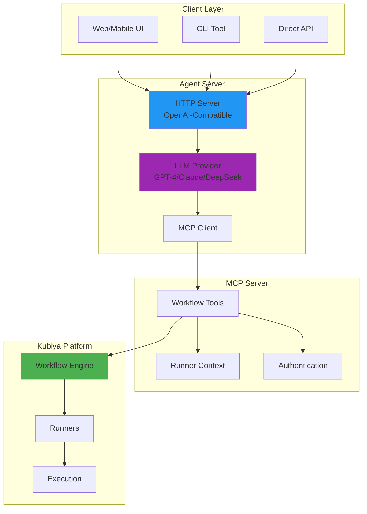
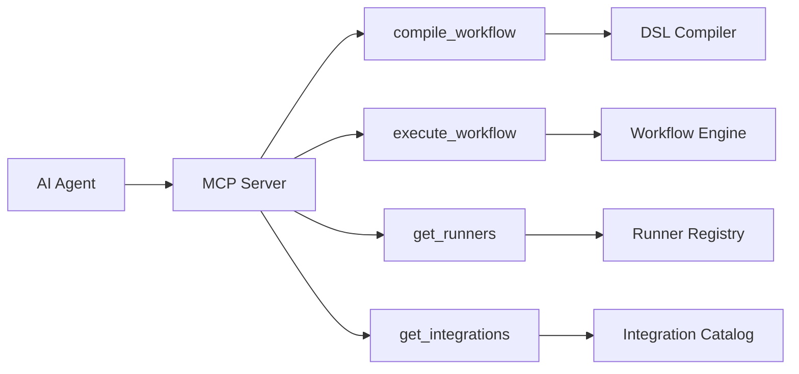
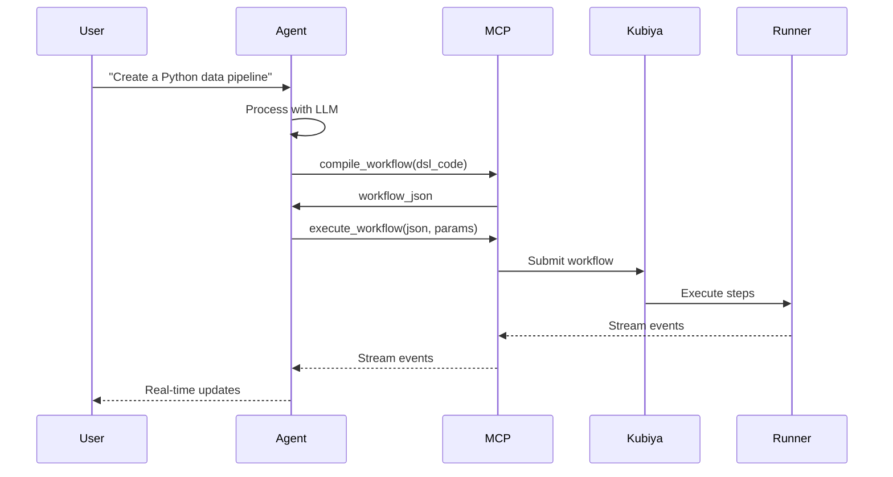
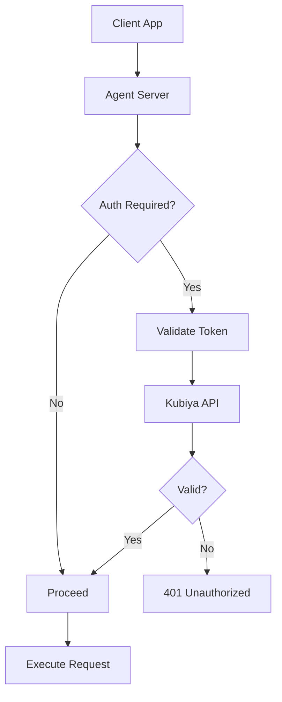
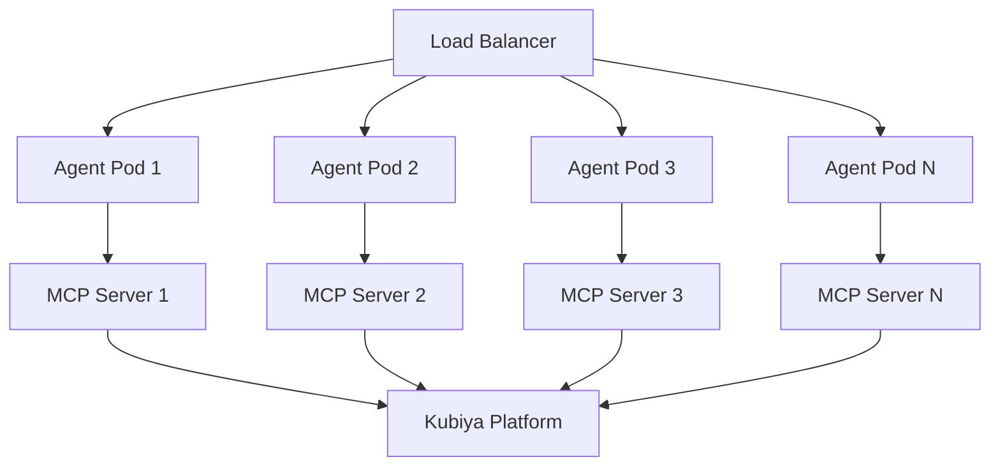
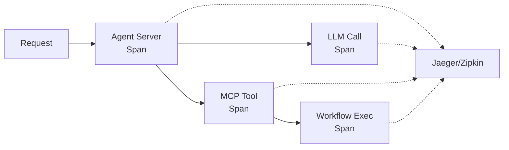

# Full-Stack Agent Architecture

Learn how Kubiya's full-stack AI agents work under the hood, from natural language understanding to workflow execution.

## System Overview



## Component Architecture

### 1. Agent Server Layer

The agent server is the brain of the system:

```python
# Core components
class AgentServer:
    def __init__(self):
        self.llm = LLMProvider()        # AI model integration
        self.mcp_client = MCPClient()   # Tool connectivity
        self.stream_handler = StreamHandler()  # Real-time updates
        self.auth_manager = AuthManager()      # Security
```

**Key responsibilities:**
- Handle HTTP requests (OpenAI-compatible API)
- Manage conversation context
- Route to appropriate LLM provider
- Stream responses in real-time

### 2. MCP (Model Context Protocol) Layer

MCP provides the tools and context:



**Available tools:**
- `compile_workflow` - Convert DSL to JSON
- `execute_workflow` - Run workflows with streaming
- `get_workflow_runners` - List available runners
- `get_integrations` - Available integrations
- `get_workflow_secrets` - Secret management

### 3. Workflow Engine Layer

The deterministic execution engine:

```python
# Workflow execution flow
async def execute_workflow(workflow_json, runner):
    # 1. Validate workflow
    validated = await validate_workflow(workflow_json)
    
    # 2. Select runner
    selected_runner = await select_runner(runner)
    
    # 3. Execute with streaming
    async for event in workflow_engine.execute(validated, selected_runner):
        yield event  # Real-time updates
```

## Data Flow

### Request Processing



### Streaming Architecture

Two streaming formats supported:

#### 1. Server-Sent Events (SSE)
```
data: {"type": "step_running", "step": "build", "message": "Building Docker image..."}
data: {"type": "step_complete", "step": "build", "duration": "45s"}
data: {"type": "workflow_complete", "status": "success"}
data: [DONE]
```

#### 2. Vercel AI SDK Format
```
0:"Starting workflow execution..."
2:{"type":"step_running","step":"build"}
0:"Docker image built successfully"
2:{"type":"step_complete","step":"build"}
d:{"finishReason":"stop"}
```

## Security Architecture

### Authentication Flow



### Token Management

```python
# Authentication layers
class AuthManager:
    def __init__(self):
        self.kubiya_auth = KubiyaAuth()      # Platform auth
        self.llm_auth = LLMProviderAuth()    # LLM API keys
        self.user_auth = UserAuth()          # User tokens
    
    async def validate_request(self, request):
        # Validate all auth layers
        await self.validate_user_token(request.headers)
        await self.validate_api_keys()
        await self.validate_permissions(request.user)
```

## Scalability Architecture

### Horizontal Scaling

```yaml
# Kubernetes HPA configuration
apiVersion: autoscaling/v2
kind: HorizontalPodAutoscaler
metadata:
  name: agent-server-hpa
spec:
  scaleTargetRef:
    apiVersion: apps/v1
    kind: Deployment
    name: agent-server
  minReplicas: 3
  maxReplicas: 50
  metrics:
  - type: Resource
    resource:
      name: cpu
      target:
        type: Utilization
        averageUtilization: 70
  - type: Pods
    pods:
      metric:
        name: concurrent_requests
      target:
        type: AverageValue
        averageValue: "30"
```

### Load Distribution



## Performance Optimization

### Caching Strategy

```python
# Multi-level caching
class CacheManager:
    def __init__(self):
        self.memory_cache = MemoryCache()      # Hot data
        self.redis_cache = RedisCache()        # Distributed
        self.workflow_cache = WorkflowCache()  # Compiled workflows
    
    async def get_or_compute(self, key, compute_fn):
        # Check memory first
        if result := self.memory_cache.get(key):
            return result
        
        # Check Redis
        if result := await self.redis_cache.get(key):
            self.memory_cache.set(key, result)
            return result
        
        # Compute and cache
        result = await compute_fn()
        await self.cache_all_levels(key, result)
        return result
```

### Connection Pooling

```python
# Efficient connection management
class ConnectionPool:
    def __init__(self):
        self.llm_pool = LLMConnectionPool(size=50)
        self.mcp_pool = MCPConnectionPool(size=100)
        self.http_pool = HTTPConnectionPool(size=200)
```

## Monitoring & Observability

### Metrics Collection

```python
# Key metrics tracked
metrics = {
    "request_count": Counter("Total requests"),
    "request_duration": Histogram("Request duration"),
    "workflow_executions": Counter("Workflows executed"),
    "streaming_connections": Gauge("Active streams"),
    "llm_tokens_used": Counter("LLM tokens consumed"),
    "error_rate": Counter("Error responses")
}
```

### Distributed Tracing



## Error Handling

### Graceful Degradation

```python
# Fallback strategies
async def handle_request_with_fallback(request):
    try:
        # Primary path
        return await process_with_primary_llm(request)
    except LLMUnavailable:
        # Fallback to secondary
        return await process_with_fallback_llm(request)
    except MCPConnectionError:
        # Return cached response
        return await get_cached_response(request)
    except Exception as e:
        # Graceful error
        return error_response(
            "Service temporarily unavailable",
            suggestions=get_suggestions(e)
        )
```

## Best Practices

<Steps>
  <Step title="Design for Failure">
    - Implement circuit breakers
    - Use exponential backoff
    - Provide fallback responses
    - Cache successful operations
  </Step>
  
  <Step title="Optimize for Streaming">
    - Use chunked transfer encoding
    - Implement backpressure handling
    - Buffer events appropriately
    - Handle connection drops gracefully
  </Step>
  
  <Step title="Scale Horizontally">
    - Stateless agent servers
    - Distributed caching
    - Load balancing strategies
    - Auto-scaling policies
  </Step>
  
  <Step title="Monitor Everything">
    - Request/response metrics
    - Resource utilization
    - Error rates and types
    - User experience metrics
  </Step>
</Steps>

## Next Steps

- Explore [deployment options](/deployment/helm-chart)
- Learn about [performance tuning](/full-stack-agents/performance)
- Implement [custom tools](/mcp/tools-reference)
- Review [security best practices](/mcp/authentication) 