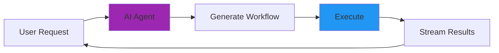

# Full-Stack AI Agents with Kubiya

Build powerful AI agents that can understand natural language, create workflows, and execute them in real-time. Kubiya's MCP Agent Server provides everything you need for production-ready AI automation.

## What Are Full-Stack AI Agents?

Full-stack AI agents combine:
- **Natural Language Understanding**: Process user requests in plain English
- **Workflow Generation**: Create deterministic workflows from AI
- **Real-Time Execution**: Execute workflows with streaming results
- **Production Infrastructure**: Deploy with authentication, monitoring, and scaling



## Quick Start

### 1. Start the Agent Server

```bash
# Install the SDK
pip install kubiya-workflow-sdk

# Set up environment
export TOGETHER_API_KEY="your-key"
export KUBIYA_API_KEY="your-key"

# Start the agent server
kubiya mcp agent --provider together --model "deepseek-ai/DeepSeek-V3" --port 8765
```

### 2. Make Your First Request

```bash
curl -X POST http://localhost:8765/v1/chat/completions \
  -H "Content-Type: application/json" \
  -d '{
    "model": "deepseek-ai/DeepSeek-V3",
    "messages": [
      {"role": "user", "content": "Create a workflow that analyzes system performance"}
    ],
    "stream": true
  }'
```

The agent will:
1. Understand your request
2. Generate a workflow using Kubiya DSL
3. Execute it on available runners
4. Stream back real-time results

## Building a Full-Stack Application

### Frontend (React + Vercel AI SDK)

```tsx
import { useChat } from '@ai-sdk/react';

export function WorkflowChat() {
  const { messages, input, handleInputChange, handleSubmit } = useChat({
    api: 'http://localhost:8765/v1/chat/completions',
  });

  return (
    <div className="chat-container">
      {messages.map(m => (
        <div key={m.id} className={`message ${m.role}`}>
          {m.content}
        </div>
      ))}
      
      <form onSubmit={handleSubmit}>
        <input
          value={input}
          onChange={handleInputChange}
          placeholder="Describe the workflow you want to create..."
        />
        <button type="submit">Send</button>
      </form>
    </div>
  );
}
```

### Backend (Agent Server)

The agent server provides:
- OpenAI-compatible chat endpoint
- Real-time streaming
- Workflow generation and execution
- Runner management

```python
# Custom agent configuration
from kubiya_workflow_sdk.mcp import AgentServer

# Initialize with custom settings
server = AgentServer(
    provider="together",
    model="deepseek-ai/DeepSeek-V3",
    api_key="your-key"
)

# The server automatically:
# - Connects to MCP tools for workflow operations
# - Manages conversation context
# - Handles streaming responses
# - Executes workflows on Kubiya runners
```

## Core Capabilities

### 1. Natural Language to Workflow

Users describe what they want in plain English:

```
User: "Create a workflow that backs up my database every night at 2 AM"

Agent: I'll create a scheduled database backup workflow for you...
[Generates and executes the workflow]
```

### 2. Docker-Based Execution

The agent can create workflows using any Docker image:

```
User: "Use Python to analyze this CSV file and create visualizations"

Agent: I'll create a data analysis workflow using Python...
[Creates workflow with python:3.11-slim image]
```

### 3. Parallel Processing

Handle complex multi-step operations:

```
User: "Test my app in Python, Node, and Go simultaneously"

Agent: I'll set up parallel testing for all three languages...
[Creates workflow with parallel steps]
```

### 4. Real-Time Streaming

Get live updates as workflows execute:

```json
{"type": "step_running", "step": "build", "message": "Building Docker image..."}
{"type": "step_complete", "step": "build", "duration": "45s"}
{"type": "workflow_complete", "status": "success"}
```

## Available LLM Providers

<CardGroup cols={2}>
  <Card title="OpenAI" icon="brain">
    ```bash
    --provider openai --model gpt-4o
    ```
    Best for: Complex reasoning and code generation
  </Card>
  
  <Card title="Anthropic" icon="robot">
    ```bash
    --provider anthropic --model claude-3-5-sonnet-20241022
    ```
    Best for: Long context and detailed analysis
  </Card>
  
  <Card title="Together AI" icon="layer-group">
    ```bash
    --provider together --model deepseek-ai/DeepSeek-V3
    ```
    Best for: Fast inference with function calling
  </Card>
  
  <Card title="Groq" icon="bolt">
    ```bash
    --provider groq --model llama-3.3-70b-versatile
    ```
    Best for: Ultra-fast responses
  </Card>
</CardGroup>

## MCP Tools Available

The agent has access to these tools:

### Workflow Operations
- `compile_workflow` - Convert DSL to JSON manifest
- `execute_workflow` - Run workflows with streaming
- `get_workflow_runners` - List available runners

### Context & Resources
- `get_integrations` - Available integrations
- `get_workflow_secrets` - Secret management
- `workflow_patterns` - Best practices and patterns

### Examples & Templates
- `hello_world_example` - Basic workflow
- `docker_python_example` - Docker-based workflows
- `parallel_example` - Parallel execution
- `cicd_example` - CI/CD pipelines

## Production Deployment

### 1. Authentication

```bash
# Set API keys
export KUBIYA_API_KEY="your-production-key"
export OPENAI_API_KEY="your-openai-key"

# Start with authentication
kubiya mcp agent --provider openai --port 8765
```

### 2. Docker Deployment

```dockerfile
FROM python:3.11-slim

WORKDIR /app
RUN pip install kubiya-workflow-sdk

ENV KUBIYA_API_KEY=${KUBIYA_API_KEY}
ENV OPENAI_API_KEY=${OPENAI_API_KEY}

EXPOSE 8765
CMD ["kubiya", "mcp", "agent", "--provider", "openai", "--port", "8765"]
```

### 3. Kubernetes Deployment

```yaml
apiVersion: apps/v1
kind: Deployment
metadata:
  name: kubiya-agent
spec:
  replicas: 3
  selector:
    matchLabels:
      app: kubiya-agent
  template:
    metadata:
      labels:
        app: kubiya-agent
    spec:
      containers:
      - name: agent
        image: your-registry/kubiya-agent:latest
        ports:
        - containerPort: 8765
        env:
        - name: KUBIYA_API_KEY
          valueFrom:
            secretKeyRef:
              name: kubiya-secrets
              key: api-key
```

## Real-World Examples

### DevOps Automation
```
"Deploy my application with zero-downtime rolling update"
"Set up monitoring and alerting for my services"
"Create a disaster recovery workflow"
```

### Data Processing
```
"Process CSV files and generate daily reports"
"Set up ETL pipeline for data warehouse"
"Analyze logs and detect anomalies"
```

### CI/CD Pipelines
```
"Create a full CI/CD pipeline with testing and deployment"
"Set up automated security scanning"
"Build multi-architecture Docker images"
```

## Best Practices

<Steps>
  <Step title="Choose the Right Model">
    - Use GPT-4 for complex logic
    - Use Claude for long contexts
    - Use DeepSeek-V3 for fast function calling
    - Use Llama for cost-effective operations
  </Step>
  
  <Step title="Design Clear Prompts">
    - Be specific about requirements
    - Mention Docker images if needed
    - Specify runner requirements
    - Include error handling needs
  </Step>
  
  <Step title="Handle Streaming Properly">
    - Use SSE for web applications
    - Use Vercel AI SDK format for Next.js
    - Buffer events for batch processing
    - Handle connection interruptions
  </Step>
  
  <Step title="Monitor and Scale">
    - Track workflow execution metrics
    - Monitor agent response times
    - Scale horizontally for load
    - Use health checks for reliability
  </Step>
</Steps>

## Next Steps

<CardGroup>
  <Card title="MCP Documentation" icon="book" href="/mcp/overview">
    Learn about the Model Context Protocol
  </Card>
  
  <Card title="Agent Server Guide" icon="server" href="/mcp/agent-server">
    Deep dive into agent server features
  </Card>
  
  <Card title="Workflow DSL" icon="code" href="/workflows/dsl-reference">
    Master workflow creation
  </Card>
  
  <Card title="Examples" icon="flask" href="/mcp/examples">
    See real-world implementations
  </Card>
</CardGroup> 