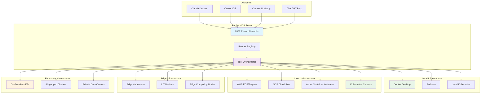

# Infrastructure Compatibility Guide

Kubiya's MCP server is designed to run tools on **any infrastructure** with **zero vendor lock-in**. This guide covers how to deploy and configure Kubiya runners across different environments.

## 🏗️ Infrastructure Overview

<div className="diagram-container">

</div>

## 🐳 Local Development

### Docker Desktop

**Perfect for development and testing**

```bash
# Prerequisites
# - Docker Desktop installed
# - Kubiya CLI installed

# 1. Start Docker Desktop
# 2. Configure local runner
kubiya runner create local-docker \
    --type docker \
    --name "Local Development" \
    --description "Local Docker Desktop runner"

# 3. Test the runner
kubiya runner test local-docker

# 4. Start MCP server
kubiya mcp serve
```

**Configuration:**
```json
{
  "runners": {
    "local-docker": {
      "type": "docker",
      "endpoint": "unix:///var/run/docker.sock",
      "network": "bridge",
      "resource_limits": {
        "cpu": "2",
        "memory": "4Gi"
      }
    }
  }
}
```

### Podman

**Alternative to Docker with rootless containers**

```bash
# Prerequisites
# - Podman installed
# - Podman socket enabled

# 1. Start Podman socket
systemctl --user start podman.socket

# 2. Create runner
kubiya runner create local-podman \
    --type podman \
    --endpoint "unix:///run/user/1000/podman/podman.sock"

# 3. Test execution
kubiya tool execute hello-world --runner local-podman
```

### Local Kubernetes

**Full Kubernetes experience locally**

```bash
# Options: minikube, kind, k3s, Docker Desktop Kubernetes

# 1. Start local cluster
minikube start --driver=docker

# 2. Create Kubernetes runner
kubiya runner create local-k8s \
    --type kubernetes \
    --kubeconfig ~/.kube/config \
    --namespace kubiya-tools

# 3. Install required resources
kubectl apply -f - <<EOF
apiVersion: v1
kind: Namespace
metadata:
  name: kubiya-tools
---
apiVersion: rbac.authorization.k8s.io/v1
kind: ClusterRole
metadata:
  name: kubiya-runner
rules:
- apiGroups: [""]
  resources: ["pods", "pods/log"]
  verbs: ["create", "get", "list", "watch", "delete"]
- apiGroups: ["batch"]
  resources: ["jobs"]
  verbs: ["create", "get", "list", "watch", "delete"]
EOF
```

## ☁️ Cloud Infrastructure

### Amazon Web Services (AWS)

#### ECS Fargate

**Serverless container execution**

```bash
# 1. Create ECS cluster
aws ecs create-cluster --cluster-name kubiya-tools

# 2. Create task definition
aws ecs register-task-definition --cli-input-json file://task-definition.json

# 3. Create runner
kubiya runner create aws-fargate \
    --type aws-fargate \
    --cluster kubiya-tools \
    --subnet subnet-xxx \
    --security-group sg-xxx \
    --execution-role arn:aws:iam::account:role/ecsTaskExecutionRole
```

**Task Definition (`task-definition.json`):**
```json
{
  "family": "kubiya-tool",
  "networkMode": "awsvpc",
  "requiresCompatibilities": ["FARGATE"],
  "cpu": "256",
  "memory": "512",
  "executionRoleArn": "arn:aws:iam::ACCOUNT:role/ecsTaskExecutionRole",
  "containerDefinitions": [
    {
      "name": "tool",
      "image": "alpine:latest",
      "essential": true,
      "logConfiguration": {
        "logDriver": "awslogs",
        "options": {
          "awslogs-group": "/kubiya/tools",
          "awslogs-region": "us-east-1",
          "awslogs-stream-prefix": "tool"
        }
      }
    }
  ]
}
```

#### EKS (Kubernetes on AWS)

**Managed Kubernetes service**

```bash
# 1. Create EKS cluster
eksctl create cluster \
    --name kubiya-tools \
    --region us-east-1 \
    --nodegroup-name workers \
    --node-type m5.large \
    --nodes 2 \
    --nodes-min 1 \
    --nodes-max 4

# 2. Install AWS Load Balancer Controller
kubectl apply -k "github.com/aws/eks-charts/stable/aws-load-balancer-controller//crds?ref=master"

# 3. Create runner
kubiya runner create aws-eks \
    --type kubernetes \
    --kubeconfig ~/.kube/config \
    --namespace kubiya-tools \
    --context arn:aws:eks:us-east-1:ACCOUNT:cluster/kubiya-tools
```

### Google Cloud Platform (GCP)

#### Cloud Run

**Fully managed serverless containers**

```bash
# 1. Enable Cloud Run API
gcloud services enable run.googleapis.com

# 2. Create service account
gcloud iam service-accounts create kubiya-runner \
    --display-name "Kubiya Runner"

# 3. Grant permissions
gcloud projects add-iam-policy-binding PROJECT_ID \
    --member="serviceAccount:kubiya-runner@PROJECT_ID.iam.gserviceaccount.com" \
    --role="roles/run.developer"

# 4. Create runner
kubiya runner create gcp-cloudrun \
    --type gcp-cloudrun \
    --project PROJECT_ID \
    --region us-central1 \
    --service-account kubiya-runner@PROJECT_ID.iam.gserviceaccount.com
```

#### GKE (Google Kubernetes Engine)

**Managed Kubernetes on GCP**

```bash
# 1. Create GKE cluster
gcloud container clusters create kubiya-tools \
    --zone us-central1-a \
    --num-nodes 2 \
    --enable-autoscaling \
    --min-nodes 1 \
    --max-nodes 10

# 2. Get credentials
gcloud container clusters get-credentials kubiya-tools \
    --zone us-central1-a

# 3. Create runner
kubiya runner create gcp-gke \
    --type kubernetes \
    --kubeconfig ~/.kube/config \
    --namespace kubiya-tools
```

### Microsoft Azure

#### Container Instances

**Serverless containers on Azure**

```bash
# 1. Create resource group
az group create --name kubiya-tools --location eastus

# 2. Create container registry (optional)
az acr create --resource-group kubiya-tools \
    --name kubiyatools \
    --sku Basic

# 3. Create runner
kubiya runner create azure-aci \
    --type azure-aci \
    --resource-group kubiya-tools \
    --location eastus \
    --registry kubiyatools.azurecr.io
```

#### AKS (Azure Kubernetes Service)

**Managed Kubernetes on Azure**

```bash
# 1. Create AKS cluster
az aks create \
    --resource-group kubiya-tools \
    --name kubiya-cluster \
    --node-count 2 \
    --enable-addons monitoring \
    --generate-ssh-keys

# 2. Get credentials
az aks get-credentials \
    --resource-group kubiya-tools \
    --name kubiya-cluster

# 3. Create runner
kubiya runner create azure-aks \
    --type kubernetes \
    --kubeconfig ~/.kube/config \
    --namespace kubiya-tools
```

## 🏢 Enterprise Infrastructure

### On-Premises Kubernetes

**Self-managed Kubernetes clusters**

```bash
# 1. Prepare cluster access
# Ensure kubectl is configured for your cluster

# 2. Create namespace and RBAC
kubectl apply -f - <<EOF
apiVersion: v1
kind: Namespace
metadata:
  name: kubiya-tools
---
apiVersion: v1
kind: ServiceAccount
metadata:
  name: kubiya-runner
  namespace: kubiya-tools
---
apiVersion: rbac.authorization.k8s.io/v1
kind: ClusterRole
metadata:
  name: kubiya-runner
rules:
- apiGroups: [""]
  resources: ["pods", "pods/log", "configmaps", "secrets"]
  verbs: ["create", "get", "list", "watch", "delete"]
- apiGroups: ["batch"]
  resources: ["jobs"]
  verbs: ["create", "get", "list", "watch", "delete"]
- apiGroups: ["apps"]
  resources: ["deployments"]
  verbs: ["create", "get", "list", "watch", "delete"]
---
apiVersion: rbac.authorization.k8s.io/v1
kind: ClusterRoleBinding
metadata:
  name: kubiya-runner
roleRef:
  apiGroup: rbac.authorization.k8s.io
  kind: ClusterRole
  name: kubiya-runner
subjects:
- kind: ServiceAccount
  name: kubiya-runner
  namespace: kubiya-tools
EOF

# 3. Create runner
kubiya runner create on-prem-k8s \
    --type kubernetes \
    --kubeconfig ~/.kube/config \
    --namespace kubiya-tools \
    --service-account kubiya-runner
```

### Air-gapped Environments

**Completely isolated networks**

```bash
# 1. Prepare container images
# Download and transfer required images to air-gapped registry

# 2. Configure private registry
kubectl apply -f - <<EOF
apiVersion: v1
kind: Secret
metadata:
  name: registry-credentials
  namespace: kubiya-tools
type: kubernetes.io/dockerconfigjson
data:
  .dockerconfigjson: BASE64_ENCODED_DOCKER_CONFIG
EOF

# 3. Create runner with private registry
kubiya runner create airgapped-k8s \
    --type kubernetes \
    --kubeconfig ~/.kube/config \
    --namespace kubiya-tools \
    --registry-secret registry-credentials \
    --image-pull-policy Always
```

**Air-gapped Configuration:**
```json
{
  "runners": {
    "airgapped-k8s": {
      "type": "kubernetes",
      "namespace": "kubiya-tools",
      "image_registry": "private-registry.company.com",
      "image_pull_policy": "Always",
      "registry_secret": "registry-credentials",
      "network_policies": {
        "enable_ingress": false,
        "enable_egress": false,
        "allowed_cidrs": ["10.0.0.0/8"]
      }
    }
  }
}
```

## 🌐 Edge Computing

### Edge Kubernetes

**Kubernetes at the edge**

```bash
# 1. Deploy lightweight Kubernetes (k3s)
curl -sfL https://get.k3s.io | sh -

# 2. Configure edge runner
kubiya runner create edge-k3s \
    --type kubernetes \
    --kubeconfig /etc/rancher/k3s/k3s.yaml \
    --namespace kubiya-tools \
    --edge-mode true \
    --local-storage true
```

### IoT and Edge Devices

**Container execution on edge devices**

```bash
# 1. Install Docker on edge device
curl -fsSL https://get.docker.com | sh

# 2. Create lightweight runner
kubiya runner create edge-docker \
    --type docker \
    --endpoint unix:///var/run/docker.sock \
    --resource-limits cpu=1,memory=1Gi \
    --local-only true
```

## 🔧 Runner Configuration

### Resource Management

```yaml
# Runner resource configuration
resource_management:
  default_limits:
    cpu: "1"
    memory: "1Gi"
    ephemeral_storage: "10Gi"
  
  default_requests:
    cpu: "100m"
    memory: "128Mi"
  
  autoscaling:
    enabled: true
    min_replicas: 1
    max_replicas: 10
    target_cpu_utilization: 70
```

### Network Configuration

```yaml
# Network security configuration
network_config:
  ingress_rules:
    - from_port: 8080
      to_port: 8080
      protocol: tcp
      cidr_blocks: ["10.0.0.0/8"]
  
  egress_rules:
    - to_port: 443
      protocol: tcp
      cidr_blocks: ["0.0.0.0/0"]  # HTTPS outbound
    - to_port: 80
      protocol: tcp
      cidr_blocks: ["0.0.0.0/0"]   # HTTP outbound
```

### Security Configuration

```yaml
# Security policies
security_config:
  pod_security_policy:
    run_as_non_root: true
    read_only_root_filesystem: true
    allow_privilege_escalation: false
  
  network_policies:
    default_deny: true
    allow_egress_to_registry: true
    allow_egress_to_api: true
  
  rbac:
    create_service_account: true
    bind_cluster_role: false
    custom_rules:
      - apiGroups: [""]
        resources: ["pods"]
        verbs: ["create", "get", "list", "delete"]
```

## 📊 Multi-Runner Management

### Runner Selection Algorithm

```python
# Automatic runner selection
def select_optimal_runner(tool_requirements, user_context):
    available_runners = get_available_runners()
    
    # Filter by requirements
    compatible_runners = [
        runner for runner in available_runners
        if runner.can_satisfy(tool_requirements)
    ]
    
    # Score based on multiple factors
    scored_runners = []
    for runner in compatible_runners:
        score = calculate_runner_score(runner, tool_requirements)
        scored_runners.append((runner, score))
    
    # Return best runner
    return max(scored_runners, key=lambda x: x[1])[0]

def calculate_runner_score(runner, requirements):
    score = 0
    
    # Geographic proximity
    if runner.region == user_context.region:
        score += 50
    
    # Current load
    score += (100 - runner.current_load_percentage)
    
    # Cost efficiency
    score += (100 - runner.cost_per_hour)
    
    # Health status
    if runner.healthy:
        score += 100
    
    return score
```

### Load Balancing

```yaml
# Load balancing configuration
load_balancing:
  strategy: "round_robin"  # round_robin, least_connections, weighted
  
  health_checks:
    enabled: true
    interval: 30s
    timeout: 5s
    failure_threshold: 3
  
  failover:
    enabled: true
    backup_runners: ["local-docker", "aws-fargate"]
    max_retry_attempts: 3
```

## 🚀 Advanced Configurations

### Multi-Cloud Setup

```bash
# 1. Configure multiple cloud runners
kubiya runner create aws-primary \
    --type aws-fargate \
    --region us-east-1 \
    --priority 1

kubiya runner create gcp-secondary \
    --type gcp-cloudrun \
    --region us-central1 \
    --priority 2

kubiya runner create azure-tertiary \
    --type azure-aci \
    --region eastus \
    --priority 3

# 2. Configure failover chain
kubiya runner configure-failover \
    --primary aws-primary \
    --secondary gcp-secondary \
    --tertiary azure-tertiary
```

### Hybrid Cloud

```yaml
# Hybrid cloud configuration
hybrid_config:
  on_premises:
    - name: "datacenter-1"
      type: "kubernetes"
      location: "us-east-datacenter"
      priority: 1
      
  cloud:
    - name: "aws-burst"
      type: "aws-fargate"
      region: "us-east-1"
      priority: 2
      burst_capacity: true
      
  policies:
    data_residency: "us-only"
    burst_threshold: 80  # Use cloud when on-prem is 80% utilized
    cost_optimization: true
```

## 🔍 Monitoring and Observability

### Runner Health Monitoring

```python
# Health check implementation
class RunnerHealthMonitor:
    async def check_runner_health(self, runner):
        checks = {
            "container_runtime": await self.check_container_runtime(runner),
            "network_connectivity": await self.check_network(runner),
            "resource_availability": await self.check_resources(runner),
            "registry_access": await self.check_registry_access(runner)
        }
        
        return {
            "runner_id": runner.id,
            "healthy": all(checks.values()),
            "checks": checks,
            "timestamp": datetime.utcnow()
        }
```

### Performance Metrics

```yaml
# Monitoring configuration
monitoring:
  metrics:
    - name: "runner_utilization"
      type: "gauge"
      labels: ["runner_id", "runner_type"]
      
    - name: "tool_execution_duration"
      type: "histogram"
      labels: ["tool_name", "runner_id"]
      
    - name: "runner_health_status"
      type: "gauge"
      labels: ["runner_id", "health_check"]
      
  alerts:
    - name: "runner_down"
      condition: "runner_health_status == 0"
      severity: "critical"
      
    - name: "high_utilization"
      condition: "runner_utilization > 90"
      severity: "warning"
```

## 📚 Best Practices

### 1. **Security First**
- Use dedicated service accounts
- Enable network policies
- Implement resource quotas
- Regular security audits

### 2. **Resource Optimization**
- Right-size containers
- Use resource limits
- Implement auto-scaling
- Monitor costs

### 3. **High Availability**
- Deploy multiple runners
- Configure failover
- Health monitoring
- Backup strategies

### 4. **Performance**
- Use local registries
- Pre-pull common images
- Optimize network paths
- Cache frequently used tools

## 🎯 Next Steps

<CardGroup cols={2}>
  <Card title="🔧 Runner Setup Guide" icon="tools" href="/mcp/runner-setup">
    Detailed setup instructions for each runner type
  </Card>
  
  <Card title="🛡️ Security Configuration" icon="shield" href="/mcp/security-config">
    Comprehensive security setup guide
  </Card>
  
  <Card title="📊 Monitoring Setup" icon="chart-line" href="/mcp/monitoring-setup">
    Configure monitoring and observability
  </Card>
  
  <Card title="🚀 Performance Tuning" icon="rocket" href="/mcp/performance-tuning">
    Optimize performance for your workloads
  </Card>
</CardGroup>

---

This infrastructure compatibility ensures that Kubiya MCP tools can run **anywhere** - from your laptop to the largest enterprise data centers, with the same consistent experience and security model.