# Kubiya MCP Server

Connect any AI assistant (Claude, ChatGPT, Cursor, or custom LLMs) to the **full power of Kubiya** using the Model Context Protocol (MCP). The Kubiya CLI includes a comprehensive MCP server that requires **zero dependencies** and can run anywhere with just a single `KUBIYA_API_KEY`. as taken from [the app](https://app.kubiya.ai/api-keys)

## 🚀 Why Kubiya MCP?

<CardGroup cols={2}>
  <Card title="🏢 Enterprise-Ready AI" icon="building">
    **Serverless Agents** with production-grade execution, policy enforcement, and audit trails
  </Card>
  <Card title="🛠️ Serverless Tools" icon="wrench">
    **Container-based tools** that run anywhere - from simple scripts to complex applications
  </Card>
  <Card title="🏃 Local & Cloud Runners" icon="server">
    Execute on **your infrastructure** or use **Kubiya-hosted runners** for instant scalability
  </Card>
  <Card title="🛡️ Policy Enforcement" icon="shield">
    **OPA-based policies** with pre-execution validation and comprehensive access control
  </Card>
</CardGroup>

## ✨ Zero Setup Required

Unlike other MCP servers, Kubiya requires **no additional dependencies**:

```bash
# That's it! Just the Kubiya CLI
curl -fsSL https://raw.githubusercontent.com/kubiyabot/cli/main/install.sh | bash

# Set your API key
export KUBIYA_API_KEY="kb-..."

# Start MCP server (runs anywhere!)
kubiya mcp serve
```

## 🎯 Key Capabilities for LLMs

### 1. **Serverless AI Agents**
- **Conversational Agents**: Multi-turn conversations with memory and context
- **Tool-Calling Agents**: Agents that can execute workflows and tools autonomously  
- **Custom Agent Logic**: Define agent behavior, personality, and capabilities
- **Identity-Aware**: Execute with proper user attribution and permissions

### 2. **🏠 Execution on Your Infrastructure**

**Critical difference**: Your data and workloads never leave your environment.

```mermaid
graph TB
    subgraph "❌ Traditional AI Platforms"
        YData1["🏢 Your Data"]
        ThirdParty["☁️ Third-Party Cloud<br/>❌ Data leaves network<br/>❌ Compliance risks<br/>❌ Vendor lock-in"]
        
        YData1 --> ThirdParty
    end
    
    subgraph "✅ Kubiya Architecture"
        YData2["🏢 Your Data"]
        YInfra["🏠 Your Infrastructure<br/>✅ Data stays local<br/>✅ Full compliance<br/>✅ Complete control"]
        
        YData2 --> YInfra
    end
    
    classDef bad fill:#ffebee
    classDef good fill:#e8f5e8
    
    class ThirdParty bad
    class YInfra good
```



**🔒 Security & Compliance**:
- **🏠 Data Locality**: Everything executes in your environment
- **🛡️ Zero Trust**: Policy validation before execution
- **📋 Compliance Ready**: GDPR, SOC2 in your infrastructure
- **🔐 Air-Gap Capable**: Works completely offline

### 3. **🧠 LLM-Native Design**

Every component designed for AI agent interaction:

```mermaid
mindmap
  root)🧠 LLM-Native Features(
    📝 Documentation
      Natural Language
      Examples & Use Cases
      Common Failures
      Alternative Suggestions
    🔍 Discovery
      Semantic Search
      Intent-Based Matching
      Context Awareness
      Auto-Suggestions
    🎯 Execution
      Self-Describing Steps
      Progress Streaming
      Error Context
      Success Metrics
    🔄 Adaptation
      Dynamic Modification
      Learning from Usage
      Improvement Hints
      Pattern Recognition
```



## 🔧 21+ LLM-Optimized MCP Tools

Every tool designed for AI agent understanding and execution:

### Core Execution Tools
| Tool | Description | Use Case |
|------|-------------|----------|
| `execute_tool` | Run any tool with live streaming | Execute Docker containers, scripts, APIs |
| `create_on_demand_tool` | Create and run tools from definitions | Build custom automation on-the-fly |
| `execute_workflow` | Run complete workflows | Complex multi-step automation |
| `execute_whitelisted_tool` | Run pre-approved tools | Secure, controlled tool execution |

### Platform Management
| Tool | Description | Use Case |
|------|-------------|----------|
| `check_runner_health` | Health status of runners | Monitor system health |
| `find_available_runner` | Auto-select best runner | Optimal execution placement |
| `list_agents` | List AI agents | Discover available agents |
| `chat_with_agent` | Conversational agent interaction | Multi-turn AI conversations |
| `list secrets` | List available secrets | Get confidential information |
| `list_integrations` | List avalable integrations | Gather system-wide info |

### Tool & Source Management  
| Tool | Description | Use Case |
|------|-------------|----------|
| `list_sources` | List tool repositories | Discover available tools |
| `execute_tool_from_source` | Run tools from specific sources | Execute from GitHub/GitLab repos |
| `discover_source` | Explore source contents | Preview tools before execution |
| `list_integrations` | List available integrations | See AWS, K8s, DB connections |

### Knowledge & Security
|------|-------------|----------|
| `search_kb` | Search knowledge base | Find documentation, procedures |
| `list_kb` | Browse knowledge entries | Explore organizational knowledge |
| `list_secrets` | List available secrets | Check available credentials |

## 📋 Quick Setup Examples

### Claude Desktop Integration

```json
{
  "mcpServers": {
    "kubiya": {
      "command": "kubiya",
      "args": ["mcp", "serve"],
      "env": {
        "KUBIYA_API_KEY": "kb-your-api-key-here"
      }
    }
  }
}
```

### Cursor Integration

```json
{
  "mcp.servers": {
    "kubiya": {
      "command": "kubiya",
      "args": ["mcp", "serve"],
      "env": {
        "KUBIYA_API_KEY": "kb-your-api-key-here"
      }
    }
  }
}
```

### Custom LLM Integration (Python)

```python
import asyncio
from mcp import ClientSession, StdioServerParameters
from mcp.client.stdio import StdioServerTransport

async def use_kubiya_tools():
    # Connect to Kubiya MCP server
    server_params = StdioServerParameters(
        command="kubiya",
        args=["mcp", "serve"],
        env={"KUBIYA_API_KEY": "kb-your-key"}
    )
    
    async with StdioServerTransport(server_params) as (read, write):
        async with ClientSession(read, write) as session:
            # Initialize
            await session.initialize()
            
            # List available tools
            tools = await session.list_tools()
            print(f"Available tools: {[t.name for t in tools.tools]}")
            
            # Execute a tool
            result = await session.call_tool(
                "execute_tool",
                {
                    "tool_name": "kubectl",
                    "args": {"command": "get pods -A"},
                    "runner": "auto"
                }
            )
            print(result.content)

# Run it
asyncio.run(use_kubiya_tools())
```

## 🛠️ Real-World Examples

### 1. **Infrastructure Automation**

```python
# In Claude/ChatGPT, just say:
"Create a tool that checks our Kubernetes cluster health and restarts any failed pods"

# Kubiya will create and execute:
# - kubectl get pods --all-namespaces --field-selector=status.phase=Failed
# - kubectl delete pod <failed-pods> --grace-period=0
# - kubectl get pods --watch (to verify restart)
```

### 2. **DevOps Workflows**

```python
# Ask your AI:
"Deploy our application to staging with version 2.1.0, run tests, and promote to production if successful"

# Kubiya executes the complete workflow:
# - docker build -t app:2.1.0
# - kubectl apply -f k8s/staging/ 
# - run integration tests
# - if tests pass: kubectl apply -f k8s/production/
# - send notification to Slack
```

### 3. **Data Engineering**

```python
# Natural language request:
"Process the daily sales data, validate it, transform it to our schema, and load it into the warehouse"

# Kubiya handles the entire pipeline:
# - Download data from S3
# - Python/pandas data validation
# - ETL transformations  
# - Load to Snowflake/BigQuery
# - Data quality checks
# - Alerting on failures
```

## 🚀 Advanced Features

### **Policy-Based Access Control**

```bash
# Enable policy enforcement
export KUBIYA_OPA_ENFORCE=true

# Create policies via CLI
kubiya policy create --name "prod-access" --file policy.rego

# Test permissions
kubiya policy test-tool --tool kubectl --args '{"command": "delete pod"}' --runner prod
```

### **Runner Auto-Selection**

```python
# Automatic runner selection based on:
# - Health status
# - Current load  
# - Geographic location
# - Resource requirements
{
  "tool_name": "heavy-computation",
  "runner": "auto",  # Kubiya picks the best runner
  "args": {"dataset": "large"}
}
```

### **Platform API Access**

```bash
# Enable full platform capabilities  
kubiya mcp serve --allow-platform-apis

# Now AI can manage:
# - Create/delete runners
# - Manage integrations
# - Control agent deployments
# - Administer knowledge base
```

## 🔧 Configuration Options

### Environment Variables

| Variable | Description | Default |
|----------|-------------|---------|
| `KUBIYA_API_KEY` | **Required** - Your Kubiya API key | None |
| `KUBIYA_API_URL` | Kubiya API endpoint | `https://api.kubiya.ai` |
| `KUBIYA_OPA_ENFORCE` | Enable policy enforcement | `false` |
| `KUBIYA_DEFAULT_RUNNER` | Default runner for execution | `auto` |
| `KUBIYA_MCP_ALLOW_PLATFORM_APIS` | Enable platform management tools | `false` |

### MCP Server Options

```bash
# Basic server
kubiya mcp serve

# With platform APIs enabled
kubiya mcp serve --allow-platform-apis

# With policy enforcement  
KUBIYA_OPA_ENFORCE=true kubiya mcp serve

# Custom configuration file
kubiya mcp serve --config ~/.kubiya/mcp-config.json
```

### Configuration File Example (`~/.kubiya/mcp-server.json`)

```json
{
  "enable_runners": true,
  "allow_platform_apis": false,
  "enable_opa_policies": false,
  "allow_dynamic_tools": false,
  "verbose_logging": false,
  "whitelisted_tools": [
    {
      "name": "kubectl",
      "alias": "",
      "description": "Executes kubectl commands. For namespace-scoped resources, include '-n <namespace>' in the command. Use '--all-namespaces' for cluster-wide queries. Some resources like nodes and persistent volumes are cluster-scoped and don't require a namespace.",
      "type": "docker",
      "content": "\nset -eu\nTOKEN_LOCATION=\"/tmp/kubernetes_context_token\"\nCERT_LOCATION=\"/tmp/kubernetes_context_cert\"\n# Inject in-cluster context using the temporary token file\nif [ -f $TOKEN_LOCATION ] && [ -f $CERT_LOCATION ]; then\n    KUBE_TOKEN=$(cat $TOKEN_LOCATION)\n    kubectl config set-cluster in-cluster --server=https://kubernetes.default.svc --certificate-authority=$CERT_LOCATION > /dev/null 2>&1\n    kubectl config set-credentials in-cluster --token=$KUBE_TOKEN > /dev/null 2>&1\n    kubectl config set-context in-cluster --cluster=in-cluster --user=in-cluster > /dev/null 2>&1\n    kubectl config use-context in-cluster > /dev/null 2>&1\nelse\n    echo \"Error: Kubernetes context token or cert file not found at $TOKEN_LOCATION or $CERT_LOCATION respectively.\"\n    exit 1\nfi\n\n\n    #!/bin/bash\n    set -e\n\n    # Show the command being executed\n    echo \"🔧 Executing: kubectl $command\"\n\n    # Run the kubectl command\n    if eval \"kubectl $command\"; then\n        echo \"✅ Command executed successfully\"\n    else\n        echo \"❌ Command failed: kubectl $command\"\n        exit 1\n    fi\n    ",
      "args": [
        {
          "name": "command",
          "type": "string",
          "description": "The full kubectl command to execute. Examples include (but are not limited to):\n- 'get pods -n default'\n- 'create namespace test'\n- 'get pods --all-namespaces'\n- 'get nodes'  # cluster-scoped resource, no namespace needed\n- 'describe node my-node-1'",
          "required": true
        }
      ],
      "env": null,
      "with_files": [
        {
          "source": "/var/run/secrets/kubernetes.io/serviceaccount/token",
          "destination": "/tmp/kubernetes_context_token"
        },
        {
          "source": "/var/run/secrets/kubernetes.io/serviceaccount/ca.crt",
          "destination": "/tmp/kubernetes_context_cert"
        }
      ],
      "with_volumes": null,
      "icon_url": "https://kubernetes.io/icons/icon-128x128.png",
      "image": "kubiya/kubectl-light:latest",
      "mermaid": "graph TD\n    %% Styles\n    classDef triggerClass fill:#3498db,color:#fff,stroke:#2980b9,stroke-width:2px,font-weight:bold\n    classDef paramClass fill:#2ecc71,color:#fff,stroke:#27ae60,stroke-width:2px\n    classDef execClass fill:#e74c3c,color:#fff,stroke:#c0392b,stroke-width:2px,font-weight:bold\n    classDef envClass fill:#f39c12,color:#fff,stroke:#f1c40f,stroke-width:2px\n\n    %% Main Components\n    Trigger(\"Trigger\"):::triggerClass\n    Params(\"Parameters\"):::paramClass\n    Exec(\"kubectl\"):::execClass\n    Env(\"Environment\"):::envClass\n\n    %% Flow\n    Trigger --> Params --> Exec\n    Env --> Exec\n\n    %% Trigger Options\n    User(\"User\")\n    API(\"API\")\n    Webhook(\"Webhook\")\n    Cron(\"Scheduled\")\n    User --> Trigger\n    API --> Trigger\n    Webhook --> Trigger\n    Cron --> Trigger\n\n    %% Parameters\n    subgraph Parameters[\"Parameters\"]\n        direction TB\n        Param0(\"command (Required)<br/>The full kubectl command to execute. Examples include (but are not limited to):<br/>- 'get pods -n default'<br/>- 'create namespace test'<br/>- 'get pods --all-namespaces'<br/>- 'get nodes'  # cluster-scoped resource, no namespace needed<br/>- 'describe node my-node-1'<br/>Type: string\"):::paramClass\n    end\n    Parameters --- Params\n\n    %% Execution\n    subgraph Execution[\"Execution\"]\n        direction TB\n        Code(\"Script: <br/>set -eu<br/>TOKEN_LOCATION=\\\"/tmp/kubernetes_context_t...\")\n        Type(\"Type: Docker\")\n        Image(\"Docker Image: kubiya/kubectl-light:latest\")\n    end\n    Execution --- Exec\n\n    %% Environment\n    subgraph Environment[\"Environment\"]\n        direction TB\n    end\n    Environment --- Env\n\n    %% Context Note\n    ContextNote(\"Parameter values can be<br/>fetched from context<br/>based on the trigger\")\n    ContextNote -.-> Params",
      "runner": "core-testing-2"
    }
  ]
}
```
this configuration file makes the mcp server expose a sigle kubectl tool and hides internal kubiya operations from the mcp

## 🎯 Use Cases for AI Applications

### **1. Enterprise Automation Assistant**
- **User**: "Please backup our production database and notify the team"
- **AI + Kubiya**: Executes secure backup workflow with proper credentials and notifications

### **2. DevOps Copilot** 
- **User**: "The app is down in production, please investigate and fix"
- **AI + Kubiya**: Checks logs, identifies issues, applies fixes, and reports back

### **3. Data Analysis Agent**
- **User**: "Analyze last month's sales trends and create a report"
- **AI + Kubiya**: Queries databases, runs analysis scripts, generates visualizations

### **4. Infrastructure Management**
- **User**: "Scale up our Kubernetes cluster for the upcoming traffic spike"
- **AI + Kubiya**: Safely scales infrastructure with proper validation and monitoring

## 🔒 Security & Compliance

### **Identity-Aware Execution**
- Every action is tied to the authenticated user
- Granular permissions via OPA policies
- Complete audit trails for compliance

### **Secure by Default**
- Tools run in isolated containers
- Secrets are encrypted and managed securely
- Network policies control access

### **Enterprise Features**
- SSO/OIDC integration
- Role-based access control (RBAC)
- SOC2 compliant infrastructure
- Air-gapped deployment options

## 📚 Next Steps

<CardGroup cols={2}>
  <Card title="🚀 Quick Start" icon="rocket" href="/mcp/quickstart">
    Get started in 5 minutes
  </Card>
  <Card title="🔧 Tools Reference" icon="wrench" href="/mcp/tools-reference">
    Complete tool documentation
  </Card>
  <Card title="🛡️ Authentication" icon="shield" href="/mcp/authentication">
    Setup authentication and policies
  </Card>
  <Card title="💡 Examples" icon="lightbulb" href="/mcp/examples">
    Real-world integration examples
  </Card>
</CardGroup>

## 🆘 Support & Community

- **Documentation**: [https://docs.kubiya.ai](https://docs.kubiya.ai)
- **GitHub**: [https://github.com/kubiyabot/cli](https://github.com/kubiyabot/cli)
- **API Keys**: [Get your API key](https://app.kubiya.ai/api-keys)

---

**Ready to supercharge your AI with enterprise-grade automation?** The Kubiya MCP server brings the full power of the Kubiya platform to any AI assistant with zero setup complexity.
