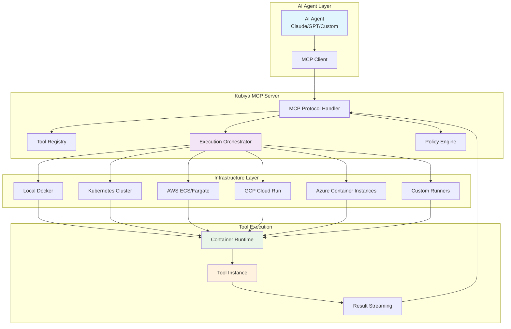
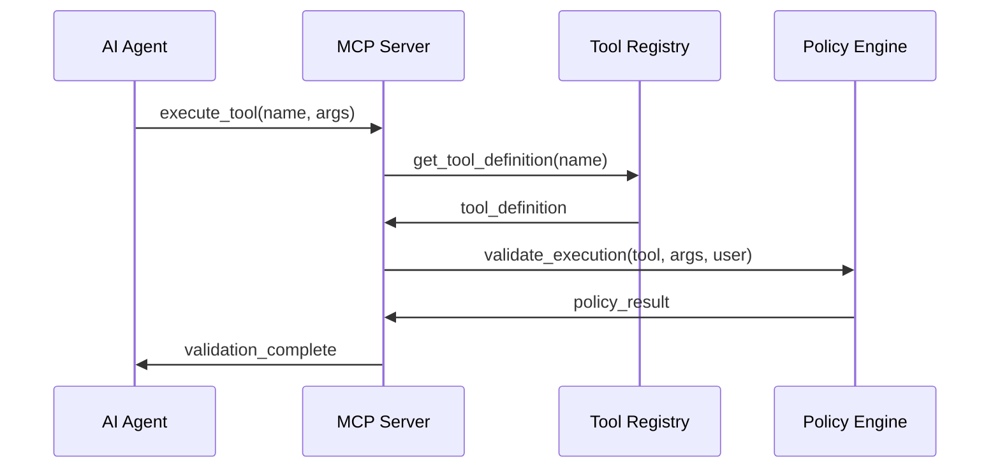
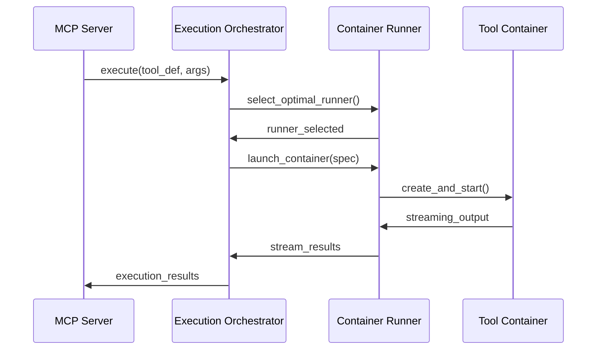

# Serverless Tools Architecture

Kubiya's MCP server exposes a revolutionary **serverless tools architecture** that enables any AI agent to execute **containerized tools** on **any infrastructure** with **zero configuration**. This document explores the technical architecture that makes this possible.

## 🏗️ Architecture Overview

<div className="diagram-container">

</div>

## 🔧 Core Components

### 1. **MCP Protocol Handler**

The entry point for all AI agent interactions:

```python
# MCP Protocol Flow
async def handle_mcp_request(request):
    # 1. Parse MCP request
    tool_name = request.get("name")
    arguments = request.get("arguments")
    
    # 2. Resolve tool definition
    tool_def = await tool_registry.get_tool(tool_name)
    
    # 3. Apply security policies
    policy_result = await policy_engine.validate(tool_def, arguments)
    
    # 4. Execute on optimal infrastructure
    result = await execution_orchestrator.execute(
        tool_def, 
        arguments, 
        policy_result
    )
    
    # 5. Stream results back to agent
    return mcp_response(result)
```

### 2. **Tool Registry**

Centralized catalog of available tools:

```yaml
# Tool Definition Schema
tool_definition:
  name: "kubectl"
  description: "Execute Kubernetes commands"
  container:
    image: "bitnami/kubectl:latest"
    command: ["kubectl"]
    args: ["${COMMAND}"]
  parameters:
    command:
      type: string
      description: "Kubernetes command to execute"
      required: true
  integrations:
    - name: "k8s-prod"
      type: "kubernetes"
      required: true
  resource_requirements:
    memory: "128Mi"
    cpu: "100m"
  execution_timeout: "300s"
```

### 3. **Execution Orchestrator**

Intelligent tool execution engine:

```python
class ExecutionOrchestrator:
    async def execute(self, tool_def, arguments, policy_context):
        # 1. Select optimal runner
        runner = await self.select_runner(tool_def, policy_context)
        
        # 2. Prepare execution environment
        env = await self.prepare_environment(tool_def, arguments)
        
        # 3. Launch container
        container = await runner.launch_container(
            image=tool_def.container.image,
            command=tool_def.container.command,
            args=self.resolve_args(tool_def.container.args, arguments),
            environment=env,
            resources=tool_def.resource_requirements
        )
        
        # 4. Stream execution results
        async for output in container.stream_logs():
            yield output
            
        # 5. Collect final result
        result = await container.wait_for_completion()
        return result
```

## 🌐 Infrastructure Compatibility

### Supported Runner Types

<CardGroup cols={2}>
  <Card title="🐳 Docker Local" icon="docker">
    **Local Development**
    - Single machine execution
    - Docker Desktop/Engine
    - Instant setup
    - Full tool compatibility
  </Card>
  
  <Card title="☸️ Kubernetes" icon="kubernetes">
    **Production Clusters**
    - Any Kubernetes cluster
    - Auto-scaling pods
    - Resource management
    - Enterprise security
  </Card>
  
  <Card title="☁️ Cloud Serverless" icon="cloud">
    **Managed Services**
    - AWS ECS/Fargate
    - GCP Cloud Run
    - Azure Container Instances
    - Auto-scaling & billing
  </Card>
  
  <Card title="🏢 Enterprise" icon="building">
    **Custom Infrastructure**
    - On-premises data centers
    - Air-gapped environments
    - Custom container runtimes
    - Compliance requirements
  </Card>
</CardGroup>

### Runner Selection Algorithm

```python
async def select_runner(self, tool_def, policy_context):
    # 1. Filter by policy constraints
    allowed_runners = policy_context.get("allowed_runners", [])
    
    # 2. Check resource requirements
    compatible_runners = []
    for runner in self.available_runners:
        if runner.can_satisfy_requirements(tool_def.resource_requirements):
            compatible_runners.append(runner)
    
    # 3. Select optimal runner based on:
    # - Current load
    # - Geographic proximity
    # - Cost optimization
    # - Health status
    
    return self.rank_runners(compatible_runners)[0]
```

## 🛠️ Tool Execution Lifecycle

### 1. **Tool Resolution**



### 2. **Container Orchestration**



### 3. **Result Streaming**

```python
async def stream_tool_execution(tool_name, arguments):
    """Stream tool execution results in real-time"""
    
    async for chunk in execution_orchestrator.execute_stream(
        tool_name, arguments
    ):
        # Stream different types of output
        if chunk.type == "stdout":
            yield {"type": "output", "content": chunk.data}
        elif chunk.type == "stderr":
            yield {"type": "error", "content": chunk.data}
        elif chunk.type == "status":
            yield {"type": "status", "content": chunk.data}
        elif chunk.type == "result":
            yield {"type": "result", "content": chunk.data}
```

## 🏃 Runner Architecture

### Local Docker Runner

```python
class LocalDockerRunner:
    def __init__(self):
        self.docker_client = docker.from_env()
        self.runner_type = "local-docker"
    
    async def launch_container(self, spec):
        container = self.docker_client.containers.run(
            image=spec.image,
            command=spec.command,
            environment=spec.environment,
            detach=True,
            stream=True,
            auto_remove=True
        )
        
        return ContainerInstance(container)
```

### Kubernetes Runner

```python
class KubernetesRunner:
    def __init__(self, cluster_config):
        self.k8s_client = kubernetes.client.ApiClient(cluster_config)
        self.runner_type = "kubernetes"
    
    async def launch_container(self, spec):
        # Create Job for tool execution
        job_spec = {
            "apiVersion": "batch/v1",
            "kind": "Job",
            "metadata": {"name": f"kubiya-tool-{uuid.uuid4()}"},
            "spec": {
                "template": {
                    "spec": {
                        "containers": [{
                            "name": "tool",
                            "image": spec.image,
                            "command": spec.command,
                            "args": spec.args,
                            "env": spec.environment,
                            "resources": spec.resources
                        }],
                        "restartPolicy": "Never"
                    }
                }
            }
        }
        
        job = self.k8s_client.create_namespaced_job(
            namespace="kubiya-tools",
            body=job_spec
        )
        
        return KubernetesJobInstance(job)
```

### Cloud Serverless Runner

```python
class AWSFargateRunner:
    def __init__(self, aws_config):
        self.ecs_client = boto3.client('ecs', **aws_config)
        self.runner_type = "aws-fargate"
    
    async def launch_container(self, spec):
        task_definition = {
            "family": "kubiya-tool",
            "networkMode": "awsvpc",
            "requiresCompatibilities": ["FARGATE"],
            "cpu": spec.resources.cpu,
            "memory": spec.resources.memory,
            "containerDefinitions": [{
                "name": "tool",
                "image": spec.image,
                "command": spec.command,
                "environment": spec.environment,
                "logConfiguration": {
                    "logDriver": "awslogs",
                    "options": {
                        "awslogs-group": "/kubiya/tools",
                        "awslogs-region": "us-east-1",
                        "awslogs-stream-prefix": "tool"
                    }
                }
            }]
        }
        
        task = self.ecs_client.run_task(
            cluster="kubiya-tools",
            taskDefinition=task_definition,
            launchType="FARGATE",
            networkConfiguration={
                "awsvpcConfiguration": {
                    "subnets": ["subnet-xxx"],
                    "securityGroups": ["sg-xxx"],
                    "assignPublicIp": "ENABLED"
                }
            }
        )
        
        return FargateTaskInstance(task)
```

## 🔒 Security Architecture

### Policy-Based Access Control

```python
class PolicyEngine:
    def __init__(self, opa_url):
        self.opa_client = OPAClient(opa_url)
    
    async def validate_execution(self, tool_def, arguments, user_context):
        policy_input = {
            "tool": {
                "name": tool_def.name,
                "image": tool_def.container.image,
                "command": tool_def.container.command,
                "args": arguments
            },
            "user": user_context,
            "runner": {
                "type": "kubernetes",
                "cluster": "production"
            }
        }
        
        result = await self.opa_client.query(
            "data.kubiya.tools.allow",
            policy_input
        )
        
        return result
```

### Example OPA Policy

```rego
package kubiya.tools

# Allow kubectl read-only operations
allow {
    input.tool.name == "kubectl"
    input.tool.args.command
    startswith(input.tool.args.command, "get")
    input.user.groups[_] == "developers"
}

# Allow admin users to run any tool
allow {
    input.user.groups[_] == "admin"
}

# Deny execution on production runners for non-admin users
deny {
    input.runner.cluster == "production"
    not input.user.groups[_] == "admin"
}
```

## 🎯 Tool Categories

### 1. **Infrastructure Tools**

```yaml
# Kubernetes Management
kubectl:
  image: "bitnami/kubectl:latest"
  integrations: ["kubernetes"]
  
# Terraform Infrastructure
terraform:
  image: "hashicorp/terraform:latest"
  integrations: ["aws", "gcp", "azure"]
  
# Docker Operations
docker:
  image: "docker:latest"
  integrations: ["docker-registry"]
```

### 2. **Development Tools**

```yaml
# Git Operations
git:
  image: "alpine/git:latest"
  integrations: ["github", "gitlab"]
  
# Node.js Applications
nodejs:
  image: "node:18-alpine"
  integrations: ["npm-registry"]
  
# Python Scripts
python:
  image: "python:3.11-slim"
  integrations: ["pypi"]
```

### 3. **Data Processing Tools**

```yaml
# Apache Spark
spark:
  image: "apache/spark:latest"
  integrations: ["hadoop", "s3"]
  
# Pandas Analytics
pandas:
  image: "python:3.11"
  integrations: ["databases"]
  
# Database Operations
postgres:
  image: "postgres:15"
  integrations: ["postgresql"]
```

### 4. **Monitoring & Observability**

```yaml
# Prometheus Queries
prometheus:
  image: "prom/prometheus:latest"
  integrations: ["prometheus"]
  
# Grafana Operations
grafana:
  image: "grafana/grafana:latest"
  integrations: ["grafana"]
  
# Log Analysis
elasticsearch:
  image: "elasticsearch:8.11"
  integrations: ["elasticsearch"]
```

## 📊 Performance Optimization

### Container Caching Strategy

```python
class ContainerCache:
    def __init__(self):
        self.image_cache = {}
        self.warm_containers = {}
    
    async def get_or_create_container(self, spec):
        cache_key = self.generate_cache_key(spec)
        
        # Check for warm container
        if cache_key in self.warm_containers:
            container = self.warm_containers.pop(cache_key)
            if container.is_healthy():
                return container
        
        # Create new container
        container = await self.create_container(spec)
        
        # Pre-warm similar containers
        asyncio.create_task(self.pre_warm_containers(spec))
        
        return container
```

### Resource Optimization

```python
class ResourceOptimizer:
    def optimize_resources(self, tool_def, historical_data):
        # Analyze historical resource usage
        avg_cpu = historical_data.get("avg_cpu", 0.1)
        avg_memory = historical_data.get("avg_memory", "128Mi")
        
        # Optimize based on usage patterns
        optimized_resources = {
            "cpu": min(max(avg_cpu * 1.2, 0.1), 2.0),
            "memory": self.calculate_memory_needs(avg_memory),
            "ephemeral-storage": "1Gi"
        }
        
        return optimized_resources
```

## 🔍 Monitoring & Observability

### Execution Metrics

```python
class ExecutionMetrics:
    def __init__(self):
        self.metrics = {
            "tool_executions_total": Counter(),
            "execution_duration_seconds": Histogram(),
            "runner_utilization": Gauge(),
            "container_starts_total": Counter()
        }
    
    def record_execution(self, tool_name, duration, success):
        self.metrics["tool_executions_total"].labels(
            tool=tool_name,
            success=success
        ).inc()
        
        self.metrics["execution_duration_seconds"].labels(
            tool=tool_name
        ).observe(duration)
```

### Health Monitoring

```python
class HealthMonitor:
    async def check_runner_health(self, runner):
        health_checks = [
            self.check_container_runtime(runner),
            self.check_network_connectivity(runner),
            self.check_resource_availability(runner),
            self.check_image_registry_access(runner)
        ]
        
        results = await asyncio.gather(*health_checks)
        
        return {
            "runner_id": runner.id,
            "healthy": all(results),
            "checks": results,
            "timestamp": datetime.utcnow()
        }
```

## 🚀 Future Enhancements

### 1. **WebAssembly Support**

```python
# Future: WASM-based tools for ultra-fast execution
class WASMRunner:
    async def execute_wasm_tool(self, wasm_binary, arguments):
        # Execute WASM in isolated runtime
        pass
```

### 2. **Edge Computing**

```python
# Future: Edge-distributed tool execution
class EdgeRunner:
    async def execute_at_edge(self, tool_def, user_location):
        # Find nearest edge node
        edge_node = await self.find_nearest_edge(user_location)
        return await edge_node.execute(tool_def)
```

### 3. **GPU Acceleration**

```python
# Future: GPU-accelerated tool execution
class GPURunner:
    async def execute_gpu_tool(self, tool_def):
        # Schedule on GPU-enabled nodes
        pass
```

## 📚 Next Steps

<CardGroup cols={2}>
  <Card title="🛠️ Tool Development" icon="hammer" href="/mcp/tool-development">
    Learn how to create custom tools
  </Card>
  
  <Card title="🏗️ Infrastructure Setup" icon="server" href="/mcp/infrastructure-setup">
    Deploy runners on your infrastructure
  </Card>
  
  <Card title="🔒 Security Configuration" icon="shield" href="/mcp/security-config">
    Configure policies and access control
  </Card>
  
  <Card title="📊 Monitoring Setup" icon="chart-bar" href="/mcp/monitoring">
    Set up observability and metrics
  </Card>
</CardGroup>

---

This serverless tools architecture enables **any AI agent** to execute **any containerized workload** on **any infrastructure** with **enterprise-grade security** and **zero configuration complexity**. The result is a truly universal automation platform that bridges the gap between AI and infrastructure.