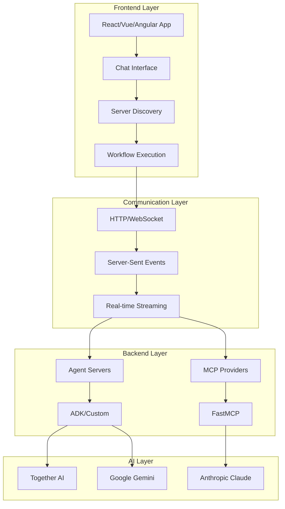

# Frontend Integration Overview

Build modern web applications that can discover, communicate with, and execute workflows through Kubiya orchestration servers. From simple chatbots to enterprise dashboards.

## Integration Approaches

<CardGroup cols={2}>
  <Card title="⚡ Vercel AI SDK" href="/frontend/vercel-ai-sdk" icon="code">
    **Most Popular** - Build streaming AI chatbots with React and Next.js
  </Card>
  
  <Card title="🔧 Custom Integration" href="/frontend/custom-integration" icon="wrench">
    Direct API integration for any frontend framework
  </Card>
</CardGroup>

## Architecture Overview



## Core Features

### 🔍 Server Discovery

Automatically find and configure available orchestration servers:

```typescript
// Server discovery client
class ServerDiscovery {
  async discoverServers(): Promise<OrchestrationServer[]> {
    const serverUrls = ['http://localhost:8001', 'http://localhost:8002'];
    const discovered = [];
    
    for (const url of serverUrls) {
      try {
        const response = await fetch(`${url}/discover`);
        const data = await response.json();
        
        discovered.push({
          id: data.server.id,
          name: data.server.name,
          capabilities: data.server.capabilities,
          isHealthy: data.health.status === 'healthy'
        });
      } catch (error) {
        console.warn(`Server at ${url} not available`);
      }
    }
    
    return discovered;
  }
}
```

### 💬 Chat Integration

Build intelligent chat interfaces that can switch between AI conversation and workflow execution:

```typescript
// Chat component with workflow integration
export function ChatInterface() {
  const [selectedServer, setSelectedServer] = useState('');
  const [workflowMode, setWorkflowMode] = useState<'plan' | 'act'>('plan');
  
  const { messages, input, handleSubmit } = useChat({
    api: '/api/chat',
    body: { selectedServer, workflowMode }
  });
  
  // Automatically detect workflow requests
  const isWorkflowRequest = selectedServer && (
    input.includes('workflow') || 
    input.includes('deploy') || 
    input.includes('create')
  );
  
  return (
    <div className="chat-interface">
      {/* Server selection and mode controls */}
      {/* Message display with streaming */}
      {/* Input with smart workflow detection */}
    </div>
  );
}
```

### 📊 Real-time Streaming

Stream workflow generation and execution in real-time:

```typescript
// Streaming workflow execution
async function executeWorkflow(serverUrl: string, prompt: string) {
  const response = await fetch(`${serverUrl}/compose`, {
    method: 'POST',
    headers: { 'Content-Type': 'application/json' },
    body: JSON.stringify({
      prompt,
      mode: 'act',
      conversationId: `chat-${Date.now()}`
    })
  });
  
  // Stream the response
  const reader = response.body?.getReader();
  const decoder = new TextDecoder();
  
  while (true) {
    const { done, value } = await reader.read();
    if (done) break;
    
    const chunk = decoder.decode(value);
    // Process streaming workflow updates
    processStreamingUpdate(chunk);
  }
}
```

## Frontend Frameworks

### React/Next.js (Recommended)

Best for most use cases with excellent streaming support:

```typescript
// Next.js API route for workflow execution
export async function POST(request: Request) {
  const { messages, selectedServer, workflowMode } = await request.json();
  
  if (selectedServer) {
    // Execute workflow and return streaming response
    const workflowResponse = await executeWorkflow(
      'http://localhost:8001',
      messages[messages.length - 1].content,
      workflowMode
    );
    
    return new Response(workflowResponse.body, {
      headers: { 'Content-Type': 'text/event-stream' }
    });
  }
  
  // Regular AI chat
  return streamText({ model: openai('gpt-4'), messages });
}
```

### Vue.js

```vue
<template>
  <div class="workflow-interface">
    <ServerSelector v-model="selectedServer" />
    <ChatMessages :messages="messages" />
    <WorkflowInput @submit="executeWorkflow" />
  </div>
</template>

<script setup>
import { ref } from 'vue'

const selectedServer = ref('')
const messages = ref([])

async function executeWorkflow(prompt) {
  if (selectedServer.value) {
    // Execute workflow
    const response = await fetch(`${selectedServer.value}/compose`, {
      method: 'POST',
      body: JSON.stringify({ prompt, mode: 'act' })
    })
    
    // Handle streaming response
    const reader = response.body.getReader()
    // Process stream...
  }
}
</script>
```

### Angular

```typescript
@Component({
  selector: 'app-workflow-chat',
  template: `
    <div class="workflow-interface">
      <app-server-selector [(selectedServer)]="selectedServer"></app-server-selector>
      <app-chat-messages [messages]="messages"></app-chat-messages>
      <app-workflow-input (submit)="executeWorkflow($event)"></app-workflow-input>
    </div>
  `
})
export class WorkflowChatComponent {
  selectedServer = '';
  messages: ChatMessage[] = [];
  
  async executeWorkflow(prompt: string) {
    if (this.selectedServer) {
      const response = await fetch(`${this.selectedServer}/compose`, {
        method: 'POST',
        body: JSON.stringify({ prompt, mode: 'act' })
      });
      
      // Handle streaming response
      this.processStreamingResponse(response);
    }
  }
}
```

## UI Components

### Server Selection

```typescript
// Server selection component
interface ServerOption {
  id: string;
  name: string;
  provider: string;
  isHealthy: boolean;
}

export function ServerSelector({ onServerChange }: { onServerChange: (id: string) => void }) {
  const [servers, setServers] = useState<ServerOption[]>([]);
  const [isDiscovering, setIsDiscovering] = useState(false);
  
  const discoverServers = async () => {
    setIsDiscovering(true);
    // Discovery logic...
    setIsDiscovering(false);
  };
  
  return (
    <div className="server-selector">
      <label>Orchestration Server</label>
      <select onChange={(e) => onServerChange(e.target.value)}>
        <option value="">None (AI Chat Only)</option>
        {servers.map(server => (
          <option key={server.id} value={server.id}>
            {server.name} ({server.provider}) {server.isHealthy ? '✅' : '❌'}
          </option>
        ))}
      </select>
      <button onClick={discoverServers} disabled={isDiscovering}>
        {isDiscovering ? 'Discovering...' : 'Refresh'}
      </button>
    </div>
  );
}
```

### Workflow Mode Toggle

```typescript
// Mode selection component
export function WorkflowModeSelector({ 
  mode, 
  onModeChange 
}: { 
  mode: 'plan' | 'act';
  onModeChange: (mode: 'plan' | 'act') => void;
}) {
  return (
    <div className="mode-selector">
      <label>Workflow Mode</label>
      <div className="toggle-group">
        <button 
          className={mode === 'plan' ? 'active' : ''}
          onClick={() => onModeChange('plan')}
        >
          Plan (Generate Only)
        </button>
        <button 
          className={mode === 'act' ? 'active' : ''}
          onClick={() => onModeChange('act')}
        >
          Act (Generate & Execute)
        </button>
      </div>
    </div>
  );
}
```

### Streaming Message Display

```typescript
// Streaming message component
export function StreamingMessage({ message }: { message: ChatMessage }) {
  const [displayText, setDisplayText] = useState('');
  
  useEffect(() => {
    if (message.isStreaming) {
      // Animate text appearance for streaming messages
      let index = 0;
      const interval = setInterval(() => {
        setDisplayText(message.content.substring(0, index));
        index++;
        if (index > message.content.length) {
          clearInterval(interval);
        }
      }, 10);
      
      return () => clearInterval(interval);
    } else {
      setDisplayText(message.content);
    }
  }, [message]);
  
  return (
    <div className={`message ${message.role}`}>
      <div className="content">
        <ReactMarkdown>{displayText}</ReactMarkdown>
      </div>
      {message.isStreaming && <div className="streaming-indicator">●</div>}
    </div>
  );
}
```

## Authentication & Security

### API Key Management

```typescript
// Secure API key handling
export class ApiKeyManager {
  private apiKey: string | null = null;
  
  setApiKey(key: string) {
    this.apiKey = key;
    // Store securely (consider encryption for local storage)
    sessionStorage.setItem('kubiya_api_key', key);
  }
  
  getApiKey(): string | null {
    return this.apiKey || sessionStorage.getItem('kubiya_api_key');
  }
  
  clearApiKey() {
    this.apiKey = null;
    sessionStorage.removeItem('kubiya_api_key');
  }
}
```

### Request Authentication

```typescript
// Authenticated API requests
export async function authenticatedFetch(url: string, options: RequestInit = {}) {
  const apiKey = apiKeyManager.getApiKey();
  
  return fetch(url, {
    ...options,
    headers: {
      ...options.headers,
      'Authorization': `Bearer ${apiKey}`,
      'Content-Type': 'application/json'
    }
  });
}
```

## Error Handling

### Graceful Degradation

```typescript
// Error handling with fallbacks
export function useWorkflowExecution() {
  const [error, setError] = useState<string | null>(null);
  const [isRetrying, setIsRetrying] = useState(false);
  
  const executeWorkflow = async (prompt: string, serverUrl: string) => {
    try {
      setError(null);
      const response = await authenticatedFetch(`${serverUrl}/compose`, {
        method: 'POST',
        body: JSON.stringify({ prompt, mode: 'act' })
      });
      
      if (!response.ok) {
        throw new Error(`Server error: ${response.status}`);
      }
      
      return response;
    } catch (err) {
      setError(err.message);
      
      // Attempt retry with exponential backoff
      if (!isRetrying) {
        setIsRetrying(true);
        setTimeout(() => {
          setIsRetrying(false);
          executeWorkflow(prompt, serverUrl);
        }, 2000);
      }
      
      throw err;
    }
  };
  
  return { executeWorkflow, error, isRetrying };
}
```

## Performance Optimization

### Response Caching

```typescript
// Cache workflow responses
class WorkflowCache {
  private cache = new Map<string, any>();
  private ttl = 5 * 60 * 1000; // 5 minutes
  
  set(key: string, value: any) {
    this.cache.set(key, {
      value,
      timestamp: Date.now()
    });
  }
  
  get(key: string): any | null {
    const cached = this.cache.get(key);
    if (!cached) return null;
    
    if (Date.now() - cached.timestamp > this.ttl) {
      this.cache.delete(key);
      return null;
    }
    
    return cached.value;
  }
}
```

### Connection Pooling

```typescript
// Reuse connections for better performance
class ConnectionManager {
  private connections = new Map<string, AbortController>();
  
  createConnection(serverId: string): AbortController {
    // Cancel existing connection
    const existing = this.connections.get(serverId);
    if (existing) {
      existing.abort();
    }
    
    // Create new connection
    const controller = new AbortController();
    this.connections.set(serverId, controller);
    return controller;
  }
  
  closeConnection(serverId: string) {
    const controller = this.connections.get(serverId);
    if (controller) {
      controller.abort();
      this.connections.delete(serverId);
    }
  }
}
```

## Deployment

### Environment Configuration

```typescript
// Environment-specific configuration
export const config = {
  development: {
    serverUrls: ['http://localhost:8001', 'http://localhost:8002'],
    apiTimeout: 30000,
    retryAttempts: 3
  },
  production: {
    serverUrls: [process.env.ORCHESTRATION_SERVER_URL],
    apiTimeout: 10000,
    retryAttempts: 5
  }
};

export const getConfig = () => {
  return config[process.env.NODE_ENV as keyof typeof config] || config.development;
};
```

### Docker Deployment

```dockerfile
# Frontend Dockerfile
FROM node:18-alpine

WORKDIR /app
COPY package*.json ./
RUN npm ci --only=production

COPY . .
RUN npm run build

EXPOSE 3000
CMD ["npm", "start"]
```

## Next Steps

<CardGroup cols={2}>
  <Card title="⚡ Vercel AI SDK Guide" href="/frontend/vercel-ai-sdk" icon="rocket">
    **Start here** - Complete chatbot with streaming workflows
  </Card>
  
  <Card title="🔧 Custom Integration" href="/frontend/custom-integration" icon="wrench">
    Direct API integration for any framework
  </Card>
  
  <Card title="🏗️ Agent Server Setup" href="/providers/agent-servers" icon="server">
    Set up backend orchestration servers
  </Card>
  
  <Card title="📚 Full Tutorial" href="/tutorials/full-stack-ai" icon="book">
    Complete end-to-end development guide
  </Card>
</CardGroup>

---

**Ready to build?** Choose your frontend approach above and follow the detailed integration guide! 