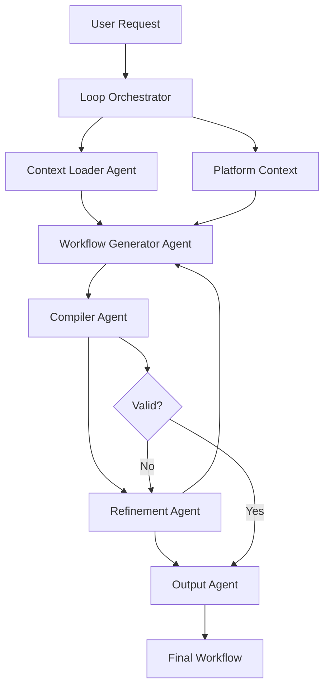

# ADK Multi-Agent Architecture

## Serverless AI Agents at Your Service

<Card title="🚀 Serverless Agents with Function Calling" icon="robot">
  ADK exposes Kubiya's **serverless AI agents** that leverage state-of-the-art techniques:
  
  - **Function Calling**: Agents use simple function calls to execute workflow tools
  - **Serverless Execution**: Spin up on-demand, no persistent processes
  - **Tool Integration**: Seamlessly call workflow steps as functions
  - **Best-in-Class Models**: Leverages top AI models for reasoning
  - **Deterministic Outputs**: Structured responses that fit into workflows
</Card>

## The Power of Inline Agents

Unlike traditional agent frameworks that require complex setups, Kubiya's inline agents are:

1. **Just workflow steps** - No separate agent infrastructure
2. **Function-based** - Agents call tools through simple function interfaces
3. **Context-aware** - Access workflow state and previous outputs
4. **Serverless** - No always-on processes consuming resources
5. **Integrated** - Part of your workflow DAG, not external

```python
# Serverless agent as a workflow step
.step("intelligent-analysis")
.inline_agent(
    message="Analyze system health and recommend actions",
    agent_name="sre-assistant",
    ai_instructions="You are an SRE expert. Use the provided tools to gather metrics.",
    
    # Agent uses function calling to execute tools
    tools=[
        {
            "name": "get_cpu_usage",
            "type": "function",
            "description": "Get current CPU usage across pods",
            "implementation": "kubectl top pods | awk '{print $2}'"
        },
        {
            "name": "check_error_logs", 
            "type": "function",
            "description": "Count errors in application logs",
            "implementation": "kubectl logs -l app=myapp | grep ERROR | wc -l"
        }
    ],
    
    runners=["kubiya-hosted"]  # Serverless execution
)
.output("SRE_ANALYSIS")
```

## How ADK Agents Work

The ADK provider orchestrates multiple specialized agents to transform natural language into production-ready workflows:



## Agent Roles

### 1. Loop Orchestrator

The **Loop Orchestrator** is the conductor of the entire process:

- **Purpose**: Coordinates all other agents
- **Responsibilities**:
  - Manages the generation lifecycle
  - Handles error recovery and retries
  - Enforces iteration limits
  - Maintains conversation state

<CodeGroup>
```python Configuration
# Orchestrator configuration
config = ADKConfig(
    max_loop_iterations=3,  # Maximum refinement attempts
    enable_streaming=True,  # Stream agent outputs
    timeout=300            # Overall timeout
)
```

```python Custom Loop
# Advanced: Custom loop behavior
from kubiya_workflow_sdk.providers.adk.agents import LoopOrchestrator

orchestrator = LoopOrchestrator(
    max_iterations=5,
    early_stop_on_success=True,
    parallel_execution=False
)
```
</CodeGroup>

### 2. Context Loader Agent

Loads platform-specific context to inform workflow generation:

- **Fetches**: Runners, integrations, secrets, organization settings
- **Outputs**: Structured context for the generator
- **Uses**: Kubiya API tools

<Info>
  The Context Loader ensures generated workflows use only available resources and integrations.
</Info>

**Loaded Context Includes:**
- Available runners and their capabilities
- Installed integrations (Slack, AWS, etc.)
- Accessible secrets (names only, not values)
- Organization policies and constraints

### 3. Workflow Generator Agent

The creative powerhouse that generates workflow code:

- **Model**: DeepSeek V3 (default) or configurable
- **Input**: Task description + platform context
- **Output**: Python SDK code using the DSL

<Tabs>
  <Tab title="Generated Code Example">
    ```python
    from kubiya_workflow_sdk.dsl import Workflow, Step, parallel
    
    workflow = Workflow(name="backup-databases")
    workflow.description = "Automated database backup workflow"
    workflow.runner = "kubiya-hosted"
    
    # Parallel backup of multiple databases
    backup_steps = []
    for db in ["users", "orders", "inventory"]:
        step = Step(
            name=f"backup_{db}",
            tool="pg_dump",
            parameters={
                "database": db,
                "output": f"/backups/{db}_{{date}}.sql"
            }
        )
        backup_steps.append(step)
    
    workflow.add_step(parallel(*backup_steps))
    
    # Compress backups
    workflow.add_step(Step(
        name="compress",
        tool="tar",
        parameters={
            "input": "/backups/*.sql",
            "output": "/backups/backup_{{date}}.tar.gz"
        }
    ))
    ```
  </Tab>
  
  <Tab title="Generator Prompts">
    The generator uses sophisticated prompts:
    - Platform capabilities and constraints
    - Best practices for the SDK
    - Security considerations
    - Performance optimization hints
  </Tab>
</Tabs>

### 4. Compiler Agent

Validates and compiles the generated code:

- **Validates**: Syntax, imports, workflow structure
- **Compiles**: Python code to workflow JSON
- **Checks**: Dependencies, circular references
- **Reports**: Errors and warnings

**Common Validation Checks:**
- ✓ Valid Python syntax
- ✓ Correct SDK imports and usage
- ✓ Runner exists and is accessible
- ✓ Required integrations are available
- ✓ Step dependencies are valid
- ✓ No circular dependencies

### 5. Refinement Agent

Fixes errors through intelligent iteration:

- **Input**: Original code + compilation errors
- **Process**: Analyzes errors and generates fixes
- **Smart**: Learns from previous attempts

<Warning>
  The refinement agent will attempt up to `max_loop_iterations` fixes before giving up.
</Warning>

**Refinement Strategies:**
- Fix syntax errors
- Resolve missing imports
- Correct API usage
- Add error handling
- Optimize performance

### 6. Output Agent

Formats the final result:

- **Formats**: JSON, YAML, or streaming events
- **Adds**: Metadata, usage instructions
- **Handles**: Both plan and act modes

## Agent Communication

Agents communicate through structured messages:

```python
# Example agent message
message = {
    "role": "workflow_generator",
    "content": {
        "generated_code": "...",
        "confidence": 0.95,
        "alternatives": []
    },
    "metadata": {
        "model": "deepseek-v3",
        "tokens_used": 1234,
        "generation_time": 2.5
    }
}
```

## Customizing Agent Behavior

### Model Selection

Different models for different agents:

```python
config = ADKConfig(
    model_overrides={
        "orchestrator": "together_ai/deepseek-ai/DeepSeek-V3",
        "workflow_generator": "together_ai/Qwen/QwQ-32B-Preview",
        "compiler": "together_ai/google/gemma-2b-it",
        "refinement": "together_ai/deepseek-ai/DeepSeek-V3"
    }
)
```

### Custom Tools

Add custom tools to agents:

```python
from kubiya_workflow_sdk.providers.adk.tools import Tool

# Custom validation tool
@Tool(name="custom_validator")
def validate_security_policies(workflow_code: str) -> dict:
    """Validate workflow against security policies."""
    # Custom validation logic
    return {"valid": True, "warnings": []}

# Add to compiler agent
compiler_agent.add_tool(validate_security_policies)
```

### Agent Hooks

Intercept agent communications:

```python
def on_agent_message(agent_name: str, message: dict):
    """Log or modify agent messages."""
    print(f"[{agent_name}] {message.get('content', {}).get('status')}")
    
    # Modify message if needed
    if agent_name == "workflow_generator":
        message["metadata"]["custom_flag"] = True
    
    return message

adk.set_message_hook(on_agent_message)
```

## Performance Optimization

<AccordionGroup>
  <Accordion title="Caching" icon="database">
    Enable caching for faster repeated requests:
    ```python
    config = ADKConfig(
        enable_caching=True,
        cache_ttl=3600  # 1 hour
    )
    ```
  </Accordion>
  
  <Accordion title="Parallel Processing" icon="bolt">
    Some agents can work in parallel:
    ```python
    # Context loading and initial generation in parallel
    config = ADKConfig(
        parallel_context_loading=True,
        parallel_validation=True
    )
    ```
  </Accordion>
  
  <Accordion title="Early Stopping" icon="stop">
    Stop refinement when good enough:
    ```python
    config = ADKConfig(
        refinement_threshold=0.95,  # Stop at 95% confidence
        early_stop_on_success=True
    )
    ```
  </Accordion>
</AccordionGroup>

## Monitoring Agents

### Logging

Enable detailed agent logging:

```python
import logging

# Enable ADK agent logging
logging.getLogger("kubiya_workflow_sdk.providers.adk.agents").setLevel(logging.DEBUG)

# Or specific agents
logging.getLogger("kubiya_workflow_sdk.providers.adk.agents.generator").setLevel(logging.DEBUG)
```

### Metrics

Track agent performance:

```python
# Get agent metrics
metrics = adk.get_agent_metrics()

print(f"Total requests: {metrics['total_requests']}")
print(f"Average generation time: {metrics['avg_generation_time']}s")
print(f"Refinement rate: {metrics['refinement_rate']}%")
print(f"Success rate: {metrics['success_rate']}%")
```

### Streaming Agent Events

Monitor agents in real-time:

```python
async for event in adk.compose(task="...", stream=True, include_agent_events=True):
    if event["type"] == "agent_event":
        agent = event["agent"]
        status = event["status"]
        print(f"[{agent}] {status}")
```

## Best Practices

<CardGroup cols={2}>
  <Card title="Model Selection" icon="brain">
    Use powerful models for generation, fast models for validation
  </Card>
  <Card title="Context Optimization" icon="gauge">
    Provide only necessary context to reduce token usage
  </Card>
  <Card title="Error Handling" icon="shield">
    Always set reasonable iteration limits and timeouts
  </Card>
  <Card title="Monitoring" icon="chart-line">
    Track agent metrics to optimize performance
  </Card>
</CardGroup>

## Troubleshooting

<AccordionGroup>
  <Accordion title="Agent Timeouts" icon="clock">
    If agents timeout:
    ```python
    # Increase agent-specific timeouts
    config = ADKConfig(
        agent_timeouts={
            "workflow_generator": 120,
            "compiler": 30,
            "refinement": 60
        }
    )
    ```
  </Accordion>
  
  <Accordion title="Refinement Loops" icon="arrows-rotate">
    If stuck in refinement:
    ```python
    # Reduce max iterations
    config = ADKConfig(
        max_loop_iterations=2,
        fail_fast=True  # Fail instead of retrying
    )
    ```
  </Accordion>
  
  <Accordion title="Context Errors" icon="triangle-exclamation">
    If context loading fails:
    ```python
    # Check API connectivity
    client = KubiyaClient()
    print(client.get_organization_info())
    
    # Provide manual context
    result = await adk.compose(
        task="...",
        context={
            "runners": ["kubiya-hosted"],
            "integrations": ["slack", "github"]
        }
    )
    ```
  </Accordion>
</AccordionGroup>

## Next Steps

<CardGroup cols={2}>
  <Card title="Streaming" icon="stream" href="/providers/adk/streaming">
    Learn about streaming responses
  </Card>
  <Card title="Custom Agents" icon="puzzle" href="/providers/adk/custom-agents">
    Build your own agents
  </Card>
  <Card title="API Reference" icon="code" href="/api-reference/providers/adk">
    Complete API documentation
  </Card>
  <Card title="Examples" icon="laptop-code" href="/providers/adk/examples">
    More complex examples
  </Card>
</CardGroup> 