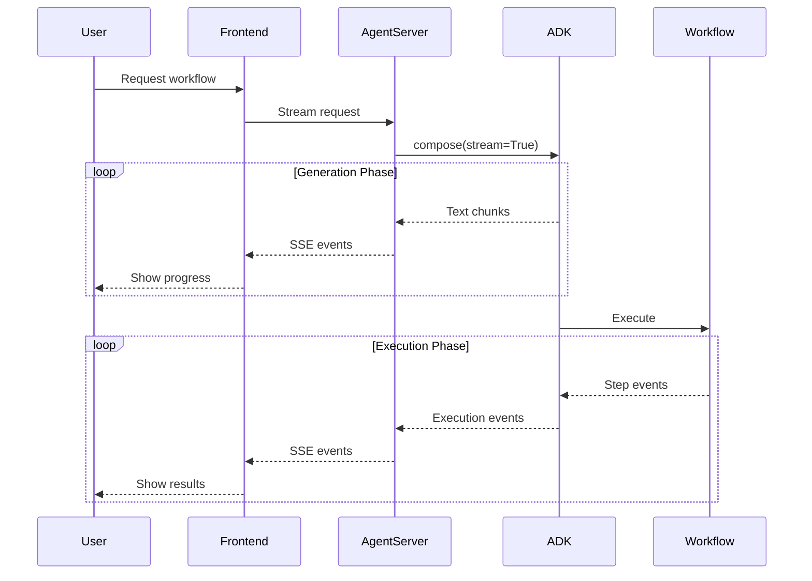

# ADK Streaming

<Note>
  Streaming is a core feature of ADK that enables real-time feedback during workflow generation and execution. This creates responsive AI applications where users see progress as it happens.
</Note>

## Why Streaming Matters

When using ADK to generate and execute workflows, operations can take time:
- **AI Generation**: The LLM needs time to analyze and create workflows
- **Execution**: Workflows may have multiple steps that run sequentially
- **Tool Calls**: Context gathering and tool execution add latency

Streaming solves this by providing immediate feedback at every stage, creating a better user experience.

## Architecture Overview



## Streaming Formats

<Tabs>
  <Tab title="Server-Sent Events (SSE)">
    Standard format for web applications:
    ```python
    async for event in adk.compose(
        task="Deploy application",
        stream=True,
        stream_format="sse"
    ):
        # Events formatted as SSE
        # data: {"type": "text", "content": "Generating workflow..."}
        print(event)
    ```
  </Tab>
  
  <Tab title="Vercel AI SDK">
    Compatible with Vercel's streaming format:
    ```python
    async for event in adk.compose(
        task="Deploy application",
        stream=True,
        stream_format="vercel"
    ):
        # Events in Vercel AI SDK format
        # Supports tool calls, text, and metadata
        print(event)
    ```
  </Tab>
  
  <Tab title="Raw ADK Events">
    Direct access to ADK events:
    ```python
    async for event in adk.compose(
        task="Deploy application",
        stream=True,
        stream_format=None  # Raw format
    ):
        # Direct ADK event objects
        if event.content:
            print(event.content.parts[0].text)
    ```
  </Tab>
</Tabs>

## Event Types

### Generation Events

Events emitted during workflow generation:

```python
# Text generation
{
    "type": "text",
    "content": "Analyzing requirements..."
}

# Tool calls (context loading)
{
    "type": "tool_call",
    "name": "get_runners",
    "arguments": {}
}

# Tool results
{
    "type": "tool_result",
    "name": "get_runners",
    "result": {"runners": [...]}
}

# Workflow ready
{
    "type": "workflow",
    "data": {
        "name": "deploy-app",
        "steps": [...]
    }
}
```

### Execution Events

Events during workflow execution:

```python
# Execution start
{
    "type": "execution_start",
    "workflow": "deploy-app",
    "run_id": "run_123"
}

# Step progress
{
    "type": "step_start",
    "step": "build-image",
    "index": 1
}

{
    "type": "step_output",
    "step": "build-image",
    "output": "Building Docker image..."
}

{
    "type": "step_complete",
    "step": "build-image",
    "status": "success",
    "duration": 45.2
}

# Execution complete
{
    "type": "execution_complete",
    "status": "success",
    "duration": 120.5
}
```

## Streaming Examples

### Basic Streaming

```python
from kubiya_workflow_sdk.providers import get_provider
import asyncio

async def stream_workflow_generation():
    adk = get_provider("adk")
    
    async for event in adk.compose(
        task="Create a backup workflow for PostgreSQL databases",
        mode="plan",
        stream=True
    ):
        # Parse SSE format
        if event.startswith("data: "):
            data = json.loads(event[6:])
            
            if data["type"] == "text":
                print(f"AI: {data['content']}")
            elif data["type"] == "workflow":
                print(f"Generated workflow: {data['data']['name']}")

asyncio.run(stream_workflow_generation())
```

### Streaming with UI Updates

```python
# For a web application
async def handle_request(task: str, websocket):
    adk = get_provider("adk")
    
    async for event in adk.compose(
        task=task,
        mode="act",
        stream=True,
        stream_format="vercel"
    ):
        # Send to frontend via WebSocket
        await websocket.send_json(event)
        
        # Update UI based on event type
        if event.get("type") == "step_complete":
            await update_progress_bar(event["step"])
```

### Error Handling in Streams

```python
async def stream_with_error_handling():
    adk = get_provider("adk")
    
    try:
        async for event in adk.compose(
            task="Deploy to production",
            mode="act",
            stream=True
        ):
            if event.get("type") == "error":
                # Handle errors gracefully
                await notify_error(event["message"])
                break
            
            # Process normal events
            await process_event(event)
            
    except StreamingError as e:
        # Handle streaming-specific errors
        logger.error(f"Streaming failed: {e}")
```

## Advanced Streaming Features

### Filtering Events

Control which events you receive:

```python
async for event in adk.compose(
    task="...",
    stream=True,
    stream_filter={
        "include_tool_calls": False,  # Skip tool events
        "include_thoughts": True,      # Include AI reasoning
        "include_metrics": True        # Include performance data
    }
):
    process_filtered_event(event)
```

### Event Buffering

Handle high-frequency events:

```python
from collections import deque
import asyncio

class EventBuffer:
    def __init__(self, max_size=100):
        self.buffer = deque(maxlen=max_size)
        self.lock = asyncio.Lock()
    
    async def add(self, event):
        async with self.lock:
            self.buffer.append(event)
    
    async def process_batch(self):
        async with self.lock:
            batch = list(self.buffer)
            self.buffer.clear()
        
        # Process events in batch
        await bulk_update_ui(batch)

# Usage
buffer = EventBuffer()

async for event in adk.compose(task="...", stream=True):
    await buffer.add(event)
    
    # Process buffer periodically
    if len(buffer.buffer) >= 10:
        await buffer.process_batch()
```

### Stream Transformation

Transform events before processing:

```python
class StreamTransformer:
    def __init__(self, adk_stream):
        self.stream = adk_stream
    
    async def __aiter__(self):
        async for event in self.stream:
            # Transform event
            transformed = await self.transform(event)
            if transformed:
                yield transformed
    
    async def transform(self, event):
        # Add timestamps
        event["timestamp"] = datetime.now().isoformat()
        
        # Enhance with metadata
        if event.get("type") == "step_complete":
            event["metrics"] = await get_step_metrics(event["step"])
        
        return event

# Usage
stream = adk.compose(task="...", stream=True)
transformer = StreamTransformer(stream)

async for enhanced_event in transformer:
    process_enhanced_event(enhanced_event)
```

## Integration Examples

### FastAPI Streaming Endpoint

```python
from fastapi import FastAPI
from fastapi.responses import StreamingResponse
import json

app = FastAPI()

@app.post("/generate-workflow")
async def generate_workflow(request: WorkflowRequest):
    adk = get_provider("adk")
    
    async def event_generator():
        async for event in adk.compose(
            task=request.task,
            mode=request.mode,
            stream=True,
            stream_format="sse"
        ):
            yield f"{event}\n\n"
    
    return StreamingResponse(
        event_generator(),
        media_type="text/event-stream"
    )
```

### React Frontend Integration

```javascript
// React component for streaming
function WorkflowGenerator() {
  const [events, setEvents] = useState([]);
  
  const generateWorkflow = async (task) => {
    const response = await fetch('/generate-workflow', {
      method: 'POST',
      body: JSON.stringify({ task, mode: 'act' }),
      headers: { 'Content-Type': 'application/json' }
    });
    
    const reader = response.body.getReader();
    const decoder = new TextDecoder();
    
    while (true) {
      const { done, value } = await reader.read();
      if (done) break;
      
      const chunk = decoder.decode(value);
      const event = JSON.parse(chunk.replace('data: ', ''));
      
      setEvents(prev => [...prev, event]);
      
      // Update UI based on event type
      if (event.type === 'workflow') {
        displayWorkflow(event.data);
      }
    }
  };
  
  // Render events...
}
```

## Performance Considerations

<AccordionGroup>
  <Accordion title="Buffer Size" icon="database">
    Configure buffer sizes for optimal performance:
    ```python
    config = ADKConfig(
        stream_buffer_size=1024,  # Events buffer
        chunk_size=512           # Network chunk size
    )
    ```
  </Accordion>
  
  <Accordion title="Timeout Handling" icon="clock">
    Set appropriate timeouts:
    ```python
    async def stream_with_timeout():
        try:
            async with asyncio.timeout(300):  # 5 minute timeout
                async for event in adk.compose(...):
                    process_event(event)
        except asyncio.TimeoutError:
            handle_timeout()
    ```
  </Accordion>
  
  <Accordion title="Backpressure" icon="gauge">
    Handle slow consumers:
    ```python
    class BackpressureHandler:
        def __init__(self, max_pending=50):
            self.semaphore = asyncio.Semaphore(max_pending)
        
        async def process_stream(self, stream):
            async for event in stream:
                async with self.semaphore:
                    await self.slow_processing(event)
    ```
  </Accordion>
</AccordionGroup>

## Debugging Streams

### Event Logging

Log all streaming events:

```python
import logging

logging.basicConfig(level=logging.DEBUG)
logger = logging.getLogger("stream_debug")

async for event in adk.compose(task="...", stream=True):
    logger.debug(f"Event: {json.dumps(event, indent=2)}")
    process_event(event)
```

### Stream Recording

Record streams for replay:

```python
class StreamRecorder:
    def __init__(self):
        self.events = []
        self.start_time = time.time()
    
    async def record(self, stream):
        async for event in stream:
            self.events.append({
                "timestamp": time.time() - self.start_time,
                "event": event
            })
            yield event
    
    def save(self, filename):
        with open(filename, 'w') as f:
            json.dump(self.events, f, indent=2)

# Usage
recorder = StreamRecorder()
stream = adk.compose(task="...", stream=True)

async for event in recorder.record(stream):
    process_event(event)

recorder.save("stream_recording.json")
```

## Best Practices

<CardGroup cols={2}>
  <Card title="Use Appropriate Format" icon="code">
    Choose SSE for web apps, Vercel for AI SDK compatibility
  </Card>
  <Card title="Handle Errors Gracefully" icon="shield">
    Always implement error handling for network issues
  </Card>
  <Card title="Implement Timeouts" icon="clock">
    Set reasonable timeouts to prevent hanging
  </Card>
  <Card title="Monitor Performance" icon="chart-line">
    Track streaming metrics and optimize buffers
  </Card>
</CardGroup>

## Troubleshooting

<AccordionGroup>
  <Accordion title="No Events Received" icon="circle-xmark">
    Check streaming is enabled:
    ```python
    # Ensure stream=True
    result = await adk.compose(
        task="...",
        stream=True  # Must be True
    )
    
    # Check config
    config = ADKConfig(enable_streaming=True)
    ```
  </Accordion>
  
  <Accordion title="Incomplete Streams" icon="triangle-exclamation">
    Handle disconnections:
    ```python
    max_retries = 3
    for attempt in range(max_retries):
        try:
            async for event in adk.compose(...):
                process_event(event)
            break
        except StreamInterrupted:
            if attempt < max_retries - 1:
                await asyncio.sleep(2 ** attempt)
                continue
            raise
    ```
  </Accordion>
  
  <Accordion title="Performance Issues" icon="gauge">
    Optimize event processing:
    ```python
    # Process events asynchronously
    async def process_events_async(stream):
        tasks = []
        async for event in stream:
            task = asyncio.create_task(process_event(event))
            tasks.append(task)
        
        await asyncio.gather(*tasks)
    ```
  </Accordion>
</AccordionGroup>

## Next Steps

<CardGroup cols={2}>
  <Card title="API Reference" icon="code" href="/api-reference/providers/adk">
    Complete streaming API reference
  </Card>
  <Card title="Examples" icon="laptop-code" href="/providers/adk/examples">
    More streaming examples
  </Card>
  <Card title="WebSocket Guide" icon="plug" href="/tutorials/websocket-streaming">
    WebSocket integration guide
  </Card>
  <Card title="Performance" icon="rocket" href="/providers/adk/performance">
    Streaming performance optimization
  </Card>
</CardGroup> 