# Agent Servers Overview

Agent servers are complete orchestration engines that provide intelligent workflow generation, multi-agent coordination, and autonomous execution capabilities. Unlike simple MCP providers, agent servers offer comprehensive workflow management with advanced AI reasoning.

## What Are Agent Servers?

Agent servers combine multiple AI agents and tools to:

- 🧠 **Generate complex workflows** from natural language descriptions
- ⚙️ **Execute multi-step processes** with error handling and retries
- 🔄 **Coordinate multiple agents** for complex problem-solving
- 📊 **Monitor and optimize** workflow performance
- 🛡️ **Provide enterprise features** like authentication and auditing

## Available Agent Servers

<CardGroup cols={2}>
  <Card title="🤖 Google ADK" href="/providers/agent-servers/adk" icon="brain">
    **Recommended** - Advanced multi-agent workflow generation with Google's Agent Development Kit
  </Card>
  
  <Card title="🔧 Custom Agent Server" href="/providers/agent-servers/custom" icon="code">
    Build your own agent server with the Kubiya SDK
  </Card>
</CardGroup>

## Agent Servers vs MCP Providers

<Accordion title="🏢 Agent Servers (Complex Workflows)">
**Best for:**
- Multi-step business processes
- Complex deployment pipelines
- Data processing workflows
- Enterprise automation

**Features:**
- Intelligent workflow planning
- Multi-agent coordination
- Error handling and recovery
- Streaming execution feedback
- Enterprise security and compliance

**Example Use Cases:**
- "Deploy my application to staging and run tests"
- "Set up a complete CI/CD pipeline for my repository"
- "Create a data processing workflow that handles failures gracefully"
</Accordion>

<Accordion title="🔌 MCP Providers (AI Assistant Tools)">
**Best for:**
- Simple tool integrations
- AI assistant capabilities
- IDE plugins
- Quick automations

**Features:**
- Direct AI assistant integration
- Simple tool definitions
- Context sharing
- Resource access

**Example Use Cases:**
- "Search my codebase for a specific pattern"
- "Generate code snippets based on my project"
- "Access my company's knowledge base"
</Accordion>

## Architecture Comparison

```mermaid
graph TB
    subgraph "Agent Server Architecture"
        A1[User Request] --> B1[Request Parser]
        B1 --> C1[Workflow Planner]
        C1 --> D1[Agent Coordinator]
        D1 --> E1[Execution Engine]
        E1 --> F1[Multiple Agents]
        F1 --> G1[Tools & APIs]
        G1 --> H1[Streaming Response]
    end
    
    subgraph "MCP Provider Architecture"
        A2[User Request] --> B2[Tool Router]
        B2 --> C2[Tool Executor]
        C2 --> D2[Single Function]
        D2 --> E2[Direct Response]
    end
```



## Getting Started with Agent Servers

### Quick Decision Guide

<Steps>
  <Step title="Simple automation needs?">
    👉 Consider **[MCP Providers](/providers/fastmcp)** instead
  </Step>
  
  <Step title="Complex workflow requirements?">
    👉 Use **Agent Servers** - continue below
  </Step>
  
  <Step title="Choose your implementation">
    - **Google ADK**: Best for most use cases, production-ready
    - **Custom Server**: Full control, custom requirements
  </Step>
  
  <Step title="Set up your environment">
    Follow the specific setup guide for your chosen server type
  </Step>
</Steps>

### Minimum Requirements

- **Python 3.10+** with virtual environment
- **API Keys**: Kubiya + AI provider (Together AI, OpenAI, etc.)
- **Memory**: 2GB+ for local development
- **Network**: Outbound HTTPS access for AI APIs

## Google ADK (Recommended)

The Google Agent Development Kit provides the most advanced workflow generation capabilities:

### Key Features

<AccordionGroup>
  <Accordion title="🧠 Intelligent Workflow Planning">
    - Multi-step workflow decomposition
    - Context-aware task planning
    - Automatic error handling generation
    - Resource optimization
  </Accordion>

  <Accordion title="👥 Multi-Agent Coordination">
    - Sequential agent execution
    - Parallel processing capabilities
    - Dynamic agent selection
    - Cross-agent context sharing
  </Accordion>

  <Accordion title="⚡ Production Features">
    - Real-time streaming responses
    - Comprehensive error handling
    - Health monitoring and metrics
    - Docker deployment support
  </Accordion>

  <Accordion title="🔧 Developer Experience">
    - Hot reloading for development
    - Extensive logging and debugging
    - Visual workflow inspection
    - Easy integration with existing systems
  </Accordion>
</AccordionGroup>

### Quick ADK Setup

```bash
# Install dependencies
pip install kubiya-workflow-sdk google-adk

# Set environment variables
export KUBIYA_API_KEY="your-key"
export TOGETHER_API_KEY="your-key"

# Start ADK server
python3 workflow_sdk/adk_orchestration_server.py
```

👉 **[Complete ADK Setup Guide →](/providers/agent-servers/adk)**

## Custom Agent Servers

Build your own agent server when you need:

- **Custom AI models** or providers
- **Specialized workflow types** for your domain  
- **Unique security requirements**
- **Custom integrations** with proprietary systems

### Basic Custom Server

```python
from kubiya_workflow_sdk.server import OrchestrationServer
from kubiya_workflow_sdk.providers import CustomProvider

class MyCustomProvider(CustomProvider):
    async def compose(self, task: str, mode: str):
        # Your custom workflow generation logic
        workflow = await self.generate_workflow(task)
        
        if mode == "act":
            result = await self.execute_workflow(workflow)
            return result
        
        return workflow

# Create and start server
server = OrchestrationServer(provider=MyCustomProvider())
server.start(port=8001)
```

👉 **[Build Custom Agent Server →](/providers/agent-servers/custom)**

## Integration Examples

### Frontend Integration

```typescript
// Detect agent server capabilities
const serverResponse = await fetch('http://localhost:8001/discover');
const capabilities = await serverResponse.json();

if (capabilities.server.capabilities.orchestration) {
  // This is an agent server - can handle complex workflows
  const workflowResponse = await fetch('http://localhost:8001/compose', {
    method: 'POST',
    body: JSON.stringify({
      prompt: "Deploy my application to staging",
      mode: "act"
    })
  });
}
```

### MCP Integration

```python
# Expose agent server capabilities through MCP
@mcp.tool()
def execute_complex_workflow(description: str, mode: str = "plan"):
    """Execute a complex multi-step workflow"""
    return agent_server.compose(task=description, mode=mode)
```

## Production Considerations

### Security

- **API Authentication**: Always use API keys in production
- **Rate Limiting**: Implement request quotas
- **Input Validation**: Sanitize all user inputs
- **Audit Logging**: Track all workflow executions

### Scalability

- **Load Balancing**: Multiple server instances
- **Caching**: Workflow templates and responses
- **Monitoring**: Health checks and metrics
- **Resource Limits**: Memory and CPU constraints

### Reliability

- **Error Recovery**: Graceful failure handling
- **Retry Logic**: Automatic error recovery
- **Health Monitoring**: Continuous server monitoring
- **Backup Strategies**: Data persistence and recovery

## Next Steps

<CardGroup cols={2}>
  <Card title="🚀 Start with ADK" href="/providers/agent-servers/adk" icon="rocket">
    Get up and running with Google ADK in minutes
  </Card>
  
  <Card title="🔧 Build Custom Server" href="/providers/agent-servers/custom" icon="wrench">
    Create your own specialized agent server
  </Card>
  
  <Card title="🌐 Frontend Integration" href="/frontend/vercel-ai-sdk" icon="monitor">
    Connect your agent server to a web interface
  </Card>
  
  <Card title="📚 Full Tutorial" href="/tutorials/full-stack-ai" icon="book">
    Complete end-to-end development guide
  </Card>
</CardGroup>

---

**Ready to build?** Choose your agent server type above and follow the detailed setup guide! 