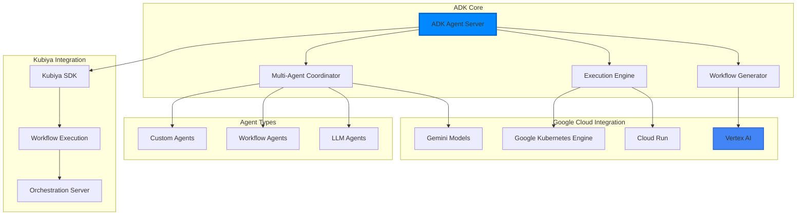

# Google Agent Development Kit (ADK)

Google's Agent Development Kit (ADK) is a comprehensive framework for developing and deploying AI agents. It provides intelligent workflow orchestration, multi-agent coordination, and seamless integration with Google Cloud services.

## Overview

ADK enables developers to build sophisticated AI applications that can:

- **Generate workflows from natural language** using advanced LLMs
- **Coordinate multiple specialized agents** for complex tasks
- **Execute workflows intelligently** with context-aware decision making
- **Integrate with Google Cloud services** natively
- **Provide real-time streaming** of execution progress
- **Handle errors intelligently** with automatic recovery

## Key Features

<CardGroup cols={2}>
  <Card title="🧠 Multi-Agent Systems" icon="users">
    Build modular applications with specialized agents that collaborate to achieve complex goals
  </Card>
  
  <Card title="🚀 Intelligent Orchestration" icon="diagram-flow">
    Define workflows using sequential, parallel, or loop patterns, or use LLM-driven dynamic routing
  </Card>
  
  <Card title="🔧 Rich Tool Ecosystem" icon="wrench">
    Equip agents with pre-built tools, custom functions, or integrate third-party libraries
  </Card>
  
  <Card title="☁️ Google Cloud Native" icon="cloud">
    Native integration with Vertex AI, Cloud Run, GKE, and other Google Cloud services
  </Card>
</CardGroup>

## Architecture



## Installation & Setup

### Prerequisites

- **Python 3.10+** or **Java 17+**
- **Google Cloud Project** with billing enabled
- **Vertex AI API** enabled
- **Google Cloud CLI** installed and authenticated

### 1. Install ADK

<Tabs>
  <Tab title="Python">
    ```bash
    # Install ADK
    pip install google-adk
    
    # Install Kubiya SDK for integration
    pip install kubiya-workflow-sdk
    ```
  </Tab>
  
  <Tab title="Java">
    ```xml
    <!-- Maven dependency -->
    <dependency>
        <groupId>com.google.adk</groupId>
        <artifactId>google-adk</artifactId>
        <version>1.0.0</version>
    </dependency>
    ```
    
    ```gradle
    // Gradle dependency
    dependencies {
        implementation 'com.google.adk:google-adk:1.0.0'
    }
    ```
  </Tab>
</Tabs>

### 2. Set Up Authentication

```bash
# Install and initialize Google Cloud CLI
curl https://sdk.cloud.google.com | bash
gcloud init

# Set up Application Default Credentials
gcloud auth application-default login

# Set environment variables
export GOOGLE_CLOUD_PROJECT="your-project-id"
export GOOGLE_CLOUD_LOCATION="us-central1"
export KUBIYA_API_KEY="your-kubiya-api-key"
```

### 3. Configure Environment

Create a `.env` file for your project:

```bash
# .env
GOOGLE_GENAI_USE_VERTEXAI=TRUE
GOOGLE_CLOUD_PROJECT=your-project-id
GOOGLE_CLOUD_LOCATION=us-central1
KUBIYA_API_KEY=your-kubiya-api-key
TOGETHER_API_KEY=your-together-api-key  # Optional: for additional models
```

## Creating Your First Agent

### Simple Weather Agent

<Tabs>
  <Tab title="Python">
    ```python
    # weather_agent.py
    from google.adk.agents import Agent
    
    def get_weather(city: str) -> dict:
        """Get current weather for a city.
        
        Args:
            city: Name of the city
            
        Returns:
            dict: Weather information
        """
        # Mock implementation - replace with real weather API
        if city.lower() == "new york":
            return {
                "status": "success",
                "weather": "Sunny, 25°C (77°F)",
                "city": city
            }
        else:
            return {
                "status": "error", 
                "message": f"Weather data for {city} not available"
            }
    
    # Create the agent
    weather_agent = Agent(
        name="weather_assistant",
        model="gemini-2.0-flash",
        description="Provides weather information for cities",
        instruction="You help users get current weather information for any city.",
        tools=[get_weather]
    )
    
    if __name__ == "__main__":
        # Run interactive session
        import asyncio
        asyncio.run(weather_agent.run_interactive())
    ```
  </Tab>
  
  <Tab title="Java">
    ```java
    // WeatherAgent.java
    import com.google.adk.agents.Agent;
    import com.google.adk.agents.tools.Tool;
    
    public class WeatherAgent {
        
        @Tool(description = "Get current weather for a city")
        public Map<String, Object> getWeather(String city) {
            // Mock implementation
            if ("new york".equalsIgnoreCase(city)) {
                return Map.of(
                    "status", "success",
                    "weather", "Sunny, 25°C (77°F)",
                    "city", city
                );
            } else {
                return Map.of(
                    "status", "error",
                    "message", "Weather data for " + city + " not available"
                );
            }
        }
        
        public static void main(String[] args) {
            Agent agent = Agent.builder()
                .name("weather_assistant")
                .model("gemini-2.0-flash")
                .description("Provides weather information for cities")
                .instruction("You help users get current weather information for any city.")
                .tools(new WeatherAgent())
                .build();
                
            agent.runInteractive();
        }
    }
    ```
  </Tab>
</Tabs>

### Run Your Agent

```bash
# Test the agent locally
python weather_agent.py

# Or use ADK CLI
adk run weather_agent.py

# Start web interface
adk web
```

## Integration with Kubiya Workflow SDK

### Creating an Orchestration Server

```python
# adk_orchestration_server.py
from kubiya_workflow_sdk.server.orchestration_server import create_orchestration_server
from kubiya_workflow_sdk.providers.adk import ADKProvider
from google.adk.agents import Agent

def get_weather(city: str) -> dict:
    """Get weather for a city"""
    # Implementation here
    pass

def get_time(city: str) -> dict:
    """Get current time for a city"""
    # Implementation here
    pass

# Create ADK agent
weather_agent = Agent(
    name="weather_time_agent",
    model="gemini-2.0-flash",
    description="Agent for weather and time information",
    instruction="I can help you get weather and time information for cities.",
    tools=[get_weather, get_time]
)

# Initialize ADK provider
adk_provider = ADKProvider(
    agents=[weather_agent],
    models=["gemini-2.0-flash", "gemini-2.0-flash-thinking"]
)

# Create orchestration server
server = create_orchestration_server(
    name="ADK Weather Service",
    provider=adk_provider,
    port=8001
)

if __name__ == "__main__":
    server.run()
```

### Server Discovery Integration

The orchestration server automatically provides discovery endpoints:

```bash
# Check server capabilities
curl http://localhost:8001/discover

# Response includes:
{
  "server": {
    "id": "local-adk",
    "name": "ADK Weather Service", 
    "provider": "adk",
    "capabilities": {
      "streaming": true,
      "modes": ["plan", "act"],
      "orchestration": true,
      "generation": true
    }
  },
  "models": [
    {
      "id": "gemini-2.0-flash",
      "name": "Gemini 2.0 Flash",
      "provider": "google"
    }
  ]
}
```

## Multi-Agent Systems

### Sequential Agent Workflow

```python
from google.adk.agents import Agent, SequentialAgent

# Create specialized agents
data_extractor = Agent(
    name="data_extractor",
    model="gemini-2.0-flash",
    tools=[extract_data_tool],
    instruction="Extract data from various sources"
)

data_analyzer = Agent(
    name="data_analyzer", 
    model="gemini-2.0-flash-thinking",
    tools=[analyze_data_tool],
    instruction="Analyze extracted data and generate insights"
)

report_generator = Agent(
    name="report_generator",
    model="gemini-2.0-flash",
    tools=[generate_report_tool],
    instruction="Generate reports from analysis results"
)

# Create sequential workflow
pipeline = SequentialAgent(
    name="data_pipeline",
    agents=[data_extractor, data_analyzer, report_generator],
    description="Complete data processing pipeline"
)
```

### Parallel Agent Execution

```python
from google.adk.agents import ParallelAgent

# Parallel processing agents
web_scraper = Agent(name="web_scraper", tools=[scrape_web])
api_fetcher = Agent(name="api_fetcher", tools=[fetch_api])
file_processor = Agent(name="file_processor", tools=[process_files])

# Run agents in parallel
parallel_collector = ParallelAgent(
    name="data_collector",
    agents=[web_scraper, api_fetcher, file_processor],
    description="Collect data from multiple sources simultaneously"
)
```

### Dynamic Agent Coordination

```python
from google.adk.agents import LlmAgent

# Coordinator agent that decides which agents to use
coordinator = LlmAgent(
    name="smart_coordinator",
    model="gemini-2.0-flash-thinking",
    sub_agents=[
        specialist_agent_1,
        specialist_agent_2,
        specialist_agent_3
    ],
    instruction="""
    You are a smart coordinator. Based on the user's request, 
    decide which specialist agents to use and in what order.
    You can transfer tasks between agents as needed.
    """
)
```

## Advanced Features

### Streaming Execution

```python
# Stream workflow execution in real-time
async def stream_workflow_execution():
    async for event in agent.execute_stream(
        message="Process this complex data pipeline",
        stream=True
    ):
        if event.type == "step_start":
            print(f"Starting: {event.step_name}")
        elif event.type == "agent_thinking":
            print(f"Agent thinking: {event.reasoning}")
        elif event.type == "tool_call":
            print(f"Calling tool: {event.tool_name}")
        elif event.type == "step_complete":
            print(f"Completed: {event.step_name}")
```

### Error Handling & Recovery

```python
from google.adk.agents import Agent
from google.adk.errors import AgentError, RetryableError

class ResilientAgent(Agent):
    def __init__(self, *args, **kwargs):
        super().__init__(*args, **kwargs)
        self.retry_config = {
            "max_retries": 3,
            "backoff_factor": 1.5,
            "retryable_errors": [RetryableError]
        }
    
    async def execute_with_recovery(self, task):
        for attempt in range(self.retry_config["max_retries"]):
            try:
                return await self.execute(task)
            except RetryableError as e:
                if attempt == self.retry_config["max_retries"] - 1:
                    raise
                await asyncio.sleep(
                    self.retry_config["backoff_factor"] ** attempt
                )
```

### Custom Tools Integration

```python
# Integrate with external APIs
@tool
def call_slack_api(channel: str, message: str) -> dict:
    """Send a message to Slack channel"""
    import requests
    
    response = requests.post(
        "https://slack.com/api/chat.postMessage",
        headers={"Authorization": f"Bearer {SLACK_TOKEN}"},
        json={"channel": channel, "text": message}
    )
    return response.json()

# Integrate with databases
@tool
def query_database(query: str) -> list:
    """Execute SQL query on database"""
    import psycopg2
    
    conn = psycopg2.connect(DATABASE_URL)
    cur = conn.cursor()
    cur.execute(query)
    results = cur.fetchall()
    conn.close()
    return results

# Add tools to agent
database_agent = Agent(
    name="database_assistant",
    model="gemini-2.0-flash",
    tools=[call_slack_api, query_database],
    instruction="Help with database operations and notifications"
)
```

## Deployment Options

### Local Development

```bash
# Run locally for development
python adk_orchestration_server.py

# Or use development server
adk web --port 8001
```

### Google Cloud Run

```yaml
# cloudbuild.yaml
steps:
  - name: 'gcr.io/cloud-builders/docker'
    args: ['build', '-t', 'gcr.io/$PROJECT_ID/adk-server', '.']
    
  - name: 'gcr.io/cloud-builders/docker'
    args: ['push', 'gcr.io/$PROJECT_ID/adk-server']
    
  - name: 'gcr.io/cloud-builders/gcloud'
    args: [
      'run', 'deploy', 'adk-server',
      '--image', 'gcr.io/$PROJECT_ID/adk-server',
      '--platform', 'managed',
      '--region', 'us-central1',
      '--port', '8001'
    ]
```

### Kubernetes Deployment

```yaml
# adk-deployment.yaml
apiVersion: apps/v1
kind: Deployment
metadata:
  name: adk-orchestration-server
spec:
  replicas: 3
  selector:
    matchLabels:
      app: adk-server
  template:
    metadata:
      labels:
        app: adk-server
    spec:
      containers:
      - name: adk-server
        image: gcr.io/PROJECT_ID/adk-server:latest
        ports:
        - containerPort: 8001
        env:
        - name: GOOGLE_CLOUD_PROJECT
          value: "your-project-id"
        - name: KUBIYA_API_KEY
          valueFrom:
            secretKeyRef:
              name: kubiya-secrets
              key: api-key
---
apiVersion: v1
kind: Service
metadata:
  name: adk-server-service
spec:
  selector:
    app: adk-server
  ports:
  - port: 80
    targetPort: 8001
  type: LoadBalancer
```

## Best Practices

### Agent Design

- **Single Responsibility**: Each agent should have a focused purpose
- **Clear Instructions**: Provide detailed, unambiguous instructions
- **Tool Documentation**: Thoroughly document all tool functions
- **Error Handling**: Implement comprehensive error handling

### Performance Optimization

- **Model Selection**: Choose appropriate models for each task
- **Caching**: Cache frequent operations and results
- **Streaming**: Use streaming for long-running operations
- **Resource Limits**: Set appropriate resource limits

### Security

- **Authentication**: Use proper Google Cloud authentication
- **API Keys**: Secure all API keys and credentials
- **Network Security**: Deploy in secure network environments
- **Audit Logging**: Enable comprehensive audit logging

## Troubleshooting

### Common Issues

**Authentication Errors**
```bash
# Ensure proper authentication
gcloud auth application-default login
gcloud config set project YOUR_PROJECT_ID
```

**Model Access Issues**
```bash
# Enable required APIs
gcloud services enable aiplatform.googleapis.com
gcloud services enable run.googleapis.com
```

**Resource Limits**
```python
# Configure resource limits
agent = Agent(
    name="resource_aware_agent",
    model="gemini-2.0-flash",
    resource_limits={
        "max_tokens": 4000,
        "timeout": 30000,
        "max_retries": 3
    }
)
```

## Next Steps

<CardGroup cols={2}>
  <Card title="🔧 Multi-Agent Tutorial" href="/tutorials/multi-agent-systems" icon="users">
    Build complex multi-agent systems with ADK
  </Card>
  
  <Card title="🚀 Production Deployment" href="/deployment/google-cloud" icon="cloud">
    Deploy ADK agents to Google Cloud environments
  </Card>
  
  <Card title="🔌 MCP Integration" href="/providers/fastmcp" icon="plug">
    Integrate ADK with MCP-compatible tools
  </Card>
  
  <Card title="📊 Monitoring" href="/deployment/monitoring" icon="chart-bar">
    Monitor and observe ADK agent performance
  </Card>
</CardGroup>

## Resources

- [Google ADK Documentation](https://google.github.io/adk-docs/)
- [Vertex AI Documentation](https://cloud.google.com/vertex-ai/docs)
- [Google Cloud Run Documentation](https://cloud.google.com/run/docs)
- [ADK GitHub Repository](https://github.com/google/adk) 