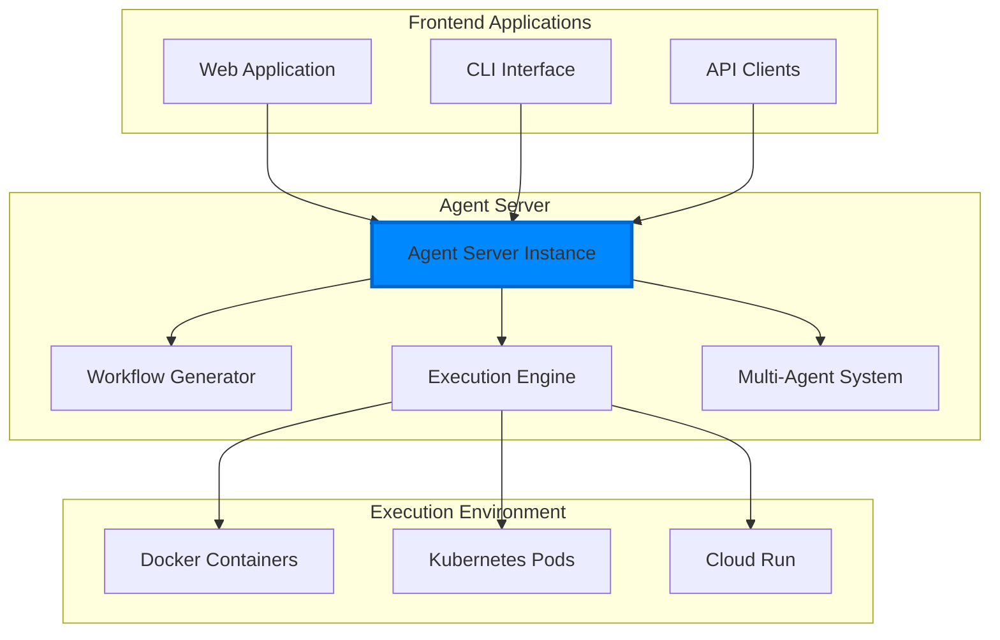
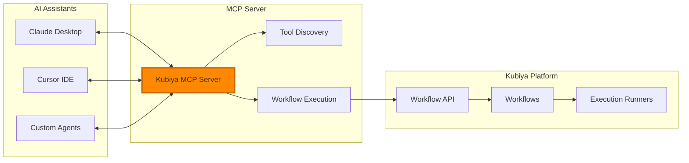

# Providers Overview

Kubiya Workflow SDK supports multiple types of providers to enable flexible workflow orchestration and integration with various AI systems. This section covers two main categories of providers:

## Provider Categories

<CardGroup cols={2}>
  <Card title="🤖 Agent Servers" href="/providers/agent-servers" icon="robot">
    Full-featured orchestration engines that provide complete workflow management, execution, and AI-powered automation
  </Card>
  
  <Card title="🔌 MCP Providers" href="/providers/fastmcp" icon="plug">
    Model Context Protocol providers that enable integration with AI assistants like Claude Desktop, Cursor, and custom agents
  </Card>
</CardGroup>

## Agent Servers

Agent servers are complete orchestration engines that handle the full lifecycle of workflow execution. They provide:

### Core Capabilities
- **Workflow Generation**: AI-powered creation of workflows from natural language
- **Intelligent Execution**: Context-aware step-by-step execution with error handling
- **Multi-Agent Orchestration**: Coordination of specialized agents for complex tasks
- **Real-time Streaming**: Live feedback and progress updates during execution

### Available Agent Servers

<Card title="Google Agent Development Kit (ADK)" href="/providers/agent-servers/adk" icon="google">
  Google's comprehensive agent framework providing intelligent workflow orchestration, multi-agent coordination, and seamless integration with Google Cloud services.
</Card>

### Architecture Overview



## MCP Providers

MCP (Model Context Protocol) providers enable integration with AI assistants and development tools. They bridge the gap between external AI systems and Kubiya's workflow capabilities.

### What is MCP?

The Model Context Protocol is an open protocol that standardizes how AI assistants connect to external tools and data sources. It enables:

- **Tool Discovery**: AI agents discover available workflow capabilities
- **Context Sharing**: Share relevant workflow context with AI assistants
- **Action Execution**: AI can trigger and monitor workflow executions
- **Real-time Integration**: Stream workflow results back to AI interfaces

### Available MCP Providers

<Card title="FastMCP" href="/providers/fastmcp" icon="zap">
  Native Python implementation of the Model Context Protocol, providing seamless integration with Claude Desktop, Cursor, and other MCP-compatible tools.
</Card>

### MCP Integration Flow



## Choosing the Right Provider

| Use Case | Recommended Provider | Why |
|----------|---------------------|-----|
| **Full AI Automation Platform** | Agent Servers (ADK) | Complete workflow lifecycle management |
| **AI Assistant Integration** | MCP Providers (FastMCP) | Seamless integration with existing AI tools |
| **Enterprise Orchestration** | Agent Servers (ADK) | Advanced multi-agent coordination |
| **Developer Tool Integration** | MCP Providers (FastMCP) | IDE and development workflow integration |
| **Google Cloud Integration** | Agent Servers (ADK) | Native Google services integration |
| **Cross-Platform AI Tools** | MCP Providers (FastMCP) | Protocol standardization |

## Execution Models

### Serverless Containerized Execution

Both provider types leverage Kubiya's containerized execution model:

<Card title="🐳 Universal Container Runtime" icon="docker">
  Every workflow step runs in its own Docker container, providing:
  
  - **Complete Software Freedom**: Install and run any software, library, or tool
  - **Language Agnostic**: Python, Node.js, Go, Rust, Java - use any language
  - **Stateless Execution**: Each execution starts fresh, ensuring consistency
  - **Infinite Scalability**: Workflows scale automatically based on demand
  - **Resource Isolation**: Each step runs in its own secure environment
</Card>

### Example: Multi-Language Pipeline

```python
from kubiya_workflow_sdk import Workflow, Step

# Create a workflow that uses multiple technologies
workflow = Workflow(
    name="multi-tech-pipeline",
    runner="kubiya-hosted"
)

# Data extraction with Python
workflow.add_step(Step(
    name="extract-data",
    image="python:3.11",
    packages=["requests", "pandas"],
    code="""
    import requests
    import pandas as pd
    
    # Extract data from API
    response = requests.get('https://api.example.com/data')
    df = pd.DataFrame(response.json())
    df.to_csv('extracted_data.csv')
    """
))

# Analysis with R
workflow.add_step(Step(
    name="statistical-analysis",
    image="r-base:latest",
    code="""
    library(tidyverse)
    
    # Perform statistical analysis
    data <- read.csv('extracted_data.csv')
    analysis <- summary(lm(y ~ x, data))
    write.csv(analysis$coefficients, 'analysis_results.csv')
    """
))

# Visualization with Node.js
workflow.add_step(Step(
    name="create-dashboard",
    image="node:20",
    packages=["d3", "express"],
    code="""
    const express = require('express');
    const d3 = require('d3');
    
    // Create interactive dashboard
    const app = express();
    // Build visualization from analysis results
    """
))
```

## Next Steps

<CardGroup cols={2}>
  <Card title="🤖 Agent Servers Guide" href="/providers/agent-servers" icon="robot">
    Learn about full-featured orchestration with Google ADK and other agent servers
  </Card>
  
  <Card title="🔌 MCP Integration" href="/providers/fastmcp" icon="plug">
    Integrate workflows with AI assistants using FastMCP
  </Card>
  
  <Card title="🚀 Frontend Integration" href="/frontend" icon="code">
    Build web applications that consume workflow providers
  </Card>
  
  <Card title="📚 End-to-End Tutorial" href="/tutorials/full-stack-ai" icon="book">
    Complete tutorial: Local development to production deployment
  </Card>
</CardGroup> 