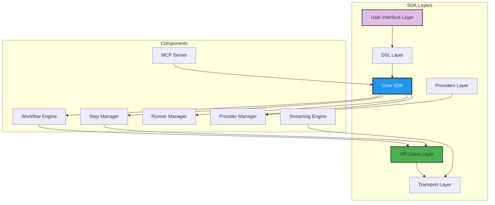
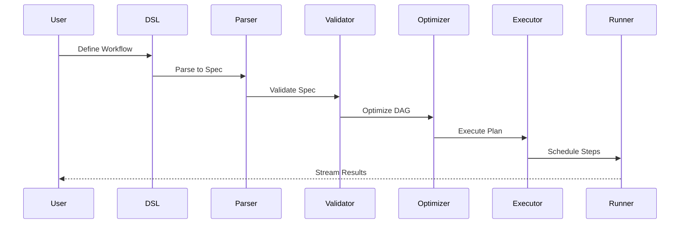

# SDK Deep Dive

Master every aspect of the Kubiya Workflow SDK - from core architecture to advanced patterns.

## SDK Architecture



## Core Components

### 1. **Workflow Engine**

The heart of the SDK - manages workflow lifecycle:

```python
from kubiya_workflow_sdk.dsl import Workflow

wf = (
    Workflow("hello-world")
        .description("My first Kubiya workflow")
        .step("greet", "echo 'Hello from Kubiya!'")
)

result = wf.to_dict()

# Internal workflow representation
result = {
    "name": "hello-world",
    "description": "My first Kubiya workflow",
    "steps": [...],
    "params": {...},
    ...
}
```

### 2. **Step Management**

There is a huge variety of step types available, including shell commands, shell scripts, Python code, etc...
Here are some simple common examples of how to define steps using the DSL:

```python
from kubiya_workflow_sdk.dsl import Step

# Create a simple step object
step = Step("greet", "echo 'Hello, world!'")

# Shell command
shell_step = (
    Step(name="simple-command")
        .shell("grep \"TODO\" *.py | less")
        .shell_type("shell")
)

# Shell script with arguments
script_step = (
    Step(name="script-step")
        .script(
            """
                #!/bin/sh
                echo "Processing data..."
                grep "${pattern}" "${file}"
            """
        ).args(
            pattern="TODO",
            file="data.txt"
        )
)

# Python script step
python_step = (
    Step(name="python-step")
        .script(
            """
                colors = ["red", "yellow", "green", "blue"]
                for color in colors:
                    print(f"Color: {color}")
            """
        )
)

```

### 3. **Multistep workflows**

As we saw in the examples below, we can define workflows and different types of steps, including shell commands, scripts, and Python code.
Now let's combine them. Here is an example of a more complex workflow with multiple steps:

```python
from kubiya_workflow_sdk.dsl import Workflow
# Here you can see a 3-step workflow, where the first step is independent,
# however the third step depends on the output of the second step and uses it as an input.
wf = (
    Workflow("multistep-workflow")
    .description("This is a multistep workflow")
    .step("initial-step", "echo 'This is the first step!'")
    .step("produce-data", callback = lambda s:
        s.shell("echo '42'")
          .output("RESULT_VAR")
    )
    .step("consume-data", callback = lambda s:
        s.python("print(int('{{RESULT_VAR}}') * 2)")
          .depends("produce-data")
    )
)
```

### 4. **DSL Parser**

Transform Python DSL to internal representation, JSON and YAML:

```python
from kubiya_workflow_sdk.dsl import Workflow

wf = (
    Workflow("workflow-for-parsing")
        .description("Workflow to demonstrate parsing")
        .step("greet", "echo 'Hello from Kubiya!'")
        .step("finish", "echo 'Bye Bye Then!'")
)

# Python dict representation
wf.to_dict()

# JSON representation
wf.to_json(indent=2)

# YAML representation
wf.to_yaml()
```

### 5. **Clients and Executors**

Here we can see an example how to execute a multistep workflow using the Kubiya SDK client.:

```python
from kubiya_workflow_sdk import KubiyaClient, workflow

# Initialize Kubiya client
client = KubiyaClient(
        api_key="your Kubiya API key",
    )

# Create a deterministic AI workflow
wf = (
    workflow("test-workflow")
        .description("[TEST]SDK workflow")
        .params(
            VERSION="0.1.0",
            ENVIRONMENT="staging",
            ROLLBACK_ENABLED="true"
        )
        .step("build", "echo 'Building application'")
        .step("deploy", "echo 'Deploying application'")
        .step("validate", "echo 'Validating application'")
        .runner("kubiya-hosted-runner")
)

# Execute the workflow and listen for stream, that's it!
for event in client.execute_workflow(wf.to_dict(), stream=True):
    print(event)
```

## Advanced SDK Features

### Complex dependent steps and async client

In this example, we will create a more complex workflow that includes multiple steps, dependencies, and outputs.
The workflow will fetch data from an API, perform a health check on a server, and generate a final summary based on the results.
Last 2 steps use Docker containers to run shell scripts. It is possible to use any Docker image, but in this example we will use the `alpine:latest` image for simplicity.

At the end we will use the async `StreamingKubiyaClient` to execute the workflow and stream the results.

```python
from kubiya_workflow_sdk import StreamingKubiyaClient, workflow

wf = (
        workflow("advanced-workflow")
            .description("This is a multistep workflow")
            .step("get-runners", callback=lambda s:
                s.kubiya(url="api/v3/runners", method="GET")
                    .output("RUNNERS")
            )
            .step("server-healthcheck", callback=lambda s:
                s.description("Make a server health check")
                    .docker(
                        image="alpine:latest",
                        content=
                        """
                            #!/bin/sh
                            set -e
                            if ! command -v curl >/dev/null 2>&1; then
                              apk add --no-cache curl
                            fi
                            echo "Checking health of $SERVER_URL ..."
                            if curl -fsS "$SERVER_URL" >/dev/null; then
                              exit 0
                            else
                              exit 1
                            fi
                        """
                    )
                    .output("SERVER_HEALTH")
                    .depends("get-runners")
            )
            .step("final-summary", callback=lambda s:
                s.tool_def(
                    name="generate_summary",
                    description="Generate final summary",
                    type="docker",
                    image="alpine:latest",
                    content="""
                        #!/bin/sh
                        if health; then
                          echo "✅ Server is healthy"
                        else
                          echo "❌ Server health check failed"
                        fi
                        echo "Runners: $runners"
                    """,
                    args={
                        "health": "${SERVER_HEALTH}",
                        "runners": "${RUNNERS}",
                    },
                )
              .output("FINAL_SUMMARY")
              .depends("server-healthcheck")
            )
    )

# Execute the workflow using the async client
try:
    async with StreamingKubiyaClient(api_key="your Kubiya API key") as client:
        async for event in client.execute_workflow_stream(wf.to_dict()):
            print(f"Event: {event}")
except Exception as e:
    print(f"Error: {e}")
```

## SDK Internals

### Execution Pipeline



### Error Handling

```python
from kubiya_workflow_sdk.errors import (
    WorkflowError,
    StepError,
    ValidationError,
    ExecutionError
)

# Custom error handlers
class RetryableError(WorkflowError):
    """Errors that can be retried"""
    pass

@workflow.error_handler(RetryableError)
def handle_retryable(error, context):
    if context.retry_count < 3:
        return "retry"
    else:
        return "fail"

@workflow.error_handler(ValidationError)
def handle_validation(error, context):
    # Log and skip
    logger.error(f"Validation failed: {error}")
    return "skip"
```

### Performance Optimization

```python
from kubiya_workflow_sdk.optimization import WorkflowOptimizer

optimizer = WorkflowOptimizer(
    strategies=[
        "parallel_detection",  # Auto-detect parallelizable steps
        "resource_pooling",    # Reuse containers
        "cache_optimization",  # Smart caching
        "dead_code_elimination"  # Remove unreachable steps
    ]
)

# Optimize workflow
optimized = optimizer.optimize(workflow)
print(f"Optimization report: {optimizer.get_report()}")
```

## Best Practices

### 1. **Workflow Design**

```python
# Good: Modular, reusable steps
@workflow
def process_data(source, destination):
    data = step.fetch(source)
    validated = step.validate(data)
    transformed = step.transform(validated)
    step.store(transformed, destination)

# Bad: Monolithic step
@workflow
def process_all():
    step.do_everything()  # Too much in one step
```

### 2. **Resource Management**

```python
# Good: Explicit resource limits
step.process(
    resources={
        "requests": {"cpu": "1", "memory": "2Gi"},
        "limits": {"cpu": "2", "memory": "4Gi"}
    }
)

# Bad: No resource constraints
step.process()  # May consume unlimited resources
```

### 3. **Error Handling**

```python
# Good: Graceful degradation
try:
    result = step.primary_service()
except ServiceError:
    result = step.fallback_service()
    step.alert_team("Using fallback service")

# Bad: Let it crash
result = step.primary_service()  # No error handling
```

## SDK Ecosystem

<CardGroup cols={2}>
  <Card title="CLI Tools" icon="terminal">
    Command-line interface for workflow management
  </Card>
  <Card title="VS Code Extension" icon="code">
    IntelliSense and debugging for workflows
  </Card>
  <Card title="Testing Framework" icon="flask">
    Unit and integration testing utilities
  </Card>
  <Card title="Monitoring Tools" icon="chart-line">
    Real-time workflow monitoring
  </Card>
</CardGroup>

## Next Steps

<CardGroup cols={2}>
  <Card title="API Reference" icon="book" href="/sdk/api-reference">
    Complete SDK API documentation
  </Card>
  <Card title="Examples" icon="lightbulb" href="/sdk/examples">
    Real-world SDK usage patterns
  </Card>
  <Card title="Contributing" icon="code-branch" href="/sdk/contributing">
    Contribute to the SDK
  </Card>
  <Card title="Changelog" icon="clock" href="/sdk/changelog">
    SDK version history
  </Card>
</CardGroup> 