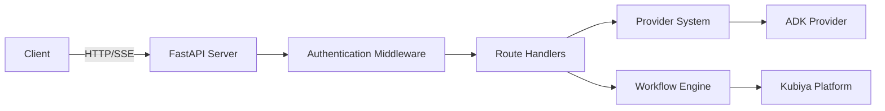

# SDK Server Overview

The Kubiya Workflow SDK includes a production-ready REST API server that provides HTTP endpoints for workflow management, AI-powered generation, and real-time execution streaming.

## Features

<CardGroup cols={2}>
  <Card title="REST API" icon="globe">
    Complete RESTful API for all SDK operations
  </Card>
  <Card title="SSE Streaming" icon="satellite-dish">
    Real-time execution updates via Server-Sent Events
  </Card>
  <Card title="AI Integration" icon="robot">
    Built-in support for AI providers
  </Card>
  <Card title="Authentication" icon="lock">
    Secure API key authentication
  </Card>
</CardGroup>

## Quick Start

### Starting the Server

```bash
# Using the CLI
kubiya-server

# With custom settings
kubiya-server --host 0.0.0.0 --port 8000

# Using Python module
python -m kubiya_workflow_sdk.server

# Using Docker
docker run -p 8000:8000 kubiya-sdk-server
```

### Configuration

The server can be configured via environment variables:

```bash
export HOST=0.0.0.0
export PORT=8000
export LOG_LEVEL=INFO
export CORS_ORIGINS='["*"]'
```

## API Endpoints

### Core Endpoints

| Method | Endpoint | Description |
|--------|----------|-------------|
| GET | `/health` | Health check |
| GET | `/docs` | OpenAPI documentation |
| GET | `/api/v1/providers` | List AI providers |
| POST | `/api/v1/compose` | Generate/execute workflows |
| POST | `/api/v1/workflows/execute` | Execute workflow directly |

### Authentication

All API endpoints (except `/health`) require authentication:

```bash
curl -H "Authorization: Bearer $KUBIYA_API_KEY" \
  http://localhost:8000/api/v1/providers
```

## Server Architecture



## Key Components

### 1. FastAPI Application

Built on FastAPI for:
- High performance async handling
- Automatic OpenAPI documentation
- Type validation
- CORS support

### 2. Streaming Support

Real-time updates using SSE:
- Workflow generation progress
- Execution status updates
- Step outputs and logs
- Error notifications

### 3. Provider Integration

Seamless integration with AI providers:
- Dynamic provider loading
- Unified API interface
- Streaming format support

## Usage Examples

### Generate Workflow (cURL)

```bash
curl -X POST http://localhost:8000/api/v1/compose \
  -H "Authorization: Bearer $KUBIYA_API_KEY" \
  -H "Content-Type: application/json" \
  -d '{
    "provider": "adk",
    "task": "Create backup workflow",
    "mode": "plan"
  }'
```

### Python Client

```python
import requests

response = requests.post(
    "http://localhost:8000/api/v1/compose",
    headers={"Authorization": f"Bearer {api_key}"},
    json={
        "provider": "adk",
        "task": "Deploy application",
        "mode": "act",
        "stream": True
    },
    stream=True
)

for line in response.iter_lines():
    if line:
        print(line.decode('utf-8'))
```

### JavaScript/TypeScript

```javascript
const eventSource = new EventSource(
  'http://localhost:8000/api/v1/compose?' + 
  new URLSearchParams({
    provider: 'adk',
    task: 'Check system health',
    mode: 'act'
  }),
  {
    headers: {
      'Authorization': `Bearer ${apiKey}`
    }
  }
);

eventSource.onmessage = (event) => {
  const data = JSON.parse(event.data);
  console.log('Event:', data);
};
```

## Deployment Options

<Tabs>
  <Tab title="Local Development">
    ```bash
    # Install SDK with server
    pip install kubiya-workflow-sdk[server]
    
    # Start server
    kubiya-server --reload
    ```
  </Tab>
  
  <Tab title="Docker">
    ```bash
    # Using pre-built image
    docker run -p 8000:8000 \
      -e KUBIYA_API_KEY=$KUBIYA_API_KEY \
      kubiya-sdk-server
    ```
  </Tab>
  
  <Tab title="Kubernetes">
    ```yaml
    apiVersion: apps/v1
    kind: Deployment
    metadata:
      name: kubiya-server
    spec:
      replicas: 3
      template:
        spec:
          containers:
          - name: server
            image: kubiya-sdk-server
            ports:
            - containerPort: 8000
    ```
  </Tab>
</Tabs>

## Monitoring & Observability

### Health Checks

```bash
# Liveness probe
curl http://localhost:8000/health

# Response
{
  "status": "healthy",
  "version": "2.0.0",
  "timestamp": "2024-01-20T10:30:00Z"
}
```

### Logging

Structured JSON logging with levels:

```python
{
  "timestamp": "2024-01-20T10:30:00Z",
  "level": "INFO",
  "message": "Workflow executed successfully",
  "workflow_id": "backup-123",
  "duration": 45.2
}
```

### Metrics

Prometheus-compatible metrics endpoint available at `/metrics`:
- Request count and latency tracking
- Workflow execution metrics and success rates
- Provider usage statistics and performance data
- System resource utilization metrics

## Security Considerations

1. **API Key Management**: Store keys securely, rotate regularly
2. **CORS Configuration**: Restrict origins in production
3. **Rate Limiting**: Implement rate limits for API endpoints
4. **TLS/SSL**: Always use HTTPS in production

## Next Steps

<CardGroup cols={2}>
  <Card title="API Endpoints" icon="plug" href="/servers/endpoints">
    Detailed endpoint documentation
  </Card>
  <Card title="Authentication" icon="key" href="/servers/authentication">
    Security and authentication guide
  </Card>
  <Card title="SSE Streaming" icon="rss" href="/servers/sse-streaming">
    Real-time streaming details
  </Card>
  <Card title="Deployment" icon="rocket" href="/deployment/docker">
    Production deployment guide
  </Card>
</CardGroup> 