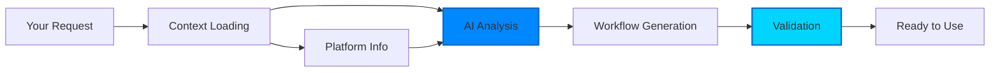

<Note>
  This tutorial will teach you how to use AI to generate and execute workflows from natural language descriptions. No workflow coding required!
</Note>

## Prerequisites

Before starting, ensure you have:

<Steps>
  <Step title="Kubiya SDK Installed">
    ```bash
    pip install kubiya-workflow-sdk[adk]
    ```
  </Step>
  
  <Step title="API Keys Ready">
    - **Kubiya API Key**: Get from [app.kubiya.ai](https://app.kubiya.ai)
    - **Together AI Key**: Get from [together.ai](https://together.ai)
  </Step>
  
  <Step title="Environment Setup">
    ```bash
    export KUBIYA_API_KEY="your-kubiya-key"
    export TOGETHER_API_KEY="your-together-key"
    ```
  </Step>
</Steps>

## Your First AI Workflow

Let's start with a simple example - creating a workflow that checks system health:

```python
import asyncio
from kubiya_workflow_sdk.providers import get_provider

async def create_health_check():
    # Initialize AI provider
    adk = get_provider("adk")
    
    # Describe what you want in plain English
    task = """
    Create a workflow that:
    1. Checks disk space usage
    2. Checks memory usage
    3. Checks CPU load
    4. Sends a Slack alert if any metric is above 80%
    """
    
    # Generate the workflow
    result = await adk.compose(
        task=task,
        mode="plan",  # Just generate, don't execute
        stream=False
    )
    
    # Print the generated workflow
    workflow = result["workflow"]
    print(f"Generated workflow: {workflow['name']}")
    print(f"Steps: {len(workflow['steps'])}")
    
    # Show the workflow structure
    for step in workflow["steps"]:
        print(f"  - {step['name']}: {step.get('description', '')}")

# Run it
asyncio.run(create_health_check())
```

**Expected Output:**
```
Generated workflow: system-health-check
Steps: 5
  - check_disk_space: Check disk space usage
  - check_memory: Check memory usage  
  - check_cpu: Check CPU load
  - evaluate_metrics: Analyze metrics and determine alerts
  - send_alert: Send Slack notification if thresholds exceeded
```

## Understanding AI Generation

### How It Works

The AI provider follows this process:



### What the AI Considers

<CardGroup cols={2}>
  <Card title="Available Resources" icon="server">
    Runners, integrations, and tools in your environment
  </Card>
  <Card title="Best Practices" icon="star">
    Optimal patterns for reliability and performance
  </Card>
  <Card title="Error Handling" icon="shield">
    Automatic retry logic and failure recovery
  </Card>
  <Card title="Dependencies" icon="diagram-project">
    Proper step ordering and parallelization
  </Card>
</CardGroup>

## Streaming Generation

Watch the AI work in real-time:

```python
async def stream_generation():
    adk = get_provider("adk")
    
    print("🤖 AI is thinking...\n")
    
    async for event in adk.compose(
        task="Create a CI/CD pipeline for a Python project",
        mode="plan",
        stream=True
    ):
        # Parse SSE events
        if event.startswith("data: "):
            import json
            data = json.loads(event[6:])
            
            if data["type"] == "text":
                print(f"💭 {data['content']}")
            elif data["type"] == "tool_call":
                print(f"🔧 Loading: {data['name']}")
            elif data["type"] == "workflow":
                print(f"✅ Workflow ready: {data['data']['name']}")

asyncio.run(stream_generation())
```

## Generate and Execute

Go from idea to execution in one step:

```python
async def backup_databases():
    adk = get_provider("adk")
    
    # Describe the task
    task = """
    Backup all PostgreSQL databases:
    - Create compressed backups
    - Upload to S3 bucket 'my-backups'
    - Keep backups for 30 days
    - Send completion notification to #ops channel
    """
    
    # Generate AND execute
    print("🚀 Generating and executing backup workflow...\n")
    
    async for event in adk.compose(
        task=task,
        mode="act",  # Generate and execute
        parameters={
            "s3_bucket": "my-backups",
            "slack_channel": "#ops"
        },
        stream=True
    ):
        # Handle streaming events
        if isinstance(event, str) and event.startswith("data: "):
            data = json.loads(event[6:])
            
            if data["type"] == "text":
                print(f"AI: {data['content']}")
            elif data["type"] == "execution_start":
                print(f"▶️  Execution started: {data['run_id']}")
            elif data["type"] == "step_complete":
                print(f"✓ Completed: {data['step']}")
            elif data["type"] == "execution_complete":
                print(f"✅ All done! Status: {data['status']}")

asyncio.run(backup_databases())
```

## Advanced Examples

### Multi-Service Deployment

Deploy a complete application stack:

```python
async def deploy_application():
    adk = get_provider("adk")
    
    task = """
    Deploy a microservices application:
    
    1. Build and push Docker images for:
       - API service (Node.js)
       - Web frontend (React)
       - Worker service (Python)
    
    2. Deploy to Kubernetes:
       - Create namespace 'myapp-prod'
       - Apply Kubernetes manifests
       - Set up ingress with SSL
    
    3. Post-deployment:
       - Run smoke tests
       - Update DNS records
       - Send deployment notification
    
    Requirements:
    - Zero-downtime deployment
    - Automatic rollback on failure
    - Health checks for all services
    """
    
    # Provide context about your environment
    context = {
        "docker_registry": "docker.io/mycompany",
        "kubernetes_cluster": "prod-cluster",
        "domain": "myapp.example.com",
        "ssl_cert": "myapp-tls-secret"
    }
    
    result = await adk.compose(
        task=task,
        context=context,
        mode="plan"
    )
    
    print("Generated deployment workflow:")
    print(json.dumps(result["workflow"], indent=2))

asyncio.run(deploy_application())
```

### Incident Response Automation

Create an intelligent incident response workflow:

```python
async def incident_response():
    adk = get_provider("adk")
    
    task = """
    Create an incident response workflow that:
    
    1. Triggered by PagerDuty alert
    2. Gather diagnostics:
       - Application logs (last 30 minutes)
       - Database query performance
       - API response times
       - Resource utilization
    
    3. Attempt auto-remediation:
       - If high memory: restart service
       - If high connections: increase pool size
       - If disk full: clean old logs
    
    4. If not resolved:
       - Create Jira ticket with diagnostics
       - Page on-call engineer
       - Start incident channel in Slack
    
    5. After resolution:
       - Generate incident report
       - Update runbook if needed
    """
    
    # Execute immediately when needed
    async for event in adk.compose(
        task=task,
        mode="act",
        parameters={
            "alert_id": "PD-12345",
            "service": "api-gateway"
        },
        stream=True
    ):
        handle_event(event)

# Can be triggered by your monitoring system
```

### Data Pipeline Automation

Build complex data pipelines with natural language:

```python
async def create_etl_pipeline():
    adk = get_provider("adk")
    
    task = """
    Create an ETL pipeline that runs daily at 2 AM:
    
    Extract:
    - Pull data from PostgreSQL (orders, customers, products tables)
    - Fetch CSV reports from S3 bucket 'raw-data'
    - Get data from REST API endpoint https://api.vendor.com/sales
    
    Transform:
    - Join orders with customers and products
    - Calculate daily revenue metrics
    - Detect anomalies in sales patterns
    - Generate summary statistics
    
    Load:
    - Write cleaned data to data warehouse (Snowflake)
    - Update dashboard datasets
    - Save reports to S3 'processed-data'
    
    Monitoring:
    - Track row counts at each stage
    - Alert if data quality issues detected
    - Send completion summary to data-team channel
    """
    
    result = await adk.compose(
        task=task,
        context={
            "schedule": "0 2 * * *",  # 2 AM daily
            "data_warehouse": "snowflake",
            "alert_threshold": {
                "missing_data": 0.05,  # 5% threshold
                "processing_time": 3600  # 1 hour max
            }
        },
        mode="plan"
    )
    
    # Review the generated pipeline
    workflow = result["workflow"]
    print(f"ETL Pipeline: {workflow['name']}")
    print(f"Schedule: {workflow.get('schedule', 'Not scheduled')}")
    print(f"Total steps: {len(workflow['steps'])}")

asyncio.run(create_etl_pipeline())
```

## Working with Context

Provide context to generate better workflows:

```python
async def context_aware_generation():
    adk = get_provider("adk")
    
    # Rich context helps AI make better decisions
    context = {
        # Environment details
        "environment": "production",
        "region": "us-east-1",
        
        # Available tools
        "tools": ["kubectl", "aws-cli", "terraform"],
        
        # Constraints
        "constraints": [
            "No sudo access",
            "Must complete in 30 minutes",
            "Requires approval for production"
        ],
        
        # Preferences
        "preferences": {
            "language": "python",
            "monitoring": "datadog",
            "secrets_manager": "vault"
        },
        
        # Compliance
        "compliance": ["SOC2", "GDPR"]
    }
    
    result = await adk.compose(
        task="Set up secure API deployment pipeline",
        context=context,
        mode="plan"
    )
    
    # AI will consider all context when generating
    print("Context-aware workflow generated")

asyncio.run(context_aware_generation())
```

## Iterative Refinement

Improve workflows through conversation:

```python
async def refine_workflow():
    adk = get_provider("adk")
    session_id = str(uuid.uuid4())
    
    # First version
    v1 = await adk.compose(
        task="Create a backup workflow for MongoDB",
        session_id=session_id,
        mode="plan",
        stream=False
    )
    
    print("Version 1 generated")
    
    # Add requirements
    v2 = await adk.compose(
        task="Add encryption to the backup workflow and compress files",
        session_id=session_id,  # Same session maintains context
        mode="plan",
        stream=False
    )
    
    print("Version 2 with encryption")
    
    # Further refinement
    v3 = await adk.compose(
        task="Also add backup verification and email notifications on failure",
        session_id=session_id,
        mode="plan",
        stream=False
    )
    
    print("Version 3 with all features")
    
    # Compare versions
    print(f"V1 steps: {len(v1['workflow']['steps'])}")
    print(f"V3 steps: {len(v3['workflow']['steps'])}")

asyncio.run(refine_workflow())
```

## Error Handling

The AI handles errors intelligently:

```python
async def error_handling_demo():
    adk = get_provider("adk")
    
    # Even with errors, AI will try to help
    try:
        result = await adk.compose(
            task="Deploy to runner that doesn't exist",
            context={
                "preferred_runner": "non-existent-runner"
            },
            mode="plan"
        )
        
        # AI will use alternative runner
        print(f"AI selected runner: {result['workflow']['runner']}")
        
    except Exception as e:
        print(f"Error: {e}")

asyncio.run(error_handling_demo())
```

## Production Tips

<AccordionGroup>
  <Accordion title="Be Specific" icon="bullseye">
    The more detailed your description, the better the result:
    ```python
    # Good
    task = """
    Create a workflow to:
    1. Check if Redis cache has > 80% memory usage
    2. If yes, identify keys by pattern 'session:*' older than 7 days
    3. Delete old keys in batches of 1000
    4. Log cleanup summary to CloudWatch
    """
    
    # Too vague
    task = "Clean Redis"
    ```
  </Accordion>
  
  <Accordion title="Test First" icon="flask">
    Always use plan mode first:
    ```python
    # Generate and review
    plan = await adk.compose(task=task, mode="plan")
    review_workflow(plan)
    
    # Then execute if satisfied
    await adk.compose(task=task, mode="act")
    ```
  </Accordion>
  
  <Accordion title="Monitor Generation" icon="chart-line">
    Track AI performance:
    ```python
    start = time.time()
    result = await adk.compose(task=task, mode="plan")
    duration = time.time() - start
    
    logger.info(f"Generation took {duration:.2f}s")
    logger.info(f"Generated {len(result['workflow']['steps'])} steps")
    ```
  </Accordion>
  
  <Accordion title="Handle Failures" icon="shield">
    Implement proper error handling:
    ```python
    async def safe_compose(task, max_retries=3):
        for attempt in range(max_retries):
            try:
                return await adk.compose(task=task, mode="plan")
            except Exception as e:
                if attempt == max_retries - 1:
                    raise
                await asyncio.sleep(2 ** attempt)
    ```
  </Accordion>
</AccordionGroup>

## Next Steps

<CardGroup cols={2}>
  <Card title="ADK Deep Dive" icon="microscope" href="/providers/adk/getting-started">
    Learn more about the ADK provider
  </Card>
  <Card title="Streaming Guide" icon="stream" href="/providers/adk/streaming">
    Master real-time streaming
  </Card>
  <Card title="Examples" icon="code" href="/workflows/examples">
    Explore more workflow examples
  </Card>
  <Card title="API Reference" icon="book" href="/api-reference/compose">
    Complete API documentation
  </Card>
</CardGroup>

## Summary

You've learned how to:
- ✅ Generate workflows from natural language
- ✅ Stream generation progress in real-time
- ✅ Execute workflows immediately after generation
- ✅ Provide context for better results
- ✅ Refine workflows iteratively
- ✅ Handle errors gracefully

The AI-powered approach dramatically accelerates workflow development while maintaining all the power and flexibility of the Kubiya platform. Start describing your automation needs in plain English and let AI handle the implementation details! 
