# Serverless Workflow Architecture

Kubiya implements a cutting-edge serverless architecture where every workflow and step runs as an independent Docker container. This design enables unprecedented flexibility, scalability, and software compatibility.

## Core Principles

### 1. **Containerized Everything**

<Card title="🐳 Docker-Based Execution" icon="docker">
  Every single step in your workflow runs in its own Docker container:
  
  - **Any Language**: Python, JavaScript, Go, Rust, Java, C++, Ruby, etc.
  - **Any Tool**: Git, AWS CLI, Terraform, kubectl, npm, cargo, etc.
  - **Any Library**: Install and use any package or dependency
  - **Any Version**: Pin specific versions of languages and tools
</Card>

### 2. **True Statelessness**

Each workflow execution is completely independent:


```python
# This workflow runs in a fresh environment every time
workflow = Workflow(
    name="data-pipeline",
    runner="kubiya-hosted"
)

# Step 1 runs in container A
workflow.add_step(
    name="fetch-data",
    image="python:3.11",
    code="# This container is destroyed after execution"
)

# Step 2 runs in container B (completely separate)
workflow.add_step(
    name="process-data",
    image="python:3.11",
    code="# Fresh container, no state from Step 1"
)
```

### 3. **Infinite Scalability**

The serverless model means:
- No pre-provisioned resources
- Automatic scaling based on demand
- Pay only for actual execution time
- Handle 1 or 1,000,000 workflows seamlessly

## Architecture Diagram


## Comparison with Other Orchestration Platforms

### Kubiya vs Traditional Orchestrators


### Execution Model Comparison


### Resource Management


## How It Works

### 1. **Workflow Definition**
You define workflows using Python SDK, YAML, or through AI generation:

```python
from kubiya_workflow_sdk import Workflow, Step

workflow = Workflow(
    name="multi-tool-pipeline",
    runner="kubiya-hosted"
)
```

### 2. **Container Specification**
Each step specifies its container requirements:

```python
# Use pre-built images
workflow.add_step(Step(
    name="python-analysis",
    image="python:3.11-slim",
    packages=["pandas", "numpy", "scikit-learn"],
    code="..."
))

# Or custom images
workflow.add_step(Step(
    name="custom-tool",
    image="myregistry/my-tool:latest",
    code="..."
))
```

### 3. **Execution Flow**


### 4. **Data Flow**
Steps communicate through artifacts:


```python
# Step 1: Generate data
workflow.add_step(Step(
    name="generate",
    code="""
    data = create_dataset()
    save_artifact('dataset.csv', data)
    """
))

# Step 2: Process data
workflow.add_step(Step(
    name="process",
    code="""
    data = load_artifact('dataset.csv')
    results = analyze(data)
    save_artifact('results.json', results)
    """
))
```

## Real-World Examples

### Multi-Language ETL Pipeline

```mermaid
graph TD
    subgraph "Extract Phase"
        E1["🐍 Python<br/>API Fetch"]
        E2["🐍 Python<br/>S3 Download"]
        E1 --> M1[Merge Data]
        E2 --> M1
    end
    
    subgraph "Transform Phase"
        M1 --> T["🟨 Node.js<br/>Data Transform"]
    end
    
    subgraph "Load Phase"
        T --> L["🐹 Go<br/>Bulk Insert"]
    end
    
    subgraph "Containers"
        C1[python:3.11]
        C2[node:20]
        C3[golang:1.21]
    end
    
    E1 -.->|runs in| C1
    T -.->|runs in| C2
    L -.->|runs in| C3
    
    style E1 fill:#3776AB,stroke:#333,stroke-width:2px,color:#fff
    style E2 fill:#3776AB,stroke:#333,stroke-width:2px,color:#fff
    style T fill:#F7DF1E,stroke:#333,stroke-width:2px
    style L fill:#00ADD8,stroke:#333,stroke-width:2px,color:#fff
```



```python
// ... existing code ...
```

### DevOps Automation

```mermaid
graph TD
    subgraph "Infrastructure"
        TF["🔧 Terraform<br/>Provision"]
    end
    
    subgraph "Configuration"
        TF --> AN["🤖 Ansible<br/>Configure"]
    end
    
    subgraph "Deployment"
        AN --> K8S["☸️ Kubernetes<br/>Deploy"]
    end
    
    subgraph "Validation"
        K8S --> TEST["🧪 Test<br/>Smoke Tests"]
    end
    
    TF -.->|"outputs.json"| AN
    AN -.->|"inventory"| K8S
    K8S -.->|"endpoints"| TEST
    
    style TF fill:#5C4EE5,stroke:#333,stroke-width:2px,color:#fff
    style AN fill:#EE0000,stroke:#333,stroke-width:2px,color:#fff
    style K8S fill:#326CE5,stroke:#333,stroke-width:2px,color:#fff
    style TEST fill:#4CAF50,stroke:#333,stroke-width:2px,color:#fff
```



```python
// ... existing code ...
```

## Advanced Features

### Custom Base Images

Create specialized images for your workflows:

```dockerfile
# Dockerfile
FROM python:3.11
RUN pip install pandas numpy scikit-learn tensorflow
RUN apt-get update && apt-get install -y graphviz
COPY models/ /opt/models/
```

```python
workflow.add_step(Step(
    name="ml-pipeline",
    image="myregistry/ml-base:latest",
    code="# Use pre-installed ML tools"
))
```

### Resource Management

Control container resources:


```python
workflow.add_step(Step(
    name="memory-intensive",
    image="python:3.11",
    resources={
        "memory": "8Gi",
        "cpu": "4",
        "gpu": "1"  # For ML workloads
    },
    code="# Run memory-intensive operations"
))
```

### Network Isolation

Each container runs in isolation:

```mermaid
graph TD
    subgraph "Network Namespaces"
        subgraph "Container 1"
            API[API Server<br/>Port 3000]
        end
        
        subgraph "Container 2"
            CLIENT[Client]
        end
        
        subgraph "Container 3"
            DB[Database<br/>Port 5432]
        end
    end
    
    API -.->|"❌ No Access"| CLIENT
    CLIENT -.->|"❌ No Access"| DB
    API -.->|"❌ No Access"| DB
    
    subgraph "Communication"
        ART[Via Artifacts Only]
    end
    
    API --> ART
    CLIENT --> ART
    DB --> ART
    
    style API fill:#FF5252,stroke:#333,stroke-width:2px
    style CLIENT fill:#FF5252,stroke:#333,stroke-width:2px
    style DB fill:#FF5252,stroke:#333,stroke-width:2px
    style ART fill:#4CAF50,stroke:#333,stroke-width:2px
```



```python
# Step 1: Start a service
workflow.add_step(Step(
    name="api-server",
    image="node:20",
    ports=[3000],
    code="# Start API server"
))

# Step 2: Different network namespace
workflow.add_step(Step(
    name="client",
    image="python:3.11",
    code="# Cannot access Step 1's ports directly"
))
```

## AI-Powered Generation

<Note>
  With ADK orchestration, you can generate these complex workflows using natural language:
</Note>


```python
from kubiya_workflow_sdk import KubiyaWorkflow

# Generate entire workflow from description
workflow = KubiyaWorkflow.from_prompt(
    """
    Create a data pipeline that:
    1. Extracts data from PostgreSQL and MongoDB
    2. Transforms using Python pandas
    3. Runs ML predictions with TensorFlow
    4. Stores results in S3 and sends Slack notification
    """,
    runner="kubiya-hosted"
)

# ADK generates the complete containerized workflow
result = workflow.execute()
```

## Benefits Summary

<CardGroup cols={2}>
  <Card title="🚀 Any Software" icon="cube">
    Run literally any software, tool, or language in your workflows
  </Card>
  
  <Card title="📦 Zero Dependencies" icon="box">
    No need to pre-install anything - containers have everything
  </Card>
  
  <Card title="🔄 Perfect Isolation" icon="shield">
    Each step runs in complete isolation with no side effects
  </Card>
  
  <Card title="⚡ Instant Scale" icon="bolt">
    From 1 to 1 million executions without infrastructure changes
  </Card>
</CardGroup>

## Security & Compliance

The containerized architecture provides:


- **Process Isolation**: Each step runs in its own namespace
- **Resource Limits**: Prevent runaway processes
- **Network Policies**: Control communication between steps
- **Audit Trails**: Complete execution history
- **Secrets Management**: Secure credential injection

## What's Next?

<Card title="Getting Started" href="/getting-started/quickstart" icon="rocket">
  Create your first containerized workflow
</Card>

<Card title="ADK Provider" href="/providers/adk/getting-started" icon="robot">
  Learn about AI-powered workflow generation
</Card>

<Card title="Examples" href="/workflows/examples" icon="code">
  See real-world containerized workflows
</Card> 