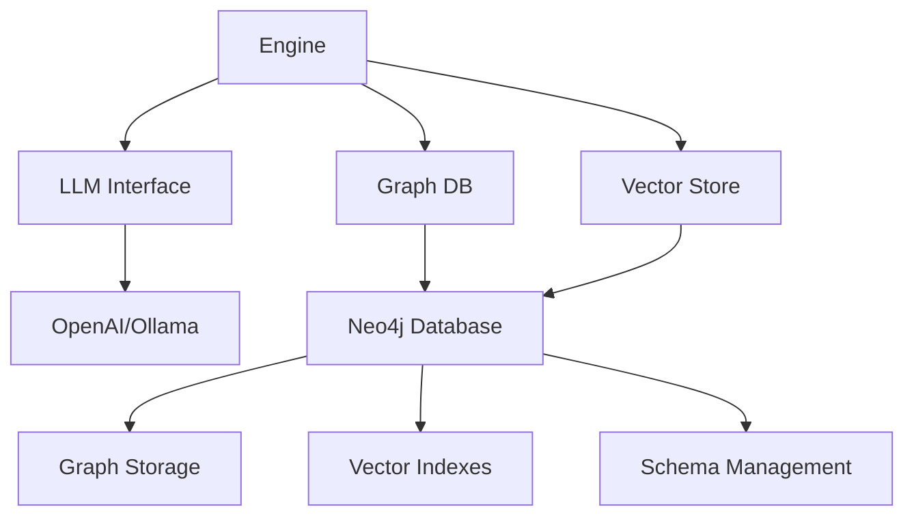

# Architecture Documentation

This section contains detailed information about the Knowledge Graph Engine v2 architecture, design decisions, and system components.

## 📑 Architecture Documents

### [System Overview](./overview.md)
High-level architecture, core components, and system design principles.

### [Neo4j Integration](./neo4j-integration.md)
Detailed explanation of Neo4j integration, schema design, and graph operations.

### [Vector Search System](./vector-search.md)
Vector storage, semantic search, and embedding management.

### [Data Models](./data-models.md)
Complete data model specifications, relationships, and validation rules.

### [Workflows](./workflows.md)
System workflows, process flows, and interaction diagrams.

## 🏗️ Architecture Principles

### 1. **Neo4j-First Design**
- Native Neo4j integration for all graph operations
- Leverages Neo4j's ACID properties and performance
- Uses Cypher queries for complex graph traversals

### 2. **Hybrid Storage Architecture**
- Graph data stored in Neo4j for relationships and structure
- Vector embeddings stored in Neo4j vector indexes for semantic search
- Unified query interface combining graph and vector operations

### 3. **Modular Component Design**
- Clear separation of concerns between components
- Pluggable architecture for easy extensions
- Interface-based design for testability

### 4. **Performance-Optimized**
- Efficient query patterns and indexing strategies
- Batch operations for bulk data processing
- Caching and optimization at multiple layers

### 5. **Production-Ready**
- Comprehensive error handling and logging
- Configuration management for different environments
- Monitoring and observability built-in

## 🔄 Component Interactions

## 📊 Technology Stack

- **Database**: Neo4j 5.x
- **Language**: Python 3.8+
- **Vector Embeddings**: Sentence Transformers
- **LLM Integration**: OpenAI API / Ollama
- **Query Language**: Cypher
- **Testing**: pytest
- **Documentation**: Markdown + Mermaid

## 🎯 Design Goals

1. **Simplicity**: Easy to use API with sensible defaults
2. **Performance**: Fast queries and efficient storage
3. **Scalability**: Handle large graphs and datasets
4. **Reliability**: Robust error handling and data consistency
5. **Extensibility**: Easy to add new features and integrations