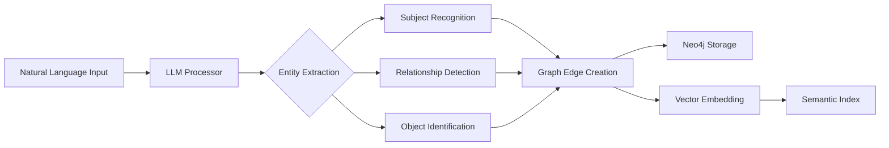
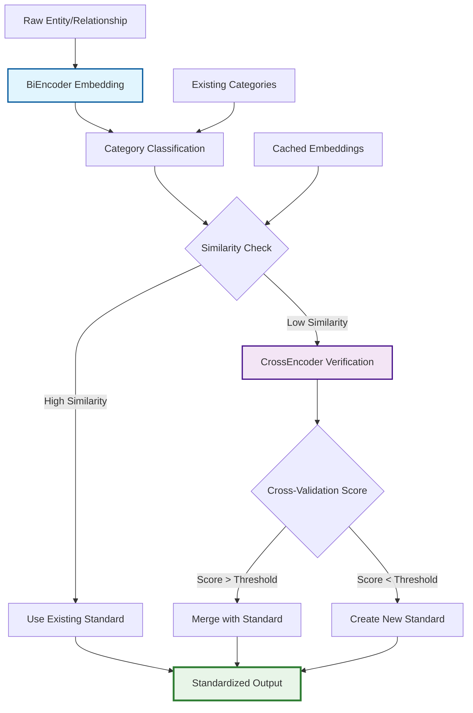
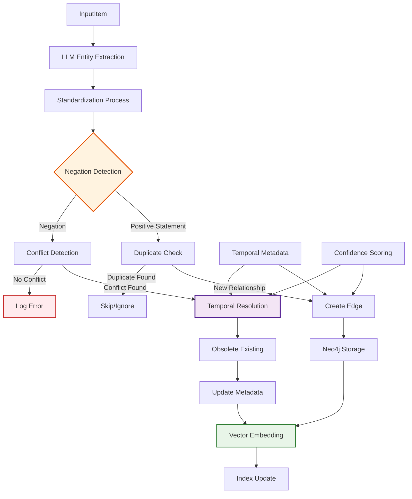

# LLM Exo-Graph 🧠🕸️

[](https://pypi.org/project/llm-exo-graph/)
[](https://www.python.org/downloads/)
[](https://opensource.org/licenses/MIT)

An advanced knowledge graph engine that externalizes LLM memory into Neo4j, creating a persistent, searchable brain for AI systems.


## 🌟 Why Exo-Graph?

Traditional LLMs have ephemeral memory. **LLM Exo-Graph** creates an *exocortex* - an external brain that:
- 📝 **Persists** knowledge across sessions
- 🔍 **Searches** with both semantic and graph algorithms
- 🧩 **Connects** information through relationships
- ⚡ **Scales** beyond context window limitations

## 🎯 The Power of Graph Structure

### Subject → Relationship → Object = Triplet(metadata)

Our graph structure captures not just entities, but the rich context of their relationships:

```
God → CREATED → man = (summary: God created man in his own image) [conf: 0.90]
God → DIVIDED → waters = (summary: God divided the waters) [conf: 0.90]
light → EXISTS → light = (summary: there was light) [conf: 0.90]
```

### Benefits of This Approach

1. **Enhanced Graph Search**
   - Traverse relationships with Cypher queries
   - Find indirect connections (friend-of-friend)
   - Discover patterns and clusters
   
2. **Superior Vector Search**
   - Summaries provide rich semantic context
   - Embeddings capture relationship meaning
   - Hybrid search combines graph + semantic

3. **Temporal Intelligence**
   - Track relationship changes over time
   - Handle contradictions gracefully
   - Maintain complete history

## 🏗️ How It Works

### Entity Extraction Pipeline



### Entity Standardization Process



### Item Processing Workflow



**Key Processing Features:**

1. **🔍 Standardization**: Entities and relationships are normalized using BiEncoder + CrossEncoder
2. **⚠️ Negation Handling**: "Alice no longer works at Google" → obsoletes existing relationship
3. **⏰ Temporal Resolution**: Automatic conflict resolution with date-based transitions
4. **🎯 Confidence Scoring**: Each relationship has confidence metadata for reliability
5. **🔄 Duplicate Prevention**: Exact matches are detected and skipped
6. **📊 Vector Integration**: All changes immediately update semantic search indexes

## 🚀 Quick Start

### Prerequisites
```bash
# Using Docker (Recommended)
docker-compose up -d

# Or use Neo4j Cloud
# Set NEO4J_URI=neo4j+s://your-instance.neo4j.io
```

### Installation

**From PyPI (Recommended):**
```bash
pip install llm-exo-graph
```

**From Source:**
```bash
git clone https://github.com/your-org/llm-exo-graph
cd llm-exo-graph
pip install -e .
```

**With Optional Dependencies:**
```bash
# For document processing
pip install "llm-exo-graph[documents]"

# For development
pip install "llm-exo-graph[dev]"

# All features
pip install "llm-exo-graph[all]"
```

### Basic Usage

```python
from llm_exo_graph import ExoGraphEngine, InputItem

# Initialize with auto-configuration
engine = ExoGraphEngine()

# Or with custom encoder models
config = {
    "encoder_model": "all-mpnet-base-v2",
    "cross_encoder_model": "cross-encoder/ms-marco-MiniLM-L-12-v2"
}
engine = ExoGraphEngine(config=config)

# Feed knowledge
engine.process_input([
   InputItem("Marie Curie discovered radium in 1898"),
   InputItem("Radium glows green in the dark"),
   InputItem("Marie Curie won the Nobel Prize twice")
])

# Query naturally
response = engine.search("What did Marie Curie discover?")
print(response.answer)
# → "Marie Curie discovered radium in 1898."
```

## 🤖 MCP Integration (Model Context Protocol)

### What is MCP?

MCP enables AI assistants like Claude to directly interact with your knowledge graph via **Server-Sent Events (SSE)**, creating a persistent memory layer that survives across conversations.

### Quick Setup with Docker

1. **Start the MCP Server**
   ```bash
   # Use the notebook docker-compose for MCP development
   docker-compose -f docker-compose.notebook.yml up -d
   
   # This starts:
   # - Neo4j on port 7687/7474
   # - MCP SSE server on port 3000
   ```

2. **Configure Claude Desktop**
   ```json
   // ~/Library/Application Support/Claude/claude_desktop_config.json
   {
     "mcpServers": {
       "exo-graph": {
         "command": "npx",
         "args": [   
             "-y",
             "mcp-remote",
             "http://localhost:3000/sse",
             "--allow-http"
         ]
       }  
     }
   }
   ```

3. **Restart Claude Desktop** - The MCP server will connect automatically

### Graph Data Examples

After setup, Claude can work with rich graph relationships like these from our Biblical knowledge graph:

```
God → CREATED → man (God created man in his own image) [conf: 0.90]
God → DIVIDED → waters (God divided the waters) [conf: 0.90]  
light → EXISTS → light (there was light) [conf: 0.90]
God → SAID → "Let there be light" (God spoke creation into existence) [conf: 0.95]
man → MADE_IN_IMAGE_OF → God (humanity reflects divine nature) [conf: 0.85]
waters → SEPARATED_BY → firmament (division of waters above and below) [conf: 0.88]
```

### Using MCP in Claude

Once configured, Claude gains persistent memory and can:

**💾 Store Knowledge Permanently**
```
Claude: "I'll remember that John works at OpenAI as a researcher"
→ Creates: John → WORKS_AT → OpenAI (researcher role) [conf: 0.95]
```

**🔍 Query Across Sessions** 
```
User: "What did we discuss about John yesterday?"
Claude: "You told me John works at OpenAI as a researcher. I have that stored in the knowledge graph."
```

**🔗 Discover Connections**
```
User: "How is John connected to AI research?"
Claude: "Through the knowledge graph, I can see John → WORKS_AT → OpenAI → FOCUSES_ON → AI Research"
```

**📊 Analyze Patterns**
```
User: "Show me all employment relationships you know about"
Claude: "I found 15 employment relationships in the graph, including John at OpenAI, Alice at Google..."
```

**⏰ Track Changes Over Time**
```
User: "John left OpenAI and joined Google"
Claude: "I've updated the graph - obsoleted John's OpenAI relationship and created a new Google relationship with today's date."
```

## 🌐 REST API

### Quick API Usage
```bash
# Start API server
cd kg_api_server
python app/main.py

# Add knowledge
curl -X POST http://localhost:8080/api/v1/process \
  -H "Content-Type: application/json" \
  -d '{"items": [{"description": "Einstein developed E=mc²"}]}'

# Search
curl http://localhost:8080/api/v1/search?query=Einstein
```

### API Endpoints
- `POST /api/v1/process` - Add knowledge
- `GET /api/v1/search` - Natural language search
- `GET /api/v1/entities/{name}` - Get entity details
- `DELETE /api/v1/edges/{id}` - Remove relationships

## 📊 Visualization

Generate beautiful graph visualizations:

```bash
python visualize_graph.py
```

Creates three outputs in `/output`:
- 📄 `knowledge_graph_relationships.txt` - Human-readable relationships
- 🖼️ `knowledge_graph_static.png` - Publication-ready visualization
- 🌐 `knowledge_graph_interactive.html` - Interactive exploration

## 🔧 Configuration

### Engine Configuration

```python
from llm_exo_graph import ExoGraphEngine, Neo4jConfig, OllamaConfig

# Custom encoder configuration
config = {
    "encoder_model": "all-mpnet-base-v2",           # BiEncoder model
    "cross_encoder_model": "cross-encoder/ms-marco-MiniLM-L-12-v2"  # CrossEncoder model
}

# Initialize with all configurations
engine = ExoGraphEngine(
    llm_config=OllamaConfig(model="llama3.2"),
    neo4j_config=Neo4jConfig(),
    config=config
)
```

### Available Encoder Models

**BiEncoder Models** (for semantic embeddings):
- `all-MiniLM-L6-v2` (default) - Fast, good quality
- `all-mpnet-base-v2` - Higher quality, slower
- `sentence-transformers/all-MiniLM-L12-v2` - Balanced

**CrossEncoder Models** (for relationship validation):
- `cross-encoder/ms-marco-MiniLM-L-6-v2` (default) - Fast
- `cross-encoder/ms-marco-MiniLM-L-12-v2` - More accurate
- `cross-encoder/ms-marco-electra-base` - Highest accuracy

### Environment Variables
```bash
# LLM Configuration (auto-detected)
OPENAI_API_KEY=sk-...           # For OpenAI
OLLAMA_BASE_URL=http://localhost:11434  # For Ollama
OLLAMA_MODEL=llama3

# Neo4j Configuration
NEO4J_URI=bolt://localhost:7687
NEO4J_USERNAME=neo4j
NEO4J_PASSWORD=password
NEO4J_DATABASE=neo4j

# Optional
LOG_LEVEL=INFO
```

## 📚 Advanced Features

### Custom Model Configuration

Choose encoder models based on your needs:

```python
# High Performance Setup (Fast processing)
fast_config = {
    "encoder_model": "all-MiniLM-L6-v2",
    "cross_encoder_model": "cross-encoder/ms-marco-MiniLM-L-6-v2"
}

# High Accuracy Setup (Better quality)
accurate_config = {
    "encoder_model": "all-mpnet-base-v2", 
    "cross_encoder_model": "cross-encoder/ms-marco-MiniLM-L-12-v2"
}

# Domain-Specific Setup (for scientific/technical content)
domain_config = {
    "encoder_model": "sentence-transformers/allenai-specter",
    "cross_encoder_model": "cross-encoder/ms-marco-electra-base"
}

engine = ExoGraphEngine(config=accurate_config)
```

### Document Processing

```python
from llm_exo_graph import DocumentProcessor

processor = DocumentProcessor()
results = processor.process_directory("./research_papers/")
```

### Temporal Relationships & Negation Handling

```python
# Example: Career transitions with temporal intelligence
engine.process_input([
    InputItem("Alice works as a software engineer at Google"),
    InputItem("Alice no longer works at Google"),  # Negation - obsoletes previous
    InputItem("Alice started working at OpenAI in January 2024")  # New relationship
])

# The system automatically:
# 1. Detects "no longer" as negation
# 2. Finds conflicting relationships
# 3. Obsoletes old relationship with end date
# 4. Creates new relationship with start date
```

### Standardization in Action

```python
# These variations are automatically standardized:
engine.process_input([
    InputItem("John works at Microsoft"),
    InputItem("John is employed by Microsoft"),  # Standardized to "WORKS_AT"
    InputItem("John's employer is Microsoft"),   # Also standardized to "WORKS_AT"
])

# Result: All create the same standardized relationship
# John → WORKS_AT → Microsoft (with different summaries)
```

### Conflict Resolution
```python
# Handles contradictions intelligently
history = engine.get_entity_relationships("Alice")
# Shows both relationships with temporal metadata:
# - Alice → WORKS_AT → Google [obsolete: 2024-01-15]
# - Alice → WORKS_AT → OpenAI [active: 2024-01-16]
```

## 🧪 Examples

- 📖 [Bible Knowledge Graph](examples/bible_processing.ipynb)
- 🧬 [Bio Research Graph](examples/bio_example.py)
- 📄 [Document Processing](examples/document_processing_example.py)
- 🔗 [API Integration](kg_api_server/tests/)

## 🛠️ Development

### Running Tests
```bash
pytest tests/
cd kg_api_server && pytest tests/
```

### Contributing
See [CONTRIBUTING.md](docs/development/contributing.md)

## 📈 Performance

- ⚡ 50-74% faster queries with optimizations
- 🔄 Batch processing for large datasets
- 💾 Intelligent caching layers
- 🎯 Optimized Neo4j indexes

## 📦 Package Information

- **PyPI**: [https://pypi.org/project/llm-exo-graph/](https://pypi.org/project/llm-exo-graph/)
- **Install**: `pip install llm-exo-graph`
- **Version**: Check latest on PyPI
- **Extras**: `[documents]`, `[dev]`, `[all]`

## 🤝 Community

- 📖 [Documentation](docs/)
- 🐛 [Issues](https://github.com/your-org/llm-exo-graph/issues)  
- 💬 [Discussions](https://github.com/your-org/llm-exo-graph/discussions)
- 📦 [PyPI Package](https://pypi.org/project/llm-exo-graph/)

## 📝 License

MIT License - see [LICENSE](LICENSE)

---

**LLM Exo-Graph** - Giving AI a persistent, searchable memory 🧠✨